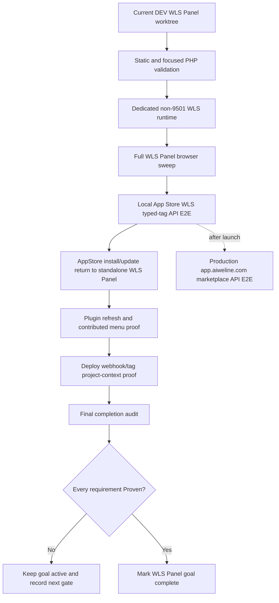
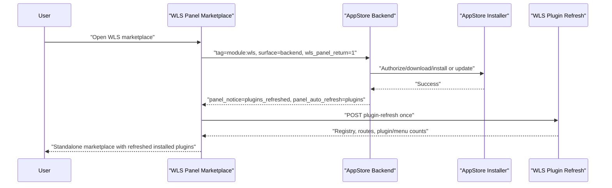

# WLS Panel Final Acceptance Runbook

Date: 2026-06-22

This runbook defines the evidence needed before the full WLS Panel goal can be
called complete. It does not replace `90-completion-audit-and-next-gates.md`;
it turns that audit into an executable acceptance sequence.

## Completion Principle

The WLS Panel goal is complete only when every requirement in
`90-completion-audit-and-next-gates.md` is `Proven` with current evidence.
Partial implementation, source inspection, green narrow probes, or historical
screenshots are not enough for final acceptance.

## Acceptance Gate Graph



## Gate 1 - Static And Focused Runtime Validation

Purpose:

- Prove edited PHP, templates, JavaScript, i18n, marketplace meta, and plan
  documents are syntactically safe before starting WLS.

Required evidence:

- PHP lint for touched controllers, services, templates, and task probes.
- JavaScript syntax checks for any changed CDP/browser harness or shared panel
  script.
- i18n CSV parity checks for touched modules.
- Marketplace `etc/marketplace/meta.json` parse checks for WLS plugin modules.
- `git diff --check` and trailing-whitespace scan for changed files.

Notes:

- New or changed production symbols require GitNexus upstream impact analysis
  before editing.
- Documentation-only changes do not need symbol impact analysis, but they still
  need `git diff --check` and scoped content review.

## Gate 2 - Dedicated WLS Panel Browser Sweep

Purpose:

- Prove the WLS Panel still behaves as an independent panel, not as ordinary
  backend pages, after all enabled packets land.

Runtime rules:

- Use a unique AI instance name.
- Use a non-9501 port.
- Stop the instance and prove the port is closed after the sweep.

Required pages:

- Dashboard / Project Config Center.
- Gateway Settings.
- Security and attack logs.
- WLS Marketplace.
- PHP Manager plugin page.
- Database Manager plugin page.
- File Manager plugin page.
- Deploy plugin page.

Required viewport/theme coverage:

- Desktop `1440` light.
- Desktop `1440` dark.
- Phone `390` light.
- Phone `390` dark.

Required browser assertions:

- No login fallback on target pages after authenticated navigation.
- Standalone WLS shell or standalone plugin shell is present.
- Theme toggle persists and does not break plugin shells.
- No visible fatal, SQL, 404, or 405 text.
- No target-page console errors.
- No horizontal overflow.
- Buttons, links, tabs, forms, and cards fit their containers.
- Project scoped links do not leak raw `project_path`.
- Marketplace endpoint strip shows the expected local or deploy-selected
  AppStore endpoint.

## Gate 3 - Local App Store WLS Typed-Tag API E2E

Purpose:

- Prove the online marketplace contract that WLS relies on, using the local App
  Store checkout rather than the official website project.

Environment:

```text
Local App Store checkout: E:\WelineFramework\Framework-Official\App\weline
Local App Store URL: https://app.weline.test:9523
Production App Store URL: https://app.aiweline.com
Not a marketplace endpoint: https://www.weline.test:9518
Not a marketplace endpoint: https://www.aiweline.com
```

Deployment information contract:

- The local checkout must be `E:\WelineFramework\Framework-Official\App\weline`
  and must expose both `app/code/Weline/PlatformAppStore` and
  `app/code/Weline/AppStore`. The local readiness probe reports this through
  `app_checkout_is_framework_official_app`,
  `app_checkout_has_platform_appstore_module`, and
  `app_checkout_has_appstore_module`; if it fails, the next action is
  `select_local_appstore_checkout`.
- Local development may use `app/etc/env.php` or SystemConfig to point
  `appstore.platform_url` at `https://app.weline.test:9523` only when the
  deploy mode is explicitly `dev` or `local`; if no local URL is configured,
  the local resolver default is still `https://app.weline.test:9523`.
- The same local readiness probe must also prove the App checkout `wls.host`,
  `wls.port`, and `wls.https` settings resolve to
  `https://app.weline.test:9523` through
  `app_env_wls_endpoint_matches_deploy_current` and
  `app_env_wls_endpoint_matches_probe_endpoint`.
- Release/deploy flows must write `appstore_environment`,
  `appstore_platform_url`, `appstore_platform_url_source`, and
  `deploy_mode_source` into `var/deploy/current.json`.
- Those deployment fields are the source of truth for deployed tests. A
  production or non-local deployment must write
  `appstore_platform_url=https://app.aiweline.com` and
  `appstore_platform_url_source=production_default` into `current.json`, then
  resolve the WLS marketplace endpoint from that artifact. Manual remembered
  URLs are not acceptance evidence.
- `appstore_platform_url` is a platform-root field, not an API endpoint field.
  Production `current.json` fails the deploy endpoint policy gate when that
  value contains `/api/v1/platform/module/list`; the required check name is
  `production_records_exact_app_aiweline_platform_url`.
  Local fixture checks use the matching
  `local_records_exact_app_weline_platform_url` gate.
- Deployed tests must read that deployment information and automatically use
  `https://app.aiweline.com` from `current.json` when the deployment is
  production or non-local. If production `current.json` omits
  `appstore_platform_url`, or omits the accepted
  `appstore_platform_url_source=production_default`, the deployed test is
  blocked instead of falling back to a remembered URL.
- Non-local resolver paths must ignore leftover local
  `WELINE_APPSTORE_PLATFORM_URL` or `appstore.platform_url` values and use the
  deployment artifact instead. The runtime resolver retains
  `https://app.aiweline.com` as a no-artifact runtime fallback, but the
  deployment artifact gate, production live gate, and typed-tag E2E endpoint
  resolver fail if production `appstore_platform_url` is empty or its source is
  not `production_default`.
- The WLS Panel marketplace must display the resolved endpoint/source so the
  operator can see whether a page is using local App Store or production App
  Store before installing plugins.
- Deployment artifact checks must pass through
  `tools/validate-deploy-appstore-endpoint-policy.php`; production must resolve
  to `https://app.aiweline.com`, not local App Store, `www.*` hosts, or an API
  endpoint path stored inside `appstore_platform_url`. The platform root must be
  explicitly present in `var/deploy/current.json`, and the source must be
  `appstore_platform_url_source=production_default`, before production E2E can
  run.
- Final workorder generation must preserve the same deployment-info contract in
  its `acceptance_contract`: local capture evidence proves
  `https://app.weline.test:9523`, while production capture evidence must read
  `appstore_platform_url=https://app.aiweline.com` plus
  `appstore_platform_url_source=production_default` from
  `var/deploy/current.json`, and production `live_evidence.endpoint_source`
  plus `capture_metadata.endpoint_source` must both prove the deployed
  `var/deploy/current.json` source. The workorder must also report
  `environment_policy.local_development.checkout=E:\WelineFramework\Framework-Official\App\weline`,
  `environment_policy.local_development.env_wls_endpoint=https://app.weline.test:9523`,
  `preflight_checks.local_readiness_app_checkout_identity_ok=true`, and
  `preflight_checks.local_readiness_app_env_wls_endpoint_locked=true`. The command
  `php app\code\Weline\Server\doc\wls-panel-plan\tools\wls-panel-final-workorder.php --self-test=1`
  fails if those final evidence invariants disappear.
- The workorder/authorization consistency gate must also pass before any
  scoped App checkout sync, App WLS start, token export, or live AppStore call:
  `php app\code\Weline\Server\doc\wls-panel-plan\tools\wls-panel-workorder-authorization-consistency.php`.
  It proves the final preflight, final workorder, and authorization packet all
  agree that local development uses `https://app.weline.test:9523`, deployed
  production uses `https://app.aiweline.com`, and the same drift review
  fingerprint is being reviewed. It must also prove
  `preflight_local_app_checkout_identity_ok=true`,
  `preflight_local_app_env_wls_endpoint_locked=true`,
  `workorder_local_app_checkout_identity_ok=true`,
  `workorder_local_app_env_wls_endpoint_locked=true`,
  `authorization_local_app_checkout_identity_ok=true`,
  `authorization_local_app_env_wls_endpoint_locked=true`,
  `local_app_checkout_identity_consistent=true`, and
  `local_app_env_wls_endpoint_consistent=true`.
- Captured evidence must preserve that same proof inside
  `capture_metadata.workorder_authorization_consistency`. A local or production
  capture is not final evidence unless the metadata records `passed=true`, the
  same drift review fingerprint, local root
  `https://app.weline.test:9523`, local endpoint
  `https://app.weline.test:9523/api/v1/platform/module/list`, production root
  `https://app.aiweline.com`, and production endpoint
  `https://app.aiweline.com/api/v1/platform/module/list`.
- Source-contract checks must pass through
  `tools/validate-appstore-endpoint-source-contract.php`; the checker confirms
  `DeployOrchestratorService` writes the App Store deployment fields,
  `AppStorePlatformUrlResolver` reads production `var/deploy/current.json`,
  and `AccountBindService` / WLS Panel consume that resolver. Its
  `--self-test=1` mode must also pass before the normal source check; it proves
  `ModuleInstallerService`, AppStore backend marketplace and installed-module
  controllers, endpoint/source strip rendering, WLS Panel return context, and
  post-install/update redirect guards reject common drift without token,
  network, WLS, or write side effects.
- The local live typed-tag call should be launched through
  `tools/local-appstore-typed-tag-live-gate.php --allow-live=1`, not by
  bypassing the guard. Without `--allow-live=1`, the wrapper is preflight-only
  and does not call the AppStore API.
- The production live typed-tag call should be launched through
  `tools/production-appstore-typed-tag-live-gate.php --allow-live=1` after
  deployed `var/deploy/current.json` resolves to `https://app.aiweline.com`.
  Fixture deploy-current files may be used only for no-network preflight; a
  production `--allow-live=1` run must report
  `production_deploy_current_is_deployed_artifact=true`.
  Without `--allow-live=1`, the wrapper is preflight-only and does not call the
  production AppStore API.
- The final operator view should be launched through
  `tools/wls-panel-final-workorder.php` before any side-effectful step. It
  condenses the aggregate preflight into `current_state`, `blocked_checks`,
  `user_authorization_required`, `user_secret_required`, the locked local
  `https://app.weline.test:9523` root, the deployed
  `https://app.aiweline.com` root, forbidden `www.*` marketplace roots, local
  capture command, production capture command, final-gate commands, and a
  machine-readable `deferred_action_plan`. That plan must carry
  `readiness_action_count`, `readiness_action_plan_contract_ok`,
  `deferred_action_plan_all_blocked`, and the blocked action ids
  `authorized_app_checkout_sync`, `run_local_app_setup_after_sync`,
  `prepare_official_manifest`, `set_local_marketplace_bearer_token`, and
  `run_live_typed_tag_e2e` so local development remains on
  `app.weline.test:9523` while deployed production tests are pinned to
  `app.aiweline.com` through `var/deploy/current.json`.

Preconditions:

- The read-only App readiness probe has been run from the DEV workspace:
  `php app\code\Weline\Server\doc\wls-panel-plan\tools\local-appstore-readiness-probe.php`.
  It must not start WLS or sync files; it reports which local App checkout
  blockers remain. Its `official_manifest_materialize` section must report
  `dry_run_available=true` and show the generated `dry_run_command` /
  `authorized_write_command` / `authorized_source_write_command` /
  `authorized_catalog_write_command` before a manifest or source catalog write
  is authorized.
  Its `next_actions` section must also map the current blockers to ordered
  actions, authorization requirements, safe-to-run status, working directories,
  commands, and side-effect boundaries. The action plan must include
  `run_local_app_setup_after_sync` with
  `php bin/w setup:upgrade --route --skip-env-check --skip-composer-dump`
  before the App WLS startup action.
- The compact operator view has also been run when reviewing the remaining
  blockers:
  `php app\code\Weline\Server\doc\wls-panel-plan\tools\local-appstore-readiness-probe.php --action-plan-only=1`.
- The local AppStore sync manifest has also been run with `--with-drift=1` so
  the operator sees exactly which allowed DEV files are different or missing in
  `E:\WelineFramework\Framework-Official\App\weline` before approving `分项`.
- After the authorized `分项` sync, the same manifest check must run with
  `--fail-on-drift=1`; residual allowed-path drift blocks App setup, WLS
  startup, and live API acceptance.
- CI or deployment logs may add `--drift-summary-only=1` to either drift
  command. The compact mode omits per-file rows, emits `rows_omitted`, and
  keeps the same pass/fail semantics.
- The compact drift summary and full authorization packet must both expose a
  comparable drift fingerprint: summary mode emits `review_fingerprint`, and
  the authorization packet emits
  `tool_results.sync_manifest.drift_review_fingerprint` with
  `drift_review_fingerprint_present=true`. Reviewers compare that value before
  approving the scoped App checkout sync, then rerun the post-sync drift gate.
- The same fingerprint comparison must also be machine-checked by
  `wls-panel-workorder-authorization-consistency.php`; do not approve a sync or
  live run when that gate reports a mismatched preflight, workorder, or
  authorization packet fingerprint.
- If `--include-rollback-review=1` is used, out-of-scope App checkout rows must
  keep correct `app/code/...` paths and a stable `out_of_scope_fingerprint`
  across the sync unless the operator intentionally changed unrelated App
  checkout files.
- Before any authorized App checkout sync, reviewers must run the full
  read-only authorization packet:
  `php app\code\Weline\Server\doc\wls-panel-plan\tools\wls-panel-live-e2e-authorization-pack.php --include-drift-rows=1 --include-rollback-review=1 --fail-if-unsafe=1`.
  It must report `authorization_pack_ready_for_review=true`,
  `rollback_review_safe_when_requested=true`, `allowed_status_count=0`, a
  non-empty `out_of_scope_fingerprint`, and preserved out-of-scope rows. Any
  App checkout status under the allowed sync paths blocks sync authorization
  until that status is cleared or explicitly reviewed as part of a new scoped
  sync packet.
- A user message has authorized the `分项` sync workflow.
- The App checkout has received the required DEV core fixes, including the
  sqlite composite-primary-key `AUTO_INCREMENT` guard.
- Before that sync is authorized, the read-only readiness probe must expose
  `schema_sync.source.guard_present=true`,
  `schema_sync.target.guard_present=false`,
  `schema_sync.authorized_sync_required=true`, and
  `schema_sync.allowed_sync_path=app/code/Weline/Framework/Database/Schema/SchemaMigrationExecutor.php`.
  This proves the blocker is an App checkout drift item, not an unimplemented
  DEV-side schema fix.
- App setup succeeds with the documented non-production options.
- The App Store official catalog manifest exists at
  `official-apps/manifest.json` and contains both at least one `module:wls`
  WLS package entry and a strict `module:wls-extra` negative canary entry
  without `module:wls`.
- The App Store official source catalog exists under `official-apps/modules/*`
  for every manifest `source_dir`, including the generated
  `Weline_WlsTagCanary` source.
- The read-only official manifest template command has been run from the DEV
  workspace so the App-side manifest is based on current WLS plugin meta rather
  than hand-written tag guesses.
- The official manifest materialize dry-run has reported
  `materialize.would_write=true` for
  `E:\WelineFramework\Framework-Official\App\weline\official-apps\manifest.json`.
- The official source catalog dry-run has reported
  `source_plan.ready=true` and `source_plan.would_write=true` for
  `E:\WelineFramework\Framework-Official\App\weline\official-apps\modules`.
- If the App checkout manifest is still missing, the authorized catalog
  preparation has materialized only `official-apps/manifest.json` with
  `--write=1 --confirm=WRITE_WLS_OFFICIAL_MANIFEST`.
- If the App checkout source catalog is still missing, the authorized catalog
  preparation has materialized only `official-apps/modules/*` with
  `--write-sources=1 --confirm-sources=WRITE_WLS_OFFICIAL_SOURCES`.
- The official manifest contract validator passes against the real App
  checkout manifest.
- App WLS is listening on `app.weline.test:9523`.
- A local bearer token/account is available outside repository files.

Required local proof:

```powershell
php app\code\Weline\Server\doc\wls-panel-plan\tools\local-appstore-readiness-probe.php
php app\code\Weline\Server\doc\wls-panel-plan\tools\local-appstore-readiness-probe.php --action-plan-only=1
php app\code\Weline\Server\doc\wls-panel-plan\tools\wls-panel-final-preflight.php --report-only=1
php app\code\Weline\Server\doc\wls-panel-plan\tools\wls-panel-final-workorder.php --self-test=1
php app\code\Weline\Server\doc\wls-panel-plan\tools\wls-panel-final-workorder.php
php app\code\Weline\Server\doc\wls-panel-plan\tools\wls-panel-workorder-authorization-consistency.php --self-test=1
php app\code\Weline\Server\doc\wls-panel-plan\tools\wls-panel-workorder-authorization-consistency.php
php app\code\Weline\Server\doc\wls-panel-plan\tools\validate-final-workorder-deferred-actions.php --self-test=1
php app\code\Weline\Server\doc\wls-panel-plan\tools\validate-final-workorder-deferred-actions.php
php app\code\Weline\Server\doc\wls-panel-plan\tools\wls-panel-goal-completion-gate.php --self-test=1
php app\code\Weline\Server\doc\wls-panel-plan\tools\validate-local-appstore-sync-manifest.php --with-drift=1
php app\code\Weline\Server\doc\wls-panel-plan\tools\validate-local-appstore-sync-manifest.php --with-drift=1 --drift-summary-only=1
php app\code\Weline\Server\doc\wls-panel-plan\tools\validate-local-appstore-sync-manifest.php --fail-on-drift=1
php app\code\Weline\Server\doc\wls-panel-plan\tools\validate-local-appstore-sync-manifest.php --fail-on-drift=1 --drift-summary-only=1
php app\code\Weline\Server\doc\wls-panel-plan\tools\marketplace-typed-tag-e2e.php --self-test=1
php app\code\Weline\Server\doc\wls-panel-plan\tools\validate-official-appstore-manifest-contract.php --self-test=1
php app\code\Weline\Server\doc\wls-panel-plan\tools\validate-official-appstore-manifest-contract.php --template=1
php app\code\Weline\Server\doc\wls-panel-plan\tools\validate-official-appstore-manifest-contract.php --template=1 --template-target=E:\WelineFramework\Framework-Official\App\weline\official-apps\manifest.json
php app\code\Weline\Server\doc\wls-panel-plan\tools\validate-official-appstore-manifest-contract.php --template=1 --template-target=E:\WelineFramework\Framework-Official\App\weline\official-apps\manifest.json --write=1 --confirm=WRITE_WLS_OFFICIAL_MANIFEST --create-dir=1
php app\code\Weline\Server\doc\wls-panel-plan\tools\validate-official-appstore-manifest-contract.php --template=1 --template-target=E:\WelineFramework\Framework-Official\App\weline\official-apps\manifest.json --write-sources=1 --confirm-sources=WRITE_WLS_OFFICIAL_SOURCES --create-source-dirs=1
php app\code\Weline\Server\doc\wls-panel-plan\tools\validate-official-appstore-manifest-contract.php --template=1 --template-target=E:\WelineFramework\Framework-Official\App\weline\official-apps\manifest.json --write=1 --confirm=WRITE_WLS_OFFICIAL_MANIFEST --create-dir=1 --write-sources=1 --confirm-sources=WRITE_WLS_OFFICIAL_SOURCES --create-source-dirs=1
php app\code\Weline\Server\doc\wls-panel-plan\tools\validate-official-appstore-manifest-contract.php --manifest=E:\WelineFramework\Framework-Official\App\weline\official-apps\manifest.json
php app\code\Weline\Server\doc\wls-panel-plan\tools\validate-appstore-endpoint-source-contract.php --self-test=1
php app\code\Weline\Server\doc\wls-panel-plan\tools\validate-appstore-endpoint-source-contract.php
php app\code\Weline\Server\doc\wls-panel-plan\tools\local-appstore-typed-tag-live-gate.php --self-test=1
php app\code\Weline\Server\doc\wls-panel-plan\tools\local-appstore-typed-tag-live-gate.php --report-only=1
php app\code\Weline\Server\doc\wls-panel-plan\tools\validate-deploy-appstore-endpoint-policy.php --self-test=1
php app\code\Weline\Server\doc\wls-panel-plan\tools\validate-appstore-live-e2e-evidence.php --self-test=1
php app\code\Weline\Server\doc\wls-panel-plan\tools\validate-deploy-appstore-endpoint-policy.php --deploy-current=app\code\Weline\Server\doc\wls-panel-plan\tools\deploy-current-local-development.json --expect=local
php app\code\Weline\Server\doc\wls-panel-plan\tools\marketplace-typed-tag-e2e.php --deploy-current=app\code\Weline\Server\doc\wls-panel-plan\tools\deploy-current-local-development.json --resolve-endpoint-only=1
curl.exe -k -I --max-time 12 --noproxy * --resolve app.weline.test:9523:127.0.0.1 https://app.weline.test:9523/
php app\code\Weline\Server\doc\wls-panel-plan\tools\validate-local-appstore-sync-manifest.php --self-test=1
php app\code\Weline\Server\doc\wls-panel-plan\tools\wls-panel-live-e2e-authorization-pack.php --self-test=1
php app\code\Weline\Server\doc\wls-panel-plan\tools\wls-panel-live-e2e-authorization-pack.php
php app\code\Weline\Server\doc\wls-panel-plan\tools\wls-panel-live-e2e-authorization-pack.php --fail-if-unsafe=1
php app\code\Weline\Server\doc\wls-panel-plan\tools\wls-panel-live-e2e-authorization-pack.php --include-drift-rows=1 --fail-if-unsafe=1
php app\code\Weline\Server\doc\wls-panel-plan\tools\wls-panel-live-e2e-authorization-pack.php --include-drift-rows=1 --include-rollback-review=1 --fail-if-unsafe=1
php app\code\Weline\Server\doc\wls-panel-plan\tools\wls-panel-live-e2e-capture.php --self-test=1
php app\code\Weline\Server\doc\wls-panel-plan\tools\wls-panel-live-evidence-final-gate.php --self-test=1
php app\code\Weline\Server\doc\wls-panel-plan\tools\wls-panel-live-e2e-capture.php --environment=local
$env:WLS_MARKETPLACE_BEARER_TOKEN = '<set outside docs>'
php app\code\Weline\Server\doc\wls-panel-plan\tools\wls-panel-live-e2e-capture.php --environment=local --allow-live=1 --evidence-output=var\wls-panel-plan\local-appstore-live-e2e.json
Remove-Item Env:\WLS_MARKETPLACE_BEARER_TOKEN
php app\code\Weline\Server\doc\wls-panel-plan\tools\validate-appstore-live-e2e-evidence.php --evidence=var\wls-panel-plan\local-appstore-live-e2e.json --expect=local
php app\code\Weline\Server\doc\wls-panel-plan\tools\wls-panel-live-evidence-final-gate.php --environment=local
php app\code\Weline\Server\doc\wls-panel-plan\tools\wls-panel-goal-completion-gate.php
```

The manifest write command is not part of the ordinary read-only preflight. It
is allowed only after the App checkout catalog preparation is explicitly
authorized. Manifest and source catalog writes have separate confirmation
phrases, and the guarded catalog commands write only
`official-apps/manifest.json` and `official-apps/modules/*`.

Acceptance:

- The local deployment metadata preflight resolves
  `https://app.weline.test:9523/api/v1/platform/module/list` before the live
  route check.
- The readiness probe reports
  `official_manifest_has_wls_positive=true`,
  `official_manifest_has_negative_canary=true`, and
  `official_manifest_negative_canary_exact=true` before the live API result is
  accepted.
- The readiness probe reports `official_manifest_materialize.dry_run_available=true`
  before the authorized App checkout manifest write command is used.
- The final preflight reports `official_manifest_source_plan_ready=true` and
  `official_manifest_source_plan_would_write=true` before the authorized App
  checkout source catalog write command is used.
- The readiness probe `next_actions` explains each remaining blocker before the
  gate is ready. Once ready, `run_live_typed_tag_e2e` is the only local AppStore
  action marked `safe_to_run_now=true`.
- The readiness probe includes `run_local_app_setup_after_sync` so operators do
  not skip the post-sync App setup step before starting WLS.
- The compact `--action-plan-only=1` output keeps the same readiness exit code
  while omitting full manifest/check details. It still reports the
  deployment-derived endpoint, `app_env`, `local_deploy_current`,
  `app_env_deploy_mode_local`,
  `local_deploy_current_matches_probe_endpoint`, blockers, and `next_actions`
  so CI and operators can verify that the local runtime target comes from
  `deploy-current-local-development.json` and that `app/etc/env.php` is
  explicitly in `deploy=dev/local`.
- The aggregate final preflight reports
  `ready_for_live_local_appstore_e2e=true` before the live local AppStore API
  command is treated as runnable. Before that point it must either exit non-zero
  or be run with `--report-only=1` for operator review.
- The final work order reports `workorder_ready=true`,
  `current_state=blocked_before_local_live_capture` or
  `ready_for_local_live_capture`, `environment_policy.local_development.root`
  as `https://app.weline.test:9523`,
  `environment_policy.local_development.checkout` as
  `E:\WelineFramework\Framework-Official\App\weline`,
  `environment_policy.local_development.env_wls_endpoint` as
  `https://app.weline.test:9523`,
  `environment_policy.production_deployed.root` as
  `https://app.aiweline.com`, `forbidden_marketplace_roots` containing
  `https://www.aiweline.com`, and an `operator_sequence` containing
  `local_live_capture_after_blockers_clear` plus
  `production_live_capture_after_launch`. It must also expose
  `preflight_checks.local_readiness_app_checkout_identity_ok=true`,
  `preflight_checks.local_readiness_app_env_wls_endpoint_locked=true`,
  `preflight_checks.sync_manifest_drift_review_fingerprint_present=true` and
  `source_summary.drift_review_fingerprint` from the latest compact drift
  review object. Its self-test must remain in-memory
  and prove blocked/ready/complete state mapping, local checkout/env endpoint
  gate retention, secret non-leakage, and that production capture is not marked
  runnable before launch. The aggregate final preflight mirrors this as
  `final_workorder_self_test_passed=true`.
- The workorder/authorization consistency gate reports `passed=true` with
  `preflight_local_endpoint_locked=true`,
  `preflight_production_endpoint_locked=true`,
  `workorder_local_root_locked=true`,
  `workorder_production_root_locked=true`,
  `authorization_local_root_locked=true`,
  `authorization_production_root_locked=true`, and
  `drift_fingerprints_match=true`. It must also report
  `preflight_local_app_checkout_identity_ok=true`,
  `preflight_local_app_env_wls_endpoint_locked=true`,
  `workorder_local_app_checkout_identity_ok=true`,
  `workorder_local_app_env_wls_endpoint_locked=true`,
  `authorization_local_app_checkout_identity_ok=true`,
  `authorization_local_app_env_wls_endpoint_locked=true`,
  `local_app_checkout_identity_consistent=true`, and
  `local_app_env_wls_endpoint_consistent=true`. Its real run must remain
  read-only and its self-test must reject mismatched fingerprints,
  `www.aiweline.com`, missing fingerprint checks, wrong local App checkout,
  missing authorization env endpoint lock, and bearer-value leaks. The aggregate final preflight
  mirrors the in-memory self-test as
  `workorder_authorization_consistency_self_test_passed=true`.
- The final workorder deferred-action validator reports `passed=true`. Its
  self-test must pass through
  `tools/validate-final-workorder-deferred-actions.php --self-test=1`, and the
  live validation must report `required_actions_ordered=true`,
  `blocked_state_all_actions_not_runnable=true` while the local gate is blocked,
  `ready_state_only_live_action_runnable=true` when the local gate is ready,
  `sync_requires_user_authorization=true`,
  `manifest_requires_confirmed_writes=true`,
  `source_summary_drift_review_fingerprint_present=true`,
  `sync_requires_drift_fingerprint_review_chain=true`,
  `token_requires_secret_placeholder=true`,
  `start_targets_app_weline_9523=true`, and
  `live_uses_guarded_local_gate=true`. It must also report
  `local_policy_records_framework_official_app_checkout=true`,
  `local_policy_records_app_env_wls_endpoint=true`,
  `local_app_checkout_identity_preflight_locked=true`,
  `local_app_env_wls_endpoint_preflight_locked=true`,
  `acceptance_contract_has_required_invariants=true`,
  `operator_sequence_present=true`, `local_capture_operator_step_present=true`,
  `local_capture_requires_reviewed_appstore_prerequisites=true`,
  `local_final_gate_operator_step_present=true`,
  `production_capture_uses_deploy_current=true`,
  `production_capture_requires_deployed_app_aiweline=true`, and
  `production_final_gate_operator_step_present=true`. This makes the handoff
  prove that local development uses the local App Store, while deployed
  production capture reads `var\deploy\current.json`. Local capture must list
  the reviewed App checkout sync/setup, official manifest/source catalog,
  `app.weline.test:9523` listener, and bearer-token prerequisites before its
  fixed evidence path can be used. Production capture must require
  `appstore_platform_url=https://app.aiweline.com`, write
  `var\wls-panel-plan\production-appstore-live-e2e.json`, and finish through
  the production final evidence gate. The acceptance contract must keep
  `captured_valid`, final evidence gate readiness, production deploy-current
  endpoint source, deployed `var\deploy\current.json` source metadata,
  conclusive `module:wls-extra` negative canary, drift fingerprint comparison,
  and no-secret evidence invariants. The aggregate final preflight mirrors the
  in-memory
  self-test as
  `deferred_actions_validator_self_test_passed=true`.
- The strict goal completion gate must be the last command before marking this
  thread goal complete:
  `tools/wls-panel-goal-completion-gate.php`. Its `--self-test=1` mode must
  pass first. The real gate must report `complete=true` only when
  `completion_audit_complete=true`, `completion_matrix_all_proven=true`,
  `traceability_matrix_all_proven=true`,
  `final_preflight_goal_complete=true`,
  `workorder_authorization_consistency_passed=true`,
  `workorder_authorization_consistency_roots_locked=true`,
  `workorder_authorization_consistency_local_app_locked=true`,
  `workorder_authorization_consistency_no_secret_values=true`,
  `local_final_gate_ready=true`, and `production_final_gate_ready=true`.
  While captured evidence is absent or the current handoff consistency proof is
  stale it must remain `complete=false` and expose blockers
  `workorder_authorization_consistency_not_current`,
  `local_live_evidence_not_accepted`, and
  `production_live_evidence_not_accepted`. The self-test must include
  `rejects_workorder_authorization_consistency_drift` and
  `rejects_workorder_authorization_production_www_root`. The aggregate final
  preflight mirrors the in-memory self-test as
  `goal_completion_gate_self_test_passed=true`.
- The read-only authorization packet reports
  `authorization_pack_ready_for_review=true`,
  `current_state=blocked_before_live_run` or `ready_for_guarded_live_run`,
  `local_endpoint_exact_root=true`, `production_endpoint_exact_root=true`,
  `local_env_is_explicit_dev_or_local=true`, `sync_manifest_ok=true`,
  `local_live_gate_self_test_passed=true`,
  `production_live_gate_self_test_passed=true`,
  `live_gate_self_test_case_counts_ok=true`,
  `preflight_kept_no_live_call=true`, `premature_allow_is_blocked=true`,
  `capture_self_test_passed=true`, `capture_path_traversal_guarded=true`,
  `blocked_preflight_no_evidence_files=true`,
  `all_side_effect_steps_deferred=true`,
  `only_live_step_runnable_when_ready=true`, and `no_secret_values=true` before
  any explicit App checkout sync, App manifest/source write, WLS start, token
  export, or live AppStore API call is authorized.
- The sync manifest checker `--self-test=1` reports `passed=true`; the
  aggregate final preflight mirrors this as
  `sync_manifest_self_test_passed=true`. The self-test must remain in-memory
  and cover rollback-review status parsing, rename target normalization,
  out-of-scope fingerprinting, forbidden prefixes, and broad includes.
- The authorization packet `--self-test=1` reports `passed=true`; the aggregate
  final preflight mirrors this as `authorization_pack_self_test_passed=true`.
  The self-test must reject bearer values, cookie values, private key markers,
  non-live runnable steps, missing capture-path guard cases, and missing
  production live-gate self-test coverage without reading files or contacting
  any service.
- The authorization packet `--fail-if-unsafe=1` command exits `0` only when
  the packet is safe for review. CI or release scripts should use this form
  instead of relying on manual JSON inspection.
- The drift-review authorization packet with `--include-drift-rows=1` remains
  read-only and exposes bounded per-file App checkout drift rows for human
  review before any scoped `分项` sync. The packet must keep
  `drift_rows_bounded_when_requested=true`; current evidence expects
  `drift_row_count=47`, `drift_total=47`, and `drift_row_bound=60` so the full
  allowed-path drift list is reviewable without becoming unbounded.
- The rollback-review authorization packet with `--include-rollback-review=1`
  remains read-only and exposes the App checkout git status split into
  allowed-sync and out-of-scope rows. Record the
  `out_of_scope_fingerprint` before and after scoped `分项`; it should not
  change unless unrelated App checkout work was intentionally changed.
  When paired with `--fail-if-unsafe=1`, the packet must also prove
  `rollback_review_safe_when_requested=true` and `allowed_status_count=0`;
  otherwise the authorization review is unsafe and the sync remains blocked.
- The live E2E evidence validator `--self-test=1` reports `passed=true`; the
  aggregate final preflight mirrors this as
  `live_e2e_evidence_validator_self_test_passed=true`. The self-test must
  accept local runner evidence and production wrapper `live_evidence`, and must
  reject a production proof that used the local endpoint, a missing conclusive
  negative canary, any bearer/cookie/private-key value, or wrapper evidence
  missing `capture_metadata_present` / `capture_metadata_source_gate`. It must
  also reject wrapper evidence whose `endpoint_source` and capture metadata
  `endpoint_source` are not `deploy-current:*`. For production, it must go
  further and reject fixture or tool-directory deploy-current sources; final
  production evidence is accepted only when both source fields point to
  `deploy-current:var/deploy/current.json` or an absolute path ending in
  `/var/deploy/current.json`. Wrapper evidence must also prove
  `capture_consistency_local_checkout_exact=true` and
  `capture_consistency_local_env_wls_endpoint_exact=true`, preserving
  `local_development_checkout=E:\WelineFramework\Framework-Official\App\weline`
  and `local_development_env_wls_endpoint=https://app.weline.test:9523` from
  `capture_metadata.workorder_authorization_consistency`. The validator
  self-test must reject `rejects_wrapper_consistency_wrong_local_checkout` and
  `rejects_wrapper_consistency_missing_env_endpoint_lock`.
- The live E2E capture wrapper `--self-test=1` reports `passed=true`; the
  aggregate final preflight mirrors this as
  `live_e2e_capture_self_test_passed=true`. Its default
  `--environment=local` or `--environment=production` mode is preflight-only,
  and an `--allow-live=1` run must first report
  `workorder_authorization_consistency_passed_before_live=true`. If the
  preflight, final workorder, and authorization packet disagree on
  local/production marketplace roots or drift fingerprint, capture must stop
  with `live_executed=false`. After the consistency gate passes, the run writes
  `evidence_written=true` under
  `var\wls-panel-plan\local-appstore-live-e2e.json` or
  `var\wls-panel-plan\production-appstore-live-e2e.json` only after the
  guarded live gate reports `live_executed=true`. The written JSON must include
  `capture_metadata` with schema, capture tool, environment, source gate,
  endpoint, endpoint source, inside-var status, and UTC timestamp. Final
  acceptance requires the wrapper to invoke both
  `validate-appstore-live-e2e-evidence.php --evidence=...`
  and `wls-panel-live-evidence-final-gate.php`, then report `captured_valid`,
  `final_gate_passed_when_written=true`, and
  `tool_results.final_evidence_gate.ready=true`.
  `capture_metadata.workorder_authorization_consistency` must include
  `local_app_checkout_identity_consistent=true`,
  `local_app_env_wls_endpoint_consistent=true`, the exact
  `local_development_checkout`, and the exact
  `local_development_env_wls_endpoint` so a captured local or production proof
  cannot hide an App checkout or env endpoint drift.
  The wrapper must also segment-normalize custom `--evidence-output` paths
  before the allowed-root check. Its self-test must include
  `path_traversal_outside_var_rejected`, `captured_payload_has_metadata`,
  `local_final_gate_uses_local_evidence_arg`, and
  `production_final_gate_uses_production_evidence_arg`,
  `live_capture_requires_consistency_gate_pass`, and
  `live_capture_rejects_consistency_gate_drift_mismatch`,
  and
  `var\wls-panel-plan\..\leak.json` must report
  `evidence_output_inside_var=false`.
- The live E2E final evidence gate `--self-test=1` reports `passed=true`; the
  aggregate final preflight mirrors this as
  `live_e2e_final_gate_self_test_passed=true`. Its self-test must include
  `rejects_raw_runner_payload_for_final_gate` and
  `rejects_missing_capture_metadata` and
  `rejects_non_deploy_current_endpoint_source`,
  `rejects_consistency_wrong_local_checkout`, and
  `rejects_consistency_missing_env_endpoint_lock`. The final gate must require
  `capture_consistency_local_app_identity_locked=true`,
  `capture_consistency_local_app_env_endpoint_locked=true`,
  `capture_consistency_local_checkout_exact=true`, and
  `capture_consistency_local_env_wls_endpoint_exact=true`. After captured local evidence
  passes the validator,
  `tools/wls-panel-live-evidence-final-gate.php --environment=local` must
  accept it as a capture-wrapper proof with `endpoint_source=deploy-current:*`,
  not raw runner output or a default/manual endpoint source.
- The local live-gate wrapper `--self-test=1` reports `passed=true`; the
  aggregate final preflight mirrors this as
  `local_live_gate_self_test_passed=true`. The self-test must remain in-memory
  and prove `manual_endpoint_rejected`, `local_insecure_disabled`, the locked
  local App Store root, readiness blocking, and conclusive negative-canary live
  args without token, WLS, write, or network side effects.
- The production live-gate wrapper `--self-test=1` reports `passed=true`; the
  aggregate final preflight mirrors this as
  `production_live_gate_self_test_passed=true`. The self-test must remain
  in-memory and prove `manual_endpoint_rejected`,
  `production_insecure_disabled`, token readiness blocking, deployed
  `current.json` forwarding, fixture deploy-current rejection for live
  execution, and conclusive negative-canary live args without token, WLS,
  write, or network side effects.
- The authorization packet `execution_order` must list the deferred sequence:
  `authorized_app_checkout_sync`, `run_local_app_setup_after_sync`,
  `prepare_official_manifest`, `start_local_app_wls`,
  `set_local_marketplace_bearer_token`, and `run_live_typed_tag_e2e`. While
  blockers remain, those steps must stay `safe_to_run_now=false`.
- The aggregate final preflight also reports
  `endpoint_source_contract_passed=true`,
  `local_readiness_app_checkout_identity_ok=true`,
  `local_readiness_app_env_deploy_mode_local=true`,
  `local_readiness_app_env_wls_endpoint_locked=true`,
  `local_readiness_deploy_current_locked=true`,
  `local_live_gate_self_test_passed=true`,
  `local_live_gate_guard_passed=true`,
  `local_live_gate_no_live_call=true`,
  `local_live_gate_premature_allow_blocked_no_live_call=true`,
  `production_live_gate_self_test_passed=true`,
  `production_live_gate_guard_passed=true`,
  `production_live_gate_no_live_call=true`,
  `production_live_gate_premature_allow_blocked_no_live_call=true`,
  `official_manifest_self_test_passed=true`,
  `authorization_pack_self_test_passed=true`,
  `live_e2e_evidence_validator_self_test_passed=true`,
  `live_e2e_capture_self_test_passed=true`,
  `official_manifest_template_dry_run_passed=true`, and
  `official_manifest_template_would_write=true`,
  `official_manifest_source_plan_ready=true`, and
  `official_manifest_source_plan_would_write=true`,
  `local_deploy_endpoint_policy_passed=true`,
  `local_deploy_endpoint_policy_exact_root=true`,
  `production_deploy_endpoint_policy_passed=true`,
  `production_deploy_endpoint_policy_exact_root=true`,
  `blocked_preflight_no_evidence_files=true`,
  `local_endpoint_locked=true`, and `production_endpoint_locked=true`; this
  proves the official manifest contract, DEV-meta-derived template, source
  catalog plan, local App Store fixture, and deployed App Store fixture still
  work before any authorized App checkout catalog write or live API call is
  attempted.
- While the local/production live gates are blocked or in preflight-only mode,
  the aggregate final preflight must show that
  `var\wls-panel-plan\local-appstore-live-e2e.json`,
  `var\wls-panel-plan\production-appstore-live-e2e.json`, and `var\leak.json`
  are absent under `summary.blocked_preflight_evidence_files`. This keeps a
  premature `--allow-live=1` probe from leaving stale evidence that could be
  mistaken for a final live proof.
- The local live-gate wrapper reports `ready_for_live=true` before the
  `--allow-live=1` command is run. If readiness blockers remain, the wrapper
  must report `status=blocked`, `live_executed=false`, and must not call the
  AppStore API. Its guard checks must also include
  `local_deploy_policy_exact_root=true`,
  `readiness_app_env_deploy_mode_local=true`, and
  `readiness_deploy_current_locked=true`, plus `manual_endpoint_rejected=true`
  and `local_insecure_disabled=true`.
- After the guarded local `--allow-live=1` run, the captured JSON evidence must
  pass `tools/validate-appstore-live-e2e-evidence.php --evidence=... --expect=local`.
  The validator checks the deployment-derived endpoint
  `https://app.weline.test:9523/api/v1/platform/module/list`, `live_evidence`,
  `single_tag_module_wls`, `structured_tags_all_match`,
  `negative_exact_match_module_wls-extra`, `require_negative_conclusive`, and
  `no_secret_values`.
- Prefer the capture wrapper for final local proof:
  `tools/wls-panel-live-e2e-capture.php --environment=local --allow-live=1 --evidence-output=var\wls-panel-plan\local-appstore-live-e2e.json`.
  It must report `captured_valid`, `evidence_written=true`, a passing
  validator result,
  `checks.workorder_authorization_consistency_passed_before_live=true`, and
  `tool_results.final_evidence_gate.ready=true`.
- The local final evidence gate must pass:
  `tools/wls-panel-live-evidence-final-gate.php --environment=local`.
  It verifies the captured proof includes capture metadata and uses
  `https://app.weline.test:9523/api/v1/platform/module/list`.
- The production live-gate wrapper must report
  `production_deploy_policy_exact_root=true` before a production
  `--allow-live=1` command can be counted as runnable.
- The aggregate final preflight also probes premature local and production
  `--allow-live=1 --report-only=1` calls. While readiness is false, it must
  report `local_live_gate_premature_allow_blocked_no_live_call=true` and
  `production_live_gate_premature_allow_blocked_no_live_call=true`.
- The post-sync drift report shows no remaining allowed-path drift.
- The post-sync `--fail-on-drift=1` command exits `0` before App setup and
  local App WLS startup are treated as valid proof inputs.
- `tag=module:wls` returns at least one WLS-compatible marketplace module.
- `module:wls-extra` does not satisfy `module:wls`.
- The negative canary query is conclusive: the runner reports a real
  `module:wls-extra` item and not merely an empty negative response.
- Returned tag shapes are normalized correctly by the local AppStore client.
- No secret, bearer token, cookie, or private credential is written to docs or
  committed files.

## Gate 4 - AppStore Install/Update Return To WLS Panel

Purpose:

- Prove WLS Panel-origin AppStore traffic feels like part of the independent
  panel instead of dropping the operator into the ordinary backend.

Required flow:



Acceptance:

- AppStore preserves `wls_panel_return=1` through filters and forms.
- Successful install/update returns to
  `server/backend/wls-panel/marketplace`, not a generic backend page.
- `panel_auto_refresh=plugins` is consumed once and removed from the final URL.
- The refresh result strip shows registry mode, route modules, WLS plugin
  count, and panel entry count.
- Installed plugin cards use the normalized default `panel_entry_url`.

## Gate 5 - Plugin Capability Proof

Purpose:

- Prove WLS plugins are discovered only through typed meta and query contracts,
  not through WLS-specific PHP inheritance.

Required plugin capabilities:

| Capability | Required typed tags | Required proof |
| --- | --- | --- |
| PHP Manager | `module:wls`, `custom:wls-php-manager`, `feature:php-config` | Project profile, php.ini apply/rollback, extension adapter guard |
| Database Manager | `module:wls`, `custom:wls-database-manager`, `feature:database-profile` | Project profile, lifecycle, backup, restore, health, SQL apply, migration import |
| File Manager | `module:wls`, `custom:wls-file-manager`, `feature:file-manager` | Bounded roots, path policy, safe edit, archive/trash queues |
| Deploy | `module:wls`, `custom:wls-deploy`, `feature:tag-deploy` | Project profile, preflight, webhook/tag release path, rollback/history |

Acceptance:

- `w_query('appstore', 'installedModules', ['tag' => 'module:wls',
  'surface' => 'backend'])` exposes normalized `tag_codes`,
  `marketplace_meta`, capabilities, and panel entry fields.
- WLS Panel operation slots resolve installed state by exact `custom:*` tags.
- Missing plugin slots open AppStore with `tag=module:wls&surface=backend`.
- Unsafe plugin URLs are ignored.
- Raw `project_path` is never placed in plugin URLs.

## Gate 6 - Deploy Webhook/Tag Release Proof

Purpose:

- Prove the second-stage WLS deploy capability can run under WLS project
  context while keeping destructive operations guarded.

Required proof:

- Project Deploy Profile save and effective configuration summary.
- Panel preflight for repo URL, deploy root, trigger mode, webhook path/secret
  state, command allowlist, and rollback ref.
- Webhook replay preflight for tag and branch refs without executing release.
- Manual release plan dry-run without Git, file writes, release history, or WLS
  reload.
- Controlled success-path webhook POST harness using temporary repo, temporary
  deploy root, project-scoped secret, project context, and cleanup.
- Project-scoped release history and `current.json` under resolved
  `deploy_root`.

Acceptance:

- Default release policy remains tag-only unless explicitly configured.
- The public `~wh~` webhook route can resolve safe project context before token
  verification.
- Enabled project Profile values override global Deploy settings only for that
  request.
- Missing or relative `deploy_root` fails instead of falling back to the host
  project.
- No fake success, dry-run public success flag, or hidden fallback is used.

## Gate 7 - Production AppStore Launch Check

Purpose:

- Prove deployed WLS Panel marketplace checks use the production App Store after
  launch.

Preconditions:

- Production App Store is live at `https://app.aiweline.com`.
- Production token/account is provided outside repository files.
- Deployed WLS has `var/deploy/current.json` with
  `appstore_environment=production`,
  `appstore_platform_url=https://app.aiweline.com`, and
  `appstore_platform_url_source=production_default`.

Required proof:

```powershell
php app\code\Weline\Server\doc\wls-panel-plan\tools\marketplace-typed-tag-e2e.php --self-test=1
php app\code\Weline\Server\doc\wls-panel-plan\tools\validate-deploy-appstore-endpoint-policy.php --self-test=1
php app\code\Weline\Server\doc\wls-panel-plan\tools\validate-deploy-appstore-endpoint-policy.php --deploy-current=app\code\Weline\Server\doc\wls-panel-plan\tools\deploy-current-production-default.json --expect=production
php app\code\Weline\Server\doc\wls-panel-plan\tools\validate-deploy-appstore-endpoint-policy.php --deploy-current=var\deploy\current.json --expect=production
php app\code\Weline\Server\doc\wls-panel-plan\tools\marketplace-typed-tag-e2e.php --deploy-current=app\code\Weline\Server\doc\wls-panel-plan\tools\deploy-current-production-default.json --resolve-endpoint-only=1
php app\code\Weline\Server\doc\wls-panel-plan\tools\marketplace-typed-tag-e2e.php --deploy-current=var\deploy\current.json --resolve-endpoint-only=1
php app\code\Weline\Server\doc\wls-panel-plan\tools\production-appstore-typed-tag-live-gate.php --self-test=1
php app\code\Weline\Server\doc\wls-panel-plan\tools\production-appstore-typed-tag-live-gate.php --deploy-current=var\deploy\current.json --report-only=1
php app\code\Weline\Server\doc\wls-panel-plan\tools\validate-appstore-live-e2e-evidence.php --self-test=1
php app\code\Weline\Server\doc\wls-panel-plan\tools\wls-panel-live-e2e-capture.php --self-test=1
php app\code\Weline\Server\doc\wls-panel-plan\tools\wls-panel-live-evidence-final-gate.php --self-test=1
php app\code\Weline\Server\doc\wls-panel-plan\tools\wls-panel-live-e2e-capture.php --environment=production --deploy-current=var\deploy\current.json
$env:WLS_MARKETPLACE_BEARER_TOKEN = '<set outside docs>'
php app\code\Weline\Server\doc\wls-panel-plan\tools\wls-panel-live-e2e-capture.php --environment=production --deploy-current=var\deploy\current.json --allow-live=1 --evidence-output=var\wls-panel-plan\production-appstore-live-e2e.json
Remove-Item Env:\WLS_MARKETPLACE_BEARER_TOKEN
php app\code\Weline\Server\doc\wls-panel-plan\tools\validate-appstore-live-e2e-evidence.php --evidence=var\wls-panel-plan\production-appstore-live-e2e.json --expect=production
php app\code\Weline\Server\doc\wls-panel-plan\tools\wls-panel-live-evidence-final-gate.php --environment=production
php app\code\Weline\Server\doc\wls-panel-plan\tools\wls-panel-live-evidence-final-gate.php --environment=both
```

Acceptance:

- Production `tag=module:wls` behavior matches the local App Store typed-tag
  contract.
- Production exact-match proof is conclusive only when the negative canary query
  returns a real `module:wls-extra` item and that item is not included in the
  `module:wls` result set.
- The runner resolves `https://app.aiweline.com/api/v1/platform/module/list`
  from `var/deploy/current.json`, not from a manually remembered official-site
  URL. If the deploy artifact is missing, the runner default is only a
  pre-deploy fallback and is not accepted as production deployment proof.
- The guarded production wrapper reports `guard_passed=true` and
  `ready_for_live=true` before the `--allow-live=1` command is run. If the
  production token or deployed `current.json` is missing, it must block with
  `live_executed=false`.
- A production live run is not runnable when the only deploy-current input is
  `tools/deploy-current-production-default.json`; the wrapper must keep
  `ready_for_live=false`, expose
  `production_deploy_current_is_deployed_artifact=false`, and perform no live
  request.
- The guarded production wrapper self-test reports
  `production_live_gate_self_test_passed=true` in the aggregate final
  preflight and proves `manual_endpoint_rejected=true` plus
  `production_insecure_disabled=true`.
- Manual `--endpoint` input and `--insecure=1` are rejected for production
  launch proof; the endpoint must come from deployment information.
- `--resolve-endpoint-only=1` passes without requiring a token or network call,
  so CI can fail early when deployed endpoint metadata is wrong.
- The captured production live evidence passes
  `tools/validate-appstore-live-e2e-evidence.php --evidence=... --expect=production`;
  this proves the live proof used the deployment-derived endpoint
  `https://app.aiweline.com/api/v1/platform/module/list` and not the local or
  official website host. It also proves both `live_evidence.endpoint_source`
  and `capture_metadata.endpoint_source` came from the deployed
  `var/deploy/current.json`, and that the deployed artifact recorded
  `appstore_platform_url_source=production_default`, not from
  `tools/deploy-current-production-default.json`, a runtime default, or a
  manual endpoint.
- The captured production JSON includes
  `capture_metadata.workorder_authorization_consistency.passed=true`, exact
  local and production roots/endpoints, and the shared
  `drift_review_fingerprint`. The validator and final evidence gate must expose
  `capture_consistency_present=true`,
  `capture_consistency_drift_fingerprint`, and the `capture_consistency_*`
  endpoint/root checks before launch proof is accepted.
- Prefer the capture wrapper for final production proof:
  `tools/wls-panel-live-e2e-capture.php --environment=production --deploy-current=var\deploy\current.json --allow-live=1 --evidence-output=var\wls-panel-plan\production-appstore-live-e2e.json`.
  It must report `captured_valid`, `evidence_written=true`, a passing
  validator result,
  `checks.workorder_authorization_consistency_passed_before_live=true`, and
  `tool_results.final_evidence_gate.ready=true`.
- The production final evidence gate must pass:
  `tools/wls-panel-live-evidence-final-gate.php --environment=production`.
  Launch-level proof can additionally use
  `tools/wls-panel-live-evidence-final-gate.php --environment=both` after both
  local and production capture-wrapper evidence files exist.
- `www.aiweline.com` is not used as the WLS marketplace endpoint.
- Production evidence is recorded separately from the local completion gate.

## Final Completion Checklist

Machine-readable gate:

```powershell
php app\code\Weline\Server\doc\wls-panel-plan\tools\wls-panel-completion-audit.php
php app\code\Weline\Server\doc\wls-panel-plan\tools\wls-panel-completion-audit.php --fail-on-incomplete=1
php app\code\Weline\Server\doc\wls-panel-plan\tools\wls-panel-final-preflight.php
php app\code\Weline\Server\doc\wls-panel-plan\tools\validate-final-workorder-deferred-actions.php
php app\code\Weline\Server\doc\wls-panel-plan\tools\wls-panel-workorder-authorization-consistency.php
php app\code\Weline\Server\doc\wls-panel-plan\tools\wls-panel-goal-completion-gate.php --self-test=1
php app\code\Weline\Server\doc\wls-panel-plan\tools\wls-panel-goal-completion-gate.php
```

The first command is a status report. The second command is the release gate:
it must exit successfully only after every row in
`90-completion-audit-and-next-gates.md` and
`96-requirement-traceability.md` is `Proven`. The strict goal completion gate is
the final end-of-goal gate: it must run the current workorder/authorization
consistency gate, then run after the local and production capture-wrapper
evidence files exist and pass their final evidence gates. While either the
local App Store typed-tag API E2E, the production App Store launch evidence, or
the current consistency proof is missing, these gates are expected to fail and
the WLS Panel goal must stay active.

Before marking the goal complete:

- Every row in `90-completion-audit-and-next-gates.md` is `Proven`.
- The final browser sweep is current after the last code/UI change.
- The local App Store typed-tag API E2E has passed against
  `app.weline.test:9523`.
- The production App Store launch E2E has passed through captured evidence from
  `var\deploy\current.json`, and that artifact records
  `appstore_platform_url=https://app.aiweline.com` plus
  `appstore_platform_url_source=production_default`.
- `tools/wls-panel-goal-completion-gate.php` reports `complete=true`, including
  `workorder_authorization_consistency_passed=true`,
  `workorder_authorization_consistency_roots_locked=true`,
  `workorder_authorization_consistency_local_app_locked=true`,
  `workorder_authorization_consistency_no_secret_values=true`,
  `local_final_gate_ready=true`, and `production_final_gate_ready=true`.
- AppStore install/update return flow has passed from WLS Panel origin.
- Plugin refresh has proven installed WLS plugin menu and operation slots.
- Deploy webhook/tag project-context success path has passed with temporary
  resources and cleanup.
- WLS test instances are stopped and non-9501 ports are closed.
- No secrets are present in docs, task artifacts, staged changes, or committed
  files.
- The WLS Panel Plan documents match the implemented and verified behavior.
