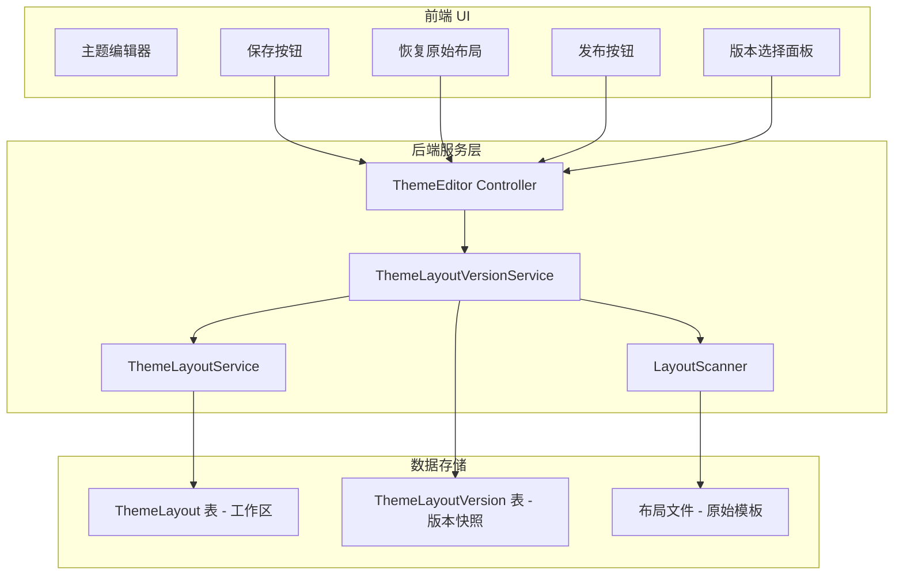
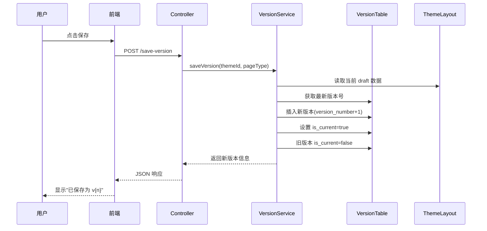
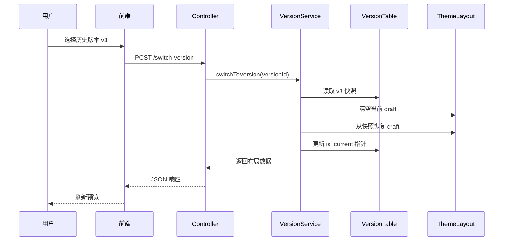
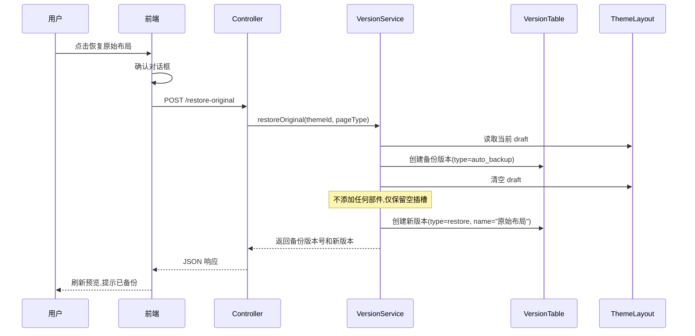
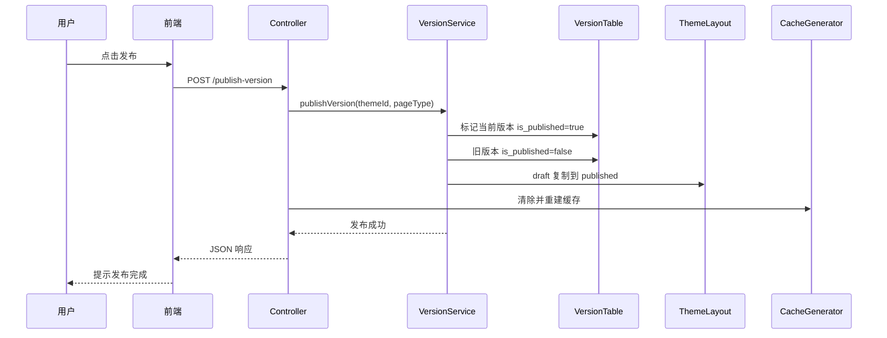

# 版本控制系统架构

## 系统架构图



## 核心流程

### 保存版本流程



### 切换版本流程



### 恢复原始布局流程



### 发布流程



## 文件结构

```
app/code/Weline/Theme/
├── Model/
│   ├── ThemeLayout.php           # 工作区模型
│   └── ThemeLayoutVersion.php    # 版本模型 (新增)
├── Service/
│   ├── ThemeLayoutService.php    # 工作区服务
│   └── ThemeLayoutVersionService.php # 版本管理服务 (新增)
├── Controller/Backend/
│   └── ThemeEditor.php           # 控制器 (更新)
├── doc/
│   └── version-control/          # 版本控制文档 (新增)
│       ├── README.md
│       ├── architecture.md
│       └── api-reference.md
└── view/
    ├── templates/backend/ThemeEditor/
    │   └── index.phtml           # 主编辑器模板 (更新，包含版本面板)
    └── statics/js/
        └── theme-editor.js       # 前端交互 (更新)
```

## 设计原则

### 1. 非破坏性操作

- 恢复原始布局前**自动创建备份**
- 切换版本不删除原有数据
- 版本快照为完整副本，互不影响

### 2. 工作区与版本分离

- 工作区（`m_theme_layout`）存储实时编辑数据
- 版本表（`m_theme_layout_version`）存储历史快照
- 两者通过服务层协调，保持数据一致性

### 3. 向后兼容

- 现有 `ThemeLayout` 表结构不变
- `status` 字段（draft/published）继续使用
- 旧 API `/restore-layout` 委托给新实现

### 4. 版本追溯

- 每个版本记录父版本 ID（`parent_version_id`）
- 支持构建版本树结构
- 可追溯版本演化历史

## 未来扩展

### 可选优化

1. **快照压缩**：对大量配置数据使用 gzip 压缩
2. **版本清理**：设置最大版本数，自动清理过旧版本
3. **差异存储**：只存储与上一版本的差异（增量快照）
4. **版本比较**：UI 增加两个版本间的差异对比功能
5. **分支管理**：基于版本树支持分支编辑和合并
