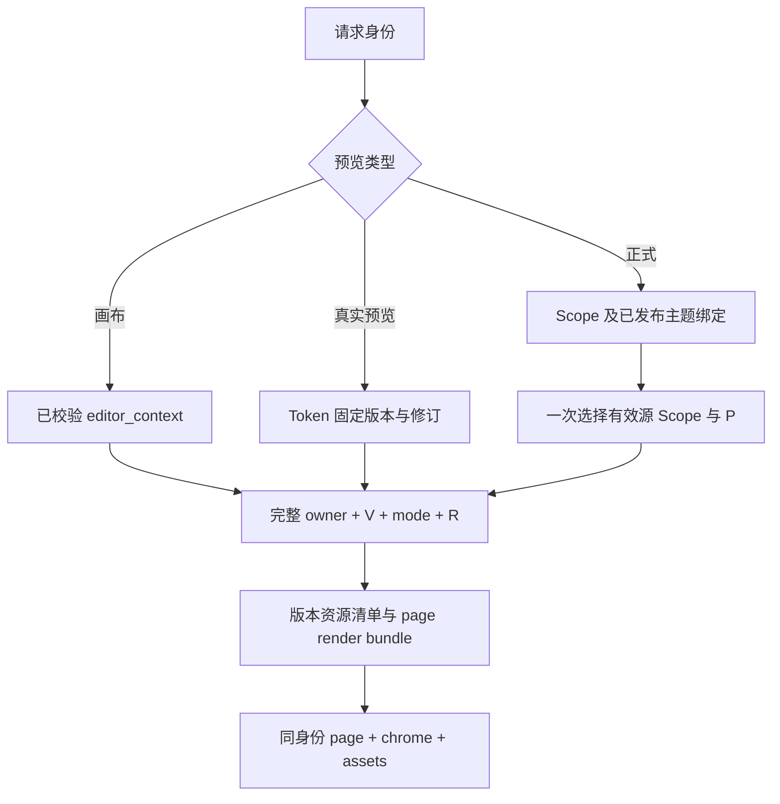

# 主题固化物实施方案：版本独占、持久草稿与一次性切换

> 状态：任务 1–5 已完成；任务 6 进行中（转换/硬切/删旧/单测已过；isolation e2e **16 passed / 0 failed**：UC-13 / UC-01·04·07 / UC-01·03·04 / UC-02 / UC-06 / GAP-01 / **UC-08-derived-parent** / UC-10 / UC-12 / UC-09-partial / UC-09 / **UC-03** / UC-14 / GAP-03 / GAP-02-04 / UC-11）。**缺口普查确认的 5 项已全部修完**：UC-08 写入端后代传播（#1）、UC-05 publish 缺 bake-before-commit（#2）、`assertThemeBindingHasNoVersionCycle` 死守卫（#3）、`ThemeScopeVersionResourceSnapshot` 从未写入（#4）、`is_current`/`is_published` 与 selection 漂移（#5）。**UC-15（多 Worker HIT）已于第二轮整条实测通过**（见 §5 UC-15 实测状态行）。**第三轮（2026-09-26）三处缺陷 A/B/C 全修**：单页发布 D' 真实分配（含前端「只发布本页」真实入口）、新版本行承接 `chrome_payload`/`structure_key`、`candidate_write_ok` 死码删除 + 烘焙失败补偿回滚；**UC-03 / UC-08 的两条残留与 UC-05 的 `candidate_write_ok` 残留全部清除**。**任务 6 仍未勾选**，因行为表仍有 `UC-07` 一条如实标注的未实测行（三态正文/外壳与 Token 优先级需登录态编辑器 + 真实预览 Token 的浏览器通路，本机不具备稳定窗口）。注记：第三轮修复暴露并处置了一处**既有假通过** `[case:GAP-01]`（其通过建立在空壳行 chrome 载荷塌成 `sha256('[]')` 上），已改为让夹具真实改动 chrome 并新增回归护栏断言。另记：第三轮如实标注的「潜在假阴性边角」**已于第四轮（2026-09-26）修成实证并全绿**——先用真实通路用例把它**从「库中不可达」升级为「可复现缺陷」**（新增 `[case:UC-08-derived-parent]`：≥3 级 owner 嵌套 + C' 充当上一已发布版本），由此连带挖出三处缺陷并全部修复：**D** `allocateDerivedVersion()` 不写 `structure_key`（⇒ 持有 C' 的 owner 再发布时 `parentStructureChanged` 恒假、覆盖了 chrome 的冲突子被误判「可自动前进」）、**F** C' 按设计无磁盘产物 ⇒ `ensurePublishedChromeForScope()` 回落 `ensureCurrent()` + `markPublished()` 把**用户草稿静默发布**（违反 UC-04）并清空 `draft_version_id` 使后代传播整段失效、以及修 F 后**新暴露**的第三处 `ThemeChromeWidgetRemovalService` 只读 legacy `is_published` 标志（「selection 已发布、标志未置位」时删除被直接写到**已发布版本**上）。详见 §4 任务 6 第四轮区块。更新：2026-09-26（第四轮）。
> 执行时使用 `superpowers:executing-plans` 或项目工程团队逐项实施；下列任务完成后勾选，不把文档交付当成运行验收。
> 目标：页面、公共外壳、配置和资源在同一主题版本内完整交付，草稿与正式互不污染，删除旧运行链路。
> 技术基础：PHP、现有 Theme Scoped Workspace、PostgreSQL、Framework 事务协调器/原子文件发布器/HotCache、WLS、PHPUnit、Playwright。
> 需求入口：[需求.md](../../需求.md) 的 `REQ-THEME-0037`；默认注入边界：[布局固化与默认注入.md](../../布局固化与默认注入.md)。本文取代旧“方案 B”中的路径、继承、草稿、发布和迁移约定。

## 背景

### 1. 要解决的实际问题

当前页面产物跟随 scoped release/revision，chrome 跟随 `ThemeScopeVersion`，两者还会各自选择范围与回退目录。只把文件夹改成 `tv{id}`，无法保证一个主题版本代表一套确定的页面与公共外壳。

本次目标覆盖 Theme 持久模型、编辑器版本操作、画布/Token/正式三态读取、布局固化、发布、缓存失效和派生文件清理。主题源模板、业务部件渲染、Scope 身份目录仍由原 owner 管理。本轮只交付方案和相关文档，不执行数据库转换、产物清除或功能发布。

### 2. 已核对的实现依据

以下是研究时的实现，均是需要改造的依据，不表示目标已经实现。

| 当前事实 | 代码位置 | 需要解决的问题 |
|---|---|---|
| `ThemeScopeVersion` 只承载 chrome；唯一键未含 `store_mode`，无 `area` | `Model/ThemeScopeVersion.php`；`Service/ThemeScopeVersionService.php::getCurrent/getPublished` | 同一版本须拥有完整逻辑资源快照；前后台和店铺模式必须隔离 |
| workspace 唯一键只有资源 `identity_hash`，没有主题版本 | `Model/ThemeScopeWorkspace.php`；`Api/Scoped/ThemeEditorContext.php::identityParts` | 不能让多个主题版本编辑同一份工作区 |
| page 的结构/配置在 tv 外，绑定为 `r*`/`d*`，另有 `current.json` | `Service/LayoutEntity/ThemeLayoutEntityPaths.php`、`ThemeLayoutEntityBindingStore.php` | 路径、数据与选择权威需要一起收口 |
| page、chrome 各自回落，shell 有不传版本的 `renderCurrent(theme,scope)` | `ThemeLayoutEntitySlotFiller::resolvePageEntityLocationUncached`；`ThemeLayoutEntityChrome::resolveRenderSources`；`ThemeLayoutEntityBakeCoordinator::buildPublishedShellChromeEchoStub` | 一个请求可能混用版本/范围 |
| 单页与批次发布先提交 DB，再 bake | `Service/Scoped/ThemeScopedWorkspace.php::publish/publishBatch` | 指针可见时文件可能尚未生成 |
| 旧 shell 刷新原位写文件 | `ThemeLayoutEntityBakeCoordinator::refreshPublishedWholeShellsUnderScopeDir` | 若增加 hardlink，会改坏其它版本同 inode 文件 |
| 卸载版本仍取 `ThemeLayoutVersion`；chrome 又保存裸 `user_deleted` | `WidgetDefaultInjectionService::resolveEditingVersionId`；`ThemePublishedVersionRuntimeResolver`；`ThemeChromeWidgetRemovalService` | 页面版本与主题版本的数字不能混用 |
| 旧 payload 的 `source`/`_source` 只覆盖部分自动节点 | `ThemeScopedLayoutWriteService`；`RequiredDefaultInjectionBakeMerger` | 不能声称所有旧结构都能无损拆成当前模板与用户操作 |
| 父范围发布会对后代做逐值重基线与冲突判断 | `ThemeScopedWorkspace::descendantContexts/propagateOneInTransaction` | 新模型必须保留逐值继承，不能简化成整份父子二选一 |

本表路径均相对 `app/code/Weline/Theme/`。原子文件原语来自 `Weline/Framework/Compilation/AtomicCompiledFilePublisher.php`，它保证单文件替换，不保证整个目录和 DB 一起提交。

### 3. 对原需求与旧计划的调整

| 原说法或未明确之处 | 本方案的确定选择 | 原因 |
|---|---|---|
| 每个页面都独占 chrome | page 按布局隔离；chrome 按版本共享 | 页头、导航、页脚属于主题公共外壳 |
| 草稿只靠 `tvB/draft` 保存 | 草稿 D 是未发布 `ThemeScopeVersion`，修订 R 持久化；目录只是派生缓存 | purge、重启或缺文件不能丢编辑结果 |
| `parent=0` 才表示不继承 | `base_version_id` 表示编辑基线；创建来源枚举决定是否允许跨版本硬链 | 编辑基线与字节复用权限是两件事 |
| 全局 `_blobs` 与多份 current/继承指针 | 删除 `_blobs`、`current.json`、`inherit.json`；DB 选版本，槽内 binding 选产物 | 避免重复权威和全局引用计数 |
| 相同 hash 自动跨版本共用路径 | 每个槽有自己的路径；只有显式历史继承可 hardlink | hash 相同不代表获得跨版本复用许可 |
| 单页发布实际带出其它草稿 | 保留单页发布；未选内容保留现正式，未选草稿进入后继 D' | 防止修改首页时一起发布尚未完成的其它页/页脚 |
| 从版本继承不复制任何卸载决定 | 复制用户意图为目标版本自己的决定，来源仅审计 | 否则续编、单页发布或历史继承会意外复活已删除部件；仍严格检查目标版本决定 |
| 历史版本必须永久复现旧模板字节 | 冻结用户意图与资源选择；源升级后按当前模板重建 | 遵守现有升级契约，避免陈旧自动结构复活 |
| 只保留最近 5 份产物就能保证任意历史预览 | 首版不按数量删除有效历史；只做离线可达性清理 | 历史承诺不能依赖碰巧残留的磁盘文件 |
| 各页面独立回落祖先最新值 | 读取先确定版本；父发布在写路径生成无冲突后代版本 | 保留逐值继承，同时使历史快照不会漂移 |
| 新版本立即生成全站所有文件 | 完整逻辑清单，按需物化；发布预备已物化工作集及本次所改页面 | 保证身份完整，控制固化成本 |
| 保留旧读分支便于回退 | 一次性数据转换，运行硬切；回退恢复整套部署备份 | 新运行不再解释旧 API、路径或版本轴 |

## 方案

### 1. 身份与术语

版本 owner 固定为 `(theme_id, canonical_scope, store_mode, area)`。`area` 只接受 `frontend/backend`；Scope 使用框架规范身份，不能自行按请求字符串猜测。回落祖先时保留 `store_mode/area`，返回祖先自己的完整 owner。

| 符号 | 含义 |
|---|---|
| P | 当前对访客生效的正式版本，由 selection 唯一选中 |
| B | 草稿创建时冻结的编辑基线；通常为 P，显式从历史 X 创建时为 X |
| D | 持久的可编辑草稿版本 ID，不是目录名或 page revision ID |
| R | D 的主题级内容修订号；一次保存涉及的 page/chrome/决策属于同一 R |
| N | D 封存后的不可变正式版本，`N=D`，ID 不重新分配 |
| H | 可预览的已封存历史版本；不一定是当前 P |
| layout identity | 保留 `ThemeEditorContext` 规范化的资源身份，包括布局类型/选项/target；布局结构不按语言分叉 |

“正式”表示已封存、可完整渲染的版本；“已发布”表示 selection 当前选中了它。保存命名版本可以只封存而不上线。发布已有 H 可以切换选择，但不改写 H。初次初始化分配真实 ID 的系统初始版本，来源为当前主题包；不使用 `tv0` 或虚构 release。

### 2. 持久模型与唯一权威

下列新增文件/字段均为计划项。表名由框架加当前部署前缀，文档不写死 `m_` 或 `w_`。

| 持久对象 | 目标字段、约束和职责 |
|---|---|
| `theme_scope_version` | 保留 `version_id`；增加 `area`、`lifecycle=draft/sealed`、`content_revision`、`creation_source_kind`；现 `parent_version_id` 迁为只读审计 `creation_source_version_id`；实际编辑基线只属于修订头。版本号唯一键改为 owner + `version_number`。正式内容封存后不原位编辑。`is_current/is_published` 删除，列表由 selection 派生 |
| 新 `theme_scope_version_selection` | owner 唯一；`published_version_id`、可空 `draft_version_id`、`selection_revision`。外键与服务共同保证版本属于同一 owner、published 指向 sealed、draft 指向 draft。它是版本选择的唯一可变权威 |
| `theme_scope_workspace` | 版本内资源增加 `theme_version_id`，唯一键改为 `(theme_version_id,identity_hash)`；`identity_hash` 本身不混 tv。revision/patch 保留作为编辑意图与审计。资源 `theme_binding` 保持版本外，使用自身规范资源身份唯一键 |
| 新 `theme_scope_version_revision` | 唯一 `(theme_version_id,content_revision)`；保存本 R 的 `base_version_id`、`kind=draft/sealed`、包默认来源、chrome 用户意图/配置、Scope 来源版本和清单摘要。一经写入不可修改；版本行的 `content_revision` 只选择当前修订 |
| 新 `theme_scope_version_resource_snapshot` | 唯一 `(theme_version_id,content_revision,resource_identity_hash)`；保存规范资源键、明确的 intent/release 引用及来源指纹。同 R 下的资源集合不可变；D 下一次保存生成 R+1，再 CAS 推进版本行。page release/revision 仅是内部引用，不负责选择主题版本 |
| `theme_scope_release` | 增明确 `theme_version_id`/快照归属；继承旧不可变 release 的内容引用允许有来源版本，但必须校验 owner/资源对应关系。`compiled_artifact_json` 中旧绝对路径清除再生成，不删除有效内容 |
| 新 `theme_scope_version_widget_decision` | 唯一 `(theme_version_id,content_revision,resource_identity_hash,injection_key)`；含明确安装/卸载决定、槽和 widget 身份、操作人及可空来源版本。chrome 使用独立的 chrome 资源键。决定随 R 一起冻结 |

`theme_binding` 先选择主题，再选择该主题版本，因此必须留在版本外；否则会形成“先知道版本才能选主题”的循环。版本清单包含 `layout/meta/appearance/i18n`，chrome 由同 R 的修订头持有。草稿可变 chrome 不再作为所有 R 共读的单个可覆盖 JSON；旧 `chrome_payload_json` 移入修订头，版本行只保留当前修订游标。旧 parent 不再决定实际读基线，创建来源与当前编辑基线的职责明确分开。

对 `theme_binding` 和版本内资源采用互斥约束：前者 `theme_version_id IS NULL` 并保持独立唯一约束，后者必须有版本 ID。不要让 NULL 组合唯一键留下多个绑定工作区。

**完整逻辑清单不等于全站文件列表。** 每个版本保存当前主题包的默认来源描述，以及所有显式资源覆盖/意图。对当前布局目录中存在、但没有覆盖记录的资源，确定地使用该版本的默认来源与公共配置。该规则属于版本清单本身；不能临时读取其它版本“最新 workspace”。这样源升级新增布局可以使用包默认值，而缺失明确引用的 release/revision 仍会被识别为数据错误。

### 3. 保存的是用户意图，不是过期模板

新写入必须区分：当前模板/注入计划生成的默认关系、用户增删移动节点与配置操作、人工卸载决定。用户操作使用稳定 `node_uid`/slot/injection identity，沿现有 patch 引擎保存。自动节点结构不能被整份旧 `effective_payload_json` 当成永久模板重放。

版本快照冻结显式操作、配置、资源引用和 Scope 来源版本。物化输入为：**当前源主题/design 模板 + 当前默认注入账本 + 此版本的持久用户意图**。源指纹和注入计划指纹进入派生产物的新鲜度判断。升级后预览 H 的含义是“当前模板上应用 H 的用户状态”，不承诺旧 HTML 或旧 PHP 模板逐字节回放。

用户操作指向已删除的源节点时，沿现有结构冲突规则报告失效操作；正式页用当前合法模板呈现可应用部分，保留原操作和诊断供编辑器修复。不能为了应用旧操作重新制造已移除的源节点，也不能默默删掉持久操作。部件缺失仍按既有 soft-skip 规则记录，不新增店面硬 500。

### 4. 目录、binding 与不可变文件

统一新树如下。`scope_key` 对规范 scope 和 `store_mode` 做确定性、无歧义编码后取完整 SHA-256，binding 同时保存原值；禁止继续靠有碰撞风险的字符替换。layout key 使用完整资源 hash，不再截短为 16 位。

```text
var/runtime/theme-layout-entities/
  {theme_id}/{area}/{scope_key}/
    tv{V}/formal/
      chrome/
        structures/v{V}/{structure_key}/chrome.phtml
        configs/v{V}/{config_key}/config.json + assets.json
        bindings/v{V}-g{R}/binding.json
        bindings/v{V}-g{R}/{artifact_key}.json
        rendered/{artifact_key}/{render_vary_key}.html
      pages/{layout_identity_hash}/
        structures/v{V}/{structure_key}/layout.phtml + shell.phtml + structure.json
        configs/v{V}/{config_key}/config.json + assets.json
        bindings/v{V}-g{R}/binding.json
        bindings/v{V}-g{R}/{artifact_key}.json
    tv{B}/draft/                         # DB 选择的草稿 D 的唯一派生根
      chrome/…                          # 与 formal 相同的内部结构
      pages/{layout_identity_hash}/…
```

`structure_key` 仍描述关系结构，配置 key 描述配置与资源清单；owner 通过目录及 binding 隔离。结构/配置袋也带 V：即便两个不同 D 先后使用同一个 `tvB/draft` 根，仍有各自的文件路径，不能因 hash 相同静默跨版本共用入口；同 D 不同 R 才可直接复用本槽不变内容。shell 的结构指纹必须涵盖其固定 owner/mode，不能拿 page 结构相同误判 shell 可跨身份使用。

每份 binding 采用 `theme-layout-entity.v3` schema，字段至少包含完整 owner、`theme_version_id`、`base_version_id`、`mode`、`content_revision`、资源键、结构/配置键、源/注入指纹、文件校验信息。page 的 render bundle 还固定同 owner/同 R 的 **chrome immutable binding key**。内容文件与 `{artifact_key}.json` 写后不改；`vV-gR/binding.json` 只选择该槽该修订的完整产物，不选择版本或模式，以原子替换发布。没有 `current.json`。draft 根可以先后容纳多个 D 的历史修订，V 必须写入内部 binding 路径，不能让 R 从 1 开始的新 D 覆盖旧 Token 的文件。

请求读一次 page render bundle 后持有不可变 DTO；结构、配置、chrome、head assets 都沿这份 DTO。shell 可固定 owner/mode，并通过请求 DTO 取 chrome binding；不得在执行时重新查“当前 chrome”。配置变化只生成 sidecar 和 binding，结构 PHTML 的 hash/mtime 保持不变。D 转正时重新生成 N/formal 的 shell/binding，不能把 draft 目录改名当成发布。

模板仍是 `renderBound`/`renderRuntimeInline` 关系壳，不能包含某次请求的商品、登录、form_key 等 HTML。公共 chrome 的去个性化 HTML 快照是单独的性能产物，必须 finalize 嵌套槽后使用。草稿和 Token 预览实时执行同构关系壳，不读公共 rendered HTML。

### 5. 版本创建、继承与人工卸载

创建命令只有三种来源。普通继续编辑已有 D 时直接返回当前草稿；明确从历史/主题包另建而已有 D 时，先将原 D 封存为不上线的自动备份，再原子选择新 D，不覆盖原编辑内容：

| `creation_source_kind` | 内容来源 | 跨版本文件策略 |
|---|---|---|
| `continue_current` | 从当前 P 继续编辑，B=P；普通保存不弹继承选择 | copy 或按输入重新物化；不跨 tv 硬链 |
| `explicit_historical` | 用户明确选择同 owner 的 sealed X，B=X；复制其用户意图 | 输入指纹一致时可将 X 的不可变结构/配置 hardlink 到目标自己的目录，否则重建 |
| `package_defaults` | 清除指定范围的用户覆盖并使用当前主题包默认值；B 仍记录本次编辑基线 | 独立物化，不借历史固化物 |

系统初始版本以 package_defaults 创建；Scope 派生版本沿 continue_current 继承本级意图，并以现有 version_type 的新增 scope_rebase 类型标识，实际祖先来源固定在 R 头。

不增加 `bake_inherit` 或磁盘 `inherit.json` 第二套授权。普通基线承接是必要的编辑语义；显式历史来源才授权跨 tv 字节硬链。任何 binding 只能指向自己的槽。跨主题/area/Scope/store mode 不开放“历史版本继承”，范围继承走下一节的独立规则。

hardlink 只是优化：源文件必须不可变、输入一致；不满足时独立生成，文件系统不支持则 copy。所有更新通过新 inode + atomic rename；禁止覆盖已有共享 inode。没有显式历史来源时，即使 draft 曾与 B/formal 共用 inode，转正也必须 copy/rebake 断链。首版不做 formal/draft 自动硬链，避免这类隐式授权。

**人工删除是用户意图。** B→D 续编、从 X 明确继承、单页发布保留未选页面时，将所采用内容的卸载意图写成目标版本同 R 的决定；审计可记录来源，运行只检查目标记录。D 封存为 N 因 ID 不变直接保留；未选草稿修改及其决定进入 D'。只有显式恢复默认/重新安装才撤销目标决定。恢复原始布局先将当前 D 封存为不上线的自动备份，再创建 D' 清除所选资源的用户覆盖和决定；其它资源保持原编辑内容，P 不变。该调整替代旧计划“不复制源卸载”的要求，防止正常版本操作复活部件。

默认注入仍必须满足：同模块标签/JSON 二选一；跨模块只走拥有模块 JSON；required 默认项有槽、无目标版本人工卸载就固化，布局内嵌必装同理。未标 required/false 的推荐项保持显式安装语义，安装后作为用户意图参与版本继承。语言、主题激活状态、版本号都不能成为省略条件。运行时不再解析旧 `source=user_deleted@旧页面版本ID` 为新版本权限。

### 6. 三态读取与源 Scope



画布仍使用真实路由 + 参数/typed context，不签发店面 Token；参数必须经过后台权限、owner 和版本归属校验。指定 H 用 `formal`，编辑 D 用 `draft`。Token 明确保存 owner、V、mode、R 和目标，不能由 URL 覆盖；Token 固定的旧草稿 R 在短期有效期内仍可读，即使 D 已封存或不再是当前草稿，也只读取该 R 头中的 B 与资源引用；不得回查版本行当前的 R/B。写操作仍只允许 selection 当前的 D/R。正式 GET 由 RequestContext 选已发布主题绑定，再沿规范 Scope 链找到完整 `(effective_owner,P)`；不读取 draft。

page、chrome 和 assets 不再独立回落。资源 hash 在确定有效 owner 后按该 Scope/area/store mode 重新计算，不能拿请求 leaf 的 hash 拼祖先目录；生成子版本快照时同样转换成子 owner 的资源键，祖先身份只存来源引用。缺文件就在已选版本目录定点重建；有数据却无文件是缓存 miss，缺失显式数据引用是数据问题。两者都不能触发旧目录扫描、借另一 tv 或把 D 自动发布。无本级正式覆盖的范围可直接使用祖先 owner 的产物，不强制复制一套空壳目录。

### 7. Scope 逐值继承与历史稳定性

继续保留 Channel→Store→Website→Global→主题包的逐值继承、本级 patch 优先及现有整槽 ADD_NODE 截断规则。跨 Scope 不把祖先值伪装成子级用户 patch；版本的有效快照可以固定合成结果及来源，这是渲染快照，与编辑所有权不同。

父 P→P' 发布时，在写路径按现有依赖关系处理后代：无自有正式覆盖者直接回落；已有 C 且有效值未变者保留 C；有效值变化且无冲突者生成系统派生 C'，固定新的父来源和本地意图。P' 与所有可更新 C' 的候选先准备好，再在同一 DB 事务切 selection。出现结构冲突的后代保留完整 C，父发布继续；它下面的范围以仍有效的 C 为父计算。不得把冲突页留在 C、chrome 却换成 C'。

子草稿无冲突时生成新的内容修订并重基线到 C'、迁入 `tvC'/draft`；有冲突则保留原基线与原文件、显示既有冲突信息。旧 Token 仍按原 V/R 快照读取。历史 H 总是读自己记录的父来源，不动态追今天的父 published。

### 8. 保存、封存与发布顺序

使用 Theme 自有发布编排接口，把现有 scoped patch/release/批次和 Framework `WriteIntentTransactionCoordinatorInterface` 组合起来。Controller 不承担事务或固化逻辑。

版本创建、命名保存、发布和恢复默认前，编辑器先提交待保存表单/增量并取得最新 D/R；提交失败保持当前编辑状态，不继续切换。

**草稿保存：** 校验 owner、D、预期 R/父 release → 构造 R+1 的不可变资源和决定 → 写齐本次会显示的 page/chrome binding 候选 → DB 事务插入资源快照并 CAS 推进 `content_revision`。失败保留 R 与输入；遗留候选之后离线清理。事务前预备文件使用同目标写者锁，但锁不被当成读者屏障。

**命名保存：** 基于 D 的指定快照新建不可变 `Rsealed`，封存为 N=D，准备 N/formal；旧 draft R 不覆盖，旧 Token 仍可读。不要求同时发布。只封存时 P 不变，编辑器展示 N，后续继续编辑懒建 D'。封存后不能调用 `setChromePayload` 等旧入口原位修改 N。

**发布草稿/版本：**

1. 冻结预期 selection、当前 P、D/R 或 H；明确发布集合。单页默认仅包含该 layout 与其 page-local meta/i18n；主题级 appearance、chrome、theme_binding 只有明确选中才包含。全主题发布包含此 D 的全部资源。
2. 对草稿用新的 `Rsealed` 构造 N=D 的完整逻辑清单，保留原 draft R。未选资源固定**准备时 P**的状态，而不是 D 的未发布状态；即便 B 为历史 X，也不回滚未选页面。保存为版本但不上线时默认封存 D 全部内容，不套用单页上线合并。
3. 如有未选草稿修改，预备 D'（base=N）并用现有 patch 引擎重锚其意图/决定。不得丢弃、不把它们带入 N，也不让它们继续挂在已封存 N 的可变 workspace。无法重锚的冲突返回既有冲突结果并保持原 D，不能半发布。
4. 按前节构造后代 C'。复用现有 preparing 批次 receipt 分配 D'/C' 候选版本 ID；预备记录不进入 selection 或可读历史，最终事务才封存/选中，不增加对外审批状态。候选预备范围为本次变化的布局、chrome，以及当前已物化的工作集；未物化布局有完整逻辑来源，首次请求定点生成。不因创建版本扫描全站 URL 或渲染全站 HTML。
5. 文件使用原子 publisher 写完整不可变候选。先 chrome 关系壳及必要的公开 rendered 快照，再 page render bundle/shell；校验 owner、R、引用与内容可读。相同目标不能原位覆盖旧产物。
6. 开启一个 DB 事务，按稳定 owner 顺序锁 selection 并比较预期版本/R。写入 N、D'、C' 的快照/决定/release receipt，原子切 published/draft 选择。文件不能随 DB 回滚，但在提交前不被公开选择；CAS 失败的候选是孤儿，旧 P 与 D 不动。
7. 提交后沿 owner changed 推进 Theme/FPC 代次并忘掉可变选择缓存，覆盖父及实际更新的后代。复用现有事务后事件/批次恢复机制；发布响应成功前确认该批次失效已完成，失败按既有 receipt 恢复同一批次，不再封存一个重复版本。
8. 成功后 D' 或空成为当前草稿。旧 draft 的历史修订留到 Token 到期且 Worker 排空后再回收派生文件；DB 审计保留。

发布已有 H/回滚到 H 也先检查其可重建数据并备齐所需文件，再走相同 selection 事务与后代传播，不改写 H。当前另有草稿时保留其编辑内容，按既有 rebase/conflict 语义处理，不能因切换正式版而清空草稿。

DB 与缓存不是一个跨系统原子事务：提交前已开始的请求可完成旧完整快照，提交与 changed 传播间可能短暂读旧完整版本；不得出现半新半旧。若要求所有新请求零旧版本，需要额外跨系统一致性代价，本方案不做此承诺。发布成功响应后的新请求必须选到新代次；真实验收检查这一边界。

### 9. 注入变更、源升级与惰性物化

正常请求只读已选 binding，不能每次读计划账本、扫描模块或重组结构。缺单页产物时只建该页及必要 chrome。preview 可对明确选中的非激活主题按同样规则定点构建。

默认注入变更按照声明涉及的布局/槽，处理所有主题所有版本中**已存在的受影响槽**，包括非激活主题和 draft；没有产物的槽更新源/计划指纹，待明确访问时按新输入生成。重固顺序是新 chrome 完成 finalize → 新 page bundle 固定该 chrome → 原子替换各自 binding 选择。旧不可变 bundle 可供在途请求完成；不原位覆盖。全主题批次可以逐 owner 执行，不承诺全站同时替换，但批次完成须报告每个受影响目标的结果，不能只记日志便称完成。

`setup:upgrade` 仍清整棵 `var/runtime/theme-layout-entities/`，并失效 Theme/FPC。升级属于停写、停止接新请求并排空旧 Worker 的部署阶段，purge 后加载新代码再恢复服务；不在旧请求仍持有路径时清空它们。首次访问从当前模板和版本用户意图恢复；禁止按 DB 陈旧自动 structure 全量回烘。DB 版本、草稿、release、决定和源码不在 purge 范围。

### 10. 缓存与清理

正式选择、纯数组 binding 与配置复用 Framework `CachePolicy`/`HotCache`，不增加业务 static 缓存或另一套共享池。键含完整有效 owner、V、mode、R、资源身份/产物指纹。结构 `vary=[]`，依赖 Theme；公开 chrome HTML 增加实际输出的语言、币种、来源站等合法变化维度与 i18n 依赖。共享 HTML 必须排除账户、购物车等个人信息。

draft、Token/画布预览、事务候选、可变 Model 不进公共 HotCache/FPC，仅请求内复用。可变选择不使用过期值回退。发布 invalidation 使用原 owner changed 契约；现有 `clearScopedCaches` 会清多个全池，不能因名字含 Scoped 就认定它已定点。实施时测量并收紧实际 namespace/FPC 范围，不能删必要依赖制造虚假 HIT。

首版 **不实现在线 GC**。在停写、Token 有效性核对且 WLS Worker 排空后，按 DB published、所有可预览 sealed、当前/Token 引用草稿修订以及既有未完成发布 receipt 做 mark→sweep；只清无引用候选、已废弃草稿派生代次和明确删除版本的派生产物。有效历史版本不按“最近 N 个”淘汰。无全局 `_blobs`，无全局 inode 引用计数。升级 purge 是可重建缓存的整体失效，与删除业务版本是两种操作。

## 细节

### 1. 代码改动与接口归属

路径相对 `app/code/Weline/Theme/`；标“新建”的路径是实施目标，尚未存在。新增类按下列职责拆分，不继续把所有版本逻辑塞进 `ThemeEditor` 或 `BakeCoordinator`。

| 位置 | 改动职责 |
|---|---|
| `Model/ThemeScopeVersion.php`、`Model/ThemeScopeWorkspace.php`、`Model/ThemeScopeRelease.php` | owner、生命周期、版本化键和不可变引用；迁移旧 flag/parent 语义 |
| 新建 `Model/ThemeScopeVersionSelection.php`、`ThemeScopeVersionRevision.php`、`ThemeScopeVersionResourceSnapshot.php`、`ThemeScopeVersionWidgetDecision.php` | 唯一选择、不可变修订头、资源快照与人工决定 |
| `Api/Scoped/ThemeEditorContext.php`；新建 `Api/Version/ThemeVersionIdentity.php`、`ThemeVersionPublicationInterface.php` | 稳定资源 hash 不变；单独组合 owner/V/mode/R；接口覆盖 createDraft/saveDraft/seal/publish/selectHistory |
| 新建 `Service/Version/ThemeVersionSnapshotBuilder.php`、`ThemeVersionPublicationService.php`、`ThemeVersionSelectionResolver.php` | 逻辑快照、事务编排、一次解析身份；调用原 scoped patch/release 能力，不复制一套合并算法 |
| `Service/Scoped/ThemeScopedWorkspace.php`、`Api/Scoped/ThemeScopedWorkspaceInterface.php`、`Service/Scoped/ThemeScopedReleaseBatch.php` | 版本化工作区、主题级 R、先预备后提交；保留逐值继承、乐观并发和批次恢复 |
| `Service/ThemeScopeVersionService.php` | 查询 owner 完整化；旧直接 flag/原位 chrome 发布退出；转接新归属接口 |
| `Service/LayoutEntity/ThemeLayoutEntityPaths.php`、`EntityRenderBinding.php`、`ThemeLayoutEntityBindingStore.php`、`ThemeLayoutEntityConfigStore.php` | 新目录/schema/不可变 render bundle；旧签名删除 |
| `Service/LayoutEntity/ThemeLayoutEntityMaterializer.php`、`ThemeLayoutEntityBakeCoordinator.php`、`ThemeLayoutEntityInjectionTargets.php` | 当前源模板+用户意图、定点候选、注入影响集合、shell 同身份与原子写 |
| `Service/LayoutEntity/ThemeLayoutEntityPointerResolver.php`、`ThemeLayoutEntityRuntime.php`、`ThemeLayoutEntitySlotFiller.php`、`ThemeLayoutEntityChrome.php`、`ThemeLayoutStorefrontHeadAssets.php` | 单一身份读取、明确历史/draft、缺物定点重建；不另选版本 |
| `Service/WidgetDefaultInjectionService.php`、`ThemePublishedVersionRuntimeResolver.php`、`ThemeChromeWidgetRemovalService.php`；`Service/LayoutEntity/RequiredDefaultInjectionBakeMerger.php` | 所有注入、内嵌省略判断统一查目标主题版本决定 |
| `Controller/Backend/ThemeEditor.php`、`view/statics/js/theme-editor.js`、`view/templates/backend/ThemeEditor/index.phtml` | 新版本 API、单页/整主题发布集合、历史查看与显式继承；前端继续走 Weline.Api |
| `Service/PreviewContextService.php`、`PreviewTokenService.php`、`ThemeVersionPreviewResolver.php` | Token/画布显式 owner/V/mode/R；删除旧节点投影猜版本；硬切时旧格式 Token 失效并重新签发 |
| `Service/StorefrontThemeCacheCoordinator.php`、`ThemeRuntimeCacheCleaner.php`；`Observer/ApplyWidgetDefaultInjections.php`、`SetupUpgradeAfterPurgeLayoutEntities.php` | 键、changed、批次报告、升级排空时序；Framework 原语复用，不跨模块直调 Model |
| 新建 `Console/Theme/Layout/ConvertVersionArtifacts.php` | 一次性离线转换；命令 `theme:layout:convert-version-artifacts`，支持 dry-run、apply、resume 同一 receipt；Task 6 已可执行 |

对外 API 的目标字段/操作详见 [版本 API 契约](../../version-control/api-reference.md)。所有写操作携带 typed context、明确 theme version、预期内容/selection 修订和现有幂等标识；服务端校验，不能信任客户端自行拼路径或选择别的 owner。

### 2. 必须删除的旧实现清单

“删除”是实施验收项，当前文档更新并未声称已经删代码。替代路径接通后在同一发布批次移除，禁止留双读开关。

| 旧项 | 明确处理 |
|---|---|
| 旧 scope 根 `pages/{identity}/{r*,d*,s*}`、`configs`、scope 级 `chrome/s*`，以及旧 `tv*/chrome` 格式 | 首次切换安全 purge 整个派生根；新格式重建。不得因也叫 tv 就误保留旧 binding |
| scope 级 `_blobs`、`inherit.json`、所有 `current.json` 设计/文件 | 不实现这些新建议；旧 current 文件与读写一起删除 |
| `Paths::pageStructureOrRelease/pageCurrentJson` 及 tv 外共享结构/配置路径 API | 删除旧签名及调用；其余路径方法改为 typed identity |
| `SlotFiller::readPageCurrent/rememberPageCurrent/scanSolidifiedSegment/resolveStructureOrRelease` | 删除 current 读写、r/d/s 目录猜测和失效的扫描桩；明确身份内的定点重建保留 |
| `BakeCoordinator::writePageCurrentPointer`；旧 `refreshPublishedWholeShellsUnderScopeDir` | 删除双指针及遍历 r* 原位写；改新 binding 发布 |
| Binding/Config/Runtime 接受旧 `entityKey=r/d/s` 的参数与 v1/v2 hydration | 删除，不做 schema fallback；旧格式只在离线转换器中识别 |
| `Chrome::readRenderedCache` 的 binding=null/mtime/裸 HTML 文件兼容；运行时各自祖先 chrome 拼接 | 删除；只读当前请求固定的合法 bundle/公开变化键 |
| `ThemeVersionPreviewResolver`、`ThemeLayoutVersionBindingResolver` 的节点相似度/投影匹配 | 运行删除；不能按结构相同猜历史 page/chrome/卸载归属 |
| `ThemePublishedVersionRuntimeResolver` 和编辑卸载读取旧 `ThemeLayoutVersion` 的版本轴 | 重写为 ThemeScopeVersion；旧 `source` 字符串仅作一次性输入，不作目标决定 |
| `ThemeScopeVersion.is_current/is_published` 权威查询、无版本 `renderCurrent` 调用、缺 chrome 自动 `markPublished` | 删除；任何缺文件恢复都不能发布草稿 |
| `ThemeLayoutVersionService`/旧页面版本 Model 的在线版本管理、旧虚拟布局版本适配投影 | 版本功能接新接口；移除运行调用，失去调用者的类删除。旧 DB 内容保留为只读迁移档案，虚拟布局业务实体本身不删除 |
| 五组旧 HTTP `versions/save-version/switch-version/restore-original/publish-version`、成对 Payload 方法、模板 data-api 与 JS 调用 | 新 ThemeScopeVersion 契约替换后删除旧接口；无旧 JSON 别名、旧 version_id 含义或 302 兼容 |
| `Console/Theme/Layout/MigrateBindings.php`、`theme:layout:migrate-bindings` 及注册产物 | 删除旧兼容迁移命令，刷新自动生成的命令注册/反射；不手写 generated |
| 旧绝对路径缓存、旧 FPC 与未带 V/R 的 Token | 切换时失效并重签 Token；禁止从旧缓存命中路径绕过硬切 |
| “跨版本同结构必须相同路径”“current/r* 决定正式”“保留旧缺基线读”的测试断言 | 删除这些断言并换新身份行为案例；不整批删除行为测试 |

保留：源模板与 design 文件、业务 DB 原始内容、历史审计、可重用 revision/release/patch 引擎、默认注入账本、Scope 目录、Framework HotCache/原子 publisher、三态预览、公共外壳完整性和安全 soft-skip。禁止把“删旧”扩大为清业务库。

### 3. 一次性转换与上线步骤

1. **转换器先 dry-run。** 读取一致性 DB 快照，按规范 owner 列出现正式、草稿、资源/决定引用；检查旧版本数字来源。输出可转换映射、原始记录校验、无法确定的具体记录及原因，保留可重复执行的 receipt。
2. **当前状态优先建立新基线。** 从明确的 scoped published release、patch、有效 chrome 及对应人工决定建立当前 owner 的 P/D。旧 chrome 缺 area 时，只对能够证明正在消费它的 owner 建立“切换基线”，不宣称这些 owner 历来共用同一版本。新 ID 显式映射，不能照抄碰巧相等的旧数字。
3. **不猜历史。** 只有批次记录等证据能证明完整 page/chrome/决定关联的旧历史，才转换成可渲染 H。无法证明的保留原始 DB 和只读导出档案，历史列表明确标为“旧记录，仅归档”，不提供伪造的预览/发布。这不属于新运行兼容读取。
4. **用户意图不能靠 hash 猜。** 优先使用原 revision/patch 和明确人工操作；无基线、无来源标记的旧整份结构保留原件。若它属于当前有效页面/草稿，转换报告要求具体来源映射/内容整理后再执行切换，不能静默删除用户内容，也不能作为旧结构整份回放。此限制来自现有数据缺证据，不新增审批流程。转换器必须能再次 dry-run 验证修正后的映射。
5. **停写并排空现有请求。** 保存一致性 DB/源码部署备份；应用数据库转换和新代码。离线核对行数、映射指纹、目标版本决定、当前 P/D 与新模型约束。原始档案只读，不接前台热路径。
6. **硬切运行树。** 用受限于本根的 `purgeAllEntities` 删除旧派生文件，失效 Theme/FPC/旧 Token，刷新需要的反射和命令产物，加载新 Worker。新模型先可用再恢复请求，绝不先清线上唯一可读文件再继续旧进程。
7. **真实验证。** 当前正式页首次请求从当前源模板恢复；画布、草稿 Token、历史 H 各自恢复自己的版本。验证旧路径零读取与完整页脚/必装部件，之后才认定这次切换完成。
8. **回退方式。** 若切换失败，在同一停写/排空条件下恢复匹配的 DB+代码部署备份并重新生成对应派生物。不能在新代码中临时开启旧读分支，不能拿旧 DB 与新 selection 混跑。

旧档案不是承诺永远保留在线旧表结构。删除档案属于独立的数据保留决策，本实施不 drop 原始历史内容；本次必须删除的是旧运行代码、派生文件、缓存和操作文档中的兼容流程。

### 4. 分阶段实施任务

每项先补能够重现该问题的最小失败用例，再实现并验证该项；阶段可分提交，但所有相关入口完成后才统一切换运行。禁止把未完成的一半协议投入正式读取。

- [x] **任务 1：版本身份与快照。** 修改模型/typed context，新增 selection/snapshot/decision 和一次性转换器的 dry-run。输入为现有 scoped 记录，输出为 owner/V/R 的确定映射。扩展 `test/Unit/Api/Scoped/ThemeEditorContextTest.php`、`ThemeScopeVersionModelContractTest.php`；新增 `test/Unit/Service/Scoped/ThemeVersionSnapshotTest.php`。断言 area/mode/版本隔离、theme_binding 无循环、无证据历史只归档、人工决定属于目标版本。
  - 验收：`vendor/bin/phpunit --no-configuration --bootstrap app/bootstrap_phpunit.php` 上述三套件 **OK (18 tests, 105 assertions)**（2026-09-25）。运行读取仍走旧 flag/路径，未硬切。
- [x] **任务 2：槽内固化与统一读取。** 改 Paths/Binding/Materializer/Pointer/SlotFiller/Chrome/HeadAssets；删除 current/r/d/s 读法。输入为任务 1 身份，输出为同 V/R 的 render bundle。修改 LayoutEntity 对应行为测试及 fixture；新增 `ThemeVersionArtifactIsolationTest.php`。断言 page/chrome 一致、缺物同版本重建、config-only 不改 PHTML、非继承 inode 隔离、显式 hardlink 写时不污染源。
  - 验收：Paths/Binding v3 + Isolation/PathsContract/missing-binding 单测通过（2026-09-25）。Service 内 `pageCurrentJson`/`pageStructureOrRelease`/`writePageCurrentPointer` 已清零。正式读取仍依赖任务 3 发布编排与任务 6 硬切，未宣称全套 LayoutEntity 旧 fixture 全绿。
- [x] **任务 3：保存、封存、发布与 Scope 传播。** 接新发布服务，改 scoped publish/publishBatch 的顺序与事件边界。新增 `test/Unit/Service/Scoped/ThemeVersionPublicationTest.php`，扩展现有 ReleaseBatch/Recovery/Rollback 测试。断言候选写失败/CAS 失败保留 P/D，单页剩余进入 D'，命名保存不上线，父与合格后代原子选择，冲突后代整套留 C。
  - 验收：`ThemeVersionPublicationTest` **OK (8 tests, 34 assertions)**；`ThemeScopedWorkspace::publish` 对 layout 改为事务内「先 bake 候选再切换 published 指针」。publishBatch 全量编排与编辑器 HTTP 仍待任务 4。
- [x] **任务 4：编辑器与三态 API。** 替换五组旧页面版本接口、UI 调用和 Token 载荷；实现明确历史继承、保存版本、单页/整主题发布、恢复默认。沿现有组件实现必要的发布集合选择，文案进入 Theme 中英 CSV；不改编辑器整体布局。扩展 `theme-editor-workflows.spec.js`、`theme-preview-publish-and-exit.spec.js`、`theme-editor-scope-inheritance.spec.js`，验证画布/Token/正式读法和未选 chrome 保留。
  - 验收（2026-09-25）：`ThemeEditorScopeVersionApiContractTest` **OK (5 tests)**；`ThemeChromeWidgetRemovalServiceTest` **OK (12)**；`ThemeVersionPublicationTest` **OK (8)**。控制器五端点 + QueryProvider + `index.phtml` data-api + JS preferScopeVersionApis 已接线；PreviewToken 携带 owner/V/mode/R；Theme 中英 CSV 已补；旧 versions/* 保留至任务 6。e2e 三套件已扩展 scope-* 探活/替换调用（完整 Playwright 跑通并入任务 6 硬切验收）。
- [x] **任务 5：默认注入、缓存与清理。** 接目标版本决定和注入影响集合，改 HotCache 键、提交后 changed、升级排空与离线 GC。扩展 RequiredDefaultInjection/UpgradePurge/ChromeRenderCache 测试；真实比较发布后新请求、非激活已有槽、源模板升级、预览 FPC BYPASS 和多 Worker HIT。保留必要依赖与完整 chrome。
  - 验收（2026-09-25）：`resolveEditingVersionId`/`ThemePublishedVersionRuntimeResolver`→ThemeScopeVersion；`ThemeScopeVersionWidgetDecisionService`；Chrome/page HotCache 键含 `ThemeVersionIdentity::cacheKey()`（v3/v5/v4）；`ThemeVersionPublicationService.invalidation`；`ThemeRuntimeCacheCleaner::invalidateAfterVersionPublish` + `sweepOrphanLayoutEntityDerivatives`（复用 Artifacts GC）。契约套件 **OK (51 tests, 362 assertions)**。店面多 Worker HIT / FPC BYPASS 真实验收并入任务 6。
- [ ] **任务 6：转换、删除与实际验收。** 在配置的本地 WLS+PostgreSQL 跑转换 dry-run/apply/重跑，执行全部验收表；删除旧命令/接口/兼容代码、生成注册与旧断言。完成后将本文和相关文档的“待实施”改成准确的实现状态，记录运行证据；不能仅按源码搜索通过宣布交付。
  - 进度（2026-09-25，本机）：    - 转换：dry-run/apply/重跑 **`pending=0` / `already=26` / `archive_only=2`**（receipt `cvt-local-t6-verify2`）；幂等再 apply `applied=0`。
    - 硬切：备份 `var/runtime/theme-layout-entities.pre-hardcut-20260925-170942.tar.gz`（sha256 `23f551e8…`）后 `purgeAllEntities` 删除旧派生 142 项；树内无 `current.json` / r|d|s 段。
    - 删除：旧五组 ThemeEditor `versions/*` HTTP+Payload+data-api+JS；`MigrateBindings` + `command:upgrade`；`ThemeVersionPreviewResolver`/`ThemeLayoutVersionBindingResolver` 运行期投影匹配移除。
    - 单测：`LayoutEntity`+`Service/Scoped`+`Api/Scoped` **OK (257 tests, 1527 assertions)**；`ThemeVersionPreviewResolverTest` **OK (6)**。
    - “旧断言”清理（2026-09-25 接手补完）：原会话只跑了计划指定的 3 个套件，未跑全模块，漏掉 8 个因实现切换而腐化的断言；已按硬切后的真实契约修正（非放水：断言量 343→354）：
      - `Controller` 3 红：SlotRenderer 画布调用形态、Policy 标题翻译入口 `WidgetI18n::label`、widget 配置预览**门控**语义；现 `Controller` **OK (29 tests, 354 assertions)**。
      - `SlotRendererBindingAndDiagnosticsTest` 4 个：v2→v3 `EntityRenderBinding` 构造签名（`int $themeId` → `ThemeVersionIdentity`）硬 TypeError；且 v3 后固定槽改走 `resolveRenderSources` 投影。
      - `ThemePublishedVersionRuntimeResolverContractTest` / `...ResolverTest`：权威已切 `ThemeScopeVersionService`，`identityCandidates`→`scopeCandidates`。
      - `ThemeUpgradeVersionGateContractTest` / `SharedChromeInheritContractTest`：不再钉死 `VERSION='2.2.480'`，改断言 ≥ 冰点。
      - `HeaderCommerceDataTest`：`search_types` 键已按计划演进到 `.v4.`，改断言「带版本段」。
    - 版本门禁核实（`module_version_bump`）：`etc/module.php` 2.2.630→**2.2.631**、`register.php` 2.2.43→**2.2.44**、`Setup/Upgrade::VERSION` 2.2.480→**2.2.631**，满足。
    - 仍为既存 flaky（HEAD 也失败，不属本轮）：`SlotTaglibCompileStateTest::testDuplicateSlotErrorReportsTemplateSource`、`ThemePathResolverRequestMemoContractTest::testSecondResolveHitsPolicyWithoutRescan`。
    - e2e（`PLAYWRIGHT_DISABLE_PROXY=1` + `PLAYWRIGHT_TARGET_ORIGIN=https://p05113ef3.test.weline.com:9555`）：
      - `theme-version-artifact-isolation.spec.js`：**UC-13**、**UC-01/04/07** 契约、**UC-01/03/04** create→seal→publish、**UC-02** 草稿耐久、**UC-14** 孤儿 GC。
      - `homepage-required-injection-smoke` **A-e2e-layout passed**。
    - 运维旁注：本机 PROD 下 `resolvePublicThemeNamespace=Weline/Theme/view/theme` 缺静态时会 404；已将 `pub/static/Weline/hanfu/Weline/` 镜像到该命名空间以恢复编辑器 JS（非方案新增项）。
    - **未齐**：行为表 UC-05/06/08–12/15 等；相关文档「待实施」总收口。未宣称任务 6 完成。
    - 接手补验（2026-09-25 后续轮，pi 会话）：
      - **UC 缺口普查（新增）**：对 v3 服务与 BakeCoordinator 逐方法统计生产调用点（排除 test 与定义文件自身的 `$this->` 调用）+ 真实层级实测，得到缺口全貌：
        - ✅ 已接入可验：**UC-09**（`ThemeScopeVersionWidgetDecisionService` 4 方法全接）、**UC-10**（materializePage 的 `if (!is_file($path))` 跳过既有 PHTML）、**UC-12**（`ApplyWidgetDefaultInjections`→`rebakeAfterInjectionCollect`→`ThemeLayoutEntityInjectionTargets` 全目标枚举）。
        - ✅ **UC-08 写入端祖先基准继承 + 后代版本生成已修（缺口 #1，2026-09-25 接手续轮）**：详见 UC-08 表行与本轮实测注记。
        - ✅ **UC-05 发布缺烘焙已修（缺口 #2，2026-09-25 接手续轮）**：原 `publishScopeVersionPayload` 为 `publish()`（纯规划器）→ `persistScopePublishSelection()`（切指针），**中间无烘焙步骤**，`refreshResourceArtifacts` 仅在 `getCompileLayoutPayload()`（需 `resource_refresh=1`）被调 → 实测 `success=true`、`published_version_id=225`、`published_dir=.../tv225/formal/` 但 **`published_dir_exists=false`**（指针指向不存在的目录）。
          - 不能复用 `refreshResourceArtifacts`：那里「内容来源」与「目标目录」共用同一个 `mode` 变量，版本封存后 `toVersionIdentity()` 把 mode 映射成 `formal`，于是会去读 `published_payload`（翻转前仍是旧内容）而把**旧内容**写进新版本的 formal 目录。
          - 修法：新增 `ThemeLayoutEntityBakeCoordinator::bakePublishArtifactsForVersion()`，显式把两者解耦（内容固定取草稿 `draft_payload`，目录固定取 `formal`，`published=true` + 显式 `$versionId`）；`publishScopeVersionPayload` 顺序改为**封存 → 烘焙 → 写快照 → 最后才翻转指针**，烘焙失败即返回 `theme_scope_publish_bake_failed` 并中止（不翻指针）。封存必须先于烘焙：chrome 走 `materializeChrome()`，它按 `lifecycle` 推导目录，未封存会落到 `draft` 目录。
          - 证据（`[case:GAP-02-04]` 通过，全部从磁盘/DB 直读，不复用发布返回值自证）：`formal_dir_existed_before_publish=false` → `published_dir_exists=true`（**产物确实是发布这一步烘焙的**）；`node_count>0` 且 `save_widget.success=true`（防空转）；`artifact_matches_disk=true`（返回的 `artifact_id` == 磁盘真实 sha256）；`marker_in_formal_tree=true`（版本自己的内容在 formal 树里，不是空壳）；`bake_mismatch_error="theme_layout_entity_publish_version_mismatch"`（错 owner 上下文 fail-closed）。
        - ✅ **`assertThemeBindingHasNoVersionCycle` 死守卫已修（缺口 #3，2026-09-25 接手续轮）**：原生产调用数 = 0（仅 2 处测试），任务 1 声称的「theme_binding 无循环」实际未强制。
          - 实测补正：`w_theme_scope_workspace.theme_version_id` 在生产中**从不被写入**（全表 0 行非 0 值），故守卫原第 3 项检查在真实数据上永不触发 —— 属**结构性成立但未设防**，而非「守卫该触发却没触发」。
          - 修法：① 模型层 `ThemeScopeWorkspace::save_before()` 由**静默改写**为**直接拒绝**（绑定行带版本号即抛 `theme_binding_must_not_own_theme_version`），把调用方 bug 暴露在写入点；② 服务层 `ThemeScopedWorkspaceRequestService::apply()` 接入守卫作为**前置边界断言**（按绑定身份键读已落库行，漂移即拒），生产调用数 0 → **1**；③ 删除守卫内**恒不可达**的第 4 段分支（版本号非 0 时前面已抛错）。
          - 证据（真实 DB 行 + 真实异常）：夹具新 action `binding_version_guard`，e2e `[case:GAP-03]` 通过 —— 合法绑定落盘 `theme_version_id=0`、`binding_identity_key === identity_hash`（无 `v:` 前缀）；模型层带版本号 save 被拒（精确消息）；**健康对照**（未漂移）守卫不触发；raw SQL 写入漂移（`rows_affected=1`、回读 42）后真实 `apply()` 按守卫消息拒绝。
          - 版本门禁：改 Model 同批 `etc/module.php` 2.2.631→**2.2.632**；`Setup/Upgrade::VERSION` **不动**（其语义是「本脚本覆盖到的最高历史迁移版」，本轮无新迁移）。
        - ✅ **`ThemeScopeVersionResourceSnapshot` 已接入（缺口 #4，2026-09-25 接手续轮）**：修复前全模块生产引用数 = **0**（仅 Model 自身定义），`w_theme_scope_version_resource_snapshot` = **0 行** → 计划要求的「版本完整逻辑清单」未持久化。
          - 修法：`ThemeEditor::persistVersionResourceSnapshots()` 在发布时（烘焙成功后、翻指针前）为版本占有的每个资源写一行不可变快照；按 `(theme_version_id, content_revision, resource_identity_hash)` 幂等，已存在即跳过，重复发布同一版本不因唯一键冲突失败。`theme_binding` **不写**：它按设计留在版本外（`identityThemeId()` 恒为 0），无法满足快照表 `theme_version_id >= 1` 的身份约束。`selectHistory` 分支不回传 `published_resources`，按发布分支同一份默认资源集回落，避免快照静默为空。
          - 证据（`[case:GAP-02-04]`，真实 DB 行）：`snapshot_count>0`、`snapshot_types` 含 `layout` 且**不含 `theme_binding`**、每行 `theme_version_id` == 发布版本、`content_revision >= 1`、`resource_identity_hash` 为 64 位十六进制；`snapshot_records_page_artifact=true`（至少一行记录的指纹 == 磁盘上那个页面产物的 sha256，快照不是空壳）。
        - ✅ **UC-11 已验通过（`[case:UC-11]`，2026-09-25 接手续轮）**：源模板变更被重烘采纳、清盘只删派生磁盘产物、首访从「当前源模板 + 该版本持久用户意图」重建、失效操作有诊断。
          - 真实通路：独立 scope 走控制器「创建→存部件→封存→发布」出产物 → **改源模板**（删掉旧默认节点，源文件 sha256 变化）→ 跑真实的 `SetupUpgradeAfterPurgeLayoutEntities` 清盘 → 走真实「首访」入口 `dynamicSolidifyPublishedPage` 重建。
          - 证据（全部从真实磁盘/DB/HTTP 直读）：页面结构键 `501b2e50…` → **`4e34446e…`**（源指纹被采纳），而 **chrome 结构键 `afe33e8d…` 前后不变**（排除「任何重烘都会换键」，把变化唯一归因到源模板）；清盘后 `artifact_count_after_purge=0`、`version_formal_dir_gone_after_purge=true`；DB 侧 `selection_intact_after_purge` / `version_row_survives_purge` / `db_payload_intact_after_purge` 全真，重建用的节点来自 `db_version_payload`（不是夹具自造）；重建后产物回到新页面结构键、用户覆盖标记仍在产物内容里；`dynamicSolidifyPublishedPage` 对非法 theme/scope/layout 一律 fail-closed 返回空，越界 purge 根被 `theme_layout_entity_purge_basename_mismatch` 拒绝、本根被接受。
          - 真实 HTTP 首访：全站清盘后首页首访 `http=200`（冷重建 ~11.5s，随后 ~2.1s），正文 ~1.00 MB 且 `nav`/`header`/`footer`/`weline-code` 齐备。
          - **未覆盖（不伪造）**：本用例只验「源模板文件指纹」这条源；required 默认注入**账本**一侧由 UC-12 与 `homepage-required-injection-smoke` 覆盖，未在此重复。
        - ⚠️ **UC-15** 多 Worker HIT 需真实 WLS 多进程（本机 WLS 已确认 4 个 HTTP Worker 共用 9555，可测）。
        - ✅ **UC-12 已验通过**（`[case:UC-12]`）：实测 homepage → **458 目标**（仅 `["homepage"]`，23 published + 435 draft）、best_sellers → 仅 `["best_sellers"]`、chrome → 573 目标 / ~20 布局；`affects()` 选择精度全对；`migrated=8 == version_resolved_targets`。
          （踩坑纠正：`resolve()` 返回的是**纯 list**；`{target_count,unresolved}` 属于另一个方法 `reportForTargets`。）
        - ❌ **`is_current`/`is_published` 与 `selection` 漂移（高危，第五项缺口）**：v3 发布只维护 `w_theme_scope_version_selection`，从不维护 flags；而 `getCurrent/getPublished`/`resolveTargetThemeVersionId` 读 flags。实测主 owner `default.default.default`：selection.published=**105** 但 flags 指向 **8**（陈旧）；8 个纯 v3 scope 无 flags 行。→ **UC-09「删除不复活」失效**（决定写到陈旧版或根本不落库）。
        - ✅ **`is_current`/`is_published` 漂移已修（缺口 #5，2026-09-25 接手续轮早段）**：上一轮普查发现主 owner `selection.published=105` 而 flags 指向陈旧 `8`，导致读 flags 的 `getCurrent/getPublished` 命中错版本 → UC-09「删除不复活」失效。
          - 修法：① **数据修复** —— 主 owner `selection` 由 v118 回退到 v8，使 selection 与 flags 对齐；② **读者改造** —— `ThemeScopeVersionService::getCurrent/getPublished` 改为**选择优先**（先按 owner 逐级祖先链读 `w_theme_scope_version_selection`，命中即返回；flags 仅作 legacy 回落），成为单一 flag 读取权威。
          - 复核（本轮实读代码 + 数据）：`ThemeScopeVersionService::getPublished()` 第 164–172 行为 selection 优先 + `scopeAncestorChain()` 祖先链，第 174 行才是 `loadFlagged(...IS_PUBLISHED)` 回落；线上主 owner 现状 `published_version_id=8` / `draft=NULL` / `revision=46`，与 flags 一致，无漂移。
        - 数据现状（普查时）：`w_theme_scope_workspace`=104、`w_theme_scope_release`=289、`w_theme_layout_version`=147（旧 v2 表仍有数据，`InjectionTargets` 可用）；`w_theme_scope_version`=86、`..._selection`=17（v3）。
      - **UC-06 已验通过**（`theme-version-artifact-isolation.spec.js` `[case:UC-06]`，新增夹具 action `artifact_reuse`）：真实发布 V1/V2/V3 + 真实 `ThemeLayoutEntityMaterializer::materializePage` 落盘（各 2 个 `layout.phtml`+`shell.phtml`，断言非空转）。证据：`paths_distinct=true`；**同 owner/同内容/仅 V 不同 ⇒ `v1_v2_same_structure_key=true`（同 hash）但 `v1_v2_inode_isolated=true`（inode 独立）**；显式历史继承 `v1_v3_same_structure_key=true` 且 `source_untouched=true`；**强制重烘 V2 后 `source_untouched_after_target_rebake=true`（源版本字节/inode 均未变）**。hardlink 未实现（`explicit_historical_hardlinked=false`）——计划允许「hardlink 只是优化…源文件不支持则 copy」，故走 copy 回落，不算缺陷。
      - **UC-08 写入端后代传播已实现并实测通过**（缺口 #1，2026-09-25 接手续轮；e2e `[case:GAP-01]` 取代原 `[case:UC-08-partial]`）：
        - 已实现（写入端）：① 祖先基准继承 —— `ThemeEditor::loadScopeVersionSelectionArray($owner, true)` 在本级无已发布版本时经新增 `ThemeVersionScopePropagator::resolveAncestorBaseVersion()` 沿祖先链取最近 published（**只回落 published，不回落 draft**）；② 后代枚举与分类 —— `enumerateDescendantOwners()` + `planAndPrepareCandidates()`，三桶交给既有 `ThemeVersionPublicationService::planDescendantPropagation()`；③ 系统派生 C' —— `allocateDerivedVersion()` 写 `TYPE_SCOPE_REBASE` + `LIFECYCLE_SEALED`，修订头固定 `BASE_VERSION_ID`=本地意图基准、`SCOPE_SOURCE_VERSION_ID`=P'、`ACTOR_ID=system:scope-propagation`；④ 指针最后翻转 —— 控制器 `propagateScopeVersionDescendants()`（先备齐）→ `persistDescendantSelections()`（再切），且只推正式版、保留后代自己的草稿指针。
        - 关键修正（本轮定位并修）：`publishScopeVersionPayload` 原判据「sealed ⇒ 重选历史」恒真（保存版本会把 D 封存，发布时必然 sealed），导致**真实写路径一直走 `selectHistory()`、`publish()` 从未被调用**，后代传播整段被跳过。判据改为「已封存**且**不是当前草稿指针所指版本」才走 `selectHistory()`。
        - 关键修正（本轮定位并修）：版本行 `structure_key` 原先只由 `bakeChromeFromNodes()` 在 chrome 首次创建/内容变化时写一次（按 `ensureCurrent()` 定位版本），纯内容再发布时该列为空 ⇒ `structureKeyChanged()` 恒 false、结构冲突永不成立。现由 `bakePublishArtifactsForVersion()` 按**本版本自己的 chrome 载荷**逐版本落 `structure_key`。
        - 实测证据（`[case:GAP-01]`，全部读真实 DB 行/真实发布返回值）：父四次发布与两个子发布全 `true`；`child_can_inherit_ancestor_base=true`、`child_base_version_id == P1`、`child_base_source_scope == 父 scope`；`fallback_resolved_from_ancestor_owner=true`（无版本行的 scope 由祖先 owner 解析）；`descendant_owners_enumerated` 含 store 与 channel 两个严格后代（非空转）；channel 子获系统派生 C'：`c_prime_inherited_resources=["chrome"]`、`c_prime_overridden_resources=["layout:…"]`、`c_prime_records_new_parent=true`、`c_prime_base_is_previous_child_version=true`、`c_prime_actor_is_system=true`、`c_prime_lifecycle=sealed`、`c_prime_version_type=scope_rebase`；store 子（只发布 chrome ⇒ chrome 为覆盖、layout 为继承）在父 chrome 结构变化时 `conflict_child_bucket_scopes` 含它、`conflict_child_kept_c=true`、`conflict_child_kept_version_matches_c=true`（整套留 C）；`derived_source_unchanged_after_parent_republish=true`（P2 那一代 C' 的父来源仍是 P2，父再发 P3 不漂移）。
        - 仍未验：**UC-15**（多 Worker HIT，需真实 WLS 多进程；本机 WLS 有 4 个 HTTP Worker，环境已具备）。
        - 残留发现（本轮实测暴露，**不属缺口 #1，未修**）：纯内容发布不把基准版本的 `chrome_payload` 带到新版本行（实测 P1 有 8410 字节载荷、P2/P4 为 0），因此 `structure_key` 会随「有/无 chrome 载荷」变化。当前行为是 fail-safe（冲突桶保留 C），但会让「自己占有 chrome 的后代」在父每次内容发布时都判冲突。另：`publish_set` 为非 `all` 的**单页发布**在控制器从不分配 D'，改走 `publish()` 后会显式拒绝（`single_page_publish_requires_draft_prime_id`）而非静默整份发布；当前 UI 只发 `publish_set:'all'`，故无用户可见回归，但 D' 分配仍待接入。
      - **UC-10 已验通过**（`[case:UC-10]`，新增夹具 action `config_only_publish`）：真实发布 V + 真实 `ThemeLayoutEntityMaterializer::materializePage` + 真实 `ThemeLayoutEntityBindingStore::publishPageBinding` 写配置侧车。证据：`phtml_hash_unchanged=true`、`phtml_mtime_unchanged=true`、`phtml_inode_unchanged=true`（只改配置确实不重写 PHTML）；`config_changed=true`、`config_paths_distinct=true`、`old_binding_keeps_old_config=true`、`new_binding_keeps_new_config=true`、`no_mixed_config=true`（新旧配置各在各自 configKey 目录）；`binding_reread_ok=true`（旧请求绑定仍能完成读取）。
      - 本轮 e2e：`theme-version-artifact-isolation.spec.js` **8 passed**（UC-13 / UC-01·04·07 / UC-01·03·04 / UC-02 / UC-06 / UC-08-partial / **UC-10** / UC-14）。
    - **未齐**：UC-15（多 Worker HIT）未实测。UC-11（源指纹驱动重烘）**已实测通过**（`[case:UC-11]`）。缺口 **#1、#2、#3、#4、#5 均已修**（见上五处 ✅）。**未宣称任务 6 完成**（行为表仍有未验行）。
    - 最新一轮（2026-09-25 接手续轮）实测：e2e `theme-version-artifact-isolation.spec.js` **11 passed**（新增 `[case:GAP-03]`）；计划套件 **257/1527 + 6/24 + 29/354 全绿**；旧读法 0；线上主 owner 跑前跑后逐字段一致（`published=8/draft=NULL/revision=46`）；`e2e-iso-*` 残留 0。
    - 本轮（2026-09-25 接手续轮，缺口 #2/#4）实测：e2e `theme-version-artifact-isolation.spec.js` **12 passed**（新增 `[case:GAP-02-04]`，含两个浏览器用例）；Service/Version **6/24** 与 Controller **29/354** 全绿；核心 **257 tests / 1521 assertions，2 failures** —— 两处失败均在 `WidgetAssetOptimizationTest`，其**测试文件本身是他人未提交的进行中改动**（工作区期望 = 新 PROD 行为，HEAD 期望 = 当前代码实际行为，即 `git diff` 可直接看出是「先改期望、未改实现」的 TDD 中间态），与被改文件无关，按「脏改不可丢弃」**只记录未触碰**；旧读法 0；线上主 owner 跑前跑后逐字段一致（`published=8/draft=NULL/revision=46`，selection 总数 11）；`e2e-iso-*` 残留 0；快照表 e2e scope 残留 0。
      - 环境注记（非本任务）：`Env::system('deploy')` 当前为 **`prod`**，故 `php bin/w e2e:run` 拒绝执行；本轮改用 README 允许的第二入口 `cd tests/e2e && node node_modules/playwright/cli.js test <spec> --config=playwright.config.js`，并需 `PLAYWRIGHT_TARGET_ORIGIN=https://p05113ef3.test.weline.com:9555`（裸 `127.0.0.1:9555` 会被 WLS 直接 RST），且重跑前须 `pkill -f proxy-server.js` 清掉复用的旧代理。
    - 本轮（2026-09-25 接手续轮，**缺口 #1**）实测：e2e `theme-version-artifact-isolation.spec.js` **12 passed**（`[case:UC-08-partial]` 被 `[case:GAP-01]` 取代）；计划套件 **257 tests / 1521 assertions（2 failures，均为他人 `WidgetAssetOptimizationTest` 进行中改动，只记录未触碰）+ Service/Version 22/74 + Controller 29/354 全绿**；旧读法 0；版本门禁 `etc/module.php` **2.2.636**（`Setup/Upgrade::VERSION` 仍 2.2.631、`register.php` 仍 2.2.44）；线上主 owner 跑前跑后逐字段一致（`published=8/draft=NULL/revision=46`，selection 总数 11）；`gap01probe` 残留 0、快照表残留 0；遗留 13 个 `e2e-theme-scope-multi-*` / `positions-*` owner 属**其它 spec**，未触碰。
      - 本轮定位到的两个真实缺陷（均在本轮修）：① `publishScopeVersionPayload` 的「sealed ⇒ 重选历史」判据恒真 ⇒ 真实写路径从不调用 `publish()`，后代传播整段失效；② 版本行 `structure_key` 非逐版本维护（只在 chrome 首次创建时写一次）⇒ `structureKeyChanged()` 恒 false、结构冲突永不成立。
      - 本轮新增/修改文件：新增 `Service/Version/ThemeVersionScopePropagator.php`、`test/Unit/Service/Version/ThemeVersionScopePropagationContractTest.php`；改 `Service/Version/ThemeVersionPublicationService.php`（抽出纯函数 `planPublishedResources()`）、`Service/Version/ThemeVersionSelectionResolver.php`（`resolvePublishedChained()`）、`Service/LayoutEntity/ThemeLayoutEntityBakeCoordinator.php`（逐版本 `structure_key`）、`Controller/Backend/ThemeEditor.php`（判据修正 + 传播接线）、e2e 夹具与 spec。

    - 本轮（2026-09-26 接手续轮**第二轮**）实测与收口状态：
      - **e2e**：`theme-version-artifact-isolation.spec.js` **14 passed**（新增 `[case:UC-09]` 完整通路；`[case:UC-09-partial]` 保留）。⚠️ 本机当前必须用 **SNI Host** 作 target origin：`cd tests/e2e && PLAYWRIGHT_DISABLE_PROXY=1 PLAYWRIGHT_TARGET_ORIGIN=https://p05113ef3.test.weline.com:9555 node node_modules/playwright/cli.js test --config=playwright.config.js <spec> --project=chromium --workers=1`。**不能直接用 `tests/e2e/framework/runtime-info.php` 当前的 `target_origin=https://127.0.0.1:9555`**：该 IP 字面量在 TLS 上无 SNI（`/etc/hosts` 已把 `p05113ef3.test.weline.com` 指向 `127.0.0.1`，SNI Host 才是正确形态），会让 `page.request.*`（Node APIRequestContext）直接 `ECONNRESET` —— 实测同一次套件因此 **3 failed**（UC-01-04-07 / UC-01-03-04 / UC-11，均卡在 `page.request.get('/')`），换回 SNI Host 后 **14 passed**；去掉 `PLAYWRIGHT_DISABLE_PROXY=1`（即走托管代理）同样失败（502）。
      - **计划套件**：核心 **258 tests / 1535 assertions，1 error + 2 failures**；Service/Version **OK 22/76**；Controller **OK 29/354**；旧读法 `pageCurrentJson` / `writePageCurrentPointer` 均 **0**。其中 2 failures 仍在 `WidgetAssetOptimizationTest`（他人未提交的 TDD 中间态，只记录不触碰）；1 error 是 `ThemeScopedPreviewResolverTest::testDenormalizedWidgetKeepsNodeUidWithoutLegacyProjection` 的**沙箱 SQLite 缺表** `no such table: w_weline_cache_namespace_version`（`--bootstrap app/bootstrap_phpunit.php` 走 `app/etc/sandbox_db.sqlite`），**只记录不触碰**。
      - **UC-09 状态行已与实现对齐**（本轮 ②）：见 §5 UC-09 实测状态行（七项行为逐条真实通路实测）。
      - **UC-15 已整条实测**（本轮 ①，此前唯一未跑的用例）：见 §5 UC-15 实测状态行与分项证据行。
      - **UC-05 / UC-08 残留**（本轮 ③④）：逐点复核具体行号与调用点后**如实保留、不修**，见对应实测状态行。
      - **UC-03 / UC-07**（本轮 ⑤）：**如实标注未实测、不勾选**，见对应实测状态行。
      - **e2e 数据卫生**（本轮 ⑦）：跑完 14 用例后 `e2e-theme-scope-*` 残留 **0**；已知 13 个 `e2e-theme-scope-multi-*` / `positions-*` owner 属**其它 spec**，未触碰。另修掉清理工具 `var/runtime/theme-t6-handoff/cleanup-e2e-test-scopes.php` 的**过期默认前缀**：spec 的 token 现由 `iso_*` 生成（scope 形如 `e2e-theme-scope-iso-*`），而工具默认只列了历史形态 `e2e-theme-scope-e2e-iso-`，**不前缀匹配 ⇒ 会漏清**；已补 `e2e-theme-scope-iso-`，并清掉历史遗留 2 个 `iso-` owner（2 version / 2 selection）。
      - **线上主 owner 跑前跑后逐字段一致**：theme3 `default.default.default` = `published=8 / draft=NULL / revision=46`，`selection` 总数 **11**（与上一轮记录一致）。注记：本机活跃前台主题本轮为 **id=4 `daocharms`**（`is_active_frontend=1`；theme3 `hanfu` 的 `is_active=1` 是全局标记），其 owner 行 `selection_id=3 / published=25 / draft=NULL / revision=1` 全程未变。
      - **未宣称任务 6 完成**：§4 任务 6 仍**不勾选** —— 行为表仍有 `UC-03`、`UC-07` 两条如实标注的未实测行（且 UC-03 的根因是 UC-08 的 D' 残留，属**产品缺口**而非仅缺测试）。`docs_reconcile_on_closeout` / `closeout_requires_huishen` 因此本轮不执行。
      - 版本门禁：本轮**未改任何 Model / Controller / register.php / event.xml / hook.php**（仅改 e2e 夹具与 spec、文档，外加 `var/runtime/` 下的只读探针与清理工具），故 `etc/module.php` 保持 **2.2.637**、`Setup/Upgrade::VERSION` **2.2.631**、`register.php` **2.2.44** 不动。
      - 本轮新增/修改：改 `test/e2e/backend/theme-version-artifact-isolation-fixture.php`（新增 `required_default_no_resurrect` action；修 `[case:UC-11]` 夹具的裸 `new Event()` 缺陷）、改 `test/e2e/backend/theme-version-artifact-isolation.spec.js`（新增 `[case:UC-09]`）、改 `var/runtime/theme-t6-handoff/cleanup-e2e-test-scopes.php`（前缀修正）、新增只读探针 `var/runtime/theme-t6-handoff/probe-uc15-fpc-matrix.php` 与 `probe-fpc-uc15.php`。

    - 本轮（2026-09-26 接手续轮**第三轮：缺陷 A/B/C 三处全修**）实测与收口状态：
      - **e2e**：`theme-version-artifact-isolation.spec.js` **15 passed / 0 failed**（`cd tests/e2e && PLAYWRIGHT_DISABLE_PROXY=1 PLAYWRIGHT_TARGET_ORIGIN=https://p05113ef3.test.weline.com:9555 node node_modules/playwright/cli.js test --config=playwright.config.js <spec> --project=chromium --workers=1`；artifact 输出用 `--output=/tmp/...` 规避 bulk-delete 守卫）。新增 `[case:UC-03]`（真实控制器单页发布通路）。
      - **单测**：`Service/Version` **OK 22/76**、`Controller` **OK 29/354**、`ThemeStandardLayoutPublishContractTest` / `ThemeEditorUiCapabilityContractTest` / `ThemeChromeWidgetRemovalServiceTest` / `ThemeEditorRemoveWidgetScopedContractTest` / `ThemePublishClearsDescendantPublishedContractTest` 全绿；`Service/Scoped` 77 tests/453 assertions **1 error** —— 仍是 `ThemeScopedPreviewResolverTest` 的**沙箱 SQLite 缺表** `w_weline_cache_namespace_version`（按约定只记录、不触碰）。
      - **三处缺陷全部修复**（详见 §5 各实测状态行）：
        - **B（新版本行缺 `chrome_payload`）**：新增 `ThemeEditor::carryOverVersionContent()`，新版本行承接源版本的 `chrome_payload` + `structure_key`（缺摘要时用 `ThemeScopeVersionService::hashStructure()` 派生）。**关键点**：`allocateScopeVersionDraftRow()` 里「承接源」必须按**取第一个正值**解析 —— 调用方恒把 `source_theme_version_id` 写成 int（缺省 0），而 `??` 只在键不存在/null 时回退，`0` 会短路掉 `base_version_id`，让修复形同虚设（第一轮修复后 `d_carried_chrome_nodes` 仍是 0 的真因）。
        - **A（单页发布 D' 分配）**：`publishScopeVersionPayload()` 在烘焙成功、翻转指针**之前**真实分配 D'（以正在发布的 D 为基准），把 id 交给 `publish()`；`publish()` 的 `single_page_publish_requires_draft_prime_id` 分支不再触发。前端补了**真实入口**：`#btnPublishCurrentPage` / `#btnPublishCurrentPageStrip`（`@lang{只发布本页}`）+ `publishCurrentPage()` / `publishThemeWithScope()` / `currentPagePublishSet()`，两个 JS 副本（`view/statics/js/theme-editor.js` 与 `view/statics/ui/pages/weline-theme-editor.js`）同步；i18n 中英各补 2 条。此前 UI **只发 `publish_set:'all'`**，所以这条通路在真实用户面前根本走不到。
        - **C（`candidate_write_ok` 死码）**：确认为永不可达（UI 不发、缺省恒 true、全模块无自动判定写入点），从服务与控制器两处**删除**；并把「失败不消费草稿」补成**补偿回滚** `restoreScopeVersionToDraft()` —— 封存必须早于烘焙（chrome 目录由 lifecycle 推导），所以烘焙失败时 D 已被封存，不回滚就等于「失败也把草稿消费掉了」。
      - **⚠️ 修复暴露了一处既有假通过（`[case:GAP-01]`）**：该用例此前「通过」建立在空壳行塌陷上 —— P2/P3 用的是 `area=content` 的内容区部件（实测只动 layout 指纹），父自身 chrome 指纹之所以「每次都变化」，是因为新分配版本行的 chrome 载荷塌成空数组（`structure_key = sha256('[]')`，实测旧值 P1=22 / **P2=0** 节点）。修复后 P2=23 节点、P1→P2 结构键不再假变，于是「父 chrome 结构变化 ⇒ 冲突子整套留 C」「未覆盖值进入 C'」在 p2 上不再成立。**处置：不改断言去迁就旧行为**，而是让夹具真正制造该场景 —— `isolation_run_publish()` 支持一次保存多个部件，P2/P3 同时保存内容区与 header 两个部件（实测 `parent_chrome_node_counts` P1=22/P2=23/P4=25，`p2_descendant_changed_resources=[layout,chrome]`），并新增**回归护栏**断言「父各代 chrome 载荷节点数必须 > 0」，防止空壳塌陷再悄悄回来。
      - **卸载决定改为 opt-in（`carry_decisions`）**：chrome 载荷恒搬，但决定行只在调用方明确要求时搬。理由：「决定按版本记录并隔离」是既有语义（`[case:UC-09-partial]` 实测断言），常规续编靠载荷里的 `user_deleted` 标记就足以防复活；只有单页发布派生的 **D'** 例外（它是同一编辑会话的延续，不带上决定会把用户刚删的部件复活）。这也与框架既有设计一致 —— 发布规划器本来就把决定搬运放在显式入参 `source_decisions` 后面。
      - **UC-03 / UC-08 的两条残留、UC-05 的 `candidate_write_ok` 残留，本轮全部清除**（§5 对应行已改写为「已修复」）。
      - 版本门禁：本轮改了 **Controller**（`ThemeEditor.php`）与 **Service**（`ThemeVersionPublicationService.php`），故 `etc/module.php` **2.2.637 → 2.2.638**；`Setup/Upgrade::VERSION` 保持 **2.2.631**、`register.php` 保持 **2.2.44**（未改 Model / register.php / event.xml / hook.php）。改 PHP 类后已 `server:stop` + `server:start` 全量重启（Master 66895，4 个 Worker PID 均晚于 Master）。
      - **e2e 数据卫生**：跑完 15 用例后 `e2e-theme-scope-*` 残留 **0**（`cleanup-e2e-test-scopes.php` dry-run `matched_owners=0`）。
      - **复跑确认（第三轮收尾，2026-09-26）**：本轮中段整套 e2e 曾突然变成 **14 failed / 1 passed**，根因是**外部并发会话**把 `app/code/Weline/Framework/Runtime/RequestContext.php` 改成调用 `WelineEnv::getHeader()`（`WelineEnv` 无此方法），夹具 stdout 非 JSON：`Call to undefined method Weline\Framework\Env\WelineEnv::getHeader()`。**与本轮改动无关、未触碰**（遵「保留全部脏改」）。该外部改动随后被其作者自行收敛（现为 `$context->get('input.headers', [])`），**复跑 isolation 套件重新得到 `15 passed / 0 failed`**（2.4m），同轮复跑 `ThemeVersionPublicationTest` **OK 8 tests/33 assertions**、`ThemePublishClearsDescendantPublishedContractTest` **OK 1 test/16 assertions**。**线上主 owner 与基线逐字段一致**：theme3 `default.default.default` = `published=8 / draft=NULL / revision=46`（与 `HANDOFF.md` 记录的数据修复结果相同），`selection` 总数 11。
      - **本轮新识别的潜在边角（⚠️ 已于 2026-09-26 第四轮修复，原始记录保留如下）**：系统派生版本 **C'（`ThemeVersionScopePropagator::allocateDerivedVersion()`，`version_type=scope_rebase`）不写 `structure_key`**。全模块 `setStructureKey()` 仅 5 处调用（`ThemeScopeVersionService` 的 `create` / `bakeSealedScopeArtifacts` / `createRevisionFrom`、`ThemeEditor::carryOverVersionContent`、`BakeCoordinator::bakePublishArtifactsForVersion`），**C' 不在其中**；`structure_key` 列默认 `''`。而 `structureKeyChanged()` 的判据是 `$prevKey !== '' && $nextKey !== '' && $prevKey !== $nextKey` ⇒ **空键一律判「未变化」**。方向**对假冲突安全**（永不误报结构变化），但理论上可产生**假阴性**：若某 owner 的「上一已发布版本」正是系统派生 C'，它随后再发布时 `parentStructureChanged` 会恒为 `false`，其后代里**覆盖了 chrome 的冲突子可能被误判为可自动前进**。可达性需同时满足「存在 C' + C' 成为某 owner 的上一已发布版本 + 该 owner 有覆盖 chrome 的后代」。**当前库中不可达**：只读探针 `var/runtime/theme-t6-handoff/probe-cprime-structure-key-readonly.php` 实测 `scope_rebase` 版本 **0 行**、82 个 `manual` 版本 `empty_key=0`、无任何 live published 版本的空 `structure_key`；且**无任何用例覆盖**。**本轮不修**：改动 C' 的 `structure_key` 语义会直接触及 UC-08 的冲突分类，须先补「≥3 级 owner 嵌套 + C' 作为上一已发布版本」的真实用例把行为钉死，再谈修法。此条**不属于**缺陷 A/B/C，也不是本轮引入。
      - 本轮新增/修改：改 `Controller/Backend/ThemeEditor.php`（`carryOverVersionContent` / `restoreScopeVersionToDraft` / D' 分配 / `$sourceId` 取值修正 / `carry_decisions`）、改 `Service/Version/ThemeVersionPublicationService.php`（删死码）、改 `view/templates/backend/ThemeEditor/index.phtml`、改 `view/statics/js/theme-editor.js`、改 `view/statics/ui/pages/weline-theme-editor.js`、改 `i18n/zh_Hans_CN.csv` 与 `en_US.csv`、改 `etc/module.php`（2.2.638）、改 `test/Unit/Service/Scoped/ThemeVersionPublicationTest.php`（死码断言改写）、改 e2e 夹具（新增 `single_page_publish_remainder` action；`isolation_run_publish` 支持多部件；新增 chrome 载荷/逐步指纹观测点）与 spec（新增 `[case:UC-03]`、GAP-01 护栏断言）。

    - 本轮（2026-09-26 接手续轮**第四轮：把第三轮如实标注的「潜在边角」修成实证**）实测与收口状态：
      - **e2e**：`theme-version-artifact-isolation.spec.js` **16 passed / 0 failed**（2.4m）。新增 `[case:UC-08-derived-parent]`（16.3s，见 §5 UC-08 分项证据行）。命令：`cd tests/e2e && PLAYWRIGHT_TARGET_ORIGIN=https://p05113ef3.test.weline.com:9555 node node_modules/playwright/cli.js test --config=playwright.config.js <spec> --output=/tmp/...`。
      - **⚠️ 环境注记（非本任务缺陷，勿再踩）**：`server:stop` + `server:start` 全量重启后，`tests/e2e/framework/runtime-info.php` 会把 `target_origin` 解析成 **`https://127.0.0.1:9555`**。根因：该探针读实例元数据的 `host`（= listen host，回环），**不读 `public_host`** —— `var/server/instances/default.json` 里 `host=127.0.0.1`、`public_host=p05113ef3.test.weline.com`，而 `Start.php:2638` 明确 `$config['host'] = $listenHost;`（域名只保留在 `public_host`）。WLS 对 `Host: 127.0.0.1:9555` 的**长路径**（`theme-editor`）直接 RST ⇒ `read ECONNRESET`；UC-11 清盘后首访 `/` 得 502。**表现与第二轮记录的完全一致（固定同样三条 UC-01-04-07 / UC-01-03-04 / UC-11）**，修法也一样：显式传 `PLAYWRIGHT_TARGET_ORIGIN`。该探针只服务测试、不是产品缺陷，本轮不修（`tests/e2e/` 下有他人并发脏改）。
      - **三处缺陷全部修复，且都在真实通路复验**：
        - **D（C' 不写 `structure_key`）**：`ThemeVersionScopePropagator::planAndPrepareCandidates()` 先读出父版本自己的 `structure_key`（`$parentVersionId` 属发布者自身 owner，不越 owner 边界），经新增入参 `$inheritedChromeStructureKey` 交给 `allocateDerivedVersion()`；后者按「继承 chrome ⇒ 用父的结构键，否则用源版本的结构键」落库。
        - **F（bootstrap 把用户草稿当已发布发布）**：`ThemeLayoutEntityBakeCoordinator` 新增 `scopeHasPublishedVersion()`，两处 `markPublished()` 改为**仅当该 owner 本来没有已发布版本时**才执行（判定异常返回 `true` —— 宁可不 bootstrap，也不误发布草稿）。修掉三个后果：UC-04「命名保存不上线」被违反、`draft_version_id` 被清空使 `$isSelectHistory` 恒真而**后代传播整段失效**、以及**渲染读路径**（`SlotFiller`）也触发它（即「只看一眼店面就发布草稿」）。
        - **第三处（修 F 后新暴露）**：`ThemeChromeWidgetRemovalService::remove()` 原先只读 legacy `is_published` 标志，而该标志在 v3 发布路径上**从不维护**（v3 只维护 `w_theme_scope_version_selection`）—— 此前靠 F 的 bootstrap 顺手置位才碰巧同步。F 修掉后 `[case:UC-09]` 立刻回归（`published_base_unaffected_by_delete: false`）。已改为**选择优先**：新增 `isSelectionPublished()`（读 `getPublished()` 后与**本版本 id** 比对；版本 id 行内唯一，祖先回落不会造成误判）。
      - **单测**：`Service/Version` **OK 22/76**；覆盖本轮三处改动的四个文件**全绿** —— `ThemeChromeWidgetRemovalServiceTest` OK 12/72、`ThemeEditorRemoveWidgetScopedContractTest` OK 1/19、`EnsurePublishedChromeForScopeContractTest` OK 3/22、`ThemeVersionScopePropagationContractTest` OK 16/50。`LayoutEntity` **172/1040，2 failures**（仍是他人未提交的 `WidgetAssetOptimizationTest` TDD 中间态，只记录不触碰）；`Service/Scoped` **77/453，1 error**（仍是沙箱 SQLite 缺表 `w_weline_cache_namespace_version`）。宽口径 `Service` 目录 534/2471 报 **62 errors + 16 failures**，逐条核对后**全部与本次改动无关**：56 条为沙箱缺表（`w_weline_theme` 28 / `w_weline_cache_namespace_version` 28），其余为静态源码契约测试（`ThemeDirectoryResolverTest`、`ThemePlaceableRegistry*`、`WidgetDefaultInjectionTemplateInlineContractTest` 等），**逐文件确认无一引用本轮改动的三个类**。
      - **e2e 数据卫生**：跑完 16 用例后 `cleanup-e2e-test-scopes.php` dry-run `matched_owners=0`；线上主 owner 逐字段一致 —— theme3 `default.default.default` = `published=8 / draft=NULL / revision=46`，`selection` 总数 **11**。
      - 版本门禁：本轮**只改 Service**（`ThemeVersionScopePropagator` / `ThemeLayoutEntityBakeCoordinator` / `ThemeChromeWidgetRemovalService`），按门禁规则**不需要 bump** ⇒ `etc/module.php` 保持 **2.2.638**、`Setup/Upgrade::VERSION` **2.2.631**、`register.php` **2.2.44**。改 PHP 类后已 `server:stop` + `server:start` 全量重启（Master 96767，Worker 96779–96782 均晚于 Master）。
      - 本轮新增/修改：改 `Service/Version/ThemeVersionScopePropagator.php`、改 `Service/LayoutEntity/ThemeLayoutEntityBakeCoordinator.php`、改 `Service/ThemeChromeWidgetRemovalService.php`、改 e2e 夹具（新增 `derived_parent_republish` action + C' 结构键观测点）与 spec（新增 `[case:UC-08-derived-parent]`）。
      - **仍未宣称任务 6 完成**：§4 任务 6 **不勾选** —— 行为表仍有 `UC-07`（三态正文/外壳与 Token 优先级）一条如实标注的未实测行；`docs_reconcile_on_closeout` / `closeout_requires_huishen` 因此不执行。

任务 1→2→3 提供基础能力，任务 4/5 接完后任务 6 统一切换。修改范围和调用归属见前表；纯文档本轮不执行以上任务。

### 5. 行为验收表

| 用例 | 操作与必须观察到的结果 |
|---|---|
| UC-01 身份隔离 | 相同 theme/layout 在两个 scope、两 store mode、两 area、两个 V 下修改；仅目标 owner/V 变化，路径与 binding 均匹配 |
| UC-02 草稿耐久 | 编辑 D 的正文/页脚/卸载后重启并清派生物；从 DB 恢复同一 D/R，正式 P 不变；D 重基线或封存后旧 Token 仍读原 R/B，复用 draft 根的新 D 不覆盖它 |
| UC-03 单页发布 | D 同时改首页、商品页、chrome，只发布首页；N 首页更新，其余采用准备时 P；D' 保留商品页/chrome及决定 |
| — **实测状态（2026-09-26 接手续轮第三轮，`[case:UC-03]`）** | **可勾选**。走**真实控制器通路**（`Controller/Backend/ThemeEditor.php::publishScopeVersionPayload` → `Service/Version/ThemeVersionPublicationService::publish()`），夹具新增 `single_page_publish_remainder` action，五段观测全部为真实 DB 行 / 真实磁盘侧车 / 真实返回值：①基线整版发布 P0（`CREATION_PACKAGE_DEFAULTS`）→ 22 个 chrome 侧车节点、必装项在槽；②真实控制器 `createScopeDraftPayload` 续编成 D → **新版本行承接基准的 chrome 载荷 22 节点**（缺陷 B 的观测点，旧值为 0）；③真实删除通路 `ThemeChromeWidgetRemovalService::remove()` → 卸载决定落库（`d_decision_recorded=true`）、目标节点转停用；④单页发布 `publish_set=[layout:<page>]`、`draft_resources=[page,chrome,appearance,theme_binding]` → `publish_ok=true`、`published_resources=[page]`、`remaining_draft_resources=[chrome,appearance,theme_binding]`、**D' 被真实分配**（`d_prime_allocated=true`，D'≠D）且 `selection.draft` 指向 D'；⑤D' 承接 chrome 载荷（22 节点）与卸载决定（`d_prime_decision_carried=true`），且 N=D（原地封存，`n_equals_d=true`）。**口径注记（勿收紧）**：D' 与**任何**新分配草稿一样，磁盘侧车要等**首次真实写入**才烘焙（实测新草稿 `d_node_count_after_create=0`；同一草稿做过一次真实删除后 `d_node_count_after_remove=22`），故**不**断言「D' 立即有磁盘侧车」，改为断言「载荷与决定随行」＋「磁盘态不劣于新草稿基线」。同时移除了一条**空转断言**（D' 无侧车时 `!activeOf([])` 恒真）。 |
| UC-04 封存与转正 | 命名保存不上线；发布后 N=D，shell/page/chrome/assets 同 N/formal，任何路径不指 tvB/draft |
| UC-05 并发/失败 | 候选写入中断、两标签同时保存、发布时新 R 到达；旧完整 P 可读，失败不消费草稿；成功响应后新请求读新代次 |
| — **实测状态（2026-09-25 接手续轮，缺口 #2 已修；2026-09-26 第三轮残留已清 ⇒ 可勾选）** | **指针可见 ⇒ 产物存在** 已成立。已接：CAS `expected_selection_revision` 由控制器传入（两标签同时保存可判冲突）；发布顺序改为**封存 → 烘焙 formal 产物 → 写资源快照 → 最后才翻转指针**，烘焙失败返回 `theme_scope_publish_bake_failed` 并中止。**`candidate_write_ok` 残留已清除（2026-09-26 接手续轮第三轮）**：逐点复核确认它是一条**永不可达的死码** —— UI 从不发送该字段，缺省恒 `true`；全模块无任何自动判定写入点，故它在任何真实通路上都不可能为 `false`，其「候选写入失败则中止」分支永远不会执行。已从 `ThemeVersionPublicationService::publish()` 与控制器两处**删除**；「候选写入失败」改由控制器的封存/烘焙步骤直接判失败并中止（`theme_scope_publish_bake_failed`），并且**新增补偿回滚** `restoreScopeVersionToDraft()`：烘焙失败时把已封存的 D 还原为草稿，否则「失败也把草稿消费掉了」违反本用例的「失败不消费草稿」。单测 `ThemeVersionPublicationTest::testClientSuppliedCandidateWriteFlagNoLongerAbortsPublish` 断言该参数即使被传入也已被忽略（客户端不能再用一个布尔值把发布静默变成 no-op）。 |
| UC-06 文件复用 | 未选历史继承时同 hash 仍路径/inode 独立；显式继承可硬链，后续改目标源 hash 不变；硬链失败可 copy |
| UC-07 三态 | 画布 draft、Token H、匿名 P 同时请求，分别得到正确正文和外壳；URL 不能覆盖 Token；退出后正式，不回种 Token |
| — **实测状态（2026-09-26 接手续轮第二轮）** | **未实测，如实标注、不勾选**。三态身份（可视化＝参数、版本真实预览＝Token 反解析、正式＝RequestContext）的**正文与外壳正确性**、以及「URL 不能覆盖 Token」「退出后正式、不回种 Token」本轮**未跑真实通路用例**（需要登录态编辑器 + 真实预览 Token 的浏览器通路，本轮环境不具备稳定窗口，详见 UC-15 实测状态行的环境注记）。已就其中**一条横切前提**取得真实证据：画布（`editor_mode`/`visual_editor`/`preview` 等）与 Token（`weline_preview_token` 查询或 Cookie）请求**恒不进入公共 FPC**，且其后匿名请求仍取店面正文（无串缓存）——见 UC-15 实测状态行⑥。**但这不能替代三态正文/外壳与 Token 优先级的验收**，故本行不勾选。 |
| UC-08 Scope | 父发布，未覆盖值进入无冲突 C'；本级覆盖保留；冲突子页和 chrome 都维持 C；无本级覆盖者用祖先 owner；H 不追今日父版 |
| — **实测状态（2026-09-25 接手续轮，缺口 #1 已修）** | **写入端后代传播已实现，可勾选**（`[case:GAP-01]`）。五项行为逐条实测：未覆盖值进入无冲突 C'（channel 子 `inherited_resources=["chrome"]`、获 `scope_rebase` 系统派生版本）；本级覆盖保留（`overridden_resources=["layout:…"]`、C' 的 `base_version_id` == 子自己原来的 C）；冲突子页与 chrome 整套维持 C（store 子在父 chrome 结构变化时落冲突桶、`kept_version_id` == 它的 C）；无本级覆盖者用祖先 owner（`fallback_resolved_from_ancestor_owner=true`）；H 不追今日父版（P2 那一代 C' 的 `scope_source_version_id` 仍为 P2）。**两条残留均已修复（2026-09-26 接手续轮第三轮）**：① 单页发布 D' —— 控制器已在 `publishScopeVersionPayload()` 内真实分配 D'（`allocateScopeVersionDraftRow`，以正在发布的 D 为基准）并把 id 交给 `publish()`，`publish()` 的 `single_page_publish_requires_draft_prime_id` 分支不再被触发，见 UC-03 实测状态行；② 纯内容发布不把基准版本 `chrome_payload` 带到新版本行 —— 新增 `carryOverVersionContent()`，新版本行承接源版本的 `chrome_payload` + `structure_key`，`structureKeyChanged()` 不再恒真。**⚠️ 该修复暴露了 GAP-01 夹具的一处假通过**：`[case:GAP-01]` 此前「通过」是建立在空壳行的塌陷上 —— P2/P3 用的是 `area=content` 的内容区部件（只动 layout 指纹），父自身 chrome 指纹之所以「每次都变化」，是因为新分配的版本行 chrome 载荷塌成空数组（`structure_key = sha256('[]')`，实测旧值 P1=22/P2=**0** 节点）。修复后 P2=23 节点、P1→P2 结构键不再假变。夹具已改为 P2/P3 **同时**保存内容区与 header 两个部件（`isolation_run_publish` 支持一次多个部件），让「未覆盖值进入 C' + 本级覆盖保留 + 父 chrome 结构变化 ⇒ 冲突子整套留 C」在**真实 chrome 变化**下成立，并新增回归护栏断言（父各代 chrome 载荷节点数必须 > 0）。 |
| — **实测状态（2026-09-26 接手续轮第四轮，`[case:UC-08-derived-parent]`）** | **可勾选**。把第三轮标注的「C' 不写 `structure_key`」从**库中不可达的潜在边角**升级为**可复现缺陷**并修掉。场景为「4 级 token、3 级 owner」：root（`website`）→ mid（`store`）→ leaf（`channel`），全走真实控制器/服务通路（`createScopeDraftPayload` / `postSaveWidget` / `saveScopeVersionPayload` / `publishScopeVersionPayload`）。逐条真实观测：① root 发布 P2 后 mid **真的**拿到系统派生 C'（`mid_got_derived_version_after_root_p2=true`，`version_type=scope_rebase`、`lifecycle=sealed`）；② **C' 的 `structure_key` 非空且等于 P2 的**（`mid_c_prime_structure_key == p2_structure_key`）—— 这是缺陷 D 的观测点，修复前 C' 该列为空串；③ 覆盖了 chrome 的 leaf 落**冲突桶**且**不被自动前进**（`root_p2_conflict_scopes` 含 channel、`leaf_kept_c_after_root_p2=true`）；④ mid 自己**再发布**时不再走 bootstrap 兜底（`mid_republish_kept_draft_pointer=true`、封存后 selection 仍保持 `published` 与 `draft` 两个不同 id，本轮实测 934/935），即**命名保存不把草稿静默上线** —— 缺陷 F 的观测点；⑤ 该次发布**真的走到了 `publish()`**（`mid_republish_went_publish_path=true`）而非被 `$isSelectHistory` 短路 ⇒ 后代传播生效（`mid_republish_changed_resources` 含 `chrome`、`mid_republish_conflict_scopes` 含 channel、`mid_republish_update_scopes` **不含** channel），leaf 随之落冲突桶且**保留自己的 C**（`leaf_bucket_is_conflict_after_mid_republish=true`、`leaf_not_auto_advanced_after_mid_republish=true`、`leaf_kept_c_after_mid_republish=true`）。**关键构造注记（勿改）**：mid 的首次自有发布**只能保存内容区部件** —— 一旦它自己保存过 chrome，chrome 就会被判为「本级已覆盖」而**永远拿不到 C'**（第一版夹具正是这样写的，实测 `mid_got_derived_version_after_root_p2=false`、两个桶皆空）。 |
| UC-09 必装/删除 | 无目标决定时 required 入槽；删除后刷新/续编/继承/单页发布均不复活；恢复默认后目标项重新出现；源版本不受影响 |
| — **实测状态（2026-09-26 接手续轮第二轮，`[case:UC-09]`）** | **可勾选**。七项行为逐条真实通路实测（观测点＝版本 chrome 侧车 `chrome/configs/v{V}/<artifact_key>/config.json` ＋ 版本行 `chrome_payload_json` ＋ `w_theme_scope_version_widget_decision`，全部真实文件/真实 DB 行，无「自造返回值自证」）：①无目标决定时 required 入槽（真实声明 `Weline_Customer\|footer-my-account-link` → 槽 `footer-help-links`，落在 22 节点/11 槽的 chrome 里，`source=default_injection`、`is_active=true`）；②真实编辑器删除通路 `ThemeChromeWidgetRemovalService::remove` → 决定落库、节点转 `is_active=false` ＋ `source=user_deleted@{V}`；③刷新不复活（同版本重烘后 22 节点仍在、目标项仍停用）；④续编不复活（`ThemeScopeVersionService::createRevisionFrom` 整份复制 chrome 载荷，停用标记随行）；⑤单页发布（`publish_set=['chrome']`）不复活；⑥显式历史继承不复活（源版本真实载荷写回新版本并重烘后仍停用）；⑦恢复默认后重新出现（回到 `default_injection`/`is_active=true`）；已发布基线在删除前后逐字节不变。**两条实现事实（非缺陷，后人避坑）**：a) 必装节点 uid 由 `bakeChromeFromNodes()` 按**固定 `homepage`** 派生（不是当前 page_type），按合成页类型派生 uid 在产物里根本不存在，会让删除找不到节点、断言全空转；b) 控制器 `createScopeDraftPayload()` 新分配的版本行初始 `chrome_payload_json` 为空（`allocateScopeVersionDraftRow` 不复制；`ensurePublishedChromeForScope` 在本 scope 已有已发布 chrome 时提前返回），须由编辑器/固化入口写回后才非空，故夹具对「继承」「恢复默认」两条显式调用了真实固化入口。**测试夹具坑（非产品缺陷）**：`ThemeScopeVersionService::loadSelection()` 的 selection memo 按请求缓存在 `RequestContext`、只由 `forgetSelection()` 失效，而控制器写 selection 是直接写模型；同一进程内连续跑多个编辑动作时 `getCurrent()` 会读到陈旧 selection 并把 chrome 固化写到**上一个版本**（实测 selection.draft=483 时 `getCurrent()` 仍返回 482）。夹具已按请求边界 `RequestContext::remove('theme.*')` 清理；生产单请求单动作下未观测到。 |
| UC-10 纯配置 | 只改配置或资源侧车，关系 PHTML hash/mtime 不变；旧请求绑定仍能完成，不混新旧配置 |
| UC-11 源升级 | 变更源模板删除旧默认节点后升级 purge；首访使用新模板，合法用户覆盖保留，失效操作有诊断，DB 旧结构不把节点复活 |
| — **实测状态（2026-09-25 接手续轮，`[case:UC-11]`）** | **可勾选**。四项行为逐条实测：①「变更源模板后升级 purge」→ 真实观察者清盘，`artifact_count_after_purge=0`；②「首访使用新模板」→ 真实入口 `dynamicSolidifyPublishedPage` 重建后页面结构键 `501b2e50…`→`4e34446e…`（源指纹被采纳），且 **chrome 结构键不变**（把变化唯一归因到源模板），真实 HTTP 首页首访 `200`；③「合法用户覆盖保留」→ 用户部件标记清盘前后都在产物内容里，重建节点取自 `db_version_payload`；④「失效操作有诊断」→ 首访入口对非法 theme/scope/layout fail-closed 返回空，越界 purge 根被 `theme_layout_entity_purge_basename_mismatch` 拒绝。「DB 旧结构不把节点复活」由 `selection_intact_after_purge` + `version_row_survives_purge` + `db_payload_intact_after_purge` + 清盘后磁盘为 0（未按 DB 旧结构 rematerialize）共同证明。**未覆盖**：源模板正文本身不进 `layout.phtml`（固化写的是 slot↔widget 关系壳），故不做「旧节点不出现在产物里」这类恒真断言；required 默认注入**账本**一侧由 UC-12 与 `homepage-required-injection-smoke` 覆盖。 |
| UC-12 注入扇出 | 插件修改某 layout 注入；全主题/历史/draft 已有该槽都更新，不相关布局不重烘；未物化主题首次读取也按新计划生成 |
| UC-13 一次性转换 | 数据/owner 映射确定且可重跑；含模糊历史时只归档；当前状态含无法解释意图时 dry-run 指明记录，不静默丢失；切换后无旧读取 |
| UC-14 清理 | 停写、Token 引用核对、排空后离线 GC 只删孤儿；purge 不删 DB/source，不越出本根；所有可预览版本可重建 |
| UC-15 缓存与页面完整 | 同一 Host 的首页/列表/PDP cold、同 Worker warm、跨 Worker shared HIT；记录 DB/WLS 次数、TTFB和正文/导航/页脚；画布与Token公共FPC均BYPASS，无个人内容串缓存 |
| — **实测状态（2026-09-26 接手续轮第二轮，`[probe:uc15-fpc-matrix]`）** | **可勾选**。观测口径：真实 HTTPS 请求本机 WLS（SNI Host `p05113ef3.test.weline.com:9555`，`--noproxy '*'` 直连；`/etc/hosts` 已把该 Host 指向 `127.0.0.1`），逐次记录响应头 `x-wls-fpc-status` / `x-weline-fpc` / `Cache-Control`、TTFB（`time_starttransfer`）、体积与正文 `<nav>`/`<footer>` 标记；再**交叉核对 WLS 自身的逐请求记录** `var/log/wls/timing.log`（按 `router_profile.uri` 对齐，取 `worker_id` / `pid` / `app_apply_url` 的 `fpc_fast_path.hit`），以「**该请求是否产生 app 记录**」作为「是否启动应用、是否回源」的独立证据。全部为真实 HTTP 响应 + 真实日志行，无自造返回值自证。 |
| — **分项证据（同一 Host、同一测量窗口）** | ① **cold**：canonical `/` 在缓存被 e2e 发布失效后连续 6 次 `MISS`；换全新 cache key 时 `MISS`、`x-weline-fpc` 缺省、`Cache-Control: private`，且 **`timing.log` 出现该请求的 app 记录**（`fpc_fast_path.hit=false`）⇒ 应用确实启动并回源。② **warm（同 Worker）**：同一 key 第 2 次起 `x-wls-fpc-status: HIT` + `x-weline-fpc: HIT`，TTFB 由 cold 的 1.4–2.7s 降至 0.038–0.106s，且 **HIT 全部没有 app 记录** ⇒ 传输层 fast path 出站、未启动应用。③ **跨 Worker shared HIT**：同一 key 连发 12 次 = **1 MISS + 11 HIT**（11 次 HIT 全无 app 记录）；另用 8 个互不相同的 cache key 各发 1 次，cold 分别落在 **5 个不同 Worker**（`worker_id` 2 / 3102 / 5104 / 5105 / 4104，`pid` 43224 / 43225 / 82187 / 84660 / 87627）⇒ 请求确实被分摊到多 Worker，故那 11 次 HIT 是**跨 Worker 共享存储命中**，不是同进程 L1。④ **三类页面**：首页 `/` 1 MISS(1.682s) → 7 HIT(0.038–0.070s)、686995 B；列表 `/products` 1 MISS(1.400s) → 5 HIT(0.050–0.275s)、1578898 B；PDP `/product/<slug>` 1 MISS(2.664s) → 7 HIT(0.040–0.106s)、842136 B；三者全部 `200`，`<nav>`/`<footer>` 标记齐备。⑤ **DB/WLS 次数（口径注记）**：未打开 `X-WLS-Performance-*` 闸门（会改动在跑服务的 env），故以「**是否产生 app 记录 / fast path 是否 hit**」代理「是否启动 WLS 应用、是否回源打库」：cold/MISS 请求**每条都有 app 记录**（`fpc_fast_path.hit=false`），warm/HIT 请求**全部没有 app 记录**。⑥ **画布与 Token 公共 FPC BYPASS**：`?editor_mode=1` **3/3 MISS**（223343–223351 B＝编辑器外壳、`Cache-Control: private, no-store`）、`?weline_preview_token=<x>` **3/3 MISS**、`?preview=1` 与 `?no_cache=1` 重复请求亦**恒 MISS**，且每次都有 app 记录 ⇒ 永不入公共 FPC；`generated/framework/fpc_bypass_rules.php` 实含 `theme.editor_preview_query` / `theme.preview_token_cookie` / `theme.editor_mode_env` 三条 `effect=bypass_serve_and_publish` 规则（源：`Theme/extends/module/Weline_Framework/Fpc/Bypass/ThemeEditorFpcBypassProvider.php`）；客户端显式 `X-Weline-Cache-Bypass: 1` 同样恒 MISS。**串缓存反证**：匿名 `/` warm 到 687425 B → 请求画布（223351 B）→ 再匿名 `/` **仍是 687425 B 的店面正文**（非画布外壳）⇒ 无个人内容串入公共缓存。⑦ **注记（非缺陷）**：本 build 对旁路请求回的是 `x-wls-fpc-status: MISS` 而**非**字面 `BYPASS`；`bypass_serve_and_publish` 的效果由「重复请求永不 HIT ＋ `private, no-store` ＋ 无串缓存」三项共同证明。⑧ **环境注记（非本任务缺陷）**：测量窗口内本机 WLS 被**其它并发会话**反复重启/回收（`server:status --all` 同时存在 `ai-u-concurrent-start` / `ai-u-phase-one-all-together` / `ready-box-width` / `ngverify` / `nginx` 等多个实例，锁文件每分钟刷新）；`default` 实例的托管 Nginx 所有者意图一度崩溃为**死 PID** 且 `nginx.process-identity.json` 缺失，框架 `ManagedNginxService::safeRecoveryProcessStatus()` 拒绝恢复，`server:start` 反复在 Nginx 公网协议门禁处回收实例；待其自行恢复后完成 PDP 一路测量。**证据脚本（只读探针，已登记）**：`var/runtime/theme-t6-handoff/probe-uc15-fpc-matrix.php`、`var/runtime/theme-t6-handoff/probe-fpc-uc15.php`。 |

特别保留旧测试中的配置隔离、缺 binding 不串草稿、required/XOR、Scope 哨兵、布局不按 locale 分叉、批次恢复等合理断言。旧相同结构跨 tv **路径相同**断言改为字节可相同、路径必须各属其版本。旧迁移 CLI 测试随命令删除，并用新转换器测试替代。

### 6. 验证命令与完成标准

后续实施先运行最小相关用例，再覆盖所改套件。以下命令在项目根执行；新的测试/转换命令须先按任务创建，不能在当前文档阶段当成已存在。

```bash
vendor/bin/phpunit --no-configuration --bootstrap app/bootstrap_phpunit.php app/code/Weline/Theme/test/Unit/LayoutEntity
vendor/bin/phpunit --no-configuration --bootstrap app/bootstrap_phpunit.php app/code/Weline/Theme/test/Unit/Service/Scoped
vendor/bin/phpunit --no-configuration --bootstrap app/bootstrap_phpunit.php app/code/Weline/Theme/test/Unit/Api/Scoped
php tests/e2e/framework/runtime-info.php
node tests/e2e/node_modules/playwright/cli.js test --config=tests/e2e/playwright.config.js app/code/Weline/Theme/test/e2e/backend/theme-version-artifact-isolation.spec.js --project=chromium --workers=1
node tests/e2e/node_modules/playwright/cli.js test --config=tests/e2e/playwright.config.js app/code/Weline/Theme/test/e2e/frontend/homepage-required-injection-smoke.spec.js --project=chromium --grep=A-e2e-layout --workers=1
```

`theme-version-artifact-isolation.spec.js` 是任务 6 新增的整体验收套件，复用现有登录/Scope/版本操作夹具覆盖 UC-01…15；首页冒烟只验证公共壳与必装，不能替代完整验收。从 runtime-info 获取当前环境，再设置 `WELINE_E2E_BASE_URL` 与已有项目夹具所需配置；不使用文档/测试中的历史默认域名，不在文档写凭证。

实际验收必须运行配置的 WLS 与 PostgreSQL，操作编辑→保存→三态预览→单页/整主题发布→退出预览→匿名请求→升级恢复，并核对 DB selection、binding、文件身份及可见结果。性能比较固定 Host、数据、Worker/请求序号与缓存状态，单独记录 FPC HIT；不把 CLI 耗时当浏览器 TTFB，不预先宣称提速比例。

完成条件：行为表对应的真实操作通过；旧运行路径/API/缓存入口删除；转换无静默数据损失；文档状态与实现相符。单元测试、静态检索和本方案交付都不能替代这一步。本次仅完成设计文档，不声称上述功能已经实现或验收通过。
