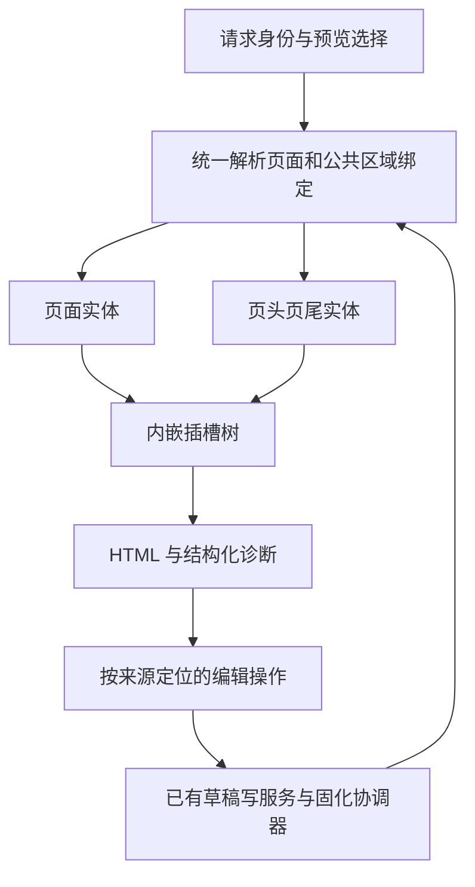

# 部件生命周期、统一渲染绑定与失效配置清理

## 用户目标

解释主题 3 商品编辑页反复出现失效部件的原因；备份后清理确认退役的旧数据，观察真实页面结果；覆盖页头页尾和部件内嵌插槽。有效部件和商家配置必须保留。用户已于 2026-09-23 确认实施；进度与实际验收见同名 session 文档。

## 调查结论与证据边界

这是旧数据与算法缺陷共同造成的问题，不能靠重置整个主题解决。

| 问题 | 已观察证据 | 影响 |
|---|---|---|
| 退役部件残留 | Weline_Theme、Weline_Blog 的 footer-help-center-link 定义缺失；实际页面各出现一条 missing_definition 提示 | 两条真实无效引用 |
| 失效检测误报 | 我的账户、FAQ 链接正常显示；recoverUnavailableWidgetsFromHtml 用最多 4000 字符的跨标签正则寻找后面的失效提示 | 把相邻正常部件列入失效清理清单 |
| 注册账本只增改 | WidgetRegistryRecordService::sync 遍历本次扫描项进行同步，没有完整扫描后的缺席项退役处理；两条旧默认注入记录仍 active | 旧 active 计划仍可被重固化消费，存在重新注入来源 |
| 根容器与嵌套槽重选版本 | ThemeLayoutEntityChrome 尊重 preview_entity/current；SlotRendererService::loadSharedChromeSlotWidgetsFromEntity 总先 getPublished，再 getCurrent | 编辑草稿时嵌套槽可读旧发布版本 |
| 作用域与绑定错配 | 内嵌读取 config sidecar 使用请求 scope，而非已选版本实际 scope；已有 LayoutIdentity 又优先于编辑器传入的上下文 | 继承版本或历史 scope 可与编辑器显示范围不一致 |
| 删除没有找准所有者 | 删除接口尝试页面工作区；UID 不存在也返回 true，因此后续 homepage 尝试被短路；实际节点也可能属于 ChromePayload | 成功提示不代表真正删除了渲染来源 |
| 父片段覆盖子槽 | 祖先父容器仍包含旧子内容；替换已选子槽后再写父槽会重新带回旧内容 | 需先合成所选父子投影，再插入页面 |
| 正式页的嵌套槽未合成 | r292 发布配置、结构及 renderBound 调用完整，但 solidifying 时父模板内嵌槽为空；取出父片段后没有填入同实体的扁平子槽 | 普通页仅剩两个购买兜底按钮，不能通过发布草稿解决 |
| 规格弹层绕过填槽 | PurchasePanelService 直接 fetch product-info，缺少普通页面的插槽处理；分销使用独立 Hook | 弹层须在当前商品及已发布布局上下文中走既有填槽流程 |

代码定位：

- `Service/SlotRendererService.php`：loadSharedChromeSlotWidgetsFromEntity、resolveStorageScopeForSharedChrome、currentLayoutIdentity、recoverUnavailableWidgetsFromHtml。
- `Service/LayoutEntity/ThemeLayoutEntityChrome.php`：renderCurrent。
- `Observer/LayoutSlotRenderer.php`：bootstrapEditorCanvasIdentity。
- `Controller/Backend/ThemeEditor.php`：postRemoveWidget、removeScopedLayoutNodeFromWorkspace。
- `../Widget/Service/WidgetRegistryRecordService.php`：sync。
- `Service/Scoped/FooterHelpCenterLinkScopedMigrator.php`：现有迁移只覆盖布局草稿，并仅按 code 匹配，不能作为跨模块/ChromePayload 的通用迁移。

请求内究竟哪一步把 scope 切到历史值，尚未完成运行时追踪；不能仅凭页面 data-editor-context 推断内部实际身份。源码已证实独立重选版本的分歧，数据库对照如下：

| scope | 当前/发布版本 | 两条退役 UID |
|---|---|---|
| default.__store__.__channel__ | 当前草稿 10 | 本轮已移除 aeab00ab00cd6a58cc8c4e5924f775cb、329b7311007284608c97643a92f35521 |
| default.__website__.default | 发布 9，channel 发布读取可继承此版本 | dc8de7a953d633f5a49a7ddb231e8728、329b7311007284608c97643a92f35521 |
| default.default.default | 当前且发布 8 | aeab00ab00cd6a58cc8c4e5924f775cb、329b7311007284608c97643a92f35521，与页面两条 UID 一致 |

后续对照确认 store current11 也含这两个 UID，因此不能仅凭 UID 断言来自 global8。无 editor_context 参数的编辑 URL 会跳过入口身份安装，而页面中展示的 typed context 是后置生成，需统一入口与编辑操作所用身份。

## 方案选择

1. **全量清空主题重新初始化**：可能暂时减少残留，但会损失有效配置，也掩盖版本错读和误报；不采用。
2. **继续按部件名补丁、模板兜底及逐页删除**：改动小，但不同模块同 code 容易误迁移；内嵌槽和其他主题仍会复发；不作为终态。
3. **复用现有绑定，统一身份、生命周期及写入归属（推荐）**：逐步收敛现有分支，无需另建布局存储或替换全部主题系统。

## 推荐架构

### 1. 一次解析版本，整棵部件树共享

请求入口通过已有 LayoutIdentity、PreviewContextService、ThemeVersionPreviewResolver 与 EntityRenderBinding 解析页面和公共页头页尾的来源。绑定至少可定位 theme、资源类型、实际 owner scope、版本/草稿修订、结构与配置摘要。请求 scope 与继承得到的 owner scope 分开表达。

根 chrome、嵌套插槽、配置 sidecar、资源依赖、失效诊断均消费同一已解析绑定。优先扩展现有 DTO/RequestContext 键，不另建一套平行上下文。嵌套槽不再自行 getPublished/getCurrent，也不能用历史硬编码 scope 掩盖上下文缺失。

编辑器无明确版本时采用已解析的当前草稿；指定历史预览版本时整棵树保持该版本；店面采用发布绑定。继承由统一解析器处理一次，所有后续文件读取采用实际 owner scope。

### 2. 注册定义具有明确生命周期

部件定义身份采用现有 area + module + type + code，实例采用 node_uid，不能只按 code 认定相同部件。

完整、成功的定义扫描同步当前项，并将扫描覆盖范围内已消失的旧定义置为非活跃，停止生成默认注入计划。局部扫描、模块读取失败和自定义/AI 部件不能被当作全量缺席。退役复用现有 is_active 与审计信息；扫描代次元数据只服务对账，不成为新的布局来源。

默认注入账本是当前定义的投影；布局草稿和发布版本是用户配置。定义退役使旧引用变为可诊断对象，不自动删除商家实例。重命名/替代须提供完整源身份与目标身份的显式迁移，覆盖 layout 与 chrome，并保留配置和 UID 对应关系。不能把 Blog 的帮助中心仅因名称相似迁成 Theme 的 FAQ。

### 3. 诊断与渲染同步产生

渲染器在判定某实例失败时直接记录 UID、完整定义身份、slot、owner binding、原因及消息；提示和清理列表使用该记录。缓存的 HTML 与诊断需要绑定同一版本摘要。

兼容旧 HTML 时，仅从明确标记 unavailable 的本实例 wrapper 恢复，严格限定所属边界并保留真实原因。移除跨任意相邻 HTML 的正则推断。父容器、前一个正常兄弟节点和正常嵌套节点不能因为内部/后方出现 tip 被判失效。

区别定义缺失、模板缺失、渲染错误、目标槽缺失、业务条件隐藏及派生产物过期。业务条件隐藏不是退役配置，不能进入“删除失效部件”列表。

### 4. 删除操作回到节点真正所属的草稿

清理请求携带诊断的节点和 owner 信息，服务端重新核对。layout 节点走现有 ThemeScopedLayoutWriteService；chrome 节点走 ThemeScopeVersionService 与 BakeCoordinator。继承项必须明确是在当前作用域覆盖移除还是编辑祖先，不偷偷修改祖先已发布版本。

已发布版本通过现有复制/修订流程形成可编辑草稿，历史版本保留。使用现有修订并发约束，不另造审批流程。查不到 UID 只表示该所有者下不存在，不能让试探页面工作区的空结果提前变成全局成功。接口区分实际移除、同一草稿已移除、无法定位来源，并据此刷新编辑器。

如果现有草稿模型不能表达对继承实例的移除，实施阶段需复用并验证版本级卸载决策或完整复制后的草稿载荷；不能通过修改发布记录或请求时静默写库替代。

### 5. 内嵌插槽与固化使用同一依赖树

沿用 ThemeLayoutSlotTreeBuilder 和现有默认注入契约，构建容器→插槽→子实例关系；任意层内嵌都按相同规则处理。静态与动态 w:slot 属性最终都必须生成可执行的渲染结果，不能把编译期 PHP 源码当成运行时 HTML。

固化只消费明确版本节点、活跃默认计划及已有版本级卸载决定；编辑器打开/刷新不得静默写回默认部件。店面 required 保证遵循既有 REQ-THEME-0036：声明槽存在、定义活跃且无有效卸载决定时，默认实例必须固化。业务能力条件影响部件内容显示，不得成为漏固化实例的理由；明确退役或不活跃定义才退出默认计划。加购、快捷支付、帮付、分享、分销都通过同一机制，不在商品模板硬塞多套兜底按钮。

结构、配置、资源与诊断投影由现有 materializer/binding publisher 生成，再切换绑定；缓存键包含绑定摘要及已有展示维度。定义变更只重建受影响资源，不在每次店面请求扫描注册表，也不靠清空所有缓存保证正确。

## 分阶段落地与验收

| 顺序 | 改造范围 | 必须观察的结果 |
|---|---|---|
| 1 | 统一根与嵌套版本绑定；修复误报恢复；按 owner 删除 | 草稿删除后刷新不再出现，账户和 FAQ 不被误报，发布版本保持原样 |
| 2 | 注册账本完整扫描对账；显式退役/迁移 | 已退役定义不再进入默认计划，重固化不复活，两模块同 code 不互相替换 |
| 3 | 收敛嵌套依赖和绑定缓存 | 商品普通页、编辑页、快捷购买弹层在同样能力条件下部件一致；重启、重固化后仍一致 |

实施前只补最小复现：有效兄弟+失效兄弟、同 code 不同 module、current10/published9 不同节点、继承 scope 配置读取、从商品页删除 chrome 节点，以及动态属性的二层内嵌槽。实施后在用户 URL 真实操作，不能只凭单测宣布完成。

实际验收还须确认：帮付/分享/快捷购买的注册与能力条件；可售商品应显示的购买入口；普通页页头页尾；弹层嵌套入口。此页脚清理结果不能代替此前购买部件问题的验收。

## 本轮已执行的数据清理与结果

- 备份：`var/backups/theme-footer-retired-20260923/cleanup-before-080633.json`，包含完整版本 10 原数据及两条注册记录，已验证可读，权限 0600。
- 停用注册记录 108、110，仅匹配 frontend/footer、两个明确模块及 footer-help-center-link；保留记录作为审计和恢复依据。
- 从当前 channel 草稿版本 10 移除两条确认退役的引用，通过既有 bakeChromeFromNodes 重建绑定。读回验证两条均不存在、默认注入计划也不再返回它们。
- 未重置主题，未删除我的账户或 FAQ，未修改已发布版本 8/9。
- 真实页面在清理和第一次 Worker 重载后仍显示原两条 UID 及四条警告，因此清理尚未达到页面消失的验收结果。这一现象与不同渲染分支的版本选择分歧吻合；请求内具体身份切换位置仍待验证。
- 后续调用现有 scoped 缓存清理接口返回无失败，但浏览器复查出现超时，检查发现 Worker 已退出。标准 reload 提示没有 Worker；start 曾提示主实例已运行，实际浏览器仍 ERR_CONNECTION_TIMED_OUT；标准 restart 被运行生命周期事务拒绝。锁记录出现 certificate_retirement_replay，未绕过锁、杀主进程或手改运行状态。最终实时验收受此运行环境阻塞，不能宣告页面已修复。

恢复应按备份恢复这两条注册记录和版本 10 的原载荷，再通过现有固化服务重建；不能回滚其他会话的代码或覆盖其他版本。恢复前需确认版本 10 未被后续编辑，避免覆盖新修改。

## 实施验收补记（2026-09-23）

上述第一轮清理未消失的状态已被本轮修复取代：原编辑 URL 在新代码进程中连续两次刷新，失效 tip 数量为 0，警告不存在，账户与 FAQ 保留。普通商品 URL 及真实“选择规格并加购”弹层中，加购、结账、分享、快捷购买、代付及 PayPal 均出现。最终 67 tests / 345 assertions 通过；未发布草稿或改写历史发布配置。

已落地的是现有绑定选择、父子槽合成、编辑范围一致性、诊断边界、Chrome 草稿删除及完整扫描退役。一般化重命名迁移接口、恢复 UI 和未扫描的停用模块自动退役未作为本次实现新增功能；不得将设计描述理解为这些能力已交付。详细运行证据和独立 WLS 环境问题见同名 session 文档。
