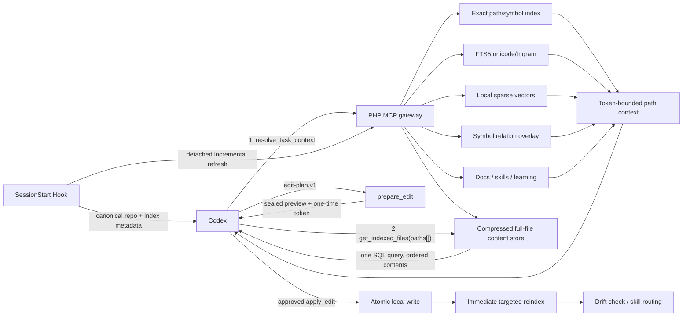

# Project Intelligence MCP

## 目标

Project Intelligence MCP 把代码库扫描、符号解析、知识检索、文档定位和机械编辑移到本地 PHP 进程中。Codex 负责理解意图、判断方案和生成小型结构化变更；MCP 负责把意图解析为精确位置、执行文件事务、验证结果并更新索引。

这能减少两类重复 Token：

- 不再把大批候选文件发送给模型，由 `resolve_task_context` 在本地排序并只返回命中片段。
- 不再让模型输出完整文件或重复机械替换，由 `edit-plan.v1` 表达“修改哪个符号/章节以及替换内容”。

它不会绕过 Codex，也不能从 MCP 侧技术性禁止 Codex 自带的 Shell/Search 工具。Server instructions 和工具返回建立的是强路由契约：索引新鲜时无需递归扫描；索引过期或缺失时必须先刷新或明确报告回退。

## 架构



每个项目拥有独立数据库：

```text
~/.learning-mcp/
├── learning.db
├── indexes/{project-hash}/project.sqlite
└── edit-journal/{project-hash}/{edit-id}/
```

`learning.db` 保存会话证据和经验；`project.sqlite` 保存可重建的代码/知识索引。两者分开，避免大型索引 WAL、清理和重建影响学习证据。

## 索引生命周期

首次索引仍然必须读取代码库。区别在于扫描只由本地 MCP 完成一次，后续 AI 请求查询持久数据库：

1. Codex 个人插件自动启动 MCP 与 `SessionStart` Hook。Hook 根据 `cwd` 找到 canonical Git root，立即返回索引 DB/revision/freshness/counts 和路由契约，不返回代码正文。
2. Hook stdout 完成且关闭 Learning/Project SQLite 句柄后，fork 一次 `index_project incremental`。对 revision 0 的项目它等价于首建；对已有项目只解析变化文件。
3. 使用 `git ls-files -co --exclude-standard -z` 获取受 Git 管理或未忽略的文件清单，不做请求期目录递归。
4. 应用扩展名、大小、测试、第三方、生成目录、密钥和二进制排除规则。
5. 用 size/mtime/content hash 判断变化，只解析新增或变化文件。
6. PHP/PHTML 使用 `token_get_all` 提取 namespace、class/interface/trait/enum、method/function，以及 extends/implements/use/new/static/method/static/function-call 等保守词法关系。
7. Markdown 按 Heading 切分；普通文本按有界行块切分。
8. 同一事务更新文件、gzip 压缩的完整文本、Chunk、FTS、稀疏向量、符号、关系、技能和知识状态。每个 Chunk 默认只保留权重最高的 24 个稀疏词项；空间成本较高的 trigram 只覆盖 doc/rule/skill。
9. MCP 自己应用代码后立刻对变化路径执行定点重索引；Codex `PostToolUse` 为外部修改安排后台增量刷新，下一次索引读取仍保留 freshness 检查作为兜底。

默认不索引 `.git`、`.gitnexus`、`.codex/code-intelligence`、`vendor`、`node_modules`、`generated`、`var`、静态产物、`view/tpl`、minified/source map、密钥文件和测试目录。测试只有在用户明确要求测试任务并调整配置后才进入索引。

## 混合检索

单一向量检索不适合类名、路径和精确符号。候选排序按以下信号组合：

1. 完全相同的 path、FQCN、`Class::method`、模块名和 Skill ID。
2. FTS5 BM25；trigram 为中文子串、专有名词和无空格文本补召回。
3. 依赖无关的 Feature Hash 稀疏向量点积。它是本地词项向量，不是神经 Embedding。
4. extends/implements/import/new/static/method/static/function-call 等词法关系邻近度；动态方法调用以低置信度返回，不冒充类型解析结果。
5. 文件/模块/状态/新鲜度加权。
6. 只基于既存 `query_id + result_id` 的脱敏命中反馈；不保存原始 Prompt，也不把反馈变成政策。

返回值必须包含 `query_id`、`index_db`、`index_revision`、freshness、repository/absolute path、内容 Hash 和行号。`resolve_task_context` 只保留按 code/doc/rule/skill/config 分组的有界结果及 `result_count`，不会再复制一份平铺结果。

推荐调用协议是“路径决策一次 + 内容读取一次”：AI 先根据 `resolve_task_context` 的候选一次性决定所有必读路径，再用一个 `get_indexed_files(paths[])` 调用读取最多 50 个文件。该工具在同一快照中执行一条 join 查询，按输入顺序返回内容，并显式报告 `database_round_trips=1`、`filesystem_scanned=false` 和 `filesystem_content_read=false`；不应退化为逐文件工具调用。

## 当前仓库性能基线

2026-07-14 在 `/Users/weline/Project/Official/框架` 的一次完整构建记录如下：

| 指标 | 实测 |
|---|---:|
| Git 可见文件 | 11,378 |
| 进入索引文件 | 8,833 |
| Chunk / Symbol / Relation | 78,834 / 37,808 / 274,811 |
| 完整构建 | 约 93.8 秒 |
| 捕获时 SQLite 文件 | 862,277,632 bytes，约 822 MiB |
| 无变化增量检查 | 内部 486ms，CLI 墙钟约 0.72 秒 |
| 同进程热 `resolve_task_context` | 约 714ms |
| 既有索引完整内容补齐 | 剩余 6,266 个文件约 7.44 秒 |
| 7 文件批量读取 | 单条 SQLite 查询，99,128 字符，全部未截断 |

这些数字只用于回归和容量规划，不是 SLA。首个冷查询需要打开大型 SQLite 索引并预热页缓存，实测明显慢于同一 STDIO MCP 进程内的后续查询；因此生产接入应复用 MCP 进程，而不是为每个检索启动一次 CLI。

## MCP 工具

### 索引与上下文

- `project_index_status`
- `index_project`
- `resolve_task_context`
- `get_indexed_files`
- `search_project_knowledge`
- `get_indexed_document`
- `inspect_symbol`
- `resolve_skill`
- `get_skill`
- `record_index_feedback`

### 本地编辑事务

- `prepare_edit`
- `apply_edit`
- `get_edit_status`
- `validate_change`
- `rollback_edit`

### 文档和技能

- `check_document_drift`
- `sync_module_knowledge`

原有会话学习、证据、审核和健康工具继续保留。

## Edit Plan

模型只提交 Draft；本地路径、Hash、Git HEAD、符号范围和最终内容由 MCP 解析并封存：

```json
{
  "schema_version": "edit-plan.v1",
  "intent": "更新配置读取并同步文档",
  "index_revision": 42,
  "operations": [
    {
      "op_id": "op-1",
      "kind": "replace_symbol",
      "symbol": "Weline\\Example\\Config::get",
      "expected_digest": "sha256:...",
      "replacement": "public function get(string $key): mixed\n{\n    ...\n}"
    }
  ],
  "validation_profile": "weline_safe"
}
```

v1 只允许：

- `replace_text`：旧文本必须在目标文件中唯一命中。
- `replace_range`：行范围必须与 expected digest 一致。
- `replace_symbol`、`insert_before_symbol`、`insert_after_symbol`：由索引符号 UID/范围和 body hash 定位。
- `replace_document_section`：由 Markdown heading 和 section hash 定位。
- `create_file`：父目录和扩展名必须在允许范围内，目标不能已存在。

`prepare_edit` 不写仓库。它返回预览、read-set、plan digest 和短时一次性 `edit_token`。`apply_edit` 只接收 Token/Digest，不再接收 Replacement，因此调用方不能在审批后偷偷替换内容。

应用阶段获取项目锁，复核 Project/HEAD/Index revision/read-set hash，把 preimage 写入 `0700/0600` journal，再在同目录写临时文件并 rename。任一文件失败则逆序恢复。Rollback 只有在当前文件仍等于 postimage hash 时才能执行，避免覆盖用户在应用后的新修改。

验证器只有固定 Profile：PHP lint、JSON parse、Git diff check 及其安全组合；不会接收任意 Shell 命令。

## 模块文档与技能

权威事实仍在源代码和模块 `doc/`：

```text
app/code/{Vendor}/{Module}/doc/
├── README.md
├── AI-INDEX.md
└── ai/
    ├── INDEX.json
    └── skills/{slug}/
        ├── SKILL.md
        └── .skill-meta.json
```

`doc/ai/INDEX.json` 和 `doc/ai/skills` 是可重建派生缓存。自动生成器遵守以下边界：

- 只覆盖带 `<!-- weline:mcp-skill:auto-generated -->` Marker 的文件。
- 手写 Skill 冲突时停止并返回 conflict。
- Locator Skill 只陈述确定性的模块路径、来源 Hash 和检索流程，可直接验证；模型生成的技术内容先进入 draft。
- 源文档或关联代码 Fingerprint 变化后，Skill 立即变为 stale，不再作为行动指导。
- 模块 Skill 不复制到全局 `AGENTS.md` 或 `dev/ai/skills`，也不会自动变成 Codex 启动期 `$SkillName`。`resolve_skill/get_skill` 直接返回其精确路径和正文。
- 显式 `sync_module_knowledge mode=apply confirm=true` 成功后封存当前 digest 为 `fresh` baseline；生成内容完全相同时返回 `already_current=true`，不会用索引修订号制造自触发改写。

漂移检测使用确定性关系：公开 API/Attribute、`#[Col]`/`#[Index]`、配置键、Route/Controller、Event/Hook、CLI signature/help 和模块结构。向量只负责找候选文档，不能单独宣布文档过期。

## 调用 Codex 更新文档

标准 MCP 不能回调“当前 Codex 会话”。启用 `knowledge.codex.enabled` 后，MCP 可启动独立 `codex exec` Planner：

- `--ephemeral`
- `--sandbox read-only`
- `approval_policy=never`
- 严格 `doc-sync.v1` Output Schema
- 只从 stdin 接收 MCP 从持久索引取出的精确文档章节、有界代码片段、位置、Hash 和确定性事实，不获得仓库读取权限
- `WELINE_MCP_CODEX_DEPTH=1` 防递归

Planner 只能返回结构化文档操作，不能写工作区。结果仍需经过 `prepare_edit → apply_edit`。该能力默认关闭，避免隐式模型费用和未经同意的数据外发。

## 与 Cursor 类架构的对应关系

| Cursor 类能力 | 本实现 |
|---|---|
| Repository indexing | Git 清单 + Hash 增量 Project SQLite |
| Semantic code search | Exact/FTS/trigram/sparse-vector Hybrid |
| Symbol/reference context | PHP token symbol/relation overlay |
| Context packing | `resolve_task_context` Token Budget |
| Batch context materialization | `get_indexed_files(paths[])` single-query content read |
| Fast local apply | Sealed structured edit + atomic PHP applier |
| Docs awareness | Module doc heading index + drift state |
| Rule/skill routing | Exact indexed module Skill path/content |
| Edit-triggered refresh | Synchronous targeted reindex + PostToolUse background refresh |
| Project-aware startup | Personal plugin + SessionStart canonical-root routing + detached incremental refresh |

这不是对 Cursor 私有实现的复制，也不声称本地稀疏向量等于神经 Embedding。速度收益主要来自持久预索引、不重复扫描、精确候选过滤和本地机械编辑。
