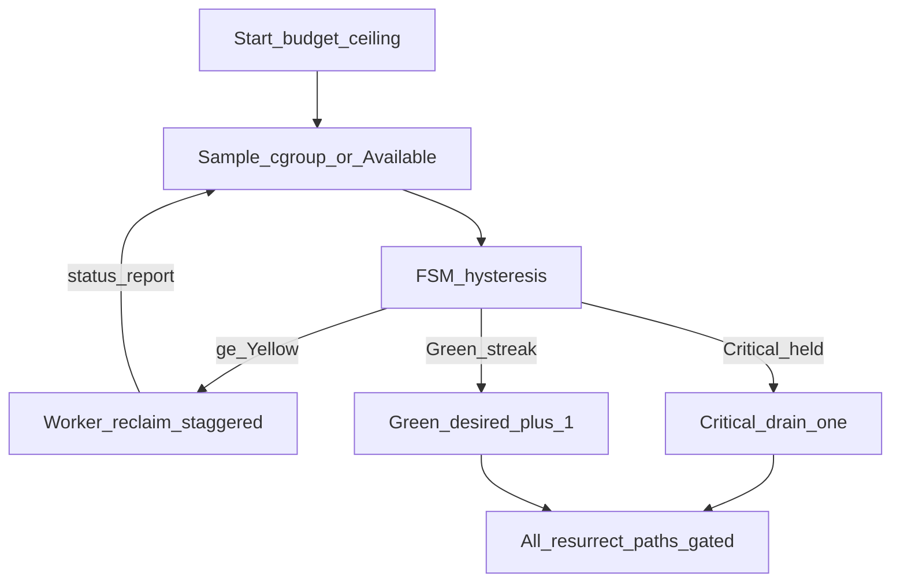

# WLS 整机内存压力控制器（定稿）

## 1. 元数据


| 项    | 值                                                           |
| ---- | ----------------------------------------------------------- |
| 状态   | **READY**（完整代码审查补丁已合入；见 §2.1）                               |
| 版本   | **定稿+审查补丁**（防 OOM + 长久稳定 + 对照 Start/Orchestrator/Worker 真码） |
| 仓库   | `/Users/weline/Project/Official/框架`                         |
| 模块   | `Weline_Server`（主）、`Weline_Framework`（Reclaimable 门面）       |
| 同步   | 实施后 §15 与 QiPai 差异合并对应 `Weline/**`                          |
| 成功定义 | 低配（含 2G）长久跑：不因整机内存把 Master 打崩；高压可降耗；低压回到启动预算；不抖；长连接不能无限挡回收  |


**稳定等式**：

```text
长久稳定 = 启动不超配
         + 可重建内存可淘汰
         + 高压单槽优雅减池（有门闩）
         + 低压慢恢复到 budget_ceiling
         + 进程有界换血（max_requests / 泄漏）
         + 全程可观测
```

**本轮不做**：按 CPU/队列自动扩容主循环、systemd、改 nginx 默认大缓存、Master 自回收、启动期 P90、「永不停机」承诺。

**禁止**：`used>70%` 杀整组、SIGKILL、MemAvailable 定启动数、缩容拉替代、`stopInstance` 多砍冒充缩容、超 desired 复活、只缩不恢复、无限等长连接、把运行时 desired 写回实例 `worker_count`。

## 2. 闭合决策（执行不得回退）


| ID  | 口径                                                                                                                            |
| --- | ----------------------------------------------------------------------------------------------------------------------------- |
| D01 | 启动容量 = `cgroup max ?? MemTotal`；Available 只用于运行时                                                                              |
| D02 | 启动 rss = `max(192, worker_memory_limit_mb)`；禁 `min(limit,256)`；含 panel 粘盘后的实际 limit（D19）                                      |
| D03 | `limitMb≤2300` → auto hardCap=2                                                                                               |
| D04 | 压力同源：cgroup `current/max`；`max` 字面量/无效 → `1-Available/MemTotal`                                                               |
| D05 | 升档连续 3 次；Green 恢复线 0.65                                                                                                       |
| D06 | Critical：desired-1 + 单槽 `sendDrainToInstance`；禁 scale/`WorkerScaler`/reconcile 一次清全部超额槽                                       |
| D07 | 复活门闩覆盖：trySchedule、scheduleResurrection、processResurrectQueue、reconcileDesiredState、reconcileWorkerSlotsWithoutHa             |
| D08 | Green×`recover_samples`(10)+冷却 → desired+1，上限 `budget_ceiling`                                                                |
| D09 | 有界 drain：45s / 120s；勿复用 reload drain 旋钮                                                                                       |
| D10 | 与 max_requests 共生；退出错峰 20s；**SSL 补齐** `memory_pressure_drain` reason + max_requests                                           |
| D11 | 泄漏口径 = PHP `memory_get_usage`（与 status_report 一致，非 RSS）                                                                       |
| D12 | 意图模型：auto 不落盘解析值；历史整数无 requested 且超 hardCap→钳制；CLI `-c` 不静默改；持久化 `worker_count_requested`；预算挂在 **requested=auto 的首次 resolve** |
| D13 | Critical 可下调显式 count（WARN）；不写回实例文件                                                                                            |
| D14 | Reclaimable 门面；**FPC 须新接末位**；验收绑请求结束后空闲（`canCompactProcessCaches`）                                                            |
| D15 | 不以 Available 回升为唯一验收                                                                                                          |
| D16 | 双开关默认 true                                                                                                                    |
| D17 | Critical 经 Orchestrator→Worker IPC 跳过 keep-warm（现状仅本地 70%）                                                                    |
| D18 | nginx 大缓存仅文档 WARN                                                                                                             |
| D19 | Panel 可把 limit 粘盘 512M → rss 用实际值并写入 reason                                                                                   |
| D20 | 压力广播走 Orchestrator IPC；禁 `BroadcastControlDispatchService`                                                                    |
| D21 | sidecar Critical 加深淘汰本轮不做；禁 Guard 清 Session                                                                                   |
| D22 | HTTP/SSL 统一读 `memory_guard.worker_memory_*`，默认 0.80 / 0.92                                                                    |


### 2.1 完整代码审查：必须处理


| 优先级 | 问题                                        | 处置                   |
| --- | ----------------------------------------- | -------------------- |
| P0  | 只改一处复活入口不够；reconcile 会补满或一次砍光             | D07 + Critical fence |
| P0  | SSL 缺 planned drain reason / max_requests | D10 / TASK-05        |
| P0  | 误用 scale 或只降 desired                      | D06                  |
| P1  | 预算挂错二次 resolve                            | D12 / TASK-01        |
| P1  | FPC 未在压力路径；忙时 compact=0                   | D14                  |
| P1  | HTTP 0.88 vs SSL 0.94                     | D22                  |
| P1  | keep-warm 无 Host 开关                       | D17                  |
| P2  | 旧公式精确式、非 RSS、panel 512、广播接错层              | 锚点/D11/D19/D20       |


**审查结论**：方向正确、不必推翻；TASK-01/04/05 必须按上表加严。

## 3. 需求


| ID     | 规则                             | 成功条件                       |
| ------ | ------------------------------ | -------------------------- |
| REQ-01 | 启动预算 + 意图模型 + `budget_ceiling` | 2G desired∈{1,2}；reason 完整 |
| REQ-02 | 同源 FSM + 滞回                    | `pressure_source` 可观测；不抖档  |
| REQ-03 | 分级回收 + 回执 + 5min 快照            | reclaim_bytes；稳态快照         |
| REQ-04 | Critical 减池 + 门闩 + 有界 drain    | live 能降；drain 有截止；SSL 同契约  |
| REQ-05 | Green 慢恢复到 ceiling             | 曾减池后能阶梯回升且不超 ceiling       |
| REQ-06 | max_requests/泄漏换血共生            | 无同窗双槽齐退；SSL 亦生效            |
| REQ-07 | 文档与残余风险明示                      | 运维知边界                      |


## 4. 现状锚点

- 旧公式：`min(cpuBased, max(2, floor(MemTotalMb/512)))` → 2G 常见 3（非加法）
- auto 不落盘；`getServerConfig` 先 resolve 再可能二次 resolve（int 短路）
- 复活无视 desired：`tryScheduleAutonomousWorkerResurrection`；另有 reconcile 补齐/超额回收
- scale 缩容：`stopInstance` 多砍
- Guard soft/hard 0.70/0.85；**FPC 不在压力路径**
- HTTP drain 硬编码 0.88；SSL 可配默认 0.94；SSL **无** `memory_pressure_drain` 字符串
- status_report.`memory` = `memory_get_usage(true)`，非 RSS
- keep-warm：本地 used≥70% 可跳过；无 Host Critical IPC
- 主循环已有 `periodic:*` / `scheduleMainLoopTask` 可挂 pressure tick
- 广播近邻：`sendToRole` / routing_policy；非 BroadcastControlDispatchService




## 5. 方案

### 5.1 启动

```text
limitMb = usableCgroupMax ?? MemTotal
rssMb   = max(192, worker_memory_limit_mb)
budget  = limitMb - system(550) - wlsBase(300) - emergency(200)
hardCap = limitMb<=2300 ? 2 : cpuCap
desired = max(1, min(cpuBased, floor(max(0,budget)/rssMb), hardCap))
budget_ceiling = desired   # 显式 -c 则 ceiling=该值（过大 WARN）
```

意图：见 D12。`worker_budget.enabled=false` 回退旧公式。

### 5.2 运行时压力


| 状态       | 主指标                  | 动作                   |
| -------- | -------------------- | -------------------- |
| Green    | <0.70（回落 <0.65）      | 累计 green_streak；可慢恢复 |
| Yellow   | 0.70–0.80            | 广播；低优先回收（错峰）         |
| Red      | 0.80–0.90            | 加重回收；复活门闩            |
| Critical | >0.90 或 Swap/PSI 辅指标 | 观察后减池；停 keep-warm    |


辅指标：Swap 增速 >8MB/采样×3；PSI `some avg10>0.20`×3（无则忽略）。

### 5.3 回收

- `MemoryReclaimableInterface` + Registry（门面）
- Host∪local：75/Yellow compact → 85/Red evict → 92 drain（受门闩）
- FPC **新接**为末位回收项（现状不在压力路径，见 D14）；禁清 Session/busy 连接
- 忙 Fiber（`canCompactProcessCaches()==false`）时允许 no-op 并计 skip，回收改在请求结束后触发
- 回执：`reclaim_bytes`、`host_level_applied`；泄漏信号见 D11

### 5.4 减池 / 恢复 / 门闩

```text
shrink: Critical held + cooldown30s → desired=max(floor, desired-1)
        sendDrainToInstance(highest instanceId > desired)（优雅、45/120 有界）
        若低于启动显式 count → WARN override
recover: green_streak>=10 + cooldown60s → desired=min(ceiling, desired+1)
         仅 Green；每次 +1；恢复不被门闩挡（+1 后 live<desired，reconcile 补 1 个空洞）
resurrect gate: skip if instanceId>desired OR live>=desired（覆盖 D07 全部入口）
reconcile fence: shrink 事务进行中，抑制 reconcileDesiredState/无 HA 补齐一次砍光超额槽
exit stagger: 任意计划退出后 20s 内不安排另一压力退出
```

Master 重启：按意图模型重算 ceiling，**从 ceiling 起**（不持久化缩容后的 desired）。

### 5.5 配置

```php
'wls' => [
  'worker_budget' => [
    'enabled' => true,
    'system_reserve_mb' => 550,
    'wls_base_reserve_mb' => 300,
    'emergency_reserve_mb' => 200,
    'low_mem_limit_mb' => 2300,
    'low_mem_hard_cap' => 2,
  ],
  'memory_pressure' => [
    'enabled' => true,
    'sample_interval_sec' => 3,
    'upgrade_samples' => 3,
    'green_recover_ratio' => 0.65,
    'scale_down_cooldown_sec' => 30,
    'recover_samples' => 10,
    'recover_cooldown_sec' => 60,
    'drain_deadline_sec' => 45,
    'hard_drain_sec' => 120,
    'exit_stagger_sec' => 20,
    'leak_signal_periods' => 3,
    'snapshot_interval_sec' => 300,
    'swap_growth_mb_per_sample' => 8,
    'psi_some_avg10_threshold' => 0.20,
    'reclaim_stagger_ms_per_worker' => 50,
  ],
  'memory_guard' => [
    'runtime_cache_pressure_threshold' => 0.70,
    'runtime_cache_hard_pressure_threshold' => 0.85,
    'worker_memory_warning_threshold' => 0.80,
    'worker_memory_drain_threshold' => 0.92,
  ],
  'scaling' => ['min_workers' => 1],
]
```

## 6. 修改矩阵


| 路径                                                           | 变更                                  |
| ------------------------------------------------------------ | ----------------------------------- |
| 新建 `Service/Memory/WorkerMemoryBudgetCalculator.php`         | 容量公式                                |
| 新建 `Service/Memory/HostMemorySampler.php`                    | cgroup/meminfo/PSI/Swap             |
| 新建 `Service/Memory/MemoryPressureStateMachine.php`           | 滞回 + green_streak                   |
| `RuntimeStrategyResolver` / `RuntimeCapabilityDetector`      | 接入预算与 cgroup                        |
| `Console/Server/Start.php`                                   | 意图模型、requested 持久化、ceiling 下发       |
| `ServiceOrchestrator.php`                                    | tick、广播、减池 drain、恢复、门闩、错峰、快照        |
| `ControlMessage` + `worker.php` / `worker_ssl.php`           | pressure、回执、有界 drain、阈值对齐           |
| Framework `MemoryReclaimable*` + `WorkerResponseMemoryGuard` | 门面与 host∪local                      |
| `env.sample.php` + `doc/WLS模式部署指南.md`                        | 配置与长久运行专节                           |
| 单测                                                           | 2G、钳制、FSM、门闩、恢复≤ceiling、drain 截止、错峰 |


## 7. 任务卡

### 执行批次与依赖

- **批次 1（可独立/并行）**：TASK-01（启动预算）、TASK-02（Sampler+FSM）——纯新增类 + 单测，不改运行时主循环。
- **批次 2**：TASK-03（IPC 广播/回执）依赖 TASK-02；TASK-04（Reclaimable 门面 + FPC）依赖 TASK-03（读 host level；无 level 时仅 local）。
- **批次 3**：TASK-05（减池/恢复/门闩/SSL 契约）依赖 TASK-03、TASK-04，是最高风险改动点，单独提交。
- **批次 4**：TASK-06（文档/配置）随代码收尾；TASK-07（≥1h soak）依赖 TASK-01～06 全绿。
- 每个 TASK 通过其专属验收后立即标 `completed`，再进下一批；禁止批量勾选。

### TASK-01 启动预算

- 允许：Calculator、Resolver、Detector、Start  
- 验收：2G≤2；历史整数无 requested→钳制；CLI `-c` 不静默改；ceiling 可读；**auto 走 getServerConfig 首次 resolve（非二次 int 短路）**；panel 512 时 reason 含实际 rss  
- 停止：静默改写当次 CLI count

### TASK-02 Sampler + FSM

- 验收：cgroup/`max` 字面量；N=3；滞回；green_streak

### TASK-03 IPC + 快照

- 验收：Orchestrator `sendToRole` 广播（非 BroadcastControlDispatchService）；含 stagger；reclaim 回执；300s 快照

### TASK-04 Reclaimable

- 验收：**新接 FPC 末位**；空闲/post-request 下 evict>0；忙 Fiber 时允许 skip 并计数；禁清 Session；泄漏字段用 PHP usage

### TASK-05 减池 + 恢复 + 门闩 + 有界 drain

- 禁止：scale/`WorkerScaler`/reconcile 多砍；恢复超 ceiling；无限等长连接  
- 必须：`sendDrainToInstance` 单槽；门闩覆盖全部复活/补齐入口；Critical 期间 fence reconcile 超额回收  
- 验收：3→2→1 且 #3 不复活（含模拟 reconcile）；Green 回升至 ceiling；45/120 drain 日志；**SSL 上报 `memory_pressure_drain` 且计 planned**；同窗无双槽齐退

### TASK-06 文档与配置

- 长久运行专节；§2.1 审查结论；残余风险；双 flag；min_workers=1；HTTP/SSL 阈值键

### TASK-07 ≥1h soak

- 前置：`server:start ai-test-{id} -p≥9502`；auto；低内存或 cgroup  
- 证据：启动≤2；压力→回收/减池；解除后回升 ceiling；1h Master 存活；无加减震荡；不要求 Available 秒回  
- 人工验收前保持实例并交接 stop 命令

## 8. 追踪


| REQ    | 任务      | 决定性证据                        |
| ------ | ------- | ---------------------------- |
| REQ-01 | T01,T07 | reason / ceiling / desired≤2 |
| REQ-02 | T02,T03 | pressure_source / 滞回         |
| REQ-03 | T03,T04 | reclaim_bytes / 快照           |
| REQ-04 | T05,T07 | drain / 门闩                   |
| REQ-05 | T05,T07 | 恢复至 ceiling                  |
| REQ-06 | T05,T06 | 错峰 / 共生说明                    |
| REQ-07 | T06     | 文档                           |


## 9. 风险与回滚


| 风险      | 缓解                                   |
| ------- | ------------------------------------ |
| 只缩不恢复   | D08 强制恢复                             |
| 恢复过快再打满 | 仅 Green；冷却；上限 ceiling                |
| 长连接拖死   | D09                                  |
| 多槽齐退    | D10                                  |
| 真泄漏     | D11；仍不够则重启（范围外）                      |
| 误钳制运维整数 | 仅无 requested 历史文件 + low-mem；CLI 当次不钳 |


回滚：关 `memory_pressure.enabled` 和/或 `worker_budget.enabled`。

## 10. 护栏与交付

- 冲突则阻断报告，不擅改架构  
- 完成一个验收一个 todo  
- 实施建任务目录；完工归档 `dev/ai/plans/`；QiPai 对齐  
- 交付：T01–T07 证据、双 flag、文档、Soak 完整 URL + 实例名 + 端口 + `server:stop`

**残余（文档必须写明）**：无 systemd 拉起、nginx 默认大缓存、Master 自泄漏、非负载扩容——内存控制器 ≠ 永不停机。