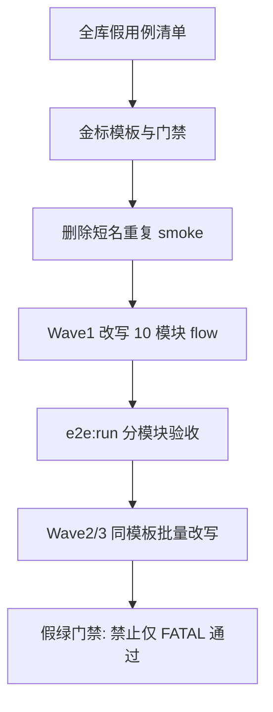

# 假 E2E 用例整治计划

## 需求基线

| ID | 触发/输入 | 规则 | 输出/成功条件 |
|----|-----------|------|----------------|
| REQ-1 | 扫描 `app/code/Weline/**/{Test,test}/e2e/**/*.spec.js` | 「假用例」= 仅 `loginAsAdmin` + `gotoBackend` + `body` 可见 / 无 Fatal / 标题正则 / URL 带 query，**无**业务点击、填表、OffCanvas、写操作或 Network 决定性断言 | 计划内完整清单（文件 + case id + 标题 + 分级） |
| REQ-2 | 标题声称搜索/筛选/CRUD/配置 | 断言必须覆盖真实 UI 操作与业务结果（表格变化、toast、OffCanvas、`Weline.Api`/bin-query 请求体或响应） | 改写后假绿不可再靠「能打开页」通过 |
| REQ-3 | 同模块存在 `Foo-smoke` 与 `Weline_Foo-smoke` | 保留 `Weline_*`，删除或停用短名重复件，避免双跑假绿 | `e2e:run` 同模块不再重复执行等价摆设 |
| REQ-4 | 路由可达性仍需要 | 真·路由冒烟降级为每模块 **至多 1 条**诚实 `type:smoke`（或 `http:request`），与 flow 用例分离 | 命名/注解不再假装业务流程 |
| REQ-5 | 用户明确要求改 E2E | 按 [`dev/ai/skills/E2E自动化工程师-端到端流程测试/SKILL.md`](dev/ai/skills/E2E自动化工程师-端到端流程测试/SKILL.md) 用 `php bin/w e2e:run` 跑通；专用 WLS `>=9502` | 目标模块 case 退出码 0，证据含交互步骤 |

**范围外**：前台 storefront E2E 大盘、单元测试补齐、生产部署、未授权新建无关模块功能。

**设计决策（已闭合）**：采用「分波推进」。本计划一次写清全库假用例清单与改造规范；**执行先 Wave1（10 模块）**，其余模块用同一模板按 Wave2/Wave3 继续，不在 Wave1 假装改完 75 个文件。

---

## 源码调查证据

| 证据 | 结论 | 关联 |
|------|------|------|
| `find … *smoke-backend.spec.js` → **75** 文件；`moduleCase`/`id` 约 **120+** | 假用例主战场是 smoke 批量生成件 | REQ-1 |
| `rg '\.(click\|fill\|…)' *smoke-backend*` → 几乎仅 [`Weline_Backend-smoke-backend.spec.js`](app/code/Weline/Backend/test/e2e/backend/Weline_Backend-smoke-backend.spec.js) 有交互 | 其余 smoke 无业务操作 | REQ-1/2 |
| [`Weline_Order-smoke-backend.spec.js`](app/code/Weline/Order/Test/e2e/backend/Weline_Order-smoke-backend.spec.js) `ORDER-SMOKE-005`：标题「关键词搜索」，实现仅为 `goto …?keyword=` + URL 断言 | 典型假业务 | REQ-2 |
| [`Weline_Seo-smoke-backend.spec.js`](app/code/Weline/Seo/Test/e2e/backend/Weline_Seo-smoke-backend.spec.js) 三页仅打开；同模块已有较强 [`sitemap-management.spec.js`](app/code/Weline/Seo/Test/e2e/backend/sitemap-management.spec.js) 但仍缺「管理 URL」等新能力 | smoke 摆设 + flow 需对齐现网 UI | REQ-2 |
| [`Acl-smoke-backend.spec.js`](app/code/Weline/Acl/Test/e2e/backend/Acl-smoke-backend.spec.js) 与 [`Weline_Acl-smoke-backend.spec.js`](app/code/Weline/Acl/Test/e2e/backend/Weline_Acl-smoke-backend.spec.js) 并存；短名版甚至「试多路由成功一条即 return」 | 重复 + 假绿 | REQ-3 |
| 金标对照：[`Framework-test-management.spec.js`](app/code/Weline/Framework/Test/E2E/backend/Framework-test-management.spec.js)、[`plan-p1c-sec07-config-center.spec.js`](app/code/Weline/SystemConfig/Test/e2e/backend/plan-p1c-sec07-config-center.spec.js)、[`theme-editor-workflows.spec.js`](app/code/Weline/Theme/test/e2e/backend/theme-editor-workflows.spec.js) | 有交互、拦截 API、决定性 expect | REQ-2/5 |
| 技能分层：路由冒烟 vs 流程 E2E | 允许薄 smoke，禁止用 flow 文案冒充 | REQ-4 |

### 假用例判定分级

- **P0**：登录后几乎无业务页断言，或试路由成功即过（短名 `*-smoke` 多属此类）
- **P1**：打开业务页 + 标题/无 Fatal；标题写「列表/配置」但无表格/表单交互
- **P2**：带 `?keyword=`/`?status=` 的 URL 伪筛选，或仅 `innerText` 匹配「上传|管理」字样

---

## 假用例清单（已确认）

### A. 短名重复件（优先删除/停用，8 个）

`Acl` / `Admin` / `Api` / `Backend` / `Framework` / `Frontend` / `ModuleManager` / `Server` 的 `*-smoke-backend.spec.js`（与对应 `Weline_*` 重复）。

### B. `Weline_*-smoke-backend.spec.js` 主体（约 67 文件，模式一致）

模块（路径均在 `app/code/Weline/<Module>/…/e2e/backend/`）：

Acl, Admin, Ai, AiKnowledge, Api, AppStore, Backend, BackendActivity, CacheManager, Captcha, Cdn, Checkout, Code, Component, Cron, Currency, Customer, CustomerService, DataTable, Database, DeveloperWorkspace, Eav, EditorManager, ElFinderFileManager, Event, Extends, FileManager, Framework, Frontend, Geo, Hook, I18n, Index, Indexer, Installer, Layout, Maintenance, Marketing, MediaManager, Meta, ModuleManager, ModuleRouter, Multipass, Order, Parts, Payment, Queue, Seo, Server, SessionManager, Shipping, Smtp, Sticker, Storage, SystemConfig, Taglib, Theme, ThemeFancy, TranslationService, TwoFactorAuth, UrlManager, Visitor, Vue, WarmCache, WebsiteMonitoring, Websites, Widget

每文件典型 case 形态：`loginAsAdmin` → `buildModuleBackendRoute` → `gotoBackend` → `expect(body).not.toContainText(FATAL)`；部分加 `h4` 标题或 URL query。

### C. 非 smoke 但仍偏弱（整改时对齐，不计入 75）

[`sitemap-management.spec.js`](app/code/Weline/Seo/Test/e2e/backend/sitemap-management.spec.js)：有按钮可见性，缺现网「管理 URL」OffCanvas / `listSitemapUrls` Network 证据。

---

## 唯一方案



**真用例最低标准（写入每条 flow case）**

1. `loginAsAdmin` 只作前置，不算业务步骤。
2. 至少 1 次业务交互：`click` / `fill` / OffCanvas / 开关 / 提交。
3. 至少 1 条决定性断言：业务 DOM 变化，或拦截到 `Weline.Api`/query 的 path+关键字段（如 `ui_enabled`、`listSitemapUrls`），禁止仅靠无 Fatal。
4. 注解：`@weline-e2e-spec { type: flow }`；薄可达性单独 `type: smoke` 且标题诚实写「路由可达」。
5. 禁止产品页 `alert/confirm`；业务请求走页面既有 bin-query，测试里用 Playwright `page.route`/`waitForResponse` 取证。

**金标模板伪代码**

```js
await loginAsAdmin(page);
await gotoBackend(page, buildModuleBackendRoute(MODULE, '<route>'));
await expect(page.locator('<业务根节点>')).toBeVisible();
// 交互
await page.locator('<按钮>').click();
await page.locator('<输入>').fill('...');
const resp = page.waitForResponse(r => r.url().includes('<api>') && r.ok());
await page.locator('<提交>').click();
await resp;
await expect(page.locator('<结果>')).toContainText(/.../);
```

---

## Wave1 模块 → 正确业务明细（执行时按此改写）

| 模块 | 现假点 | 应对齐的真实路径（源码锚点） | 改写后最小 flow |
|------|--------|------------------------------|-----------------|
| Seo | smoke 只打开 3 页 | [`Sitemap/index.phtml`](app/code/Weline/Seo/view/templates/Backend/Sitemap/index.phtml)「管理 URL」；[`seo-admin.js`](app/code/Weline/Seo/view/statics/js/seo-admin.js) `listSitemapUrls` | 打开 sitemap → 点管理 URL → OffCanvas 可见 → 拦截 `listSitemapUrls` |
| Acl | 打开/伪搜索 | 角色列表、IP 白名单、安全日志 Controller | 角色页填关键词点搜索或表格行操作；白名单页见表单控件 |
| Order | 伪 keyword/status | 订单列表/发票/货运/退款页 | 列表页操作筛选控件（非仅改 URL）；至少一页有表格或空状态文案断言 |
| SystemConfig | smoke 弱；已有 plan-p1c | [`plan-p1c-sec07`](app/code/Weline/SystemConfig/Test/e2e/backend/plan-p1c-sec07-config-center.spec.js) | smoke 收缩为 1 条可达；flow 复用/引用 plan-p1c，补 Framework「测试运行」开关若配置中心可见 |
| Customer | 列表伪搜索 | 客户列表 Controller/模板 | 搜索框 fill+提交，断言结果区或 query 请求 |
| Payment | 交易列表伪搜索 | 支付方式/交易页 | 切换方式列表或交易筛选交互 |
| Queue | 打开列表 | 队列列表/类型 | 刷新或筛选按钮 + 表格/空状态 |
| Cron | 打开列表 | 计划任务列表 | 表格可见或运行/启用控件可点（不强制真跑危险任务） |
| Websites | smoke 弱；已有 website-add | [`website-add.spec.js`](app/code/Weline/Websites/Test/e2e/backend/website-add.spec.js) | smoke 收缩；flow 对齐站点列表筛选/进入编辑 |
| Framework | smoke 弱；已有 test-management | [`Framework-test-management.spec.js`](app/code/Weline/Framework/Test/E2E/backend/Framework-test-management.spec.js) | smoke 收缩；确保 UI 开关 `setUiEnabled` + `runE2e` 携带 `ui_enabled` 的 case 保持为权威 flow |

Wave2/Wave3：剩余模块按「读 Backend 菜单入口 + 主列表/配置 phtml + QueryProvider」各抽出 **1～2 条**核心 flow，替换同文件内 P1/P2 case。

---

## 缺陷审查（§16.5，合入计划）

| 缺陷 | 严重度 | 处理 |
|------|--------|------|
| smoke 文案声称搜索/筛选但无 UI 操作 | 高 | 改写或降级标题为「路由可达」 |
| 短名与 Weline_ 双跑 | 中 | 删除短名 |
| 仅 FATAL 断言导致假绿 | 高 | flow 强制决定性证据 |
| 路由写死错误 path（如 Seo `seo/dashboard` vs 实路由） | 中 | 改写时对照 `buildModuleBackendRoute` + 实页 |
| 多实例争抢 Nginx 导致 e2e 环境 503 | 环境 | 验收卡写前置；未满足=环境阻断 |

---

## 工程任务卡

### TASK-1 清单固化与门禁文档
- **允许**：新增 [`dev/ai/tasks/2026-07-25-fake-e2e-inventory.md`](dev/ai/tasks/2026-07-25-fake-e2e-inventory.md)（完整文件/case 表）；可补 `tests/e2e` 或 Framework Test 文档一节「禁止假 smoke」
- **禁止**：本任务不改业务 PHP
- **验收**：清单覆盖 75 smoke + 8 短名重复；分级 P0/P1/P2 齐全

### TASK-2 删除短名重复 smoke
- **允许**：删除 A 节 8 个短名 spec（或改名为 `.bak` 并移出收集路径——默认直接删除）
- **验收**：`find` 不再出现这 8 个；对应 `Weline_*` 仍在

### TASK-3 金标模板落地
- **允许**：在 `tests/e2e/` 或 `Framework/Test/E2E/` 增加简短 `FLOW_SPEC_TEMPLATE.md`（或写入 inventory 文档），含最低标准与伪代码
- **验收**：Wave1 执行者无需重新设计结构

### TASK-4～13 Wave1 十模块改写（每模块一张卡）
- 每卡：**允许**改该模块 `Weline_*-smoke-backend.spec.js` 及必要时增强已有 flow spec；**禁止**改无关模块
- 步骤：对照上表业务锚点 → 改写/拆分 smoke vs flow → `php bin/w e2e:run --module=Weline_X`（或项目等价过滤）
- **验收**：该模块至少 1 条 flow 含 click/fill + 决定性断言；`e2e:run` 退出码 0；环境 503 记阻断不记功能失败

### TASK-14 Wave1 回归与假绿抽检
- 抽检改写后的 case：去掉业务 click 应失败；保留仅 FATAL 的旧写法不得再标 flow
- **验收**：抽检记录写入 task 文件

### TASK-15 Wave2/Wave3 批次（计划内预留）
- 按模板处理剩余模块；每批 8～10 个模块一张总卡 + 分模块验收行
- **验收**：假用例清单中 P1/P2 清零或降级为诚实 smoke（每模块 ≤1）

---

## 修改点矩阵（Wave1）

| 文件 | 当前 | 目标 | 任务 |
|------|------|------|------|
| 8×短名 `*-smoke-backend.spec.js` | 重复假绿 | 删除 | TASK-2 |
| `Weline_{Seo,Acl,Order,SystemConfig,Customer,Payment,Queue,Cron,Websites,Framework}-smoke-backend.spec.js` | P1/P2 | flow + 可选 1 条诚实 smoke | TASK-4～13 |
| Seo `sitemap-management.spec.js` | 弱交互 | 补管理 URL / API 证据 | TASK-4 |
| inventory/task 文档 | 无 | 清单+模板+证据 | TASK-1/3/14 |

---

## 风险与回滚

- **风险**：全量 e2e 变慢 → Wave 每模块只保留 1～3 条高价值 flow。
- **风险**：危险写操作（真发邮件/真支付）→ 只测 UI 至确认框前或 mock/拦截 API。
- **回滚**：git 还原对应 spec；短名删除可用 git 恢复。

---

## 验收总览

- 清单与分级完整（REQ-1）
- Wave1 十模块 flow 真实跑通（REQ-2/5）
- 短名重复消失（REQ-3）
- 薄 smoke 诚实且每模块 ≤1（REQ-4）
- 计划文件保留并归档至 `dev/ai/plans/`（§16.6）
