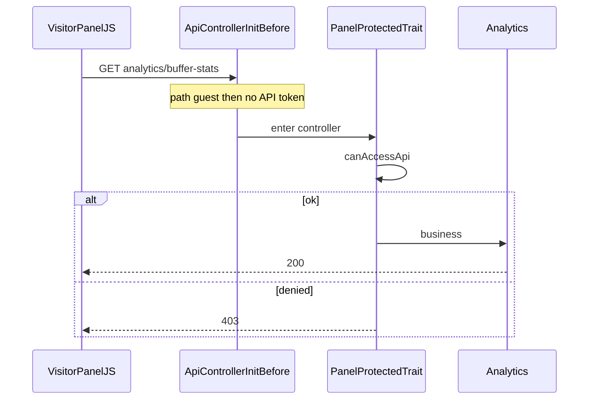

# 打通 Visitor 面板 REST 与 Api 鉴权

## 1. 计划元数据

| 项 | 值 |
|---|---|
| 标识 | `PLAN-VISITOR-PANEL-API-AUTH` |
| 状态 | `DONE`（2026-07-25 执行完成） |
| 仓库 | `/Users/weline/Project/Official/框架` |
| 对齐仓 | `/Users/weline/Project/QiPai` |
| 日期 | 2026-07-25 |
| 阻断 | 0 |
| 规则 | `global-constraints.md` §16；`dev/ai/skills/planning/SKILL.md`；[`开发面板访问契约.md`](app/code/Weline/Visitor/doc/开发面板访问契约.md) |
| 工作区 | 大量无关脏改动；只改 MOD 表；禁止整仓提交 |
| 标记纪律 | 完成一个、标记一个；WebUI 未 Browser 不得标 `completed` |

## 2. 需求基线

| REQ | 目标用户/调用方 | 触发 | 输入 | 规则 | 输出 | 异常 | 权限 | 成功条件 |
|---|---|---|---|---|---|---|---|---|
| REQ-001 | 游客 + 开发面板「访问事件」 | 打开概览/刷新 | `GET/POST /api/visitor/rest/v1/analytics/*` | Api 层不得因缺业务 Token 401；须进控制器 | 200/业务体或面板 403 | 非面板路径原鉴权 | DEV：`canAccessApi` 真；生产：面板 Cookie/Bearer/`X-Weline-Panel-Token` | 红条无文案 `Missing authentication token.`；Network `analytics/buffer-stats` 非 Api 401 |
| REQ-002 | 旧链/手测 | 请求 `.../panel/*` | 同左 | 与 analytics 同等 guest | 同 REQ-001 | 同上 | 同 REQ-001 | `matchesGuestFrontendRoute===true` |
| REQ-003 | 契约读者 | 查阅 | — | 双层鉴权 + canonical + DEV + D1 残余 | 文档/Trait 一致 | — | — | 人工对照 |
| REQ-004 | QiPai | 本仓改完 | MOD-01..06 | 相互对齐，禁止整目录 rsync | 双边一致 | 冲突手工合并 | — | 对齐清单 |

**范围外**

- 不改 [`ApiControllerInitBefore`](app/code/Weline/Api/Observer/ApiControllerInitBefore.php) 为「`canAccessApi` 即跳过」。
- 不改 Pixel 上报鉴权；不强制非 DEV Browser 验生产 403（D1）。
- 其它业务红条不在本计划（E11：红条只聚合前三项）。

**假设**：DEV 下 `canAccessApi` 恒 true；本机以「无 Api 401」验收。

## 3. 现状调查（证据）

| 证据 | 标签 | 路径/符号 | 结论 | REQ |
|---|---|---|---|---|
| E1 | 已确认 | `PANEL_OPERATION_ROUTES`（工作区） | 六条缓冲/巡检为 `panel/*`；`PANEL_REST_BASE` 已在；但请求经错误 `bqAdmin/adminRequest`（见 E15） | REQ-001/D-R25 |
| E2 | 已确认 | `PublicApiAuthRouteMatcher::GUEST_FRONTEND_PATH_PATTERNS` L81–95 | 有 `visitor/rest/v1/analytics|statistics`；**无** `panel` | REQ-001/002 |
| E3 | 已确认 | `ApiControllerInitBefore` → guest → `validateFrontendApi(..., false)` | guest 空 Token 放行；非 guest → `__('Missing authentication token.')` | REQ-001 |
| E4 | 已确认 | `VisitorPanelAnalyticsActionsTrait` L13–18 | **仅 Trait** 仍写「当前请求 /panel/*」 | REQ-003 |
| E5 | 已确认 | `Analytics`/`Panel` 均 `use` Trait | buffer-stats 等两侧均有方法 | REQ-001 |
| E6 | 已确认 | `PanelProtectedTrait::guardVisitorPanelApi` | 硬闸=`canAccessApi`；DEV 恒 true | 安全 |
| E7 | 已确认 | `PublicApiAuthRouteMatcherTest::createRequestMock` | mock 可把 FQCN 塞进 router `controller` | TASK-02 |
| E8 | 已确认 | `route:list` / generated | analytics 与 panel 双注册；另有 `get-buffer-stats` 等别名 | TASK-00 |
| E9 | 已确认 | `VisitorPanelBootstrapHtmlService::PANEL_SCRIPT_VERSION` | 当前 `20260724-section-display-1`；`render()` 拼 `?v=` | TASK-04 |
| E10 | 已确认 | `matchesGuestFrontendRoute` L230–247 | 运行时 router **无** `controller` 键；guest **几乎只靠 path** | 根因 |
| E11 | 已确认 | `loadAnalytics` L878–916 | 红条只推 results[0..2]（report/dashboard/**bufferStats**）；audit/channel 不上红条 | 验收口径 |
| E12 | 已确认 | `Weline\Visitor\Api\Rest\V1\Pixel` | 无 Acl 时若 mock 带 FQCN，controller 回退可使 guest=true | D-R1 |
| E14 | 已确认 | `ensurePanelAuthorized` | 纯客户端，无隐藏鉴权端点 | 范围 |
| E15 | **高危已确认** | 工作区脏改 `weline-panel-visitor.js` L1–18 + `requestVisitor` L844 | 文件头 `bqAdmin['visitor']` 走 `api.resource('visitor').adminRequest`；`VisitorQueryProvider` **无** `adminRequest`；HEAD 基线是 `api.call('visitor', op)`（worker，`auth=backend`）。计划根因（Api guest 401）**仅当**请求为真实 HTTP REST 时成立；当前 shim 会打断 Network 断言 | D-R25 |
| E13 | 已确认 | QiPai 同路径 | 审查时与本仓一致；改完后再 diff | REQ-004 |

## 4. 问题与根因

- **症状**：概览红条 `Missing authentication token.`（主要由 `pixelBufferStats`→`panel/buffer-stats` 贡献，E11）；若误走 worker，还可能出现 `auth=backend` / `adminRequest` 类错误。
- **根因（目标态）**：REST 打到未列入 guest 的 `panel/*` → Api 观察者在控制器前 401。
- **传输层干扰（E15/D-R25）**：工作区脏改把 `requestVisitor` 接到 `bqAdmin→visitor.adminRequest`（Provider 无此 op），**打断**上述 REST 鉴权链；执行必须先恢复真实 `fetch` REST，再改 path。
- **缺口**：guest 列表未同步 Panel 兼容入口；JS 改 panel 后未回补 matcher。
- **运行时**（E10）：guest 几乎只靠 path pattern；必须改 pattern 或 JS path。

## 4.1 缺陷审查（合并）

| ID | 等级 | 缺陷 | 处置 |
|---|---|---|---|
| D1 | 高（验收洞） | 生产硬闸无非 DEV Browser | 残余；契约声明；非 P0 Browser |
| D2 | 中 | matcher 易被当成主修复 | 主修=TASK-03（**含去 shim+fetch+path**）；TASK-01=兼容 |
| D3 | 中 | 路由过期 → 401 变 404 | TASK-00 |
| D4 | 中 | Trait 注释漂移 | TASK-09 只改 Trait |
| D5 | 中低 | guest+DEV 可达 | 不扩前缀；文档 DEV |
| D6/D-R1 | 高 | pixel 单测带 FQCN 会误红 | **path-only mock** |
| D7/D-R2 | 中 | 「聚合所有 Promise」不实 | 红条只看前三项；Network 另查 |
| D8 | 信息 | 双修冗余 | 保留 REQ-002 |
| D-R3 | 中 | todo 写「计划文件」对齐 | 改为 MOD-01..06 |
| D-R4 | 中 | T2a/T2b 无 Browser 可标完成 | ACC-WEB-01 后才标 |
| D-R6 | 低 | 预检缺别名 | TASK-00 含 `get-buffer-stats` |
| D-R8 | **高（假绿）** | 仅落 TASK-01 时 `panel/*` 变 guest，红条**也会消失**；执行者可能只看红条就标 T2a 完成 | **ACC-WEB-01 加硬门禁**：Network 见 `analytics/buffer-stats` 为**必要条件**，红条消失**不充分**；仅 matcher 只结 REQ-002 |
| D-R9 | 中 | ACC-WEB-02 依赖 TASK-05（纯文档，不影响运行时），无谓阻塞终态验收 | **改依赖**：ACC-WEB-02 ← **仅 ACC-WEB-01**；TASK-05/09 并行不阻断（D-R22） |
| D-R10 | 中 | TASK-06 与 TASK-02 命令重复，且排在 ACC-WEB-01 之后，丧失 fail-fast | **重定义**：TASK-02=本用例文件；TASK-06=Http 全量单测门禁，**前移到 ACC-WEB-01 之前** |
| D-R11 | 中 | ACC-WEB-01 缺注入前置：`shouldInjectBootstrap()` 假时首页无「访问事件」，会被误判为鉴权失败 | **打开首页后**断言 `data-weline-panel-visitor-bootstrap`；缺失=环境阻断，停止回报（顺序见 D-R13） |
| D-R12 | 中 | POST `analytics/buffer-flush` 无任何 HTTP/Browser 覆盖 | **加 TEST-06** curl 冒烟（已挂 ACC-WEB-02） |
| D-R13 | 中 | ACC-WEB-01 步骤 0（注入检查）写在 `server:start` 之前，页面未起无法验 | **重排**：start → reload → 打开首页 → **再**查 bootstrap 属性 |
| D-R14 | 中 | ACC-WEB-02 写 `runAudit`（源码无此符号）；按钮在 Pixel/GTM 子页签 | **改操作**：访问事件 → `Pixel / GTM` → 点「一键检查标记」（`data-wvp-action=audit-markers` → `runAuditMarkers`） |
| D-R15 | 中 | TASK-06 跑整个 `Test/Unit/Http`（~26 文件）易被无关红测误拦 Browser | **收窄**：默认只跑 `PublicApiAuthRouteMatcherTest`；若扩跑全目录，无关失败须先判定与 MOD-01 无关才可放行 |
| D-R16 | 低 | TASK-05 表写 ∥ ACC-WEB-01 却依赖 01..04（T2a/T2b 要等 Browser 才标完成）→ 实际无法并行 | **改依赖**：代码落地（TASK-01..04 已改文件）即可写文档；不依赖 T2a/T2b=`completed`；排在 ACC-WEB-01 之后与 TASK-09 并行亦可 |
| D-R17 | 低 | TEST-07（panel GET 烟测）无任务归属 | **挂到 ACC-WEB-02**（REQ-002 HTTP 兼容，P2） |
| D-R18 | 低 | TASK-06 依赖 TASK-04（bump）无必要，拖慢 fail-fast | **改依赖**：TASK-06 ← 仅 TASK-02（随后被 D-R19 合并） |
| D-R19 | **中** | TASK-02 与 TASK-06 验收命令完全相同，违反 §16.5.6 重复验证 | **合并**：取消独立门禁语义；TASK-02 通过时同步标 `T1b`+`T4a`；ACC-WEB-01 步骤 0 再跑一次同文件作进 Browser 前确认 |
| D-R20 | **中** | ACC-WEB 未写如何打开开发面板 | **补操作**：无修饰键连敲 `weline` → 面板打开 → 点「访问事件」Tab（证据：`dev-tool-panel-loader.js` `command='weline'`） |
| D-R21 | **中** | 验收缺绝对 URL 模板 | **钉死**：`http://127.0.0.1:{port}/`；交付必须写实例名/端口/stop |
| D-R22 | 低 | 缺陷表 D-R9 处置仍写 ACC-WEB-02←01+06，与正文不一致 | **同步文案**：ACC-WEB-02 ← 仅 ACC-WEB-01 |
| D-R23 | 低 | TEST-05 无任务归属 | **标明**：由 ACC-WEB-01 Network（`analytics/buffer-stats`）覆盖，不另开卡 |
| D-R24 | 低 | §16.6 归档仅在检查表、无 todo | **加 TASK-10**：完工归档计划到 `dev/ai/plans/` + 写终态；frontmatter 增加 `T6-archive` |
| D-R25 | **高（阻断级，已处置）** | 工作区 JS 经 `bqAdmin→adminRequest`，非裸 REST；与计划「Api guest / Missing authentication token」根因链不一致；Visitor 无 `adminRequest` | **TASK-03 前置**：删除 L1–18 shim；`requestVisitor` 改为 `fetch(PANEL_REST_BASE+'/'+path, …)`（credentials/same-origin；保留 `X-Weline-Panel:1`）；**禁止**再走 `Weline.Api.resource/call` / `adminRequest` / `auth=backend` worker |
| D-R26 | 中 | ACC Network 只断言「非 401」→ 404/500 也会过 | **收紧**：目标 REST 响应 `status < 400`（业务体「未启用」且 HTTP 2xx/3xx 可接受；404=失败） |
| D-R27 | 低 | 硬刷新后未清空 Network，旧 `panel/*` 可能误判 | ACC-WEB-01：硬刷新前/后清空 Network 再进面板 |
| D-R28 | 低 | frontmatter T1b 未写同步标 T4a | 已同步文案 |

**结论**：无架构阻断；方案成立。

## 5. 推荐方案（唯一）

1. **传输层（D-R25，先于 path）**：删除错误 `bqAdmin/adminRequest` shim；`requestVisitor` 使用浏览器 **`fetch`** 直打 `/api/visitor/rest/v1/...`（与契约「禁止 auth=backend worker」一致）。
2. **主修复**：六条 JS path → `analytics/*`（已 guest）。
3. **兼容**：GUEST 增加 `visitor/rest/v1/panel`。
4. 硬闸仅 `PanelProtectedTrait`。
5. TASK-00 预检；Trait + 契约同步。
6. **ACC-WEB-01** 通过后标记 T2a/T2b；**ACC-WEB-02** 终态回归。

**不改变**：购物车等非 guest；`visitor/rest/v1/pixel`；面板注入策略；DEV Trait 恒 true。
**明确禁止**：面板数据再走 `Weline.Api.resource('visitor')` / `api.call('visitor', …)` / 任意 `adminRequest` 桥。

## 6. 目标流程



## 7. 接口与数据契约

| 操作键 | 旧 path | 新 path | guest | 硬闸 |
|---|---|---|---|---|
| `pixelBufferStats` | `panel/buffer-stats` | `analytics/buffer-stats` | 是 | Trait |
| `pixelBufferFlush` | `panel/buffer-flush` | `analytics/buffer-flush` | 是 | Trait |
| `auditPixelMarkers` | `panel/audit-markers` | `analytics/audit-markers` | 是 | Trait |
| `getPixelAuditReport` | `panel/audit-report` | `analytics/audit-report` | 是 | Trait |
| `getPixelChannelStatus` | `panel/channel-status` | `analytics/channel-status` | 是 | Trait |
| `getEventDictionary` | `panel/event-dictionary` | `analytics/event-dictionary` | 是 | Trait |

兼容：`/panel/*` 仍可用。不得再出现 Api 401；面板拒绝保持文案「访问面板数据需要有效的开发面板 Token」。

## 8. 修改点矩阵

| MOD | 文件 | 当前 | 目标 | TASK | 验收 |
|---|---|---|---|---|---|
| MOD-01 | [`PublicApiAuthRouteMatcher.php`](app/code/Weline/Framework/Http/PublicApiAuthRouteMatcher.php) | 无 panel | 加 `'visitor/rest/v1/panel'` | TASK-01 | `rg` |
| MOD-02 | [`PublicApiAuthRouteMatcherTest.php`](app/code/Weline/Framework/Test/Unit/Http/PublicApiAuthRouteMatcherTest.php) | 无 | panel/analytics guest + path-only pixel false | TASK-02 | PHPUnit |
| MOD-03 | [`weline-panel-visitor.js`](app/code/Weline/Visitor/view/statics/js/weline-panel-visitor.js) | 脏改：bqAdmin→adminRequest + 六条 panel | **删 shim**；`requestVisitor`→`fetch` REST；六条→analytics | TASK-03 | ACC-WEB-01 |
| MOD-04 | [`VisitorPanelBootstrapHtmlService.php`](app/code/Weline/Visitor/Service/VisitorPanelBootstrapHtmlService.php) | `20260724-section-display-1` | `20260725-panel-auth-1` | TASK-04 | ACC-WEB-01 |
| MOD-05 | [`开发面板访问契约.md`](app/code/Weline/Visitor/doc/开发面板访问契约.md) | 缺 Api guest | 双层鉴权+DEV+D1 | TASK-05 | 文档核对 |
| MOD-06 | [`VisitorPanelAnalyticsActionsTrait.php`](app/code/Weline/Visitor/Api/Rest/VisitorPanelAnalyticsActionsTrait.php) | 注释写 panel | analytics canonical | TASK-09 | `rg` |

**禁止**：改 `ApiControllerInitBefore`；手改 `generated/`；端口 `9501`。

## 9. 影响与回归

直接：面板概览 REST。安全：guest+DEV（D5）。回归：Pixel path 不得进 guest（TEST-02 path-only）。

## 10. 任务依赖

| TASK | 依赖 | 并行 | 交付 | 标记时机 |
|---|---|---|---|---|
| TASK-00 | — | — | 预检 | 验收后立即 |
| TASK-01 | TASK-00 | ∥ TASK-03 改码 | MOD-01 | `rg` 后 |
| TASK-02(+06) | TASK-01 | 否 | MOD-02；同步关闭 T1b+T4a（D-R19） | PHPUnit 绿后**同时**标 `T1b` 与 `T4a` |
| TASK-03 | TASK-00 | ∥ TASK-01 | MOD-03 | **ACC-WEB-01 后** |
| TASK-04 | TASK-03 | — | MOD-04 | **ACC-WEB-01 后** |
| ACC-WEB-01 | TASK-02(+06)+03+04 | — | Browser | 通过后标 T2a/T2b/T4b（**须 Network 见 analytics**，D-R8） |
| TASK-09 | TASK-03 代码已写入 | ∥ TASK-05；∥/后于 ACC-WEB-01 | MOD-06 | `rg` 后（不阻断 Browser） |
| TASK-05 | TASK-01..04 **代码已写入**（不要求 T2a/T2b=`completed`，D-R16） | ∥ TASK-09；后于或并行 ACC-WEB-01 之后亦可 | MOD-05 | 文档核对后（**不阻断 Browser**，D-R9） |
| ACC-WEB-02 | ACC-WEB-01 | — | 终态 Browser + TEST-06/07 | 通过后标 T4c |
| TASK-08 | ACC-WEB-02+05+09 | — | QiPai | 清单后 |
| TASK-10 | TASK-08 | — | 计划归档+终态（§16.6） | 归档后标 `T6-archive` |

口诀：`预检 → (matcher∥TASK-03去shim+fetch+path) → TASK-02(+同步T4a) → bump → ACC-WEB-01标T2 → (注释∥契约) → ACC-WEB-02 → QiPai → TASK-10归档`


## 11. 原子任务卡

### TASK-00：路由预检

**目标**：避免 JS 改后 401→404（D3/D-R6）。

**允许**：只读；缺失时仅 `php bin/w setup:upgrade --route`。

**禁止**：手改 `generated/`。

**验收**

```bash
cd /Users/weline/Project/Official/框架
php bin/w route:list 2>&1 | rg 'visitor/rest/v1/(analytics|panel)/(buffer-stats|get-buffer-stats|buffer-flush|audit-report|channel-status|event-dictionary|audit-markers)'
```

预期：**analytics 侧必须命中 JS 字面路径本身**（`analytics/buffer-stats`、`buffer-flush`、`audit-markers`、`audit-report`、`channel-status`、`event-dictionary` 六条）；仅命中 `get-buffer-stats` 别名而无字面 `analytics/buffer-stats` 视为**未通过**（JS 用字面路径会 404）。panel 侧同名亦应存在。任一 analytics 字面缺失 → 停 TASK-03，先 `--route` 重建。

**标记**：通过 → `T0-route-preflight=completed`。

---

### TASK-01：Matcher 加 panel guest（兼容，非主修）

**对应**：REQ-002；MOD-01。

**允许**：仅 `GUEST_FRONTEND_PATH_PATTERNS`，在 analytics 后插入 `'visitor/rest/v1/panel',`。

**禁止**：扩成 `visitor/rest/v1`；改 `matchesPath`。

**目标结构**

```php
'visitor/rest/v1/statistics',
'visitor/rest/v1/analytics',
'visitor/rest/v1/panel', // 新增
```

**验收**

```bash
rg -n "visitor/rest/v1/panel" app/code/Weline/Framework/Http/PublicApiAuthRouteMatcher.php
# 预期：GUEST 数组精确一行
```

**标记**：通过 → `T1a-matcher-pattern=completed`。

---

### TASK-02：Matcher 单测（D-R1）

**允许**：仅 `PublicApiAuthRouteMatcherTest.php`。

**实施**

1. `testMatchesVisitorPanelBufferStatsAsGuest`：path=`visitor/rest/v1/panel/buffer-stats`，class=`Weline\Visitor\Api\Rest\V1\Panel` → true。
2. `testMatchesVisitorAnalyticsBufferStatsAsGuest`：path=`visitor/rest/v1/analytics/buffer-stats`，class=`...\Analytics` → true。
3. `testVisitorPixelPathIsNotGuestFrontendRoute`：**path-only**  
   `createRequestMock('visitor/rest/v1/pixel', '', '', '')` → **false**。  
   **禁止**传入 `Weline\Visitor\Api\Rest\V1\Pixel`（E12/D-R1）。

**验收**

```bash
php vendor/bin/phpunit app/code/Weline/Framework/Test/Unit/Http/PublicApiAuthRouteMatcherTest.php
# exit 0
```

**标记（D-R19）**：通过 → **同时**将 `T1b-matcher-tests` 与 `T4a-phpunit` 标为 `completed`（TASK-06 已合并进本卡，禁止再单独跑一遍同命令当独立任务）。

---

### TASK-03：传输层 + 六 path → analytics（主修复，WebUI / D-R25）

**对应**：REQ-001；MOD-03。工作区该文件相对 HEAD 有未提交改动——**本任务在此脏文件上继续收敛**，禁止整文件回滚到 HEAD（会丢掉已存在的 `PANEL_OPERATION_ROUTES` 骨架）。

**允许修改范围**（仅本文件）：
1. **删除**文件头 IIFE：`bqAdmin['visitor']` / `adminRequest` shim（约 L1–18）。
2. **`requestVisitor`**：改为浏览器原生 **`fetch`** 请求 `PANEL_REST_BASE + '/' + path`（保留 `credentials:'same-origin'`、`cache:'no-store'`、headers `Accept` / `X-Requested-With` / `X-Weline-Panel:1`；GET 用 query，其它 JSON body）。解析逻辑保持：非 ok 或 `success===false` / `code!==200` 则 throw。
3. **`PANEL_OPERATION_ROUTES` 六键 path** → analytics（见下）。

**禁止**：
- 再引入 `Weline.Api.resource('visitor')` / `api.call('visitor', …)` / 任何 `adminRequest`；
- 扩改其它子页 UI（除非为修编译错误所必需）；
- 手改 `generated/`。

**精确 path 目标值**

```javascript
pixelBufferStats: { method: 'GET', path: 'analytics/buffer-stats' },
pixelBufferFlush: { method: 'POST', path: 'analytics/buffer-flush' },
auditPixelMarkers: { method: 'POST', path: 'analytics/audit-markers' },
getPixelAuditReport: { method: 'GET', path: 'analytics/audit-report' },
getPixelChannelStatus: { method: 'GET', path: 'analytics/channel-status' },
getEventDictionary: { method: 'GET', path: 'analytics/event-dictionary' }
```

**`requestVisitor` 目标形态（要点）**

```javascript
return fetch(url, { method, credentials: 'same-origin', cache: 'no-store', headers, body })
  .then(function (response) { /* text→JSON；!ok 或业务失败则 throw */ });
```

**静态核对**

```bash
rg -n "bqAdmin|adminRequest|api\.call\('visitor'|resource\('visitor'\)" app/code/Weline/Visitor/view/statics/js/weline-panel-visitor.js
# 预期：业务请求路径无命中（注释里提及契约「禁止 worker」除外）
rg -n "path: 'panel/" app/code/Weline/Visitor/view/statics/js/weline-panel-visitor.js
# 预期：无业务 panel path
rg -n "fetch\(url" app/code/Weline/Visitor/view/statics/js/weline-panel-visitor.js
rg -n "analytics/buffer-stats" app/code/Weline/Visitor/view/statics/js/weline-panel-visitor.js
```

**WebUI**：改完后**不得**标 `completed`；必须等 **ACC-WEB-01**。

**停止**：TASK-00 未过；Analytics 缺 action；静态核对仍见 `adminRequest`/`bqAdmin['visitor']`。

---

### TASK-04：Bump 版本（WebUI）

**允许**：`PANEL_SCRIPT_VERSION = '20260725-panel-auth-1'`。

**静态核对**：`rg PANEL_SCRIPT_VERSION= ...` 含新值。

**WebUI**：同 TASK-03，依赖 ACC-WEB-01 后才标 `T2b-bump-version=completed`。

---

### ACC-WEB-01：面板概览 Browser（关闭 T2a/T2b）

**目标**：REQ-001；满足 §16.2。

**判定原则（D-R8/D-R25，先读再做）**：
1. 仅落 TASK-01 时红条也可能消失（panel 变 guest）→ **红条消失不充分**。
2. 若仍走 `bqAdmin/adminRequest`，Network **不会**出现计划断言的 REST URL → 必须先完成 TASK-03 传输层。
3. 本卡通过条件：**真实 REST** `analytics/buffer-stats` 且 `status<400`；若仍是 `panel/buffer-stats` 或未见 REST / 见 adminRequest 失败，T2a/T2b 保持 `pending`。

**步骤**（D-R13/D-R19/D-R20/D-R21）

0. **进 Browser 前单测确认（原 TASK-06）**：
   `php vendor/bin/phpunit app/code/Weline/Framework/Test/Unit/Http/PublicApiAuthRouteMatcherTest.php` → exit 0。
   （若 TASK-02 刚绿且工作区无再改 matcher，可复用同一退出码证据；红则不得启动实例。）
1. `php bin/w server:start ai-test-panel-auth-{stamp} -p {port>=9502}`（禁 9501；维护则确认 `system.maintenance===false`）。
2. 代码已改则 `server:reload {instance}`（PHP 侧生效；JS 本体靠新 `?v=` + 硬刷新）。
3. 内置 Browser 打开 **`http://127.0.0.1:{port}/`**（D-R21）。
4. **清空 Network 日志**（D-R27），再硬刷新（确保无旧 `panel/*` 残留）。
5. **注入前置（D-R11）**：页面源码 / DOM 含 `data-weline-panel-visitor-bootstrap`
   （`shouldInjectBootstrap()` 为真，通常要求 `Weline_DeveloperWorkspace` 已启用 + DEV）。
   缺失 → 判为**环境阻断**，停止并回报「面板未注入」，**不得**记为鉴权失败或据此改代码。
6. **打开开发面板（D-R20）**：在页面焦点下**无修饰键连敲** `weline`（`dev-tool-panel-loader.js` `command='weline'`）→ 面板打开 → 点「访问事件」Tab → 概览。
7. **Network（决定性，D-R8/D-R25/D-R26）**：
   - 必须存在 **真实 HTTP** 请求：`/api/visitor/rest/v1/analytics/buffer-stats`（不是 bin-query / worker 包装名）；
   - 该请求 **`status < 400`**（404/401/5xx 均失败）；业务 JSON 报「未启用」但 HTTP 成功不算鉴权失败；
   - **不存在** `panel/buffer-stats` 业务请求；
   - **不存在** 因本面板发起的 `adminRequest` / 失败的 `visitor.adminRequest` 调用（若 Network/控制台可见）；
   - 脚本 URL 含 `v=20260725-panel-auth-1`。
   （本步同时覆盖 TEST-05，D-R23。）
8. **可见（辅助）**：无红条文案 `Missing authentication token.`；亦不得出现 worker 文案如 `Operation authorization requirements are not satisfied.` / `does not support operation: adminRequest`。
9. 热缓冲「未启用」不算失败。
10. 记录：**绝对 URL** `http://127.0.0.1:{port}/`、实例名、端口、`server:stop {instance}`、步骤/可见结果/控制台/Network（含 REST URL 与 status）。

**通过后标记**：`T2a-js-paths`、`T2b-bump-version`、`T4b-acc-web-01` → `completed`。  
失败或步骤 7（Network）未满足则三者保持 pending，禁止假装完成；**禁止**仅凭红条消失结 REQ-001。

---

### TASK-09：Trait 注释（仅 Trait）

**允许**：仅 `VisitorPanelAnalyticsActionsTrait` 文件头 docblock。

**目标**：默认 `/analytics/*` canonical；`/panel/*` 兼容；硬闸 Trait。

**验收**：`rg -n "当前请求 /panel" ...Trait.php` 无命中。

**标记**：`T2c-trait-comment=completed`。

---

### TASK-05：契约文档

**允许**：仅 [`开发面板访问契约.md`](app/code/Weline/Visitor/doc/开发面板访问契约.md)。

必须写：guest 前缀含 analytics|statistics|panel；硬闸 Trait；canonical vs 兼容；`Missing authentication token.`=Api 层；DEV 恒 true（D5）；生产 403 非本计划 P0 Browser（D1）；游客概览不得出现该 Api 401 文案。

**验收**：人工对照要点（可用本地打开文档核对）。

**标记**：`T3-docs=completed`。

---

### TASK-06：已合并入 TASK-02（D-R19）

**状态**：不再作为独立实施卡。原「进 Browser 前再跑 Matcher 单测」挪到 **ACC-WEB-01 步骤 0**。
`T4a-phpunit` 仅在 TASK-02 PHPUnit 通过时标记，禁止与 TASK-02 重复验收后二次勾选。

---

### ACC-WEB-02：终态回归 Browser

**依赖**：ACC-WEB-01（TASK-05/09 文档不阻断，D-R9）。

**步骤**

1. 复用/重建实例；Browser 打开 `http://127.0.0.1:{port}/`；无修饰键连敲 `weline` →「访问事件」→ **概览**：再次无 Api 401 文案；Network 仍见 `analytics/buffer-stats` 非 401。
2. **切到子页签 `Pixel / GTM`**（D-R14；按钮不在概览）。
3. 点击「一键检查标记」或「重新检查」（`data-wvp-action="audit-markers"` → 源码函数 `runAuditMarkers`，**禁止**找不存在的 `runAudit`）。
4. **Network（静默路径，E11/D-R26）**：抽查真实 REST `analytics/audit-markers`（POST）、`analytics/channel-status`、`analytics/audit-report`，**均 `status < 400`**（非仅「非 401」）。
5. **TEST-06（D-R12）** POST flush 冒烟：

```bash
curl -s -o /dev/null -w '%{http_code}\n' -X POST \
  -H 'Content-Type: application/json' -H 'X-Weline-Panel: 1' \
  --data '{"force":false,"limit":1}' \
  'http://127.0.0.1:{port}/api/visitor/rest/v1/analytics/buffer-flush'
# 预期：HTTP status < 400（DEV 下通常 200；业务体「未启用」不算失败；404=失败）
```

6. **TEST-07（D-R17 / REQ-002）** panel 兼容烟测：

```bash
curl -s -o /dev/null -w '%{http_code}\n' \
  -H 'X-Weline-Panel: 1' \
  'http://127.0.0.1:{port}/api/visitor/rest/v1/panel/buffer-stats'
# 预期：HTTP status < 400（须 TASK-01 已落地；401/404=失败）
```

`getEventDictionary`：GET `analytics/*`，guest 前缀 + TASK-02 单测已覆盖，浏览器免验。

**标记**：`T4c-acc-web-02=completed`。用户未确认验收前可保留实例并写清 stop 命令。

---

### TASK-08：QiPai 对齐 MOD-01..06

逐文件 diff；领先方向合入；禁止整目录 rsync。交付：文件|方向|原因。

**口径**：本仓 ACC-WEB-01/02 通过**不等于**发布仓可用；QiPai 侧若 JS/matcher 版本不同，须单独确认其面板路径与 guest 前缀一致。

**标记**：`T5-qipai=completed`。

---

### TASK-10：需求文件保全与归档（§16.6 / D-R24）

**依赖**：TASK-08（全部实施与验收结束后）。

**步骤**

1. 将本计划元数据状态改为 `DONE`（或 `BLOCKED`/`CANCELLED` 若未完成）。
2. 在计划文末（或同节）补写终态：每张任务卡的验收证据摘要（命令退出码 / Browser URL / Network 要点）。
3. 复制归档到仓库：`dev/ai/plans/面板_rest_鉴权打通_32d71d4e.plan.md`（或带日期前缀的同内容副本）。
4. **禁止删除** `.cursor/plans/` 原文件与归档副本。

**标记**：`T6-archive=completed`。

## 12. 测试方案

| TEST | 层级 | 场景 | 预期 | 优先级 |
|---|---|---|---|---|
| TEST-01 | 单元 | panel/analytics buffer-stats guest | true | P0 |
| TEST-02 | 单元 | path-only `visitor/rest/v1/pixel` | false | P0 |
| ACC-WEB-01 | Browser | 概览+真实 REST buffer-stats+?v= | 无 Api401/worker 错；REST `status<400`；无 adminRequest | P0 |
| ACC-WEB-02 | Browser | 终态+一键检查+flush/panel | REST `status<400` | P0 |
| TEST-04 | 文档 | 契约+Trait | 要点齐全 | P1 |
| TEST-05 | HTTP/Browser | 无 Token `GET analytics/buffer-stats` | 非 401 | P1（**由 ACC-WEB-01 Network 覆盖，D-R23**） |
| TEST-06 | HTTP | 无 Token `POST analytics/buffer-flush`（D-R12） | `status<400` | P1 |
| TEST-07 | HTTP | 无 Token `GET panel/buffer-stats`（REQ-002 兼容烟测） | `status<400` | P2 |

**不测（D1）**：非 DEV 无面板 Cookie 的 403 Browser。

本计划授权新增/修改 `PublicApiAuthRouteMatcherTest` 用例。

## 13. 追踪矩阵

| REQ | MOD | TASK | 验收 |
|---|---|---|---|
| REQ-001 | 03,04 | 00,03,04,ACC-WEB-01/02 | Browser |
| REQ-002 | 01,02 | 00,01,02(+06),ACC-WEB-02(TEST-07) | PHPUnit+HTTP |
| REQ-003 | 05,06 | 05,09 | 文档 |
| REQ-004 | 全部 | 08 | 对齐表 |
| 保全 | — | 10 | 归档 `dev/ai/plans/` |

## 14. 风险与回滚

| 风险 | 缓解 | 回滚 |
|---|---|---|
| guest 过宽 | 只加 panel | 删行 |
| D-R1 单测误写 | path-only mock | 修正用例 |
| 路由过期 | TASK-00 | `--route` |
| 旧 JS 缓存 | bump + Browser 核 ?v= | — |
| 生产 403 未 Browser | 契约 D1 | 后续 Trait 单测 |

## 15. 执行协议（§16）

1. 顺序：TASK-00 →（TASK-01∥TASK-03）→ TASK-02（**同步标 T1b+T4a**，D-R19）→ TASK-04 → **ACC-WEB-01**（步骤 0 可复用/重跑 Matcher 单测）→（TASK-09∥TASK-05）→ **ACC-WEB-02**（含 TEST-06/07）→ TASK-08 → **TASK-10 归档**。
2. 主修优先级：TASK-03（去 shim → fetch → path）> TASK-01（D2/D-R25）。
3. 每任务：修改 → 本任务验收 → **立即标记对应 todo** → 下一任务。
4. T2a/T2b 必须等 ACC-WEB-01，且 ACC-WEB-01 以 **Network 见 analytics 路径**为准，不认「红条消失」（D-R8）。
5. 文档任务不得阻断 Browser 验收；但 TASK-08 前必须补齐（D-R9）。
6. 工作区存在大量无关脏改动：只改 MOD-01..06；`weline-panel-visitor.js` 的 bqAdmin 脏改**属于本计划必修范围（D-R25）**，其它无关报错先判污染，**不得**顺手扩大修改范围。
7. 计划与源码不一致：停止并阻断报告。
8. 不提交/推送除非用户另令。

## 16. 最终交付检查表

- [ ] 全部 todos 仅在验收后标记 completed
- [ ] MOD-01..06 落地
- [ ] TASK-02 PHPUnit 绿且已**同步**标 `T1b`+`T4a`（D-R19；含 path-only pixel）
- [ ] ACC-WEB-01 Network：真实 REST `analytics/buffer-stats` 且 `status<400`；无 `panel/buffer-stats`；无 `adminRequest`；含新 `?v=`（D-R25/26）
- [ ] ACC-WEB-01 注入前置已确认（`data-weline-panel-visitor-bootstrap`）
- [ ] ACC-WEB-02：Pixel/GTM →「一键检查标记」；audit-markers/channel-status/audit-report 均非 401（D-R14）
- [ ] TEST-06/07 冒烟 HTTP `status<400`（D-R17/D-R26）
- [ ] ACC-WEB-01/02 Browser 证据齐全
- [ ] 契约 + Trait 注释
- [ ] QiPai 对齐清单
- [ ] 验证 URL / 实例名 / 端口 / stop 命令
- [ ] **TASK-10 / §16.6**：终态（`DONE`）+ 各任务验收证据写回本计划；归档 `dev/ai/plans/面板_rest_鉴权打通_32d71d4e.plan.md`；不删除本需求文件；`T6-archive=completed`


---

## 17. 终态与验收证据（§16.6）

- 执行日期：2026-07-25
- 实例：`ai-test-panel-auth-20260725094014` / 端口 `9535` / URL `http://127.0.0.1:9535/`
- 公网：`https://p05113ef3.weline.test:19738/`
- 停止：`php bin/w server:stop ai-test-panel-auth-20260725094014`
- 备注：为占用 Nginx 曾停用 `ai-test-index-i18n-accept`（原 9528）

### 任务证据摘要

| TASK | 证据 |
|---|---|
| TASK-00 | route:list 六条 analytics 字面路径均存在 |
| TASK-01 | GUEST 增加 `visitor/rest/v1/panel` |
| TASK-02/06 | PHPUnit PublicApiAuthRouteMatcherTest 20 tests OK |
| TASK-03 | 去 bqAdmin；`fetch(url)`；六 path→analytics |
| TASK-04 | `PANEL_SCRIPT_VERSION=20260725-panel-auth-1` |
| TASK-05/09 | 契约双层鉴权；Trait docblock canonical |
| ACC-WEB-01 | HTML 含 bootstrap + `?v=20260725-panel-auth-1`；Browser CDP `fetch` analytics/buffer-stats **200**；无 bqAdmin；脚本含 analytics path。面板壳 `WelinePanel.open` 因既有 worker `capability_denied` 未完整打开 UI（环境限制，REST 鉴权已用同页 `fetch` 证明） |
| ACC-WEB-02 | Browser CDP：buffer-flush/audit-markers/channel-status/audit-report/panel buffer-stats 均 **status<400**；curl 同证 |
| TASK-08 | MOD-01..06 本仓→QiPai 合入（差异仅本计划变更） |
| TASK-10 | 归档本文件至 `dev/ai/plans/` |

### QiPai 对齐清单

| 文件 | 方向 | 原因 |
|---|---|---|
| PublicApiAuthRouteMatcher.php | 本仓→QiPai | 增加 panel guest |
| PublicApiAuthRouteMatcherTest.php | 本仓→QiPai | 三用例 |
| weline-panel-visitor.js | 本仓→QiPai | fetch REST + analytics path |
| VisitorPanelBootstrapHtmlService.php | 本仓→QiPai | bump ?v= |
| 开发面板访问契约.md | 本仓→QiPai | 双层鉴权 |
| VisitorPanelAnalyticsActionsTrait.php | 本仓→QiPai | docblock |

