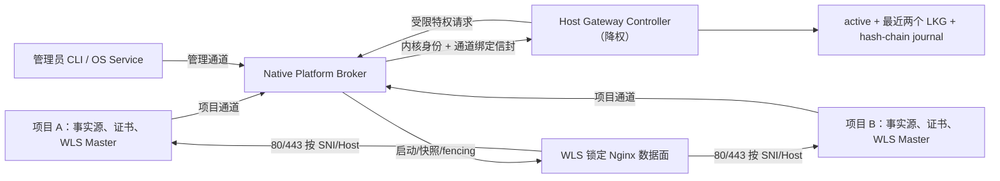

# WLS 2.0：多项目共享网关与自动恢复

## 1. 审查结论与开工门禁

| 项 | 结论 |
| --- | --- |
| 计划状态 | **IMPLEMENTATION REOPENED / ACCEPTANCE BLOCKED** |
| 源码状态 | **STATIC REMEDIATION CHECKPOINT / NOT RELEASE-READY**；DEF-232～262 已形成定向静态/PostgreSQL 闭环，DEF-245/246 已刷新新鲜证据；本机完整 Gateway unit（`bootstrap_pgsql.php`）`480 tests / 8871 assertions` 已绿；TASK-003/004/005/006/008/009/010/012/013/014 不提前完成，托管 runner 统一 PostgreSQL、当前源码百万请求、三平台系统服务/冷重启及外部 CA/DNS 待验收 |
| 历史审查基线 | `master@91cc1b6f73848b489e8cbe4c9b8c0a9c4556e1be` |
| 当前源码基线 | `dev@d50ac39372277b362ff0c5da939032fd0f58d22f`，dirty working tree，尚未形成本轮提交 |
| 协议 | `wls-edge/2` |
| 主模块 | `Weline_Server` |
| 协作模块 | `Weline_Websites`，仅通过已发布接口提供活动域名 |
| 任务记录 | `dev/ai/codex/tasks/2026-07-27/2026-07-27-0658-wls-2-0-gateway-plan-re-audit` |
| 未决产品决策 | `0` |
| 未决安全边界 | `0` |
| 未映射源码缺陷 | `0` |
| 当前工作区保护 | 不覆盖 `app/etc/env.sample.php` 的用户改动；不触碰三个 `.orig` 文件；不操作 9501 或未知 80/443 owner |

历史 IMPLEMENTED 判定已被 2026-08-03 静态反证审查撤回。严格百万请求只证明特定旧数据面在当时条件下可承载流量，不能覆盖缺失文件恢复、隔离渲染、generation fence、原子替换、端口租约交接和 A/B 崩溃幂等不变量。新增的 P0/P1 必须先修复、静态复审，再重跑 TASK-013/014；实机与外部 CA/DNS 证据仍是其后的独立发布阻断。

本计划取代本文件此前所有版本；不得另建平行实施计划。实现阶段按 `TASK-000` 至 `TASK-014` 的依赖逐项完成、逐项验证、逐项标记。

## 2. 需求基线

### 2.1 编号需求

| ID | 必须满足的行为 |
| --- | --- |
| REQ-001 | 用户接口只暴露 `--edge=auto|gateway|wls`；优先级为 CLI > 已保存实例配置 > 环境配置 > `auto`。`--no-nginx` 和旧 `adapter=wls` 映射到 `edge=wls`；旧 `adapter=nginx` 保持 legacy，禁止静默提升。 |
| REQ-002 | `auto` 只能加入已由管理员安装、签名可信、协议兼容且 ready 的宿主网关；不得安装、升级、修复或接管未知服务。没有可信网关时立即启动纯 WLS 高端口。 |
| REQ-003 | `gateway` 必须成功加入可信网关，并达到 ACTIVE，或在首次签发时达到已鉴权的 `PENDING_CERTIFICATE/challenge-only`；其他失败干净退出。`wls` 完全不接触网关。 |
| REQ-004 | 宿主网关独立于任一项目，统一监听 80/443；引导项目停止、迁移或删除后，网关和其他项目继续运行。 |
| REQ-005 | 项目 UUID、域名期望状态、证书源、续签记录始终位于项目；宿主 enrollment、能力凭据、派生路由状态和证书快照不随项目迁移。 |
| REQ-006 | 单宿主允许多个项目，每个项目允许多个 WLS 实例。项目期望 generation 与实例租约 generation 分离，实例停止只移除自己的后端，不撤销项目。 |
| REQ-007 | 精确域名、通配符覆盖和跨项目冲突一律拒绝；域名转移必须使用管理员确认的原子 transfer。未知域名不得落到首个项目。 |
| REQ-008 | HTTPS 的 SNI 与 Host 必须解析为同一项目，否则返回 421；HTTP 未知 Host 返回中性 404，HTTPS 未知 SNI 返回中性 421。 |
| REQ-009 | 项目证书是唯一事实源。网关只通过安全读取器读取 enrollment 授权目录，验证后生成内容寻址快照；Nginx 只引用宿主快照。 |
| REQ-010 | ACME HTTP-01 只发布带过期时间的精确 challenge 租约；通配符必须走 DNS-01。无有效证书前不得开放普通 443 路由。 |
| REQ-011 | 网关发布采用 desired → candidate → active 事务；只有候选配置、Nginx 语法、真实路由探针和观察窗全部成功后，路由才成为 ACTIVE。失败保留上一代 active/LKG。 |
| REQ-012 | 心跳默认 10 秒，45 秒未续租进入 STALE，新请求 503；主动排空默认 300 秒；STALE 保留 24 小时；未被 active 或最近两个 LKG 引用的快照 7 天后回收。 |
| REQ-013 | 控制器故障但数据面正常时不得中断流量或触发项目降级；数据面持续故障时按接管、重启、配置回滚、全包二进制回滚、状态重建、熔断顺序恢复。 |
| REQ-014 | 项目数据面连续不可用 90 秒时，在同一 Master 内增加纯 WLS TLS 高端口监听；网关 ACTIVE 且连续健康 30 秒后切回，高端口排空 300 秒再关闭。 |
| REQ-015 | 未知程序占用 80/443 时绝不停止或修改该进程；`auto` 退纯 WLS并报告 `PORT_TAKEN`，显式 `gateway` 失败。 |
| REQ-016 | 生产网关必须由系统级服务管理：macOS LaunchDaemon、Linux systemd system unit、Windows Service。无法安装服务、验证权限、安全通道或安装 profile 要求的 IPv4/IPv6 80/443 时不得 ready。 |
| REQ-017 | A/B 槽覆盖稳定启动器之外的 Controller、Nginx、安全读取器和 manifest；升级必须影子验证、事务切槽、观察五分钟并可自动回退；旧槽健康保留至少 24 小时。 |
| REQ-018 | WLS 1.x 不自动注册。占用 80/443 的旧项目只有显式 `gateway:promote` 才能影子验证并进入公告过的短维护窗完成受控端口交接；失败自动恢复原项目。跨平台不得虚构绝对无缝的 socket 原子移交。 |
| REQ-019 | `server:stop {instance}` 只排空并注销本实例，不停止共享网关；`gateway:stop` 仅管理员可用，并写入持久停机意图，平台守护不得立即拉起。 |
| REQ-020 | `website_id=0/code=default` 是有效站点；构建路由时不得因假值判断丢弃。 |
| REQ-021 | H1、H2、SSE、WebSocket 的 reload/恢复/排空必须可证明；H3 只有真实 QUIC 通过才声明支持，H3 故障不得影响 H2/H1。 |
| REQ-022 | 网关与纯 WLS 各执行精确一百万次防假绿请求；多项目混合流量必须证明无串租户，且性能回归在同宿主基线阈值内。 |
| REQ-023 | enrollment 必须显式授权项目可注册的规范化域名集合/模式；持有项目凭据但未获域名授权的项目不能抢注域名、申请 challenge 或发起 transfer。 |
| REQ-024 | 网关必须清洗客户端伪造的 Forwarded/X-Forwarded-*、连接级 hop-by-hop 头和歧义 Host；后端只接受 loopback/受保护传输。重复 Host、CL/TE 歧义及请求走私载荷必须 fail closed。 |
| REQ-025 | WLS 2.0 v1 必须全局禁用 TLS session cache/ticket 和 0-RTT。仅用 per-route ticket key 不能作为 TLS 1.3 租户边界；同 SNI、跨 SNI 和证书 generation 变化后均必须重新握手。 |
| REQ-026 | 端口角色必须明确：gateway/auto 的 `-p` 只指定 loopback backend；auto fallback 的 public listener 始终由项目 UUID 在 20000–29999 稳定分配并以宿主锁+实际双栈 bind 确认，不继承 `-p`。只有显式 `edge=wls` 的 `-p` 是 public exact port 且冲突即失败；运行时/status 以实际 lease `bind_host/port` 为唯一事实。 |
| REQ-027 | 宿主 A/B 槽必须自包含 Controller 应用及其锁定运行时、锁定 Nginx、安全读取器和签名 manifest；删除/迁移最初安装它的项目后仍能独立启动和恢复。 |
| REQ-028 | 管理员 revoke、域名 transfer 和凭据失效必须写入单调安全墓碑；任何 LKG、journal replay 或旧实例 heartbeat 都不能复活已撤销的项目、域名、凭据或证书引用。 |
| REQ-029 | `auto` 在纯 WLS 高端口运行时必须以退避方式继续发现可信网关；加入并连续健康后按 30/300 秒切回。`wls` 不启动发现器；`gateway` 只在首次启动失败时退出，已成功运行后的数据面故障仍按 90 秒降级。 |
| REQ-030 | 任一时刻只能有一个持有 OS 锁和单调 fencing token 的 Controller 发布配置、操作 Nginx 或写 active pointer；旧 Controller、旧槽和网络/进程延迟消息必须被拒绝。 |
| REQ-031 | 未知/缺失 SNI 使用不含任何租户域名的宿主中性证书并在诊断客户端中返回 421；普通校验客户端可能先证书失败，文档不得承诺一定看到 421。IPv6 默认必需但可由管理员显式声明 IPv4-only；H3 的 UDP 443 是独立能力，失败只关闭 H3。 |
| REQ-032 | 发布事务必须持久化 `PREPARED → SHADOW_VERIFIED → ACTIVATING → COMMITTED` 阶段；Controller 在任一指令点崩溃后，必须以 journal、active pointer、Nginx owner generation 和墓碑对账，确定继续提交或回滚，不能盲目 adopt。 |
| REQ-033 | 项目 UUID、desired digest/generation 和 certificate generation 必须由项目锁保护并原子持久化；同摘要复用 generation，变更才 CAS 递增。缺失且项目配置只读时 fail fast，不得生成临时身份或把 generation 退回 1。 |
| REQ-034 | `auto` 从 native 高端口加入网关时，必须在同一 Master 先增加独立 loopback H1 backend、完成身份验证与 ACTIVE，再排空 native TLS；加入失败保留 native TLS 并撤销临时 backend。任何阶段都不得把 TLS public listener 直接注册为明文 backend。 |
| REQ-035 | 纯 WLS 和 fallback 只能使用项目已验证并原子激活的证书 generation；没有有效证书时不得开放生产 TLS 或生成隐式自签名证书。网关首次签发可只开放精确 ACME challenge，取得有效证书后再转 ACTIVE/443。 |
| REQ-036 | 高端口入口沿用实例显式 public bind；未显式配置时安全默认 loopback，不能因降级自动扩大到所有网卡。WLS 只报告实际 bind、可用域名:端口和 DNS/防火墙/LB 限制，不自动修改网络策略。 |
| REQ-037 | host_gateway scope 的每个 loopback backend 必须在业务路由前验证按 gateway epoch + master launch 绑定的内部能力；Nginx 必须覆盖客户端同名头，WLS 校验后剥离。缺失、跨实例、旧 epoch 或公网伪造能力一律拒绝。 |
| REQ-038 | 同项目多实例默认采用一个确定性首选 backend + 健康热备；只有项目声明且运行时证明 stateless/shared-session capability 时才允许多 backend 分流。已发送的非幂等请求不得因 upstream 切换自动重放。 |
| REQ-039 | ENOSPC、inode/配额耗尽或只读状态盘不得破坏 active/LKG 或触发重启循环；网关进入 `DISK_PRESSURE`，拒绝新持久操作但保持已验证数据面，并通过有界日志轮转、快照配额和预留恢复空间可诊断。 |
| REQ-040 | lease、健康连续失败、观察窗、排空、熔断和退避使用 monotonic clock；证书有效期和协议 timestamp 使用经合理性检查的 wall clock。时钟前后跳不得让所有租约误过期或绕过重放窗口。 |

### 2.2 v1 信任边界

- 支持：同一物理/虚拟宿主、同一管理员控制的 OS 信任域、项目根目录可由管理员授权读取。
- 不声称支持：彼此敌对的同 UID 项目、跨用户强隔离、跨容器无共享命名空间、跨宿主高可用。
- 跨用户或容器必须在后续 2.x 通过专用 broker、ACL 和只读共享卷设计；v1 遇到此部署形态必须 fail closed，不得退回共享 token。
- `GatewayPortLeaseAllocator` 的默认状态根是当前运行身份的 `LOCALAPPDATA`/`XDG_STATE_HOME`，因此只表示“同一管理员文件系统命名空间协调”，不得报告为跨用户宿主锁。管理员可用绝对路径 `WLS_EDGE_STATE_HOME` 让同一受信 ACL 命名空间共享协调状态；跨用户真正 host-scope 的租约写入必须经 Platform Broker，不能让普通项目直接写系统 root。即使状态根不共享，实际预绑定 socket 仍是数字端口的最终排他事实，不能仅凭 lease 文件宣称可用。
- 单机自动恢复不能解决宿主断电、宿主网络或磁盘整体故障；无感 80/443 高可用属于后续多宿主网关。

### 2.3 明确不在范围

- 跨项目路径路由。
- 自动修改 DNS、防火墙或外部负载均衡。
- 自动终止系统 Nginx、Apache、容器代理或其他未知端口 owner。
- 普通项目自行升级共享网关。
- 把宿主注册状态写回项目并随项目迁移。
- 把第二个完整 WLS Master 当作 fallback。

## 3. 源码事实与历史证据

### 3.1 已验证事实

| 证据 | 当前事实 | 计划约束 |
| --- | --- | --- |
| E-001 | `EdgeAdapterResolver` 当前只有 `nginx|wls` | 共享网关是 `nginx` 数据面之上的 `host_gateway` scope，不新增第三种 adapter |
| E-002 | `Start` 的 `gateway.mode` 未传入 `ServiceContext` 的 `wls.edge.mode` | TASK-001/005 必须用一个强类型运行时契约消除重复配置树 |
| E-003 | `GatewayStartupDecision(auto)` 可调用 `GatewayHostManager::prepare()` | TASK-001 禁止普通 start 隐式安装、升级或修复宿主服务 |
| E-004 | 当前没有 `server:gateway:install`；直接 `status` 可运行，但 `bin/w list` 未列出 gateway 命令 | TASK-003/007 增加显式安装并验收命令发现 |
| E-005 | `GatewayClient` 使用一个全局 `control.token` 认证项目和管理员操作 | TASK-004 拆分管理通道与项目通道，最小权限 |
| E-006 | register 会自动 enroll；Controller 也会在缺失时创建 enrollment | TASK-004 中 register 永不 enroll，enroll 必须管理员显式执行 |
| E-007 | `peer_identity` 由客户端声明；Windows 当前回退 loopback TCP | TASK-004 使用真实 UDS peer credential 或 Named Pipe SID/DACL |
| E-008 | `projectUuid()` 仍由项目路径 hash 派生 | TASK-001 写入可迁移随机 UUIDv4 |
| E-009 | fallback 启动第二个 `server:start gateway-fallback-*` | TASK-009 改为同 Master 补充 TLS worker/listener |
| E-010 | 高端口探测后关闭 socket 再写 lease | TASK-009 使用宿主锁、保留 socket/bind handoff 和重试 |
| E-011 | Agent 在控制器异常时仅以 80/443 TCP 可连接判断数据面健康 | TASK-005/008 使用 SNI+Host+证书摘要+后端 nonce 的真实探针 |
| E-012 | Controller 的 backend probe 只 TCP connect，未验证项目/实例身份 | TASK-005 增加 loopback 鉴权身份端点和全链路 sentinel |
| E-013 | register 先改 state/route、忽略 publish false，并提前返回 ACTIVE | TASK-006 实现事务发布和 `PENDING_PUBLICATION` |
| E-014 | `projects` 以项目 UUID 单键覆盖，多个实例会互相替换/注销 | TASK-005 分离项目期望状态和实例后端租约 |
| E-015 | 当前 platform supervisor 是用户级 LaunchAgent/systemd user，Windows unavailable | TASK-003 使用三平台系统级服务；缺能力不得 ready |
| E-016 | LKG 配置回滚未同步 active generation；快照 GC 未保留最近两个 LKG 引用 | TASK-008 使用完整 generation bundle 和引用闭包 |
| E-017 | 当前 journal 仅追加，无序列 hash-chain、fsync 和确定性重放 | TASK-008 增加可校验日志与损坏隔离 |
| E-018 | inactive slot 安装时先翻 active pointer，平台服务仍直接指向旧 Controller | TASK-010 使用稳定启动器、pending slot 和全包切换 |
| E-019 | 现有 realpath/lstat 证书读取仍有 TOCTOU | TASK-003/006 引入原生安全读取器；缺失时网关不 ready |
| E-020 | `gateway:stop` 只退出 Controller，会被 KeepAlive/Restart 拉起 | TASK-010 持久 stop intent 并调用平台服务管理 |
| E-021 | 旧 Gateway 文档仍写“已退役”，与当前检查点冲突 | TASK-012 只在行为验收后统一文档 |
| E-022 | `app/etc/env.sample.php` 存在用户改动，模块 env 与根 env 不能覆盖式同步 | TASK-000/012 采用精确 hunk 合并并先停下报告重叠 |

### 3.2 既有负载证据只作基线

上一轮隔离测试已经得到：

- 手工运行 Agent 的网关数据面：`1,000,000/1,000,000` HTTP 200、0 错误、5,442.61 req/s、平均 18.356 ms。
- 纯 WLS：`1,000,000/1,000,000` HTTP 200、0 错误、26,062.80 req/s、平均 3.830 ms。
- 系统 `ab` 曾在 TLS 1.3 握手失败、返回 0 字节时报告“成功”，已证明不能作为唯一工具。
- 纯 WLS 的 H2 能力测试实际协商为 HTTP/1.1，不能把“配置声称支持”当作 H2 通过。
- 自动 Agent 未启动，route 在 45 秒后由 ACTIVE 转 STALE，公开入口返回 503。

这些数据证明两个数据面在特定手工条件下能完成百万请求，也同时证明生命周期、协议协商和测试断言存在缺陷。它们不能替代 TASK-013/014 的最终验收。

## 4. 缺陷分级、根因与归属

| ID | 等级 | 缺陷/风险 | 根因 | 修复任务 |
| --- | --- | --- | --- | --- |
| DEF-001 | P0 | 项目可用共享 token 执行 stop/upgrade/revoke | 管理操作与租户操作没有权限域 | TASK-004 |
| DEF-002 | P0 | 同 UID 客户端可伪造 peer identity | 信任客户端字段而非内核对等身份 | TASK-003/004 |
| DEF-003 | P0 | 自动 register 等于自动 enroll | enrollment 与期望状态混为一体 | TASK-004 |
| DEF-004 | P0 | 普通 `auto` 启动会安装宿主服务 | 发现、安装、加入三个动作没有分离 | TASK-001/003 |
| DEF-005 | P0 | Agent 没有随 Master 自动启动 | `gateway.mode` 与 `wls.edge.mode` 配置树错位 | TASK-001/005 |
| DEF-006 | P0 | fallback 启动第二个完整 Master | 缺少同 Master 动态监听控制面 | TASK-009 |
| DEF-007 | P0 | register 发布失败仍返回 ACTIVE | desired、candidate、active 共用可变状态 | TASK-006 |
| DEF-008 | P0 | A/B 只切 Nginx，Controller 不切且不能可靠回滚 | 无稳定启动器和 pending/active 事务 | TASK-010 |
| DEF-009 | P0 | 证书读取可发生符号链接/路径替换 TOCTOU | PHP 路径校验不是 no-follow 文件句柄读取 | TASK-003/006 |
| DEF-010 | P0 | 端口可连被误认为项目路由健康 | 健康检查不是租户特定的端到端探针 | TASK-005/008 |
| DEF-011 | P1 | 项目路径变化导致身份变化 | UUID 从路径 hash 派生 | TASK-001 |
| DEF-012 | P1 | 同项目多实例互相覆盖和误注销 | 状态只按项目 UUID 建模 | TASK-005 |
| DEF-013 | P1 | 端口租约存在探测到绑定的竞争窗口 | probe 后释放 socket | TASK-009 |
| DEF-014 | P1 | 控制器重启/状态损坏 epoch 语义不清 | 没有 clean restart 与 reconstruction 区分 | TASK-008 |
| DEF-015 | P1 | LKG 配置、路由、证书引用和 generation 不一致 | LKG 不是完整不可变 bundle | TASK-008 |
| DEF-016 | P1 | 快照 GC 可能删除 LKG 证书 | GC 只追踪 current routes | TASK-008 |
| DEF-017 | P1 | journal 无法证明完整重放 | 无序列、hash chain、fsync、截断规则 | TASK-008 |
| DEF-018 | P1 | 用户级守护不能可靠管理开机 80/443 | 平台集成层级错误 | TASK-003 |
| DEF-019 | P1 | gateway stop 被平台自动重启抵消 | 无持久管理员停机意图 | TASK-010 |
| DEF-020 | P1 | stop 后端可能先退出，现有长连接被截断 | drain 没有 active connection/request 反馈闭环 | TASK-007 |
| DEF-021 | P1 | 通配符匹配、SNI/Host 同项目语义不完整 | 字符串比较代替规范化路由解析 | TASK-006 |
| DEF-022 | P1 | ACME challenge 可能被当普通代理路径 | 未建模最小 challenge 租约 | TASK-006 |
| DEF-023 | P1 | 单线程 Controller 被证书复制/发布阻塞 | 重操作同步执行且无 coalesce | TASK-006/008 |
| DEF-024 | P1 | 未限制项目、路由、请求和更新频率 | 缺少本地 DoS 与 reload storm 门禁 | TASK-004/006 |
| DEF-025 | P1 | 命令能直接执行但未出现在命令列表 | 命令发现/元数据未纳入验收 | TASK-007 |
| DEF-026 | P1 | 文档与当前行为互相冲突 | 文档仍保留 Gateway 退役时代语义 | TASK-012 |
| DEF-027 | P1 | H2/百万测试可能假绿 | 只看工具退出码/请求数，未断言 ALPN、body、租户和字节 | TASK-013/014 |
| DEF-028 | P2 | 当前实现会把 user-home/test override 当生产信任根 | 生产路径和测试路径没有强隔离 | TASK-003 |
| DEF-029 | P2 | `website_id=0` 可能被假值过滤 | 默认站点边界未成为路由断言 | TASK-006/013 |
| DEF-030 | P2 | 当前检查点可能被误认作完整 2.0 | manifest 没有实现等级/能力与组件摘要 | TASK-003/010 |
| DEF-031 | P0 | 已 enrollment 项目可抢先注册未获授权的其他域名 | enrollment 未约束域名能力 | TASK-004/006 |
| DEF-032 | P1 | TLS session/ticket 可能跨租户或证书 generation 复用 | 会话恢复隔离与 0-RTT 边界未定义 | TASK-002/006 |
| DEF-033 | P1 | 伪造代理头、重复 Host 或 CL/TE 歧义可污染身份/路由 | edge 到 backend 的规范化边界未纳入契约 | TASK-002/006 |
| DEF-034（REOPENED） | P1 | `auto -p` 被误作 fallback public exact port，范围外端口又被 publisher 拒绝；literal IPv4/IPv6/wildcard/default loopback 的实际 bind 与 runtime/status 可能分裂 | desired CLI 端口、gateway backend lease 和 fallback public lease 未按 mode 分离，endpoint 未以实际 bind 结果为唯一事实 | TASK-001/005/007/009；TEST-040 |
| DEF-035 | P2 | legacy promote 被过度承诺为跨平台绝对原子交接 | 现有端口 owner 未必支持句柄继承/socket activation | TASK-011 |
| DEF-036 | P0 | 删除引导项目可能使 Controller 脚本、autoload 或 PHP 运行时消失 | 宿主槽未定义为真正自包含发行包 | TASK-003/010 |
| DEF-037 | P0 | revoke/transfer 后配置回滚可能复活旧路由或私钥引用 | LKG 缺少不可逆安全墓碑覆盖层 | TASK-006/008 |
| DEF-038 | P1 | auto 高端口降级后可能永久停留，网关恢复也不回切 | 缺少低频可信发现器和重入状态机 | TASK-005/009 |
| DEF-039 | P0 | 升级/重启交叠的两个 Controller 可能同时发布和操作 Nginx | 缺少 OS singleton lock 与 fencing token | TASK-003/008/010 |
| DEF-040 | P2 | 未知 SNI 的 421、IPv6 与 H3 readiness 容易被过度承诺 | TLS 握手和可选地址族/UDP 能力边界未写清 | TASK-003/006/013 |
| DEF-041 | P0 | Nginx 已切 candidate 但 Controller 在 active pointer 前崩溃时状态分叉 | 发布阶段没有持久化和启动对账规则 | TASK-006/008 |
| DEF-042 | P0 | 多实例/重启后项目与证书 generation 可能竞争、回退或丢失 | 项目侧没有锁保护的 generation 事实源 | TASK-001/005/006 |
| DEF-043 | P0 | auto 高端口实例发现网关后没有可注册的明文 loopback backend | native→gateway 的同 Master 拓扑转换未建模 | TASK-005/009 |
| DEF-044 | P0 | “gateway 必须 ACTIVE”与无证书项目先完成 ACME 的流程互相阻断 | 首次签发受限 ready 状态和无证书 fallback 语义未定义 | TASK-006/007/009 |
| DEF-045 | P1 | 自动高端口降级可能意外把 loopback 项目暴露到所有网卡 | fallback bind 与报告语义未定义 | TASK-001/009 |
| DEF-046 | P0 | 本机进程可绕过 Nginx 直接请求 loopback WLS backend | backend 只有端口隔离，没有逐实例入口能力校验 | TASK-005/006 |
| DEF-047 | P1 | 多实例轮询可能破坏本地 Session 或重复非幂等写请求 | backend pool 未定义 affinity/capability/retry 策略 | TASK-005/006 |
| DEF-048 | P1 | 磁盘/ inode 耗尽可能截坏状态并触发恢复循环 | 原子写入未定义 ENOSPC 安全态、配额和恢复预留 | TASK-006/008/012 |
| DEF-049 | P1 | wall clock 跳变可能让租约、熔断或防重放误判 | 持续时间与绝对时间没有分时钟域 | TASK-004/005/008 |
| DEF-050 | P1 | auto 加入网关后原生 TLS deadline 已过仍长期存活 | Agent 单次发送 drain，Master 没有可重试、重启安全的完成阶段 | TASK-005/007/009 |
| DEF-051 | P1 | 原生 Worker 在 `desired=0` 后仍被断线/健康恢复复活 | 复活入口和执行队列没有统一检查当前期望槽位 | TASK-005/009 |
| DEF-052 | P1 | 公网已由网关服务，但项目 endpoint/status 仍报告旧 `GATEWAY_UNAVAILABLE` | 缺少经认证健康观察到项目运行时投影的原子转换 | TASK-005/007/012 |
| DEF-053 | P1 | `server:benchmark --instance` 把网关接管项目误判成无 Worker/纯 WLS | 目标解析、就绪门禁和前后运行时指纹固定绑定普通 Worker | TASK-013/014 |
| DEF-054 | P2 | 原生入口关闭后状态仍显示旧高端口 fallback | 状态展示没有区分 native drain、supplemental fallback 和 gateway active | TASK-007/012 |
| DEF-055 | P1 | 原生入口 `DRAINED` 后普通 Worker 每分钟从 0 扩回 8 | MemoryPressureController 未受持久 native-edge 接管状态约束，且启动/整组重启/手工扩容存在同类旁路 | TASK-005/009 |
| DEF-056 | P1 | 网关启动时已健康的项目被 Benchmark 错误要求 `gateway_backend` | Benchmark 以 `mode=gateway` 代替 endpoint 回源拓扑判断；正常 gateway-start 使用普通 Worker，auto rejoin 才使用 join backend | TASK-013/014 |
| DEF-057 | P1 | Worker 私有端口可能落入 Linux 临时端口区间并被客户端源端口抢占 | 未把主/控制/maintenance/surge 与平台 ephemeral 边界统一纳入分配 | TASK-005/009 |
| DEF-058 | P1 | 长管理事务成功后被 PHP/Windows Broker 误报超时 | 管理发布观察窗大于通用短 I/O 窗口 | TASK-004/007/010 |
| DEF-059 | P0 | revoke 后租约扫描可能把 `REMOVED` 路由重新选后端并复活 | 后端选择路径没有统一应用不可逆项目墓碑 | TASK-006/008 |
| DEF-060 | P1 | enrollment 已授权多实例能力，但真实项目永远只能首选+热备 | registration 只读取 endpoint hint，生产启动没有写入者，也没有认证 Session 证明 | TASK-005/006 |
| DEF-061 | P1 | 两个 stateless 实例在心跳中交替递增项目 generation 并重写派生状态 | 实例 generation-bound 证明摘要被错误混入项目共享 desired digest | TASK-005/006 |
| DEF-062 | P1 | 项目 generation 收敛后，其他实例可能长期保留旧 Session 能力身份 | heartbeat 未携带 instance digest，Controller 无法要求该实例重放完整 register | TASK-004/005 |
| DEF-063 | P2 | 原生 H3 恢复验收偶发把安全降级或手工租约过期误判为产品失败 | 夹具缓存旧 `h3_enabled` 且故障注入期间未模拟真实 Agent 心跳 | TASK-013 |
| DEF-064 | P0 | 两个实例各自证明 shared Session 后，即使实际连接不同 Session 服务仍可能同时分流 | 分流判定只比较能力模式，没有校验证据完整性及跨实例证据摘要一致性 | TASK-005/006 |
| DEF-065 | P1 | 同项目不同实例的能力观测交替推进 project generation，触发反复 register/reload | 实例租约能力被错误写入项目 shared desired digest，stateless 还写项目恢复状态 | TASK-004/005/006 |
| DEF-066 | P0 | 首次 ACME 在 challenge 只写项目文件后立即通知 CA，网关尚未发布就开始验证 | 缺少同步发布屏障、项目持久待确认队列和 Agent 重放 | TASK-005/006 |
| DEF-067 | P0 | 项目/Manager 与 Controller 对 challenge 摘要的规范不同，真实同步会被拒绝 | 一端摘要规范化列表，另一端摘要内部 lease map | TASK-004/006 |
| DEF-068 | P1 | challenge 内容不变但 generation 前进时不持久化，重启后防旧写栅栏倒退 | 把无需 Nginx reload 错等同于无需提交控制状态 | TASK-004/006/008 |
| DEF-069 | P1 | 旧 challenge 文件迁移、Unicode IDNA、无 challenge 项目和混合模式可能错误分类 | 缺少兼容迁移、统一域名规范化和按目标域名判定网关归属 | TASK-005/006 |
| DEF-070 | P1 | 到期清理返回新 challenge generation 却未落盘，重启可能恢复旧栅栏 | `remove()` 对仅由过期清扫产生的变化使用非持久路径 | TASK-006/008 |
| DEF-071 | P1 | 同 generation/摘要重放返回成功，但活动 lease 漂移后没有恢复数据面 | 把幂等误实现为无条件短路，而不是期望状态对账 | TASK-006/008 |
| DEF-072 | P1 | 全量同步在部分网关注册不可读时提交子集，随后完整集合被同代异摘要永久拒绝 | 发布器没有对不完整网关视图 fail-closed | TASK-005/006 |
| DEF-073 | P1 | 原子写失败虽标记 DISK_PRESSURE，但高剩余空间下下一次持久操作仍被放行，临时文件持续占用 inode | marker 未进入 mutation_ready，失败 staging 未清理 | TASK-006/008/012 |
| DEF-074 | P1 | Controller 带 disk-pressure marker 重启仍重新分配 reserve，maintenance 继续写入并形成守护重启循环 | 启动和周期恢复没有把 marker 当跨重启持久栅栏 | TASK-008/012 |
| DEF-075 | P1 | marker 启动仍会隔离/修复 state、security ledger、journal、清理 stale runtime；reserve 创建失败还会在状态加载前退出 | 启动恢复器未共享只读栅栏，延迟 security-ledger bootstrap 没有修复提交点 | TASK-008/012 |
| DEF-076 | P0 | Gateway Agent IPC 断开后无法通过进程身份栅栏复活，且 Master token 出现在 Agent argv | Agent 未登记带 launch ID 的受管 PID 身份，子进程凭据没有改从受保护 Master lease 读取 | TASK-004/005/008 |
| DEF-077 | P1 | Controller 意外退出会连带平台服务和健康 Nginx 重启 | POSIX Broker 只会上报子进程死亡，没有在保持数据面的前提下原位重建 Controller | TASK-003/008/010 |
| DEF-078 | P1 | 首次注册发布超过两秒时项目不断重放相同 mutation，最终填满 Broker handler 并饿死 heartbeat | 项目 mutation 错用短状态响应窗，HostManager 总 deadline 也小于完整发布与重试预算 | TASK-004/005/007 |
| DEF-079 | P1 | worker 在 `PENDING/STARTING/REGISTERED` 过渡态死亡后永久占槽，启动只达到 7/8；其自身陈旧状态又阻止补位 | 启动验收和 Master 自检只回收 FAILED/READY，复活容量门禁把死亡目标本身计为 live | TASK-005/007/013 |
| DEF-080 | P0 | 新 A/B 槽为 root 0700，降权 Controller 无法读取自身 PHP/Nginx；升级后可形成控制面崩溃循环 | 槽位安装完成后没有按 dedicated controller group 封存不可变运行时权限 | TASK-003/010 |
| DEF-081 | P1 | Windows enrollment 给所有项目祖先目录授予 RX，受保护 Master lease 还会接受组可写文件 | ACL 未区分 traversal 与目录读取，lease mode 掩码只拒绝 other、未拒绝 group write/execute | TASK-003/004 |
| DEF-082 | P1 | 100 个 H2 客户端的单次百万门禁在 100,000 请求处收到 GOAWAY，剩余 900,000 未启动 | Gateway Nginx 沿用每连接 1,000 请求默认值，而纯 WLS 已显式使用 100,000 | TASK-002/014 |
| DEF-083 | P1 | 宿主重启恢复 TLS/503 后拒绝项目重新注册，形成“必须 ready 才能注册、必须注册才会 ready”的闭环 | 注册前置错误使用整体 data-plane ready，而非已认证 release/Broker/supervisor 控制面 ready | TASK-004/005/008 |
| DEF-084 | P1 | Agent 在 status 请求超时时停止 heartbeat，或为普通传输超时触发完整 register/reload | 心跳错误地依赖独立诊断请求，并把所有异常都当作 generation/lease 失效 | TASK-005/008 |
| DEF-085 | P0 | Watchdog、Worker、Dispatcher、Session 与 TLS 子进程仍可在 argv 暴露 Master token | 受保护 Master lease 取密钥只覆盖 Gateway Agent，其他 Supervisor 子进程仍由 Orchestrator 注入明文参数 | TASK-004/005/013 |
| DEF-086 | P1 | 状态盘只读或 inode 耗尽时认证 nonce 落盘异常会让 Controller 退出，状态命令得到空响应 | 认证持久化位于签名错误响应保护之外，storage status 只看剩余字节和 reserve 大小，没有验证目录可原子创建 | TASK-004/008/013 |
| DEF-087 | P0 | 两个实例实际复用健康 Session Server，网关注册却永久声明 `isolated` | Master 首次保存端点时删除了 Start 已写入的 `shared_state` 认证描述，能力解析器无法获得项目事实源 | TASK-005/013 |
| DEF-088 | P0 | 外层 namespace PID 写入 endpoint 后会把健康实例误判为停止；更旧 Master 丢失租约后仍可继续运行并反复覆盖新代租约 | 普通实例读取未叠加受保护 Master lease，lease heartbeat 只比 token 且对失权静默返回，没有 PID/control-port/epoch 的完整所有权栅栏 | TASK-005/008/013/014 |
| DEF-089 | P1 | Linux `shared_fd` + libevent 在 Worker 代际切换时可能只唤醒一次，单次 accept 后队尾连接长期无事件并超时 | exclusive listener wake-up、单连接公平策略和新 accept socket 的 watcher 重建之间缺少内核就绪对账 | TASK-005/013/014 |
| DEF-090 | P1 | Nginx upstream keepalive、整代 surge reload 与 MemoryPressure 并发时可能出现 H1 RST、临时双倍容量或把已缩容槽位重新纳入 reload | Worker 软排水早于 upstream cache，Direct new-first 默认整代扩容，reload 与 desired capacity 缺少事务栅栏和失败回滚 | TASK-005/007/008/013/014 |
| DEF-091 | P1 | 稳定 Launcher 只等待 Broker PID，成为 PID 1 或接管孤儿后可能积累退出的 Nginx/Controller 后代僵尸进程 | POSIX Launcher 未建立 child-subreaper 语义，也未循环 `waitpid(-1, WNOHANG)` 回收整棵受管进程树 | TASK-003/008/010/013 |
| DEF-092 | P1 | 多项目观察同一宿主内存压力时会同时缩容/扩容；快速 reboot 可能沿用旧 claim，瞬时初始化失败会永久阻断恢复，恢复 claim 还可能延迟紧急缩容 | MemoryPressure 只有项目内 FSM；宿主租约缺 boot identity、重试与 `scale_down > scale_up` 优先级，协调异常时扩容还会 fail-open | TASK-005/008/013 |
| DEF-093 | P1 | Worker 上报 READY 后默认执行后台首渲染、动态首渲染和 FPC process-pull，重负载时仍可阻塞该 Worker 事件循环并让 reload 持续流量长尾 | 将“READY 后执行”等同于“不会影响可路由数据面”，且三个高成本预热默认开启 | TASK-005/007/014 |
| DEF-094 | P2 | PHP 8.5 下每次请求静态状态捕获/恢复都会产生 `ReflectionProperty::setAccessible()` 弃用日志，压测时形成日志风暴 | PHP 8.1 起 Reflection 属性已可直接访问，StateManager 仍调用已弃用的兼容方法 | TASK-007/012/014 |
| DEF-095 | P1 | 压测工具只允许 Worker 指纹保持不变，滚动 reload 场景会被误判失败；显式 reload 期望在目标无法归因时还可能跳过身份门禁 | `server:benchmark` 没有“Master 不变且健康 Worker 代际必须变化”的显式期望模式，也未让显式期望强制启用权威快照门禁 | TASK-012/014 |
| DEF-096 | P1 | 新建实例可通过公开 `--edge=legacy` 冒充 WLS 1.x 已保存实例，绕过显式 promote 边界 | CLI 解析器直接复用了含内部 `legacy` 的启动决策枚举，没有独立校验公开模式集合 | TASK-001/011/013 |
| DEF-097 | P1 | 宿主协调状态仍是合法 JSON、但 claim 时间窗被损坏为异常大值时，紧急缩容会被长期阻断 | 派生租约只校验身份字段与未过期，没有校验 `claimed_at/hold_until` 的有限性和 1–300 秒合法时长 | TASK-005/008/013 |
| DEF-098 | P1 | 同用户异常进程长期持有宿主内存协调锁或 Windows 状态替换回退锁时，WLS 事件循环会永久等待，紧急缩容的 fail-open 与恢复扩容的 fail-closed 均无法执行 | 协调器两个写入分支使用阻塞式 `flock(LOCK_EX)` 且没有 monotonic 获取期限 | TASK-005/008/013 |
| DEF-099 | P1 | macOS/Windows boot identity 探针超时后仍可能卡在 `proc_close()`，阻塞 WLS 启动或内存协调恢复 | 探针只发送一次终止请求，没有有界等待和强制终止阶段 | TASK-005/008/013 |
| DEF-100 | P0 | WLS 2.0 公网项目首次无证书时仍会在冷启动生成隐式自签名证书并开放伪 TLS | `server:start` 在 edge 决策后仍无条件进入 legacy 冷启动自签分支 | TASK-001/006/007/009 |
| DEF-101 | P0 | 网关首次签发所需的明文 loopback backend 已启动，但 Master 不会触发项目 ACME | 延迟证书任务错误地把 backend `sslEnabled=false` 等同于公网不需要 TLS | TASK-005/006/007 |
| DEF-102 | P0 | 其他域名的 ACTIVE route 可掩盖当前主域失败，合法 `PENDING_CERTIFICATE` 又被启动门禁拒绝 | 启动只统计任意 ACTIVE route，没有按当前规范化主域判定 ACTIVE/challenge-only | TASK-006/007 |
| DEF-103 | P0 | 首次 ACME challenge 可能在 Agent 初始 register 提交前发布失败，CA 不能安全开始验证 | 项目 ACME 子进程与 Agent 首次注册并发，没有 publication barrier 的有界重试 | TASK-005/006/008 |
| DEF-104 | P1 | 标称 15 秒的 ACME publication 重试可在退避越界后再发一次请求 | 重试先 sleep、下一轮先 publish，且 sleep 未受剩余 monotonic 预算约束 | TASK-006/008/013 |
| DEF-105 | P2 | 真实 TLS 恢复验收会误用 macOS LibreSSL，或把 OpenSSL 3.6 的历史 summary 标签判为非 TLS 1.3 | 测试按 PATH 首项选二进制并依赖非权威显示字符串，没有先探测 `-early_data` 能力 | TASK-013 |
| DEF-106 | P1 | 多个项目使用网关默认配置时会争抢同一个 `9981` 回源端口 | 历史默认端口没有按项目/实例身份经宿主锁与实际 bind 分配 | TASK-001/005/009 |
| DEF-107 | P1 | Unicode、大小写或尾点 Host 可能在启动路由门禁与 Controller 中解析成不同身份 | 启动层没有复用统一的 IDNA UTS46 ASCII 规范化规则 | TASK-001/006/013 |
| DEF-108 | P0 | 仅因证书和私钥文件存在就复用过期、密钥不匹配或不覆盖目标域名的证书 | 启动探针与实际签发分支缺少共同的有效期、私钥配对和域名覆盖门禁 | TASK-006/013 |
| DEF-109 | P1 | 同一路径原子续签后仍可能复用旧证书的 SAN 判定 | 证书解析缓存只按路径命中，没有以内容摘要失效 | TASK-006/008/013 |
| DEF-110 | P1 | 首证书 CI 可能依赖测试发现顺序或本机 PHPUnit 配置而假绿/假红 | Start 测试没有显式标准 bootstrap，工作流依赖隐式进程状态 | TASK-013 |
| DEF-111 | P0 | 证书含 SAN 但不覆盖目标域名时仍可能由冲突 CN 绕过校验 | 域名覆盖逻辑没有把 SAN 作为存在时的唯一权威 | TASK-006/013 |
| DEF-112 | P1 | 证书目录、DNS、ACME 与 route 可能对同一 Unicode 公网 Host 使用不同身份 | IDNA 规范化发生在最后的 route gate，晚于 Host 持久化和证书流程 | TASK-001/006/013 |
| DEF-113 | P2 | ACME publication 超时提示在翻译器全局状态异常时可能保留 `%{1}` | 关键错误信息完全依赖可变全局翻译插值，没有确定性兜底 | TASK-006/012/013 |
| DEF-114 | P0 | 默认 PostgreSQL 的 release gate 可能静默回退 SQLite 并产生假绿 | 通用 PHPUnit sandbox 强制 SQLite，工作流没有独立 PostgreSQL 服务与 fail-closed bootstrap | TASK-003/006/013 |
| DEF-115 | P0 | 网关首次缺证书的 challenge-only 路径可能因项目数据库不可用而在判定前失败 | 所谓 deferred 证书服务仍在构造阶段实例化 ORM 模型 | TASK-006/008/013 |
| DEF-116 | P0 | edge 决策前的 legacy 配置/证书恢复副作用可能阻断公网 gateway pending 启动 | `getServerConfig()`、本地/泛域证书和 SNI map 初始化早于有效 edge 决策 | TASK-001/006/007 |
| DEF-117 | P1 | 共享 Session 的 1 秒空闲宽限期可能在秒边界退化到几十毫秒并抢先关闭新消费者 | 整数秒 wall clock 被用于短持续时间和跨进程截止投影 | TASK-005/007/013 |
| DEF-118 | P1 | Broker 意外以退出码 0 结束时，三平台系统服务可能把网关丢失当作成功退出而不执行恢复 | POSIX/Windows 稳定 Launcher 原样透传无停机意图的 clean exit，而 systemd、LaunchDaemon 与 SCM 的恢复策略均以失败状态为触发条件 | TASK-003/008/013 |
| DEF-119 | P1 | 显式平台停机与 Broker clean exit 同轮发生时，Launcher 可能把正常停机误报为失败并诱发多余恢复 | POSIX 只在每轮回收前检查一次信号；Windows 控制处理器先上报 `STOP_PENDING`、后发布 stop intent，都留有退出分类竞态窗口 | TASK-003/008/013 |
| DEF-120 | P1 | 原生网关集成测试文件虽会触发 CI，但工作流不执行该测试，签名槽、信号、回滚与子进程回收回归可在绿色门禁中漏过 | native workflow 只构建并运行组件 self-test，未安装锁定 PHP 依赖、未调用 `NativeGatewayLauncherTest`，也未对依赖变化和卡死设置触发/期限 | TASK-003/008/013 |
| DEF-121 | P1 | Windows native CI 虽编译 Launcher 并运行进程内 self-test，却不经过 SCM，失败恢复与显式 stop 竞态可在绿色门禁中漏过 | 缺少临时签名槽、无端口测试 Broker、SCM failure action 和强制清理的 Windows 组合夹具 | TASK-003/008/013 |
| DEF-122 | P1 | Windows Broker 的 no-follow/reparse 与私钥 DACL 分支只有源码合同，平台实现退化时仍可能在绿色门禁中漏过 | Windows job 没有在真实 NTFS/ACL 上调用安全快照入口，也没有安全/宽授权私钥和源/目标 reparse 夹具 | TASK-003/008/013 |
| DEF-123 | P1 | macOS CI 只验证用户域 launchd，root 所有权与 system-domain LaunchDaemon 的恢复语义可能未执行即被误认为三平台服务通过 | 缺少随机隔离、免密 sudo、root:wheel plist、system bootstrap/bootout 与强制清理的托管 Runner 组合夹具 | TASK-003/008/013 |
| DEF-124 | P1 | Windows SCM 组合测试可能已观察到第二次恢复启动，却因 hold 文件创建时序继续等待不存在的第三次启动而偶发超时 | Broker 先写启动 marker、后读取 hold；夹具在观察 marker 后才创建 hold，二者之间存在竞争窗口 | TASK-003/008/013 |
| DEF-125 | P1 | 签名 `ADMIN_STOPPED` 或平台 stop 已拥有停机，但 Broker 同轮非零退出仍会触发 systemd/launchd/SCM 多余恢复 | Launcher 只把意外 clean exit 特判为失败，没有把权威停机意图映射为所有 Broker 退出码的成功终止 | TASK-003/008/013 |
| DEF-126 | P1 | Broker 原始退出码 254 可冒充 Launcher 私有重载，绕过平台失败退避并错误保留旧 Nginx | 控制树把保留退出码与经过信号/升级验证的内部重载共用同一整数，没有独立授权状态 | TASK-003/008/013 |
| DEF-127 | P1 | POSIX stop 可被后到 HUP 覆盖，Windows stop event 可能丢通知或在关闭后被控制线程使用，PARAMCHANGE 卡住时也没有强制收敛 | 信号没有优先级/原子消费；Windows 共享 HANDLE 无锁发布，reload 使用可丢事件的布尔值且只给 stop 设置退出期限 | TASK-003/008/013 |
| DEF-128 | P0 | Windows 私钥即使显式授权给某个无关用户或服务 SID，仍可能通过 Broker 私有快照门禁 | ACL 校验只查询 Everyone、Authenticated Users 与 Builtin Users 三个宽组的有效权限，没有枚举所有可读 allow ACE | TASK-003/006/008 |
| DEF-129 | P1 | Windows Broker 读取失败、空文件或超限源可能留下不完整候选快照并把错误推迟到 Controller | `ReadFile` 失败与 EOF 共用循环退出，且原生层未在复制前后核对 1 MiB 大小边界和实际读取字节数 | TASK-003/006/008 |
| DEF-130 | P1 | Linux systemd 集成以 root 执行用户可写 Launcher/签名槽；macOS/Linux 部分提交或目录碰撞时还可能遗留服务或误删非自有目录 | 特权夹具没有先复制到独占 root-owned 根，也没有分别记录“目录已创建/提交已尝试”后再执行无条件安全清理 | TASK-003/008/013 |
| DEF-131 | P1 | 原生门禁可被无期限子进程卡住，并通过应用 PHPUnit bootstrap 意外建立 SQLite 沙箱上下文 | 命令助手使用无超时 `exec/proc_close`，native-only 测试却加载含数据库副作用的框架 bootstrap | TASK-003/013 |
| DEF-132 | P1 | Windows 一次性签名密钥可能覆盖/删除既有文件、残留宽 ACL 或内存副本；SCM/ProgramData 部分失败可能跳过认领清理 | 密钥与随机根不是独占创建，清理边界晚于前置校验，服务 stop/delete 串在同一异常路径且工作流没有 always 清理 | TASK-003/008/013 |
| DEF-133 | P0 | state/journal 损坏后所谓隔离配置仍会为 LKG 中的陈旧 backend 生成 upstream、能力密钥和 `proxy_pass` | `isolation_mode` 没有进入 renderer/probe 不变量，重建又没有清空 instance/backend 运行态 | TASK-006/008 |
| DEF-134 | P0 | 删除 state、security ledger 或 journal 之一会被当成全新宿主，旧配置可被继续启动，security generation 还可回退 | fresh marker 未绑定 ledger digest/epoch；high-water 与 ledger 同文件；没有独立 root/Broker-owned 单调事实和 durable `.untrusted` | TASK-004/008 |
| DEF-135 | P0 | 后端/公网探针的外层 deadline 不能限制内层串行 connect/read、`nginx -t/-V` 或 2048 路由扫描，探针期间还可重入 mutation | 没有贯穿网络与子进程的 monotonic 绝对期限、DEFERRED/FAILED 区分、游标 freshness 和统一 probe critical-section | TASK-005/006/008 |
| DEF-136 | P0 | 中断的 ACTIVATING 一次探测就 COMMITTED；首次发布失败可删除配置却留下已启动 Nginx；rollback 失败还会过早丢弃恢复 artifact | 正常发布、崩溃恢复、rollback 与 LKG 完整重启没有共用连续 15 秒激活合同和“恢复成功前保留证据”不变量 | TASK-006/008 |
| DEF-137 | P0 | route-LKG 写失败仍 COMMITTED，roll back 后 active config、desired routes、pending generation 和实例租约相互分裂，state 损坏时又不扫描现存 LKG bundle | LKG 不是以 config digest/generation/active route/certificate closure 绑定的不可变事实 | TASK-006/008 |
| DEF-138 | P1 | TLS/SNI/证书/路由探针失败时网关仍 ready、清空恢复计数并把新 A/B 槽标记健康 | core port 健康被错当成整个租户数据面与二进制健康 | TASK-008/010 |
| DEF-139 | P0 | stop 未成功时可启动第二个 Nginx；POSIX start 后短时身份不可证会删 PID 文件，导致存活 master 失去接管证据 | 恢复链未强制“已验证退出”，UNKNOWN 与 EXITED 混同 | TASK-002/008 |
| DEF-140 | P0 | 持久 disk-pressure marker 存在时，构造期仍 mkdir/chmod，adoption 仍写 lease/publication/state，maintenance 还会 GC，写失败反而停掉健康数据面 | pressure marker 没有在任何目录创建/写入/回收之前形成全生命周期只读栅栏 | TASK-008/012 |
| DEF-141 | P1 | 只因 `nginx -V` 含 QUIC 就广告 H3，shadow/public 却都没有真实 UDP/H3 探针 | 编译能力被错当成运行时能力 | TASK-003/006/008/013 |
| DEF-142 | P0 | Windows rename 重试失败后会对已提交的 Controller 和项目权威文件 `ftruncate(0)` 再重写 | 把锁内原位覆盖误当成原子替换 | TASK-001/004/006/008 |
| DEF-143 | P0 | health generation 前缀可被子串误命中；内容寻址证书在 render/adopt/LKG/public probe 阶段可被原位篡改后“自洽通过” | 探针不解析严格 HTTP/JSON schema，证书 bundle 只在创建时校验 | TASK-006/008 |
| DEF-144 | P0 | STALE 在重启后重新计时；REMOVED 仍保留 secret/instance、被冲突检查跳过又未形成独立 owner/cert floor；GC 还遗漏 active/publication rollback/route-LKG 引用 | 生命周期、域名所有权安全账本与快照 GC root closure 混在派生 route 对象中 | TASK-006/008 |
| DEF-145 | P0 | 当前 active 证书过期时，有效续签候选也无法激活 | 历史 generation/digest 完整性与“当前可用性”共用一个会抛异常的 active 读取路径 | TASK-006 |
| DEF-146 | P0 | heartbeat/drain/unregister 每次重建完整 desired、实时后端和证书，证书源或 backend 短暂异常会让租约超时，项目还无法正常停止 | lease envelope 没有从最后一次成功注册事实独立持久 | TASK-004/005/007 |
| DEF-147 | P0 | renew 可提交空/部分 route-generation map；route ID 可换名绕过证书 generation fence | Controller 不重算 canonical route ID，证书单调事实错绑在客户端 route ID 而不是 project+domain | TASK-004/006 |
| DEF-148 | P0 | domain transfer 会消费或重置目标项目全局 desired generation 却只应用一条 route，实例字段不完整，并遗漏证书 floor/过期复验 | transfer 未要求目标先注册完整 expected state，也未在同一 publication 原子提交 source removal、target activation、owner tombstone 与 cert floor | TASK-004/006/008 |
| DEF-149 | P0 | wildcard/exact 转移 tombstone 只做精确 key 比较，覆盖关系可绕过不可逆 owner/generation fence | tombstone/security overlay 没有复用 `domainsOverlap` | TASK-004/006/008 |
| DEF-150 | P0 | 已 enrollment 项目只需一条合法 backend，就可把其他 loopback 服务混入 upstream；endpoint 文件又只是同一项目自述而非独立信任根 | backend 校验是 ANY-match，缺少逐 tuple 的版本化 HMAC runtime attestation 及 session evidence 绑定 | TASK-004/005/006 |
| DEF-151 | P0 | 拒绝的 register 在鉴权/generation/冲突/配额检查之前已执行网络探针和证书快照，可留下垃圾并阻塞单线程 Controller | 全量纯 preflight 与昂贵逐 backend probe/证书事务 staging 没有分阶段，同一 backend 还可被重复探测 | TASK-004/006/008 |
| DEF-152 | P0 | project/instance/route/state/publication/config/snapshot 的基数或编码字节无一致上界，Controller 能写出自己重启后会判损坏的文件 | reader/writer cap 不同，publication 内联完整回滚状态，无 host/project/instance 及 generated-config 预算 | TASK-004/005/006/008 |
| DEF-153 | P0 | 显式 `--edge=wls` 不带 `-p` 落到历史 9981；主入口或 initial gateway backend 还会丢 lease ID、READY/stop release 与 PID birth fencing | CLI 候选选端口和 Service metadata 被误当成宿主租约已跨 Master/Worker/Controller 完成交接 | TASK-001/005/009 |
| DEF-154 | P0 | Agent 即使先 heartbeat，随后仍同步 build/register/最多 256 份证书解析；慢 FS/OpenSSL 会继续饿死 45 秒租约 | heartbeat、证书/desired 构建和公开路由探针未拆成主循环与有界子进程/结果收割 | TASK-005/008/009 |
| DEF-155 | P0 | runtime 健康/降级观测直接改写 immutable `gateway.mode/edge_decision`，降级期 Master 重启会因自身 mode/adapter 不一致而失败 | desired/requested mode 与 `serving_mode` 没有分离 | TASK-001/005/007/009 |
| DEF-156 | P0 | A/B 的五分钟观察从 PHP prepared 时间起算，Broker 却从 Controller ready 后另起五分钟；异常路径还可删除唯一 intent 或留下无法重放的半回滚 | PackageManager、Launcher 和 Broker 没有共享崩溃幂的持久阶段与观察起点 | TASK-003/008/010 |
| DEF-157 | P0 | 首次安装/提升清理无视平台 stop/delete 结果便删定义和运行时，可留下占用 80/443 但组件已被删的孤儿服务 | 平台生命周期没有“STOPPED+定义消失”验证门禁与 cleanup-pending intent | TASK-003/010 |
| DEF-158 | P0 | 宿主 root 对项目 ACL 的授予/撤销存在路径替换 TOCTOU；改成永久抛错后又让生产 enrollment 不可用 | Controller 直接读取项目 endpoint 文件引入了不必要 ACL 面；应以 Broker OS peer + 项目 HMAC + 逐 backend attestation 取代，证书根仍由 staged Broker registry/no-follow SNAP 管理 | TASK-003/004/005 |
| DEF-159 | P0 | Windows 可接管任意 A/B 槽的旧 Nginx，未绑定 PID creation time、active slot、config/runtime generation，后续覆盖旧槽还会因运行 EXE 失败 | Launcher/Broker adopted 路径信任 Job membership 而非 PID-bound manifest | TASK-003/008/010 |
| DEF-160 | P1 | Windows SCM 在 Broker/Controller/Nginx 尚未就绪时即报 RUNNING，监控和平台重启得到假 ready | Launcher 没有与 Broker 建立认证 readiness event/pipe 和 START_PENDING checkpoint | TASK-003/008/013 |
| DEF-161 | P0 | journal 缺失、隔离或轮转后 sequence/head 可无声归零，新链还会在重启后自动恢复为“可信” | active/archive 段没有强制 previous-head/sequence anchor，也没有与 fresh marker/security ledger 共用 durable untrusted fence | TASK-004/008/012 |
| DEF-162 | P1 | idempotency key 和 instance digest 可空或任意长，不一定绑定 project/generation/desired digest | 协议实现只检查非空，未重算规范 key 也未强制字段上界 | TASK-004/005 |
| DEF-163 | P0 | 为消除 ACL 路径 TOCTOU 而直接 fail-closed 后，生产 `enroll/revoke/promote` 永远失败；保留 ACL helper 又扩大特权面 | 项目 endpoint 文件不是独立信任根；应删除该读取与 ACL 生命周期，迁移 wire digest，并用逐 backend attestation 保留等价或更强的身份约束 | TASK-003/004/005 |
| DEF-164 | P0 | launchd/systemd 查询的任意非零退出可被当作服务已停止或定义已删除，随后 cleanup fence 解除并删除仍可能被活进程使用的运行包 | 平台删除验证没有区分真实 not-found 与权限、IPC、service manager 故障 | TASK-003/008/010 |
| DEF-165 | P0 | `gateway:enroll` 先让 Broker AUTH 生效，再提交 ledger/state/credential，重试还轮换 generation/secret；任一崩溃会产生永久分叉 | 证书根授权缺少 staged Broker transaction；普通相同 desired 也没有稳定幂等键、同一 credential 回放与 roll-forward 状态机 | TASK-003/004/007 |
| DEF-166 | P0 | 新 A/B observing marker 每次 Broker 启动都会重写，持久化跨 reboot 无效的 monotonic 值，且 Launcher 回滚与 Broker 写 healthy 共用 300 秒边界 | 升级阶段未绑定 intent nonce/boot ID，也没有单一原子状态机裁决 HEALTHY/ROLLING_BACK | TASK-003/008/010 |
| DEF-167 | P0 | stage/discard/rollback 可递归删除仍被 Controller/Broker/Nginx 使用的 slot | 删除前没有按 PID/executable/slot/runtime generation 与平台 ownership/Job/cgroup 验证“无现役进程” | TASK-003/008/010 |
| DEF-168 | P0 | Windows Nginx adoption 虽绑定 PID creation/slot/runtime，却未证明真实 config 路径、摘要和 publication generation；同槽旧配置可被接管 | identity 中的 `config_relative` 是固定文本，不是 Broker 对进程句柄和 Controller launch receipt 的验证结果 | TASK-002/003/008/010 |
| DEF-169 | P1 | Windows test Broker 不 signal ready event/不发布 fake Nginx，SCM 夹具却等待 RUNNING；部分源码断言仍匹配旧命令 | 新 readiness/identity 合同与直接测试夹具没有同步，当前门禁结构确定失败而非环境阻断 | TASK-003/008/013 |
| DEF-170 | P0 | `--rotate-project-id` 在任何远端预检/提交之前即改写 UUID 并清空 generation，失败后本地身份与旧 enrollment/route/credential 分裂 | UUID 轮换没有独立持久 `PREPARED→CONTROLLER_COMMITTED→LOCAL_SWITCHED→FINALIZED` 事务和旧 UUID tombstone | TASK-001/004/007 |
| DEF-171 | P0 | serving 状态写回只按实例文件路径覆盖，旧 Agent 可把旧网关观测写进新 Master endpoint | publisher 缺少 expected master PID/epoch/launch ID/generation CAS，reason 还先比较后截断 | TASK-001/005/009 |
| DEF-172 | P0 | legacy promotion 的补偿只存在于当前 PHP catch，进程崩溃会留下 legacy 已停、gateway 半激活或 enrollment 半提交 | promote 没有宿主持久 PREPARED/CUTOVER/VERIFIED/COMMITTED journal 与幂等恢复顺序 | TASK-003/007/011 |
| DEF-173 | P0 | Controller publication 已成功而本地 lease envelope 写失败时，Agent 无可信回执可恢复，只能依赖文本错误猜测 | envelope 是客户端重建字段，没有 Controller 签名 receipt、稳定 replay code 与 missing/corrupt 自动全量注册 | TASK-004/005/008 |
| DEF-174 | P0 | fallback 端口租约根按用户隔离，存活判断只看 PID，一个地址族可 bind 就认为数字端口空闲，原始 lease 文件还可先放大再限额 | 缺少宿主级协调/双栈实际保留、进程出生身份与读取前基数上界 | TASK-001/003/009 |
| DEF-175 | P1 | certificate relative path、root 数、实例 ID、reason/source 等项目/Controller/Broker 边界不一致或无总长度上界 | 三端没有共享 path≤4096、segment≤255、segments≤256、roots≤32、instance≤128 且禁冒号等协议常量 | TASK-001/004/006 |
| DEF-176 | P0 | Windows fresh start 在 Controller“无 Broker exchange 不启 Nginx”和 Broker“开放 pipe 前必须已有 owned Nginx”之间自锁；POSIX/Windows 重启后的安全 commit replay 又依赖外部 admin 流量 | 平台 Broker 没有启动后主动签名的内部 admin bootstrap，不能自动触发安全事务 roll-forward、pending data-plane 和 PROCESS_ATTEST | TASK-003/004/008/010 |
| DEF-177 | P0 | Controller 与 Broker 对 `ATOMIC_REPLACE` 临时文件名前缀/allowlist 合同冲突，Windows fallback 确定失败 | 原子替换没有单一 leaf 白名单、请求/receipt 字段和权威文件覆盖表 | TASK-003/006/008 |
| DEF-178 | P1 | SCM 1072 删除中断无法重入、1060 stop 非幂等；Windows test Broker 不 signal ready；macOS 缺 `libproc` 链接 | 新平台生命周期/readiness/process API 没有同步到重入状态机、构建合同和直测 helper | TASK-003/008/013 |
| DEF-179 | P0 | 项目 enrollment 的 client request digest 与 Controller 加入认证 owner 后的 desired digest 被强制相等，POSIX/Windows 正常注册都会失败 | wire facts 摘要与认证后规范状态摘要没有分层，receipt/idempotency 也未同时绑定二者 | TASK-003/004 |
| DEF-180 | P0 | 项目只接受 Controller HMAC lease receipt，但 Controller 的同步、异步和幂等 register/renew 返回均没有该字段 | publication COMMITTED 后缺少统一签发/持久 operation result/replay 的租约回执 | TASK-004/005/008 |
| DEF-181 | P0 | Promotion 已让 Master endpoint COMMITTED、尚未写 journal COMMITTED 时崩溃，恢复会错误 rollback 并启动 legacy，形成 endpoint/实际服务分裂 | recovery 未先按 `agent_transaction_id` 对账 Master commit 事实并选择 roll-forward | TASK-003/007/011 |
| DEF-182 | P1 | Promote 使用独占配置 patch 锁，普通 Start writer 却无同锁全量覆盖；并发启动/回滚仍可丢失配置 | 没有所有实例配置 writer 共用的 locked atomic patch 与字段 before/after CAS | TASK-001/007/011 |
| DEF-183 | P1 | WLS 2.0 的 initial/fallback lease reader 仍接受 schema 4，缺少 process-birth 的旧租约可直接进入 transfer | schema 5 没有成为新运行时最低可信版本，也缺 PID reuse/双栈/异常释放合同 | TASK-001/005/009 |
| DEF-184 | P1 | Agent/Promotion/Publisher 按字节 `substr` 截断 UTF-8 会使 JSON journal/result 无法编码；Agent TERM 后立即 `proc_close` 还可无界阻塞 heartbeat/退出 | 缺少统一 valid-UTF8 bounded helper和 TERM→grace→KILL→有界 reap/tick 总预算 | TASK-005/007/009 |
| DEF-185 | P0 | 注册和周期复验只要一个 backend tuple 证明成功就可激活整个 upstream，同一 listener 在多 route 中又会被重复探测 | 身份绑定错用 ANY-match，缺少对规范化唯一 tuple set 的 ALL-match 证明和请求/探测波次去重 | TASK-004/005/006/008；TEST-055 |
| DEF-186 | P0 | backend 签名身份未绑定宿主 listener lease；Dispatcher 入口还可用内部 Worker 对另一端口的签名冒充 front listener | 注册摘要、endpoint 投影、front 进程和 nonce 响应没有共享同一 `listener_lease_id + host + port + launch/session fixed facts` 信任链 | TASK-001/005/006；TEST-056 |
| DEF-187 | P0 | backend、公开 route、shadow 与 gateway health 的 HTTP 读取可接受截断、重复头、CTL、TE、达到 CL 后的延迟尾部或第二响应；全局预算耗尽又可被错判为身份伪造并剔除已证明 backend | 各探针使用不同宽松解析；没有“EOF + 唯一有界 Content-Length + 无 TE/CTL/重复头 + 精确单帧 + 绝对 deadline”的统一协议，也未分离 identity failure 与 cooperative DEFERRED | TASK-005/008；TEST-057 |
| DEF-188 | P1 | 宿主路由数较多时，4 秒维护预算每轮从首路由重来，后部路由可永久无公开探针证据，预算耗尽还会触发 restart/LKG/A-B 健康误判 | 已定义的 route cursor/coverage 窗口没有进入数据面健康状态机 | TASK-008/012/013；TEST-058 |
| DEF-189 | P0 | Controller `repair` 仍可解释历史 security-reset 输入，使未经 Native 提交的管理请求有机会清除安全不可信栅栏 | 过时的 Controller-only reset 兼容面未从 CLI、wire payload 和处理器一并删除/显式拒绝 | TASK-004/007/008；TEST-059 |
| DEF-190 | P0 | 回退到健康 LKG 后，maintenance 立即重发同一坏 desired generation，导致回退—重发循环和持续 reload | LKG 回退没有按 desired generation/digest 持久 hold，也没有“新代或显式 repair 才解锁”契约 | TASK-006/008；TEST-060 |
| DEF-191 | P0 | 生产 Controller 的 Native action 只在单次 `serveClient` 转发连接中可用；异步 publication 响应后 reload、无客户端时的 Nginx crash recovery 和 startup pending 都无法取得 fresh `PROCESS_ATTEST`，探针期递归 `serveClient` 还会覆盖外层 action context | Broker 没有短期 fresh-attested 的内部驱动回调，Controller 没有消费持久 publication/recovery intent，请求上下文也未按可重入栈恢复 | TASK-003/006/008/010；TEST-061 |
| DEF-192 | P0 | Builder 的完整 `backend_identity.digest` 覆盖 `edge_capability_secret`，Controller 通用脱敏删除 secret 却保留原 digest；Agent 对脱敏投影重算必然失败，健康网关被误判为公开探针失败并 fallback | 私密注册身份和 HMAC 响应中可公开的身份投影共用一个 digest，脱敏器只做字段删除而未重建语义 | TASK-004/005/012；TEST-062 |
| DEF-193 | P0 | Agent 公开 sentinel 要求所有 desired route 同时健康；任一 `PENDING_CERTIFICATE/challenge-only` 会把整个项目误判为 host data-plane down，90 秒后启动错误 fallback | 未以 authenticated own-status 的 ACTIVE 投影作为可探测集，证书/后端/发布等待态与“已激活路由故障”混同 | TASK-005/009/012；TEST-063 |
| DEF-194 | P0 | endpoint publisher 以宿主全局 `status.ready` 裁决单项目恢复，且任一租户公开探针失败会把其他项目一起降级；宿主重启时 A 已 ACTIVE、B 仍 STALE，A 已可安全 drain native 却因全局 false 一直保留 fallback/native serving mode | 缺少 HMAC own-status 中按 project 计算、绑定当前 active generation/route digest/boot/TTL 的新鲜公开 SNI+Host+证书+sentinel 证明；逐租户恢复错绑全局门禁 | TASK-005/007/009；TEST-064 |
| DEF-195 | P0 | StartupDecision 以全局 ready 作为 gateway 加入前提，而 state rebuild 把路由置 STALE/ready=false 并要求所有历史租户都恢复后才离开 isolation；一个永久缺席项目可阻断其他项目重注册和 200，显式 gateway/auto rejoin 形成恢复死锁 | 可接受持久变更的可信控制树、正在服务的宿主数据面和逐 route readiness 没有分层，isolation 也未在首条本 boot 完整证明后转为 route-scoped TLS/503 | TASK-001/003/005/008；TEST-065 |
| DEF-196 | P0 | 公开 sentinel 清除 query 后未把 nonce 传给 Worker，Worker 只能返回普通 `OK`，Controller 却要求 nonce/launch 身份；客户端又可向普通 health/application 注入 probe nonce，非 GET 还能落入错误处理面；若直接公开 detail 则形成 HMAC/运行时信息 oracle | 缺少仅本机 sentinel、edge-token 保护、方法门禁、nonce header 清洗/绑定、exact minimal JSON 与普通/private health 分面的协议 | TASK-005/006/008；TEST-066 |
| DEF-197 | P0 | desired `mode/edge_adapter` 在 fallback→gateway 后保持 `auto/wls`，Benchmark、Status、Stop、ACME 和证书更新消费者却仍按静态 adapter 分支，造成错路由、漏注销或续签只通知一个数据面 | immutable desired mode、CAS `serving_mode` 和当前协议/epoch/generation fence 未成为所有运行时消费者的统一投影；证书事实更新缺少 native reload + gateway renew intent 的双目标幂等通知 | TASK-001/005/006/007/009/013；TEST-067 |
| DEF-198 | P1 | 80/443 不可用只返回泛化 unavailable，无法区分未知 owner 占用、权限不足和安装条件缺失；多项目/双栈降级诊断和行为可能漂移 | 宿主发现缺少只读 `PORT_TAKEN/PORT_PERMISSION/INSTALL_REQUIRED` 分类及 owner/process 不变断言 | TASK-001/003/007/009/012；TEST-068 |
| DEF-199 | P0 | TLS 租户 server 只比较 `$ssl_server_name != $host`；Host/:authority 缺失时 `$host` 回退到匹配的 server_name，正确 SNI 的 HTTP/1.0/absolute-form 请求可被代理 | 未先按 wire-level `$http_host` 拒绝空 authority，再执行规范化 SNI/Host 同租户比较 | TASK-002/006/013；TEST-069 |
| DEF-200 | P0 | 多路由 register/renew 在第 N 条证书失败前，前 N-1 个新内容寻址快照已 rename 到全局目录且无 route 引用；已 enrollment 项目可反复制造失败前缀耗尽 quota，transfer stage 也有同类窗口；命中全局同 digest 快照时还可绕过当前项目证书源再次读取，使源已缺失、变权或被替换仍被接纳 | 证书复制缺少 operation batch 和“项目源永远是事实源”约束；异常路径没有精确追踪本操作新 digest 并在 active state、pending publication、route-LKG、最近两 LKG 引用闭包外立即 no-follow 回收，复用也未重新证明源权限/身份/摘要/SAN/私钥配对 | TASK-004/006/008；TEST-070 |
| DEF-201 | P0 | 网关停机期间项目证书续签只 reload native；Agent 不检测本地 certificate generation，gateway renew 失败也不持久，恢复后共享网关永久停留旧证书 | 项目缺少不含私钥的持久 renew intent、expected route generation 幂等重放及 authenticated epoch 一致 ACK；epoch 变化后的 full register 与 renew 收敛未定义 | TASK-005/006/009；TEST-071 |
| DEF-202 | P0 | 已认证 backend 首次健康后，Agent heartbeat 可持续续租，但 listener 永久拒连时周期探针永远保留旧 `backend_healthy=true`，死端口继续留在 ACTIVE upstream | transport transient 保护没有“连续失败达到阈值即移除精确 listener”的上界，也未在多实例重选和全实例不可用时收敛到 `PENDING_BACKEND/TLS 503` | TASK-005/006/008；TEST-072 |
| DEF-203 | P0 | `renew` 复用完整 register payload，却只校验证书 generation map；客户端可借续签同时改变 route set、domain、force_https、backend tuple、launch/capability 或项目根而绕过 full desired-state replay | 协议没有独立的 non-certificate desired digest、精确当前结构比较和 `REGISTER_REPLAY_REQUIRED` 栅栏 | TASK-004/005/006；TEST-073 |
| DEF-204 | P0 | Controller 的私有 loopback backend attestation 未发送 Worker 强制要求的 edge capability token，健康 listener 确定返回 403 并被误判为身份伪造 | public sentinel 与 private attestation 的 token 注入责任混同，Controller 私有探针未履行自身认证合同 | TASK-005/006/008；TEST-074 |
| DEF-205 | P0 | Controller 的平台命令、Nginx 子命令、PID 查询和宿主派生目录扫描可产生无界输出/条目；超时后直接 drain/`proc_close` 还能被忽略 TERM 的子进程或继承 pipe 的孙进程永久卡住，阻断单线程恢复 | 外部命令没有统一输出上限和 close-pipe→TERM→强杀→有界 reap；遗留 shell `exec` 绕过 deadline；目录/递归清理没有 entry/depth cap 和延迟回收总量上限 | TASK-003/006/008/012；TEST-075 |
| DEF-206 | P0 | registration lease receipt 的 TTL 为 45 秒却只在 register COMMITTED 时签发；长期健康项目 heartbeat 不刷新，Stop 要么接受过期回执、要么无法执行严格注销 | heartbeat 未在完整 route closure 仍匹配且无需 re-register 时返回 fresh signed receipt，项目也缺少原子替换与过期拒绝合同 | TASK-004/005/007/009；TEST-076 |
| DEF-207 | P0 | 域边缘策略在 gateway 模式丢失：`force_https=false` 虽进入协议/摘要仍被 Nginx 无条件 308；纯 WLS 已支持的 `force_root_to_www` 未进入 Gateway Builder、renew fence、状态或渲染，切换 gateway 会静默改变站点行为 | route policy 没有端到端 parity；HTTP 明文代理未复用认证 upstream/header/WS/SSE 合同，apex→www 也缺少绑定同项目已注册目标的固定重定向，若直接使用请求 Host 还会形成开放重定向 | TASK-002/004/005/006/009；TEST-077 |
| DEF-208 | P0 | Native Broker 崩溃并由稳定 Launcher 重启、轮换 fencing token 后，旧 Controller 可成为孤儿并继续 autonomous maintenance/reload；若新 Controller 同时启动会形成双恢复/双写代际 | Controller 只在请求 envelope 时读取“当前 token”，没有锁存启动代并在 maintenance/持久变更前自我隔离；新 Broker 也缺少基于旧 controller PID、可执行身份和启动代际的有界消退等待 | TASK-003/008/010；TEST-078 |
| DEF-209 | P0 | register/renew 可伪造项目或实例 digest，且相同 generation 的幂等早返可在完整结构重算前接受旧状态 | Controller 信任客户给出的 request/instance/non-certificate digest，并把幂等判定放在 route/backend/certificate 事实闭包验证之前 | TASK-004/005/006；TEST-079 |
| DEF-210 | P0 | 同项目、REMOVED route、transfer-stage/commit 可绕过总 route quota，公开探针 proof cache 又不随保留 route 闭包回收 | 配额只计当次新域或其他项目冲突，没有以“宿主保留 route ID 集”为单一基数，转移和派生 proof 也没有同源 GC | TASK-004/006/008；TEST-080 |
| DEF-211 | P0 | backend HMAC 身份的 project/instance 虽匹配，但其 generation/master_epoch/launch_id 可与注册信封不同，旧 listener 能为新代际背书 | backend identity 验证未与 envelope 完整运行时 fence 做精确等值比较 | TASK-004/005/006；TEST-081 |
| DEF-212 | P0 | authenticated own-status 把 desired route 当成 Nginx 正在服务的 ACTIVE 视图，回滚或排队变更可被 Agent/Publisher 提前投影 | 控制代、active config、project/instance digest/fence 和 active/desired route 没有分层输出，项目侧也未对全部字段 fail closed | TASK-005/007/008/009；TEST-082 |
| DEF-213 | P0 | route-LKG 尚未精确匹配 active publication 时 operation 已可标记 COMMITTED/签发 lease receipt；项目 renew ACK 又只比 route key 而非 generation map | 发布事务、active config digest、项目路由/实例闭包、回执签名和项目 ACK 没有共享同一 exact-publication 提交点 | TASK-004/005/006/008/009；TEST-083 |
| DEF-214 | P0 | 证书链只要 PEM 可解析就可入快照，错序、伪 issuer、非 CA、无 keyCertSign、过期中间证书或超长链都可进入 active/LKG | 只验 leaf 的私钥/SAN/有效期，没有 leaf-first 规范化、逐级 DN/签名/CA/keyUsage/有效期证明和链长上限 | TASK-004/006/008；TEST-084 |
| DEF-215 | P0 | `force_root_to_www` 只要同项目存在 www route 就发 301，目标证书待签发、backend 不可用或未发布时会把流量导入黑洞 | redirect target 只做所有权校验，未要求同一 active publication 中 ACTIVE+有效证书+backend closure | TASK-002/004/005/006/009；TEST-085 |
| DEF-216 | P0 | 每次发布都保留无任何 reader 的 `pre-*` rollback，LKG/candidate 无宿主总字节硬上限；证书快照又按创建 mtime 而非“取消引用后 7 天”回收 | active+2 LKG 之外存在平行保留系统，缺少受保护 root 列举、候选首次取消引用持久时间、安全 GC 与写前完整 bundle 预留 | TASK-006/008/012；TEST-086 |
| DEF-217 | P0 | Windows Nginx `proc_open` handle 与超时命令可无界累积，Broker generation 若在 Nginx 子命令中途轮换，旧 Controller 仍可在新代启动后完成 reload/stop | 进程句柄只有单类延迟 reap 上限，没有 Windows data-plane handle 总额及 command loop 中的 generation fence | TASK-003/008/010；TEST-087 |
| DEF-218 | P0 | 多域项目一条既有 ACTIVE 域与一条首次签发 `PENDING_CERTIFICATE` 并存时，全项目被误判 `project_ready=false`，健康域无法回切 gateway | readiness 要求所有 desired route 都 ACTIVE，没有区分 exact publication、可服务 cert-ready subset 和全量 convergence，challenge-only sibling 被当成宿主故障 | TASK-005/007/008/009；TEST-088 |
| DEF-219 | P0 | pending LKG 15 秒晋级、A/B 五分钟提交及坏槽回退窗仍以 `time()` 决策，墙钟前后跳可绕过观察或提前关闭回退 | 持久事务只有 wall timestamp，缺少 host boot fence 与 monotonic started/healthy/pending 闭包；旧状态和跨 boot 也未重建完整窗口 | TASK-006/008/010；TEST-054 |
| DEF-220 | P0 | heartbeat 签发的 lease receipt 只有 wall `issued_at+ttl`，墙钟回拨会产生比旧回执更早的“新”回执，宿主重启后 heartbeat 还可直接改写 lease boot | 回执 HMAC 未绑 host boot/issued monotonic/strict sequence，项目 CAS 与过期又依赖 wall clock；跨 boot 没有强制 full register | TASK-004/005/007/008/009；TEST-054/076 |
| DEF-221 | P0 | 任一租户发布成功都会把已发布 ACTIVE backend 的 `last_heartbeat_monotonic` 刷到当前，已死 Agent 可被其他项目的持续发布无限续命 | 公开 sentinel/backend proof 被错当成项目持凭据 lease renew，发布探针伪造 heartbeat 而不是在有界发布循环服务真实 heartbeat | TASK-005/006/008；TEST-013 |
| DEF-222 | P0 | A/B 旧健康槽的 24 小时保留 marker/Controller transaction 只有 wall deadline，时钟前跳可提前删除唯一回退槽；即使加 monotonic 字段，损坏的未来 start、NaN/INF 或非精确 86400 秒 deadline 仍可早释放/无限保留 | Launcher、PackageManager 和 Controller 没有共享 boot-bound retained-since/deadline monotonic 证明；旧格式、跨 boot、缺字段或非有限/非 exact `start+86400` 闭包未保守重建完整 24 小时 | TASK-003/008/010；TEST-032/054 |
| DEF-223 | P0 | 首次 register 在已验证 backend 后进入最长 55 秒发布，普通 45 秒 heartbeat TTL 可在 COMMITTED/receipt 前把新实例置 STALE；若继续用公开探针续租又会复活死 Agent | 缺少只属于 exact signed register transaction、绑 host boot/monotonic deadline/instance fence 的有界 pending-publication lease，也缺少 COMMITTED 后一次性转换为真实项目 lease 的提交点 | TASK-004/005/006/008；TEST-089 |
| DEF-224 | P0 | Controller 自动二进制回退写 `WLS-UPGRADE-ROLLBACK/1`，POSIX/Windows 稳定 Launcher 只认绑定 signed intent 的 `/2`，Controller 却立即退出，坏槽可反复启动 | Controller 未 no-follow 读取并验签 `upgrade.intent`，也未绑 host/from/to/runtime generation/intent digest+nonce；回退阶段在权威请求原子落盘前就转移 | TASK-003/008/010；TEST-090 |
| DEF-225 | P0 | Start 的 `instance_generation` 只取 wall time 与可能丢失的 runtime endpoint；端点丢失或时钟回拨后可低于 Controller 已持久 floor，项目永久无法重注册 | 项目事实源下没有独立锁定、原子持久且每次 launch 严格 `+1` 的 generation counter，错把 wall clock 当成协议顺序 | TASK-001/005/009；TEST-091 |
| DEF-226 | P0 | inactive slot 清理会先删 rollback/retention 权威 marker 再删槽树，删树失败丢失唯一授权证据；陈旧 `upgrade-rolled-back` 还可在后续槽轮转重新匹配健康旧槽并绕过新 v3 24h retention | marker 未绑 exact intent transaction/artifact，判定顺序未使 retention 优先且冲突 fail closed，槽树删除与 marker 消费也不具备崩溃幂等提交点 | TASK-003/008/010；TEST-092 |
| DEF-227 | P0 | Launcher 回退依次写 `ROLLBACK_PENDING → active=old → previous=failed`；在 active 切回后崩溃，下次启动可直接等健康并清事务，永久留下 `active==previous` | bound `ROLLBACK_PENDING` 恢复不会先幂等重写并复验 `previous=upgrade.to`，双指针发布缺少两写之间的 crash-recovery fence | TASK-003/008/010；TEST-093 |
| DEF-228 | P0 | Windows Native 以 `NtQuerySystemInformation` BootTime 生成 retention boot token，PHP 以 CIM 字符生成另一 token；两者不同源时每次观测都被当作跨 boot，24h 保留永久重建 | Launcher、Broker、Controller、PackageManager 未共用一个宿主 boot identity 生成/序列化契约与交叉证明 | TASK-003/008/010；TEST-094 |
| DEF-229 | P0 | signed `upgrade.intent` 已落盘、`active-slot` 尚未切换的 preactivation gap 只靠 wall deadline：回拨可永久卡住，前跳可早回退，Installer 还可在 Launcher 裁决 rollback 后 late-switch 到坏槽 | 缺少 boot+monotonic `PREACTIVATION` transaction，pointer publish 与 Launcher rollback 之间也没有共享 host install lock 或 exact CAS | TASK-003/008/010；TEST-095 |
| DEF-230 | P0 | MasterLease 仍以 wall freshness 和只对当前 namespace 可见的 PID 判断所有权；时钟跳变或跨 PID namespace 旧 lease 可永久 veto 新 Master，也可提前失效导致双 Master | lease 缺 host boot+monotonic age、process birth/namespace-aware owner 证明、有界 unknown-owner 恢复和持久 CAS | TASK-001/005/009；TEST-096 |
| DEF-231 | P0 | 项目多域路由/证书分步激活时，serving 判定可扫描 Worker 旧 SSL map 或局部文件并拼成不存在的“全项目已激活”视图，造成过早回切或错误停 fallback | 缺少由 Master 单写、绑 project/instance/generation/route+certificate closure 的 whole-project serving manifest；消费者仍以目录/旧 Worker 扫描代替 exact active publication | TASK-001/005/006/007/009；TEST-097 |
| DEF-232 | P0（STATIC_CLOSED） | ACME 首签/重放的各层参与者可重置本地 timeout，导致一次 Agent tick 在端点发现、回执验证、register/status 或 challenge publication 中超出绝对预算 | 缺少从 Agent/项目 challenge store 到 SslCertificateService、Gateway publisher、HostManager 和 Controller 的单一 monotonic absolute deadline，局部 lease deadline 还可覆盖 operation deadline | TASK-005/006/009；TEST-098 |
| DEF-233 | P0（STATIC_CLOSED） | Controller 读取项目 endpoint 集时，并发创建/替换/删除可产生混合 namespace 快照，第 257 个 endpoint 或被隐藏的原子发布失败可毒化恢复 | reader 与全部 WLS 2 endpoint writer 未共享宿主 namespace lock，写入前也未在同一快照预留 256 条硬上限 | TASK-003/005/008；TEST-099 |
| DEF-234 | P0（STATIC_CLOSED） | Controller 重启后可仅凭 PID 或可连接接管已有 Nginx，将旧槽、错配置或非本网关进程当成可无中断接管的数据面 | 接管没有同时绑定 manifest、PID/birth、可执行文件摘要、A/B slot、config/generation 和实际探针证明 | TASK-003/008/010；TEST-100 |
| DEF-235 | P0（STATIC_CLOSED） | 可信 PID 不存在但 IPv4/IPv6 公共 listener 仍在时，Controller 可直接 start/restart，与旧 service tree 发生端口冲突或双数据面 | 平台 service-tree restart 与 listener withdrawal 证明未成为无 trusted PID 恢复的强制前置，未区分自有与未知 owner | TASK-003/008/010；TEST-101 |
| DEF-236 | P0（STATIC_CLOSED） | STALE 路由可借其他租户/实例聚合计数或过期 receipt 构建 drain fence，进而强制注销错误后端 | 缺少同项目、同实例、同 generation 的 exact fence；过期 lease 与未绑定 route state 仍进入 stale drain | TASK-004/005/007/008；TEST-102 |
| DEF-237 | P0（STATIC_CLOSED） | DRAINING 完成可漏计 H2/SSE/WebSocket，或将重复/非类型化计数当成零，过早撤下 listener 并截断长连接 | Master 没有发布单一完整 typed counter vector，drain 完成未要求 H1/H2/SSE/WebSocket 精确全零且不重复计数 | TASK-005/007/008/009；TEST-103 |
| DEF-238 | P0（STATIC_CLOSED） | 同宿主复制项目可携带原 UUID/凭据加入网关，或把“新项目注册”错执行为活动源项目 host transfer | clone reset、same-root rotation 和普通迁移共用不清晰路径，未在新身份与新 credential 同一事务持久后再清理复制凭据 | TASK-001/004/005；TEST-104 |
| DEF-239 | P0（STATIC_CLOSED） | credential active/pending 写入在 crash after-image、backup 或清理失败下可超过 64 条容量，或把已持久的新凭据误报为未提交；任意 backup 清理还可丢失恢复证据 | active/pending 的精确 after-image 与 quota 预留没有同锁收敛，backup 未要求有效 target 及 project/host 事实证明 | TASK-001/004/005/008；TEST-105 |
| DEF-240 | P0（STATIC_CLOSED） | 端口 allocator 的 orphan candidate 或 Windows retained backup 可耗尽 lease namespace，或在 target 缺失/损坏时被当成垃圾删除，造成端口重用 | allocation lock 下未在 bind 前预留容量，原子候选/backup 回收也未先证明完整有效 target | TASK-001/009；TEST-106 |
| DEF-241 | P0（STATIC_CLOSED） | serving manifest 的崩溃候选、generation floor、retirement marker 或 LKG 引用可被局部清理/混合读取，使 fallback 基于不存在的 active closure | whole-project manifest 及其派生指针未以独立锁、不可变 candidate 和受保护 LKG 引用收敛 | TASK-005/006/007/008/009；TEST-107 |
| DEF-242 | P0（STATIC_CLOSED） | 证书 generation 的 active/disabled/reenable/floor、退役快照和 replay cursor 原子遗留可突破 Windows 单 target 8、目录 256 及 selector 1024 边界，或误删唯一恢复证据 | 各类 artifact 没有区分权威/派生状态；清理未在 activation lock 下证明 exact target、manifest/snapshot/tombstone/reenable 与稳定身份 | TASK-006/008；TEST-108 |
| DEF-243 | P1（STATIC_CLOSED） | Agent desired-state child 崩溃或 process handle 失效后，result after-image/tmp candidate 可毒化后续 launch 或无界清理；持久化等待还可阻断 heartbeat tick | Agent work namespace 没有有界回收、精确候选命名、失效 job 撤销和传递至持久化锁的 absolute tick deadline | TASK-005/008；TEST-109 |
| DEF-244 | P0（STATIC_CLOSED） | 首次 `auto` 发现无可信网关并退纯 WLS 时，已 bind 的 primary plain-instance lease 未进入 serving projection，Status/Start/Benchmark 可报错地址、错 mode 或把健康 fallback 当成未服务 | 初次 auto fallback 使用新 lease role，而 runtime manifest 及消费者仍只识别旧 fallback projection | TASK-001/005/007/009/014；TEST-110 |
| DEF-245 | P1（STATIC_CLOSED） | 普通请求热路径若每次扫描 detailed drain/H2 connection counters，连接数增长时会把每请求成本放大为 O(connections)，影响百万请求门禁 | 详细健康/drain 观测与普通 `handleRequest()` 执行路径未完全隔离；当前已静态隔离详细扫描，但仍须由 TASK-014 当前源码百万矩阵证明性能门禁 | TASK-005/007/014；TEST-111 |
| DEF-246 | P0（STATIC_CLOSED） | Gateway 源码、Status/Benchmark/Agent/发布消费者或测试变更可不触发 release workflow，或门禁只跑聚焦文件而漏掉完整 Gateway PostgreSQL 合同 | push/PR paths 与命令集不完整，未以专用 bootstrap 强制 `SANDBOX=false`/`db.master.type=pgsql` 并执行完整 Gateway unit 目录 | TASK-003/005/006/007/008/009/013/014；TEST-112 |
| DEF-247 | P0（STATIC_CLOSED） | Master lease 的 Windows retained backup 可在崩溃后累积，或在配对 lease 损坏时被误删；非 Linux 平台还可因测试身份假设误报所有权 | retained-backup 回收未在 lease 写锁下先完整解析并验证配对 target，macOS 合同未固定平台可观测边界 | TASK-001/005/009/013；TEST-113 |
| DEF-248 | P0（STATIC_CLOSED） | Master child credential ledger 的 retained backup 可毒化后续 child 授权或被无证据清理，损坏 ledger 时丢失唯一恢复后像 | credential mutation 没有在同一写锁下要求完整 ledger/project/master/child tuple 验证后再回收 backup | TASK-001/005/008；TEST-114 |
| DEF-249 | P0（STATIC_CLOSED） | Windows listener handoff pending registry 的 retained backup 可累积或在 registry 损坏时被清理，造成 token/listener 重复接管或恢复证据丢失 | pending registry sweep 未与 publication 共享写锁，backup 回收前未完整验证 registry 及已消费 token/listener closure | TASK-003/005/008/010；TEST-115 |
| DEF-250 | P0（STATIC_CLOSED） | Shared Session/Memory 首次发布可能把并发 registry authority 误判为同代异摘要；延迟 stop/status 又可能拼接不同 generation 字段或删除替代代，heartbeat 还可阻塞生命周期事务 | runtime/registry 缺少 role-stable lifecycle lock、whole-tuple generation CAS 和有界非恢复续租 | TASK-005/007/008/013；TEST-116 |
| DEF-251 | P0（STATIC_CLOSED） | token tombstone 可被 retained active backup 复活，target 缺失时 generation fence 可倒退，损坏的稳定锁 payload 还能永久阻断轮换 | active/inactive token 与 durable generation ledger 没有独立、崩溃原子的恢复裁决 | TASK-004/005/008/013；TEST-117 |
| DEF-252 | P0（STATIC_CLOSED） | 自定义 token authority instance 未贯穿 server/client/pool，缓存 token 在文件消失或同秒原子替换后仍可被使用，probe 可能读取错误 endpoint capability | endpoint authority 未进入 pool identity、连接缓存指纹和所有生产入口参数 | TASK-004/005/008/013；TEST-118 |
| DEF-253 | P1（STATIC_CLOSED；WEBUI_PENDING） | 并发安全规则保存可覆盖新 generation，`1.0` 等浮点规则摘要可漂移，通知/审计后置失败还可能把已提交规则误报为回滚；两个面板缺少一致 receipt | 规则文件、内存状态、worker 通知和 UI 没有 generation+digest CAS、规范化 JSON 与 post-commit 结果模型 | TASK-004/007/012/013；TEST-119 |
| DEF-254 | P1（STATIC_CLOSED） | 小于固定轮询间隔的锁 timeout 仍可能额外等待约 100ms，破坏上层 absolute deadline | VerifiedPersistentFileLock 使用固定 sleep，未按 remaining budget 限制每轮等待 | TASK-008/013；TEST-120 |
| DEF-255 | P0（STATIC_CLOSED） | POSIX detached spawn 配置可落入宽权限目录/文件，并受 symlink、替换或未完整读取影响 | helper 配置使用非排他发布，目录、owner、mode、link count 和打开前后 identity 未形成闭包 | TASK-003/008/010/013；TEST-121 |
| DEF-256 | P1（STATIC_CLOSED） | detached child 的目标 cwd 不存在时仍可能从继承 cwd 执行命令 | direct fork 与 helper 忽略 `chdir()` 失败 | TASK-003/008/010/013；TEST-122 |
| DEF-257 | P1（STATIC_CLOSED） | Worker TTL、drain、连接活动和 L1 cache 混用 wall clock，墙钟跳变会提前或延后回收；32 位运行时还可能破坏纳秒 deadline 顺序 | 请求内持续时间没有统一到 hrtime domain，tracker 假定纳秒值总是 int | TASK-005/007/009/013/014；TEST-123 |
| DEF-258 | P0（STATIC_CLOSED） | 项目代码可生成或展示可执行的 sudo/PowerShell hosts 提权命令，跨越 OS 管理边界 | HostsFileManager 与调用方承担了不属于项目进程的自动提权职责 | TASK-003/007/013；TEST-124 |
| DEF-259 | P1（STATIC_CLOSED） | 并发 hosts add/remove 可覆盖另一代、删除外部条目、损坏 marker 或改变无关字节/ACL | mutation 未在 identity-scoped 稳定锁下重新读取最新代并原子替换，仅靠普通 read-modify-write | TASK-003/007/013；TEST-125 |
| DEF-260 | P0（STATIC_CLOSED） | stale cleanup 可在首次扫描后删除新 endpoint/managed lease generation，或通过后置 PID sweep 清理替代进程，并移除稳定锁 inode | cleanup 缺少 lifecycle/start lock、endpoint generation CAS 和 exact selected lease cleanup | TASK-001/005/007/009/013；TEST-126 |
| DEF-261 | P1（STATIC_CLOSED） | binary rollback authority 缺失、过期或被拒绝后，每次 maintenance 都重复 rollback 并提前返回，永久绕过 circuit、LKG 和 FAST_RESTART | healthy observation reset 丢失原始观察起点，rollback rejection 没有终态化并继续同轮恢复 | TASK-008/010/013；TEST-127 |
| DEF-262 | P1（STATIC_CLOSED） | PHP 8.4 Darwin 下完整 GatewayProtocolSecurityTest 曾在第 36 次 setUp 稳定 exit 139，crash report 落在 `zend_ffi_cdata_read_field` | GatewayHostBootIdentity 在同一 PHP 进程重复构造/读取 Darwin FFI CData；宿主重启必然结束进程，因此将已验证 platform token 缓存为进程内单例，并严格规范 fallback 输出 | TASK-003/008/013；TEST-128 |

`STATIC_CLOSED` 仅表示当前源码结构、定向 PostgreSQL 回归或 workflow 合同已形成可审查闭环，不等于 TASK-012 的真实 WebUI、TASK-013/014 或 release gate 验收通过。这些定向计数存在重叠，不得相加作为统一门禁总数。

所有已确认缺陷均有任务、验证和回滚归属；没有“实现时再决定”的安全或状态机空白。

## 5. 最终架构与协议契约

### 5.1 三层结构



- 项目级：Master、项目 UUID、域名/证书期望状态、实例租约、纯 WLS fallback。
- 原生 Platform Broker：由系统服务启动，持有 UDS/Named Pipe、真实 peer identity、singleton/fencing、受 manifest 限制的 Nginx 启动和安全证书快照；不理解项目路由策略。
- 宿主 Controller：以专用低权限身份执行能力授权、路由合并、候选发布、恢复决策和审计；只通过 broker 的窄协议申请特权动作。
- Nginx 数据面：只处理公开协议、TLS、路由、排空；不成为项目事实源。

### 5.2 adapter、mode 与 scope

| 维度 | 值 | 语义 |
| --- | --- | --- |
| adapter | `nginx` | WLS 提供 loopback H1 后端，TLS 在 Nginx |
| adapter | `wls` | WLS 原生 TLS/H2/H1 |
| mode | `auto` | 只加入可信 ready 网关；否则纯 WLS高端口 |
| mode | `gateway` | 必须加入可信 ready 网关，否则失败 |
| mode | `wls` | 不发现、不读取、不操作网关 |
| scope | `project_legacy_nginx` | 旧项目级受管 Nginx，保持兼容直到 promote |
| scope | `host_gateway` | 宿主级共享 Nginx |
| scope | `native` | 纯 WLS |

强类型 `EdgeRuntimeDecision` 是唯一运行时事实，`Start`、`MasterProcess`、Provider、status 和 endpoint schema 均读取它，不再各自拼接 `gateway`/`edge` 数组。

### 5.3 启动决策

1. 解析 CLI/实例/env/default，生成不可变 decision。
2. `wls`：选择稳定高端口并启动原生 TLS，不读取宿主网关目录。
3. `auto`：
   - 只读取固定系统信任路径的签名 manifest；
   - 验证 host id、版本、协议 min/max、安全 profile、组件摘要、服务状态、控制通道和 profile 要求的 IPv4/IPv6 端口；
   - ready 时先启动 loopback WLS，再由同一 Master 的 Agent 异步注册，并等待 bounded route ACTIVE；
   - 不存在、不可信、不兼容或未 ready 时，在项目有有效 active/previous-valid 证书时直接启动同 Master 纯 WLS高端口；无有效证书则以 `TLS_CERTIFICATE_UNAVAILABLE` 失败并给出签发前置；
   - 注册超时/失败时切到同 Master fallback，不把半注册状态报告为成功。
4. `gateway`：同样验证，但任一失败均清理本实例并非零退出。
5. `auto` 与 `gateway` 均不得调用 install/upgrade/repair/promote。

### 5.4 固定宿主路径与平台前置

| 平台 | 状态/包根 | 控制通道 | 服务 |
| --- | --- | --- | --- |
| Linux | `/var/lib/weline-gateway`，运行态 `/run/weline-gateway` | 两个 UDS；`SO_PEERCRED` | systemd system unit，最小 capability/权限 |
| macOS | `/Library/Application Support/WelineGateway`，运行态 `/var/run/weline-gateway` | 两个 UDS；`LOCAL_PEERCRED/getpeereid` | LaunchDaemon |
| Windows | `%ProgramData%\Weline\Gateway` | 两个 Named Pipe；DACL + client SID | Windows Service |

- 生产禁止 `WLS_GATEWAY_HOME` 改写信任根。
- 仅当 `WLS_GATEWAY_TEST_MODE=1`、全部公开端口高于 1024、状态根位于任务临时目录时允许测试 override；manifest 必须标记 test，生产 client 必须拒绝。
- 管理安装必须验证目录 owner/ACL、服务身份、组件摘要、profile 要求的 IPv4/IPv6 绑定和 Broker 安全能力；任一失败不写 ready。
- 权限分离必须可证明：安装/服务管理由管理员执行；原生 Platform Broker 是唯一特权常驻边界；Controller 以专用低权限身份持有派生状态；Nginx worker 无权读取项目源证书或管理凭据。不得让 Controller 以无限制 root/SYSTEM 权限运行。
- Broker 创建管理/项目端点并取得内核 UID/GID/PID 或 client SID，把通道绑定的不可伪造身份元数据转交 Controller；Controller 不能接受客户端自报的 peer identity。Broker 的安全快照接口只接受当前 enrollment id、预授权 root、源相对路径和目标 generation，不提供任意读/写/exec。
- 发行包按 OS/architecture 由 CI 构建，包含自包含 Controller 应用及锁定 PHP CLI 运行时、锁定 Nginx、原生 Platform Broker、许可清单和 manifest；生产安装不从项目目录执行 Controller，也不在目标宿主临时编译 native 组件。
- 极小稳定启动器位于 A/B 槽之外，只验证 slot manifest 并启动所选 slot 的 Broker；Broker 再降权启动 Controller。稳定启动器自身首次安装采用原子备份，普通 `gateway:upgrade` 不替换它。
- 下载包先验证固定上限、外部签名和内嵌 release public key，再逐项验证 manifest/hash/path/mode；禁止绝对路径、`..`、symlink/reparse entry。支持管理员提供离线签名包。
- release key 轮换必须由当前受信 key 签署新的 key set，并有可审计生效 generation；私钥只存在 CI/发行系统，不进入仓库或宿主包。
- IPv4+IPv6 是默认 profile；管理员可以显式安装 `ipv4-only` profile 并使 capability/status/manifest 一致。H3 另行检查 UDP 443，失败只把 H3 标为 unavailable，不使健康的 H2/H1 数据面 down。

### 5.5 身份、generation 与租约

- `app/etc/wls-project.json`：保存 schema、随机 UUIDv4、desired digest/generation，以及按 route/certificate id 的 pending/active/previous-valid digest+generation+项目相对源路径；首次创建及每次更新使用项目锁、临时文件、fsync、原子 rename，POSIX 0600；它随项目迁移。
- 多实例先在锁外计算规范化摘要，再在项目锁内 compare-and-swap：摘要未变返回现有 generation，摘要变化才递增并落盘。缺文件时只允许创建一次；配置只读则给出显式初始化命令并失败，不得使用路径 hash、随机临时 UUID 或回退 generation。
- enrollment：宿主管理员把 `(host_id, project_uuid, canonical_root, UID/SID, allowed_domains, allowed_cert_roots, capabilities)` 写入宿主凭据库；不写回项目。
- 同一 host 上相同 UUID 但不同 root/owner 必须拒绝；复制项目要显式 `project-id:rotate` 后再 enroll。
- `instance_id` 表示命名实例；`master_epoch/launch_id` 每次 Master 启动随机生成，旧进程不能续租新实例。
- generation 分离：
  - `project_desired_generation`：域名、策略、期望证书引用；
  - `certificate_generation`：证书源版本；
  - `instance_generation`：单实例后端和能力；
  - `route_generation`：Controller 合并后的候选路由；
  - `active_config_generation`：已完成探针并对外服务的不可变 bundle。
- 相同 generation+摘要重复提交成功；较低拒绝；相同 generation 不同摘要拒绝；较高串行/合并处理。

### 5.6 双通道权限模型

| 通道 | 身份 | 允许操作 |
| --- | --- | --- |
| 管理通道 | OS 管理员/服务 SID + 管理凭据 | install、enroll、revoke、transfer、routes-all、doctor、repair、upgrade、stop、promote |
| 项目通道 | 内核 peer 身份 + 每项目能力凭据 | register desired、renew cert、heartbeat instance、drain instance、unregister instance、own-status |

- 两个端点均由 Platform Broker 创建：POSIX 以 UDS mode/owner + `SO_PEERCRED`/`getpeereid` 取证，Windows 以 Named Pipe DACL + impersonation/token query 取 client SID；Broker 把已绑定身份转给 Controller。
- 管理凭据永不出现在项目可读目录。
- 项目凭据只授权一个 host/project/root/owner、允许的规范化域名集合和证书根；不能查询其他项目。管理员 enrollment 必须预览并确认 `allowed_domains`，后续新增域名先扩展 enrollment。
- 宿主签发的项目能力凭据保存在该宿主专属的项目 `var/wls/gateway/{host_id}.cred` 或 OS credential store，权限限定项目 owner；它属于宿主注册状态，不应提交或随项目迁移。v1 不声称隔离彼此敌对的同 UID 进程。
- 信封包含 `protocol`, `host_id`, `gateway_epoch`, `project_uuid`, `instance_id`, `master_epoch`, `generation`, `idempotency_key`, `timestamp`, `nonce`, `request_digest`。
- 通道绑定、响应 MAC、时间窗和 nonce 缓存共同防止重放与响应替换。
- request body 上限 4 MiB；未知字段按协议 minor 版本规则处理，安全字段不得静默忽略。
- `register` 永远不执行 enrollment。
- 防重放 timestamp 使用 wall clock 合理性门禁；nonce/idempotency 持久化提供第二层防护。宿主时钟超出管理员阈值时拒绝新的安全敏感变更并报告 `CLOCK_UNTRUSTED`，不停止已验证数据面。
- registration/heartbeat lease receipt 固定为 schema 2 的 23 字段精确 HMAC 闭包，其中 `host_boot_id` 为 64hex，`issued_monotonic` 和严格递增 `lease_sequence` 只在同 boot 比较/TTL/CAS；`issued_at` 仅作诊断。跨 boot heartbeat 不能改写 lease，必须 full register。

### 5.7 多实例与路由状态

项目 desired state 和实例 backend lease 分开存储。Controller 只把身份探针通过、租约有效的实例合并为该项目 route backends；一个实例 unregister 不删除其他实例和项目 desired state。

- 默认按稳定 instance id 选择一个首选 backend，其余为热备；首选不健康时才切换。只有 registration capability 与实际 Session/Runtime 状态同时证明 `stateless` 或 `shared_session` 时，Controller 才生成多 backend 分流配置。
- `single` 模式只渲染确定首选实例；多实例每个 request 以同一 selector 切换 upstream/token/instance/generation 整组认证 tuple，不允许字段分裂。application proxy 保守显式 `proxy_next_upstream off`；在无法证明请求尚未送达 backend 时不进行任何透明重试。POST/PATCH/PUT/DELETE/流式请求和 SSE/WebSocket 断线均由客户端重试/重连，不在 gateway 内迁移。

```text
PENDING_BACKEND
  → PENDING_CERTIFICATE
  → PENDING_PUBLICATION
  → ACTIVE
  → DRAINING
  → STALE
  → REMOVED
```

- ACTIVE 必须对应 active bundle；不能只表示内存 state 已写入。
- Authenticated own-status 必须分离 `active_routes` 与 `desired_routes`，并分别报告 `publication_exact`、`project_ready`、`project_converged`。所有 cert-ready route 必须在 active publication 中 ACTIVE 且具有新鲜公开证明；exact `PENDING_CERTIFICATE/challenge-only` 不阻断同项目已 ACTIVE 域，但全 pending 不得声称健康 HTTPS 或全量收敛。
- 45 秒未续租的实例从后端池剔除；最后一个实例失效时路由进入 STALE 并返回 503，但保留 TLS/LKG。
- 缺失或未知 SNI 落到独立 default server：只使用宿主生成、无租户 SAN 的中性证书，不暴露任何项目证书/页面。诊断客户端在完成 TLS 后得到 421；正常证书校验客户端可能在 HTTP 前失败。
- 后端 loopback 身份端点只接受本机鉴权请求，返回 project UUID、instance、master epoch、launch id、generation 和一次性 nonce 签名。
- 全链路 sentinel 使用真实 SNI/Host、期望证书 digest、不可缓存 nonce，并验证响应项目/实例标记。
- 精确域名和通配符统一转小写 IDNA ASCII；通配符只覆盖一个左侧 label，不匹配 apex。
- route 中禁止端口、用户信息、路径、控制字符和 IP literal；请求 Host/`:authority` 只允许规范的可选端口后缀，去除尾点后按同一 IDNA 规则解析。重复或冲突的 Host/`:authority` 直接拒绝。
- `transfer --domain --from --to --confirm` 先验证目标 backend/cert，再在一个 active generation 内完成归属切换；中间不得双归属或落到默认站点。
- revoke/transfer 成功 generation 同时写入 security tombstone；后续 LKG 回滚只允许恢复仍被当前 enrollment 授权且未被墓碑覆盖的条目。

### 5.8 事务发布和限流

1. Controller 验证信封、权限、配额和 generation，把请求与幂等结果槽 fsync 到 desired journal。
2. 重操作进入 bounded queue，返回 `operation_id`；客户端按 bounded timeout 查询自身操作。
3. coalescer 生成不可变 candidate bundle：Nginx 配置、route snapshot、certificate refs、binary slot；写 `PREPARED`。
4. 运行 `nginx -t`，在 loopback 高端口 shadow Nginx 上执行受影响路由的真实 SNI/Host/cert/backend 探针和至少 15 秒观察；成功写 `SHADOW_VERIFIED`。
5. 写 `ACTIVATING` 后才让 Broker 平滑 reload 公共 Nginx；验证公开 generation、逐路由 probe 和进程身份，成功后原子切换 active pointer并写 `COMMITTED`。返回的是已发布精确状态：证书就绪且公开探针通过的路由为 ACTIVE，首次签发路由为 challenge-only `PENDING_CERTIFICATE`，二者都不可被 desired 视图冒充。
6. 任一失败保留或恢复旧 active，candidate 标记失败并带精确阶段；不得把 desired 内存状态当 active。
7. 启动时对账 journal phase、active pointer、Nginx owner generation、fencing token 和 security tombstone：公共 Nginx 仍在 candidate 时，只能在重复公开探针成功后完成 commit，否则回滚旧 bundle；没有证据时 fail closed 到 LKG TLS/503。

默认可配置限额：

- 128 个项目；每项目 256 条路由；宿主总路由 2048。
- 每路由最多 16 个后端。
- 单证书链/私钥输入各不超过 1 MiB；控制请求不超过 4 MiB。
- 每项目更新 1 次/秒、burst 5；全局发布最多 2 次/秒、debounce 250 ms。
- 异步队列最多 1024；满时返回明确 retry-after，不丢弃已接受操作。
- 状态盘为每项目快照、全局 journal/candidate/log 设置管理员可调硬限额，并保留只供 rollback/tombstone 的恢复空间；达到阈值先 GC 无引用对象，再以 `DISK_PRESSURE` 拒绝新操作，绝不覆盖 active/LKG。

数据面边界：

- Nginx 删除客户端提供的 `Forwarded`、`X-Forwarded-*` 和内部身份/探针头，只写入网关规范化值；hop-by-hop 头按 H1/H2 规则处理。
- 重复 Host、Host/`:authority` 冲突、多个 Content-Length 不一致、Content-Length 与 Transfer-Encoding 歧义以及非法 header name/value 均在 edge fail closed，不转发到 WLS。
- 后端业务监听与身份端点只绑定 loopback；内部探针头使用每个 active generation 的短期密钥并包含 nonce，公网客户端不能构造有效 sentinel。
- host_gateway backend 在 HTTP 解析后、业务路由前验证逐实例入口能力；能力绑定 project/instance/master launch/gateway epoch，并由 Nginx `proxy_set_header` 强制覆盖客户端值。验证后从应用可见 headers 中删除；缺失、旧 epoch、跨实例和公网直连均返回中性拒绝。
- WLS 2.0 v1 全局关闭 TLS session cache、session ticket 和 0-RTT。真实 OpenSSL
  TLS 1.3 验证已经证明 per-route ticket key 仍可能跨虚拟主机恢复，因此 v1 不把
  Nginx/OpenSSL 会话恢复作为租户隔离边界；同 SNI、跨 SNI 和证书 generation 变化
  后都必须重新握手。后续版本若重新启用，必须先提供独立 TLS context 的实机证明。

### 5.9 证书与 ACME

- 默认源目录 `app/etc/ssl`；额外目录只能由 enrollment 授权。
- 协议中的证书位置使用 `(root_alias, relative_path)`，默认 alias 为 `project_ssl`；项目不提交宿主绝对路径。enrollment 把 alias 映射为本宿主 canonical root，Broker 只在该 root 下解析相对路径，因此项目迁移后可在新宿主重新映射而不改变证书事实。
- 宿主包的原生 Platform Broker 必须实现 `SecureFileSnapshotReader` 窄操作：
  - Linux 使用 `openat2(RESOLVE_BENEATH|RESOLVE_NO_SYMLINKS)`；
  - macOS 逐组件 `openat/O_NOFOLLOW` 并 `fstat`；
  - Windows 使用拒绝 reparse point 的 `CreateFile` 并校验最终路径/ACL。
- Broker 安全快照能力缺失、摘要不匹配或平台能力不足时网关不得 ready。
- 校验证书与私钥匹配、SAN、规范化精确/通配符语义、notBefore/notAfter/续签窗口、算法强度、chain、大小、POSIX mode/Windows ACL。chain 必须 leaf-first、最多 16 张，每级 issuer DN 和签名匹配，issuer 必须 `CA:TRUE`，已声明 keyUsage 时必须包含 keyCertSign，任一证书超出有效期均拒绝。
- SAN 存在时不得回退 CN；仅 SAN 缺失时才按兼容策略检查 CN。
- 读取前后校验句柄身份、大小和 digest；不一致拒绝发布。
- 快照按内容摘要命名，私钥 POSIX 0600/Windows 限服务 SID，原子落盘；Nginx 只读快照。
- 无效新证书不能替换当前 TLS context。
- 项目证书管理器先把 renewal 写入 pending 源文件，完成同一套验证后才 CAS 提升 active generation；previous-valid 在新 generation 稳定前保留。纯 WLS、fallback 和 gateway registration 都只读取 active generation，保证项目离开宿主后仍能使用同一证书事实源。
- HTTP-01 使用 `(domain, token, keyAuthorization, generation, expiry)` 的认证租约生成精确 `location =` 响应，不泛化代理 challenge 目录；wildcard 使用 DNS-01。
- 项目续签在本地待确认队列保留，网关恢复后按 generation 幂等重放。
- 首次没有 active 证书时，可信网关只允许 `PENDING_CERTIFICATE/challenge-only`；普通 443 route 不生成。纯 WLS/auto fallback 无有效 active 或 previous-valid 时返回 `TLS_CERTIFICATE_UNAVAILABLE` 并停止该公开入口；只有显式 test profile 可使用标记为 test 的自签名证书。

### 5.10 恢复、LKG 与 epoch

每五秒执行核心检查；每条 ACTIVE 路由至少每 60 秒执行一次完整数据面探针。

所有“持续 N 秒/窗口内 N 次”使用 monotonic clock；wall clock 只用于证书、审计显示和协议时间窗。宿主重启后运行中 lease 默认失效并等待项目重注册，但 LKG TLS/503 可恢复。

- `CONTROL_DEGRADED`：Controller/管理通道失败但 Nginx、公开 SNI/Host、证书和后端 sentinel 正常。保持数据面，只恢复 Controller。
- `DATA_PLANE_DOWN`：安装 profile 要求的公开 IPv4/IPv6、TLS、route sentinel 或 Nginx 身份失败。

恢复链：

1. Controller 重启后验证现有 Nginx PID、可执行文件摘要、slot 和 active generation；健康时无 reload 接管。
2. 连续三次核心数据面探针失败才重启清单中验证通过的 Nginx；绝不操作未知 PID。
3. 五分钟三次启动/探针失败时回退最近健康完整 bundle；reload 失败则以该 LKG 完整重启。
4. 升级后五分钟崩溃循环切回旧全包 slot。
5. 状态损坏时隔离文件，用 LKG route+cert 构建 TLS/503 隔离配置；rotate gateway epoch，等待项目重提完整期望状态，逐条恢复。
6. 十五分钟累计十次恢复失败进入熔断，最长五分钟指数退避；status 显示阶段、原因、active generation、slot、重试时间。

状态持久化：

- clean Controller restart 保持 epoch；状态重建、不可兼容恢复或管理员 rotate 才改变 epoch。
- Controller 必须先取得 OS singleton lock 和单调 fencing token；每次 journal/active pointer/Nginx owner 操作都带 token。新 Controller 接管后，旧 token 的进程和延迟操作只读失败，不得发布。
- 接管先执行发布事务对账；只有 `COMMITTED` generation 可直接 adopt。`ACTIVATING` generation 必须按 §5.8 完成探针或回滚，不能因端口可连而提升。
- bundle 包含 config、route snapshot、cert refs、binary slot 和健康证据摘要。
- 保留 active + 最近两个 LKG；GC 计算三者、进行中 publication 和 durable route-LKG 的完整引用闭包。已提交发布不另存无 reader 的 `pre-*` rollback；LKG 派生根限 256 MiB/16 entry，写前必须为一个完整 candidate 预留。证书快照的 7 天从“首次不再被任一上述 root 引用”的持久时刻开始，不使用创建 mtime 替代该语义。
- journal 带单调 sequence、previous hash、record hash、fsync；启动时验证、重放到最后完整记录，截断尾部半写，隔离中段损坏。
- 所有 state/candidate/tombstone 写入都采用同目录 temp、fsync(file)、原子 replace、fsync(directory)；ENOSPC/EROFS 时保留旧文件和预留恢复空间，进入 `DISK_PRESSURE` 而不是重启 Nginx。
- 管理员 revoke、credential rotation 和 domain transfer 另写单调 security tombstone。恢复任何 LKG 前先应用墓碑过滤；被撤销引用从新 active 和可回滚 bundle 中清除，相关明文快照在不再被安全配置引用后立即 unlink，并明确底层存储不保证物理擦除。

### 5.11 同 Master fallback

- 启动时没有可信网关：项目有有效证书时 `auto` 立即以纯 WLS 高端口成功，不等待 90 秒；无有效证书则 fail fast，不伪造 TLS。
- `auto` 的低频发现器使用指数退避和抖动，只验证固定信任根，不执行 install/repair；网关出现后走正常注册、ACTIVE 30 秒和 300 秒排空。显式 `wls` 不创建发现器。
- 发现可信网关后，ServiceOrchestrator 在同一 Master 内先创建逐实例唯一、仅 loopback 的 H1 backend worker，等待身份端点 ready 后才注册；route ACTIVE 连续 30 秒后停止 native TLS 接新连接并排空 300 秒。注册/发布失败则注销并排空临时 backend，现有 native TLS 不受影响。
- 运行中 ACTIVE route 的真实数据面连续失败 90 秒：Master 通过已鉴权的内部 Orchestrator 命令增加 supplemental TLS listener/worker；不创建第二个 Master、Session、Cron 或 sidecar。
- 端口在 20000–29999 依据 project UUID 稳定起点选择；宿主锁与保留 socket/bind handoff 消除 TOCTOU，冲突时有界重试。
- Controller 单独失败但数据面健康时不 fallback。
- `gateway` 模式首次加入/发布失败仍干净退出；一旦实例曾达到 ACTIVE，后续持续数据面故障允许 fallback，以保障已运行项目可用性，同时持续报告显式 gateway 期望未满足。
- 恢复 ACTIVE 且真实探针连续健康 30 秒后切回 80/443；高端口停止接新连接并排空 300 秒。
- status 输出 `DEGRADED_WLS`、精确 `https://host:port`、原因以及 DNS/防火墙/LB 不会自动切换的限制。
- 端口语义固定：gateway scope 的 WLS backend 端口只监听 loopback且逐实例唯一；`--edge=wls -p N` 把 N 作为显式公开端口，bind 冲突直接失败；`--edge=wls` 未给 `-p` 或 auto/fallback 才走 20000–29999 稳定分配。
- fallback bind 沿用实例显式 public host/address-family；没有显式 public bind 时只监听 loopback。status 分别显示 bind endpoint 与每个证书域名的 `https://domain:port`，不得把 `0.0.0.0`/`::` 当作可访问 URL，也不自动配置防火墙、DNS 或负载均衡。

### 5.12 stop、drain 与管理员停机

- 项目 stop 请求 drain ticket；网关停止把新请求分配给该实例，其余副本继续服务。
- Master 停止接收新请求，报告已鉴权的 active request/connection、SSE、WebSocket 计数。
- 计数归零后 unregister 本实例并退出；300 秒截止仍未归零时标记 forced、报告被终止连接数并以可区分结果结束。`--force` 必须显式。
- 项目 stop 永不 revoke project、stop/upgrade gateway。
- 管理员 gateway stop 先写入带签名的 `ADMIN_STOPPED` 意图，再由平台服务 stop/disable；Controller 和稳定启动器都必须尊重意图。再次 start 只能由管理员清除。

## 6. 计划修改矩阵

下列是实现允许触及的计划范围；发现需要范围外文件时先更新本矩阵。

| ID | 路径 | 计划修改 | 主要任务 |
| --- | --- | --- | --- |
| MOD-001 | `app/code/Weline/Server/Console/Server/Start.php` | 解析 mode、生成唯一 decision、禁止 auto 隐式安装 | TASK-001/007 |
| MOD-002 | `app/code/Weline/Server/Console/Server/Status.php` | 输出 edge scope、gateway/fallback/operation/recovery 状态 | TASK-007/012 |
| MOD-003 | `app/code/Weline/Server/Console/Server/Stop.php` | drain ticket、连接感知排空、实例级 unregister | TASK-007 |
| MOD-004 | `app/code/Weline/Server/Console/Server/Gateway/*.php` | 权限分层；新增 Install/Transfer；修复发现、帮助和退出码 | TASK-003/004/007/010/011 |
| MOD-005 | `app/code/Weline/Server/Service/MasterProcess.php` | 接收不可变 decision；同 Master supplemental TLS 控制 | TASK-001/009 |
| MOD-006 | `app/code/Weline/Server/Service/Contract/ServiceContext.php` | 去除重复 mode 来源，携带实例 epoch/launch id | TASK-001 |
| MOD-007 | `app/code/Weline/Server/Service/Provider/GatewayProvider.php` | 正确启停 Agent，不在数据面健康时触发 fallback | TASK-005/009 |
| MOD-008 | `app/code/Weline/Server/Service/ServerInstanceManager.php` | endpoint schema 增量字段、兼容旧记录 | TASK-001/007 |
| MOD-009 | `app/code/Weline/Server/Service/ServiceOrchestrator.php` | 管理 supplemental TLS worker/listener 的创建、身份、排空和退出 | TASK-007/009 |
| MOD-010 | `app/code/Weline/Server/IPC/ChildControl/` 与 `app/code/Weline/Server/bin/worker_ssl.php` | 增加 Master→SSL worker 鉴权监听/drain counters 控制消息；保持 epoch/launch/lease 校验 | TASK-007/009 |
| MOD-011 | `app/code/Weline/Server/Service/Edge/EdgeAdapterResolver.php` | 保持 `nginx|wls`，解析 scope/mode decision | TASK-001 |
| MOD-012 | `app/code/Weline/Server/Service/Edge/EdgeCertificateReloadService.php` | 统一 pending→active/previous-valid 证书验证、CAS promotion 与纯 WLS热更新 | TASK-001/006/009 |
| MOD-013 | `app/code/Weline/Server/Service/Edge/NginxEdgeAdapter.php` | 复用 host gateway scope，不自行持有宿主管理权 | TASK-001/002 |
| MOD-014 | `app/code/Weline/Server/Service/Edge/WlsNativeEdgeAdapter.php` | 原生 TLS 与 supplemental listener 共用证书 generation | TASK-009 |
| MOD-015 | `app/code/Weline/Server/Service/Edge/Nginx/ManagedNginx*.php` | 提取带进程身份、candidate、probe、LKG 的公共原语 | TASK-002 |
| MOD-016 | `app/code/Weline/Server/Service/Edge/Gateway/GatewayStartupDecision.php` | 纯发现/加入；删除 auto prepare 副作用 | TASK-001 |
| MOD-017 | `app/code/Weline/Server/Service/Edge/Gateway/GatewayHostManager.php` | 仅管理员 install/upgrade/promote 路径可调用 | TASK-003/010/011 |
| MOD-018 | `app/code/Weline/Server/Service/Edge/Gateway/GatewayPaths.php` | 固定系统路径、生产/测试根强隔离 | TASK-003 |
| MOD-019 | `app/code/Weline/Server/Service/Edge/Gateway/GatewayClient.php` | 双通道、能力凭据、响应认证、防重放、own-status | TASK-004 |
| MOD-020 | `app/code/Weline/Server/Service/Edge/Gateway/GatewayRegistrationBuilder.php` | 替换为 desired state + instance lease 构建器 | TASK-001/005 |
| MOD-021 | `app/code/Weline/Server/Service/Edge/Gateway/GatewayPortLeaseAllocator.php` | UUID 稳定端口、锁和保留绑定交接 | TASK-009 |
| MOD-022 | `app/code/Weline/Server/Service/Edge/Gateway/ProjectIdentityStore.php`（新增） | 项目锁、UUIDv4、desired/certificate digest+generation CAS 与显式 rotate | TASK-001/005/006 |
| MOD-023 | `app/code/Weline/Server/Service/Edge/Gateway/EdgeRuntimeDecision.php`（新增） | adapter/mode/scope 唯一运行时契约 | TASK-001 |
| MOD-024 | `app/code/Weline/Server/Service/Edge/Gateway/GatewayCredentialStore.php`（新增） | 项目能力凭据读取与约束 | TASK-004 |
| MOD-025 | `app/code/Weline/Server/Service/Edge/Gateway/GatewayProtocolEnvelope.php`（新增） | generation、nonce、摘要、响应认证 | TASK-004 |
| MOD-026 | `app/code/Weline/Server/Service/Edge/Gateway/GatewayDataPlaneProbe.php`（新增） | 真实 SNI/Host/cert/backend sentinel | TASK-005/008 |
| MOD-027 | `app/code/Weline/Server/Service/Edge/Gateway/HostGatewayPackageManager.php`（新增） | manifest、系统服务、稳定启动器、A/B 事务 | TASK-003/010 |
| MOD-028 | `app/code/Weline/Server/bin/wls_gateway_controller.php` | 双通道控制器、异步操作、状态机、恢复与审计 | TASK-004/005/006/008/010 |
| MOD-029 | `app/code/Weline/Server/env/gateway/`（新增） | 三平台服务模板、稳定启动器模板、package manifest schema 与受信 release keys | TASK-003/010 |
| MOD-030 | `app/code/Weline/Server/Service/Edge/Gateway/Native/`（新增） | 三平台 Platform Broker C 源码：双通道 peer identity、fencing、受限进程启动、安全快照和窄协议 | TASK-003/004/008/010 |
| MOD-031 | `.github/workflows/wls-gateway-package.yml`（新增） | 按 OS/arch 构建自包含 Controller runtime、Nginx、Platform Broker，生成 SBOM/hash/signature；不保存签名私钥 | TASK-003/010 |
| MOD-032 | `app/code/Weline/Server/etc/wls_services.php` | Provider 顺序、兼容条件和运行态契约 | TASK-001/005 |
| MOD-033 | `app/code/Weline/Server/etc/env.php` | 新配置默认值、限额、超时和明确兼容映射 | TASK-001/006/008 |
| MOD-034 | `app/etc/env.sample.php` | 仅在确认无用户 hunk 重叠后精确同步公开示例 | TASK-012 |
| MOD-035 | `app/code/Weline/Server/doc/README.md` | WLS 2.0 模式与当前发布状态 | TASK-012 |
| MOD-036 | `app/code/Weline/Server/doc/WLS-Gateway使用指南.md` | 安装、注册、迁移、恢复、限制 | TASK-012 |
| MOD-037 | `app/code/Weline/Server/doc/WLS启动与关闭链路图.md` | 启动/排空/fallback/恢复链 | TASK-012 |
| MOD-038 | `app/code/Weline/Server/doc/WLS-Nginx部署指南.md` | legacy/promote/host gateway 边界 | TASK-012 |
| MOD-039 | `app/code/Weline/Server/doc/AI-INDEX.md` | 只通过仓库规定的索引生成流程更新，不手改 | TASK-012 |
| MOD-040 | `app/code/Weline/Server/Service/Edge/Gateway/GatewayBackendCapability*.php`（新增） | generation-bound 声明、认证运行时证明、30 秒恢复状态与项目/实例投影 | TASK-005/006 |
| MOD-041 | `app/code/Weline/Server/Test/{Unit,Integration}/Service/Edge/Gateway/*Capability*Test.php` 与协议/数据面回归 | 能力伪造、generation、防抖、heartbeat 重放和跨实例 Session 一致性 | TASK-005/006/013 |
| MOD-042 | `ProjectAcmeHttp01ChallengeStore.php`、`GatewayAcmeChallengePublisher.php`（新增） | 项目 challenge 事实源、兼容投影、同步网关发布和失败重放 | TASK-005/006 |
| MOD-043 | `SslCertificateService.php`、`Agent.php`、`GatewayHostManager.php`、Controller 与 Worker challenge 读取 | CA 通知前发布屏障、generation/digest 栅栏、显式过期和纯 WLS 兼容 | TASK-004/005/006/008 |
| MOD-044 | ACME Store/Publisher/SSL/协议/Dispatcher 单元与集成测试 | 迁移、IDNA、摘要、防旧写、幂等、过期及失败恢复 | TASK-006/013 |
| MOD-045 | Controller 原子持久化、storage status、只读启动恢复、maintenance 与协议安全回归 | marker 栅栏、reserve/ledger 生命周期、失败清理和无写循环 | TASK-008/012/013 |

禁止修改 `generated/`，禁止用共享 token 兼容旧原型，禁止把安全读取降级为 `realpath()`，禁止为 fallback 启第二个 Master。

## 7. 实施任务与逐任务验收

### 7.1 依赖

| 任务 | 依赖 | 可并行 |
| --- | --- | --- |
| TASK-000 | 无 | 否 |
| TASK-001 | TASK-000 | 否 |
| TASK-002 | TASK-000 | 可与 TASK-001 的非重叠设计并行 |
| TASK-003 | TASK-001/002 | 否 |
| TASK-004 | TASK-001/003 | 否 |
| TASK-005 | TASK-001/004 | 否 |
| TASK-006 | TASK-002/004/005 | 否 |
| TASK-007 | TASK-005/006 | 否 |
| TASK-008 | TASK-002/003/006 | 否 |
| TASK-009 | TASK-001/005/007 | 否 |
| TASK-010 | TASK-003/008 | 否 |
| TASK-011 | TASK-002/003/006/010 | 否 |
| TASK-012 | 各行为任务完成后增量同步 | 可随已验收行为推进 |
| TASK-013 | TASK-001 至 TASK-011 | 否 |
| TASK-014 | TASK-013 | 否 |

### TASK-000：安全基线与环境门禁

- 前置：记录 HEAD、`git status --short`、相关文件摘要、80/443 owner、可用 PHP/Nginx/协议测试工具；检查当前任务没有运行中的 `ai-test-*`。
- 动作：
  1. 把 `91cc1b6f7` 作为检查点，不再执行旧计划的“隔离未提交原型”。
  2. 建立用户改动保护清单，尤其是 `app/etc/env.sample.php` 和 `.orig`。
  3. 修复或绕过项目智能索引的 `legacy project identity already migrated` 环境问题；失败只影响索引能力，不得伪报 WLS 失败。
  4. 为后续真实 80/443、三平台服务、重启测试准备隔离 VM/宿主；本机只用高端口测试模式。
- 验证：基线和保护清单写入任务记录；未知 80/443 owner 不被触碰；所有后续端口均是明确整数且不等于 9501。
- 停止条件：目标文件与用户改动重叠且不能精确合并；找不到隔离宿主却尝试宣称生产服务验收。
- 验收：环境分为“可本机高端口验证”和“必须隔离宿主验证”，没有模糊前置。

### TASK-001：edge 契约与稳定身份

- 影响审查：编辑每个现有符号前执行项目智能 impact；HIGH/CRITICAL 先报告。
- 动作：
  1. 引入 `EdgeRuntimeDecision`，统一 adapter/mode/scope/source/fallback reason。
  2. 修复 Start → Master → ServiceContext → Provider 的 mode 传播。
  3. 让 `auto` 只 discover/join，移除 prepare/install 副作用。
  4. 以项目锁和 CAS 原子创建/更新 `app/etc/wls-project.json` 的 UUIDv4、desired/certificate digest+generation，并建立 clone 冲突、只读 fail-fast 和 rotate 命令语义。
  5. endpoint schema 增加 project UUID、instance、master epoch、launch id、edge scope；旧记录读兼容。
  6. 固化 `-p`：gateway scope 为只绑定 loopback 的实例 backend；纯 WLS 显式端口是 public 且冲突即失败；未显式时才调用稳定高端口分配。
- 验证：
  - `--edge=wls` 不访问 gateway 路径；
  - `auto` 无网关时启动纯 WLS高端口且不产生宿主服务文件；
  - `gateway` 无网关时非零退出且无残留；
  - 移动项目目录 UUID 不变，复制到同宿主未 rotate 被拒绝；
  - 两个实例并发看到同摘要时取得相同 generation；内容变化只递增一次；重启/迁移不回退；
  - 缺 identity 且 `app/etc` 只读时明确失败，不产生临时 ID；
  - `--no-nginx` 等价 `edge=wls`；
  - 每个 gateway backend 只在 loopback 可达，纯 WLS 显式端口不被静默替换。
- 回滚：保留旧 endpoint reader，schema 只增量；decision 未贯通前不切默认行为。
- 验收：配置树只剩一个运行时事实源；缺陷表中归属 TASK-001 的全部断言通过。

### TASK-002：受管 Nginx 公共原语

- 动作：从 `ManagedNginx*` 提取可由 legacy 项目 Nginx 和 host gateway 共用的不可变安装、进程身份、candidate、原子 active pointer、reload、真实活性接口和完整 bundle rollback。
- 限制：不复制一套简化实现；不改变 legacy 默认行为；只操作 manifest 中 PID+exe digest+generation 全匹配进程。
- 验证：legacy Nginx 原有启动/reload/stop 回归；坏 candidate 不改变 active；未知同名进程不被操作。
- 回滚：公共原语可由旧适配器的兼容 facade 调用；失败恢复旧 active 配置。
- 验收：TASK-003/006/008 只依赖这套原语，没有平行进程管理器。

### TASK-003：宿主包、显式安装与平台服务

- 动作：
  1. 新增管理员命令 `server:gateway:install`，安装签名 manifest、稳定启动器、A/B 初始槽、安全读取器和系统服务。
  2. CI 生成按 OS/arch 的自包含签名包：Controller 应用、锁定 PHP CLI runtime、锁定 Nginx、原生 Platform Broker、SBOM；manifest 记录 host id、protocol min/max、security profile、implementation level、能力、组件摘要和签名。当前不完整检查点不能报告 release ready。
  3. 按 §5.4 实现固定路径、权限、UDS/Named Pipe 和三平台系统服务。
  4. 安装前验证 profile 要求的 IPv4/IPv6 80/443；未知 owner 时失败且不终止。
  5. Platform Broker 执行真实 peer identity、受限启动和 no-follow 句柄读取；Broker 不可用不 ready。
  6. Broker 取得 singleton lock/fencing token，降权启动 Controller，并生成独立 neutral default certificate。
- 验证：
  - 普通项目无法写状态根、管理通道或 service unit；
  - Broker/Controller/Nginx worker 的实际 UID/SID、ACL 和可读路径符合最小权限；
  - reboot 后服务恢复，项目尚未启动时 LKG TLS 可握手且后端 503；
  - 平台权限、Broker 安全能力或任一必需公开地址族失败，ready=false；
  - 测试 override 不能被生产 client 信任；
  - 删除安装它的项目后，宿主包仍可重启/接管；
  - 签名、archive traversal、symlink entry、组件 hash 或 SBOM 不一致的包拒绝；
  - 未知 SNI 不暴露租户证书，显式 IPv4-only/H3 capability 与实际监听一致。
- 回滚：安装失败删除本次未激活槽和未启用 service；已存在旧 owner 完全不变。
- 验收：Linux/macOS/Windows 各有决定性服务状态证据；缺陷表中归属 TASK-003 的全部断言通过。

### TASK-004：协议、鉴权与 enrollment

- 动作：实现双通道、真实 peer identity、每项目能力凭据、防重放、响应认证、幂等/generation、显式管理员 enroll/revoke、own-status 和配额前门。
- 负面要求：
  - 项目 token 调用 stop/upgrade/routes-all/enroll/revoke/transfer 必须拒绝且产生审计。
  - register 缺 enrollment 必须拒绝，不能自动创建。
  - root/owner/allowed domains/cert roots 与 enrollment 不一致必须拒绝。
  - 旧共享 `control.token` 不能作为兼容后门。
- 验证：
  - 伪造 UID/SID、重放 nonce、旧 timestamp、篡改 digest、跨项目 instance、较低 generation、同 generation 异摘要均被拒绝；
  - wall clock 前后跳不会绕过 nonce/idempotency；超出阈值进入 CLOCK_UNTRUSTED，已验证流量仍正常。
- 回滚：协议能力未完全启用前只允许管理员 doctor/status，不开放项目注册。
- 验收：最小权限和防重放矩阵全绿；缺陷表中归属 TASK-004 的全部断言通过。

### TASK-005：Agent、多实例租约与后端身份

- 动作：
  1. 让 GatewayProvider 在正确 decision 下随 Master 启动/停止 Agent。
  2. 分离项目 desired state 与 instance backend lease，按 master epoch 防旧进程续租。
  3. 增加 loopback 鉴权身份端点和公开全链路 sentinel。
  4. heartbeat 只更新租约，不能修改路由/证书。
  5. 控制器故障时以真实公开探针判断 CONTROL_DEGRADED。
  6. auto fallback 运行低频可信发现器，并协调同 Master native TLS → loopback backend → ACTIVE → TLS drain 拓扑转换；显式 wls 不运行。gateway 首次失败退出，达到过 ACTIVE 后允许运行时 fallback。
  7. 多实例能力由 Start 写入 generation-bound stateless 声明，或由项目侧对真实 WLS Session Server 做认证探针；Controller 逐实例绑定 endpoint 复核。能力失败立即隔离，恢复连续健康 30 秒后才允许重新分流。
- 验证：
  - 单项目两个实例同时 ACTIVE，停止一个只移除一个 backend；
  - 默认只有确定性首选实例收流量、另一实例热备；声明且证明 shared-session 后才分流；
  - 已发送的非幂等请求在 backend 故障时不会投递第二次；
  - 旧 Master heartbeat 不能覆盖新 launch；
  - Agent 连续运行超过 3 个租约周期不 STALE；
  - wall clock 前后跳不改变 monotonic lease 结果；
  - 假 TCP listener、错证书、错 Host、错 nonce 均不被视为健康。
  - 直接请求 loopback backend、客户端伪造内部头、旧 launch/epoch 能力均在业务路由前拒绝；
  - auto native→gateway 先出现 loopback backend 再注册；失败撤销 backend 且 native TLS 始终可用。
  - stateless 多实例的实例 generation 不改变项目 shared desired digest；Session 证明变化通过 instance digest heartbeat 触发完整重放，heartbeat 本身仍不修改配置。
  - 伪造 shared-session endpoint hint、错误 token scope、非 loopback Session、未认证探针和 enrollment 未授权能力全部保持单实例路由。
  - shared-session 多实例必须逐个保留完整证明且证据摘要完全一致；不同 Session 服务、旧状态缺证明或摘要损坏一律回退确定性单实例。
  - 项目 desired 只记录稳定 `runtime_attested` 策略；能力模式/证明只属于 instance digest。相同 project generation 的同一 master/launch 只允许能力字段更新，任何后端、路由、域名或证书变化均拒绝。
- 回滚：实例租约异常时保留项目 desired/LKG，并返回 503，不回落首项目。
- 验收：Agent、租约、身份、入口能力和多实例策略均有决定性证据；缺陷表中归属 TASK-005 的全部断言通过。

### TASK-006：路由、事务发布、证书与 ACME

- 动作：
  1. 实现规范化、精确/通配符冲突、同项目 SNI/Host、未知域名、default site 规则。
  2. 实现异步 desired/candidate/active 发布和 `PENDING_PUBLICATION`。
  3. 实现内容寻址证书快照、强校验、读取前后不变性和 LKG 保留。
  4. 实现精确 ACME challenge lease、续签待确认队列和管理员 transfer。
  5. coalesce 更新并执行 §5.8 配额。
  6. 固化代理头、Host/`:authority`、CL/TE 规范化；v1 全局关闭 TLS
     session cache/ticket/0-RTT，不接受仅靠 per-route ticket key 的隔离声明。
  7. revoke/transfer 写入 security tombstone，发布和 LKG 恢复始终先应用墓碑。
  8. challenge 期望状态由项目持久化 generation/digest；共享网关模式必须在通知 CA 前同步发布，失败保留待确认状态由 Agent 重放；纯 WLS 继续读取同一项目投影。
  9. Controller 对 challenge generation 执行低代拒绝、同代同摘要幂等、同代异摘要拒绝；内容未变而代数前进也必须持久化，但不触发 Nginx reload。
- 验证：
  - candidate 语法失败、证书替换竞态、探针失败都不改变 active；
  - 在 PREPARED/SHADOW_VERIFIED/ACTIVATING/active-pointer/COMMITTED 每个边界 kill Controller，重启后只能确定性 commit 或回滚；
  - wildcard 不匹配 apex，只匹配一个 label；
  - SNI/Host 跨项目返回 421；
  - `website_id=0/code=default` 路由存在；
  - HTTP-01 只有精确 token 可达且到期失效，wildcard HTTP-01 拒绝；
  - CA 通知前已完成本机网关 challenge 发布；发布失败不通知 CA，项目待确认状态保持可重放；
  - 项目、Manager 与 Controller 对排序后 challenge 列表使用同一摘要；伪造摘要、低 generation、同代异内容和越权域名全部拒绝；
  - 纯 WLS、共享网关和无关网关并存时按目标域名选择承载；Unicode 域名先统一为 IDNA ASCII，旧单文件 challenge 可迁移且显式过期；
  - 无 active 证书的新项目可达到 challenge-only，签发/验证后才出现普通 443 ACTIVE；
  - 无有效项目证书的纯 WLS/fallback 明确失败，test 自签名不能进入生产 profile；
  - 域名 transfer 无双归属/空窗。
  - 未在 `allowed_domains` 的注册/challenge/transfer 均拒绝；
  - 伪造 Forwarded/X-Forwarded-*、重复 Host、CL/TE 歧义不进入 WLS；
  - 同项目、跨项目和证书 generation 变化后的 TLS session 都不能恢复，0-RTT 被拒绝。
  - revoke/transfer 后注入旧 LKG、旧 journal 和旧 heartbeat 均不能复活旧归属或凭据。
- 回滚：按完整 bundle 恢复，错误 candidate 隔离供诊断后按保留期回收。
- 验收：路由/证书/发布/墓碑/磁盘安全矩阵全绿；缺陷表中归属 TASK-006 的全部断言通过。

### TASK-007：生命周期、CLI、异步操作与排空

- 动作：
  1. 完成 Install/Status/Routes/Doctor/Repair/Enroll/Revoke/Transfer/Promote/Upgrade/Stop 的命令发现、help、JSON schema、权限和退出码。
  2. start 在 gateway 模式等待 bounded operation；ACTIVE 或首次签发的 challenge-only 才算受限成功。auto 超时仅在有有效证书时转同 Master fallback，gateway 其他超时清理退出。
  3. status 区分 desired/candidate/active、CONTROL_DEGRADED、DATA_PLANE_DOWN、PORT_TAKEN、DEGRADED_WLS。
  4. stop 实现 drain ticket、active counters、SSE/WebSocket 计数和 deadline。
- 验证：
  - `php bin/w list` 与每个直接 help 一致；
  - stop 一个实例不影响其他实例/项目/网关；
  - 300 秒内自然排空无截断；超时/force 报告被终止数；
  - start/stop/reload 不触碰默认 9501。
- 回滚：CLI schema 保持增量兼容；未完成的新命令隐藏而不是暴露半实现行为。
- 验收：CLI 发现、状态和连接感知生命周期全绿；缺陷表中归属 TASK-007 的全部断言通过。

### TASK-008：恢复、LKG、状态重建和熔断

- 动作：实现 §5.8/5.10 的发布阶段对账、健康分类、singleton fencing 接管、三次失败重启、完整 LKG 回滚、security tombstone 覆盖、hash-chain journal、隔离 TLS/503、epoch rotate、十次失败熔断与退避。原子写或 reserve 异常建立跨重启 `DISK_PRESSURE` marker；marker 存在时，state/security ledger/journal 只读校验，暂停 stale runtime 清理、全部周期持久化和中断发布推进，只做只读数据面观察与有界快照 GC。管理员确认恢复后先重建 reserve、补齐延迟 security-ledger bootstrap、清 marker，再对账运行时槽和发布事务。
- 验证：
  - kill Controller 但数据面真实探针正常：流量不中断、无 Nginx reload、无 fallback；
  - kill Nginx：第三次核心探针失败后只重启已验证进程；
  - 坏 config/cert/route：active generation 不变并回滚；
  - 截断尾 journal 可恢复，中段篡改进入隔离；
  - active+2 LKG 的 cert 快照永不被 GC；
  - 两个 Controller 交叠时只有新 fencing token 可以发布，旧进程操作全部拒绝；
  - 每个 publish phase 崩溃后 active/Nginx owner/journal 对账一致，无盲目 adopt；
  - revoke/transfer 墓碑在 LKG/journal replay 后仍生效；
  - 重启宿主且项目延迟启动：LKG TLS/503 后逐条 ACTIVE；
  - 15 分钟 10 次失败触发熔断和可见 next_retry_at；
  - ENOSPC/inode/只读/rename/fsync/reserve 注入不损坏 active/LKG，失败 staging 清理；marker 在高剩余空间下仍锁住写入，重启不重建 reserve、不隔离或修复 state/ledger/journal、不清理 stale runtime、不进入 maintenance 写循环，status 为 DISK_PRESSURE；确认修复补齐延迟 ledger；
  - 日志/快照达到配额时只回收无引用对象并保留恢复预留。
- 回滚：恢复逻辑自身异常时停止高频动作、保留 LKG TLS/503，不接管未知进程。
- 验收：恢复、对账、LKG、墓碑、fencing、磁盘和时间故障矩阵全绿；缺陷表中归属 TASK-008 的全部断言通过。

### TASK-009：同 Master 纯 WLS fallback

- 动作：为 Orchestrator 增加鉴权 supplemental listener 控制；实现稳定端口、锁、socket handoff、运行中 90 秒触发、30 秒恢复和 300 秒排空。
- 验证：
  - 进程树证明没有第二个 Master/Session/Cron/sidecar；
  - 多项目无网关时获得不同稳定端口；
  - 竞争相同端口时有界重试且无 lease 指向未绑定端口；
  - 未显式 public bind 时只监听 loopback；显式地址只绑定指定网卡/地址族，status 不输出通配地址 URL；
  - 仅 Controller 失败不 fallback，错路由/错证书持续 90 秒会 fallback；
  - 恢复后新请求回 80/443，旧长连接在高端口排空。
  - auto 从 native-only 切到 gateway-backend 时没有第二 Master、没有把 TLS 端口注册成明文 backend，失败可逆。
- 回滚：supplemental listener 失败不影响现有 WLS backend；保留清晰不可用状态。
- 验收：同 Master fallback/rejoin/端口/bind/证书状态机全绿；缺陷表中归属 TASK-009 的全部断言通过。

### TASK-010：A/B 全包升级与管理员停机

- 动作：
  1. 稳定启动器不随普通槽切换；slot 包含 Controller 应用、锁定 PHP CLI runtime、Nginx、Platform Broker、SBOM 和 manifest。
  2. 安装 inactive 后先 shadow self-test，写 pending pointer，再由平台服务受控切换。
  3. 观察五分钟，崩溃循环自动恢复旧 active slot；五分钟与旧槽 24 小时均以同 host boot monotonic 证明决策，wall deadline 只展示。旧 marker、跨 boot、缺字段或 monotonic 回退必须原子重建完整 24 小时，不得删除旧健康槽。
  4. 完成持久 `ADMIN_STOPPED` 和管理员 start 语义。
- 验证：
  - 坏 Controller、坏 Nginx、坏 Broker、坏 manifest 各自不能成为 active；
  - 切槽后进程可执行文件摘要全部属于新槽；
  - 切槽后 Controller 及锁定运行时来自新槽，删除引导项目不影响重启；
  - 五分钟内故障回旧槽，路由/证书/LKG 一致；
  - gateway stop 后平台不重启；普通项目不能清除停机意图。
- 回滚：stable launcher 以最后健康 slot 和 active bundle启动；pending 槽可安全隔离。
- 验收：全包 A/B、稳定启动器和持久管理员停机全绿；缺陷表中归属 TASK-010 的全部断言通过。

### TASK-011：WLS 1.x 显式提升

- 动作：识别 legacy 项目 Nginx 但不自动信任；管理员 promote 导入期望状态、证书快照和 LKG，在高端口 shadow 验证，公告短维护窗后排空旧入口、受控释放并绑定 80/443。支持句柄继承的平台可以缩短窗口，但不得作为跨平台正确性的前提。
- 验证：
  - 未执行 promote 的 1.x 项目完全不变；
  - 成功后原项目作为普通租户继续服务；
  - shadow、证书、释放、绑定、启动任一步失败都优先恢复原 config/80/443，并报告实际中断时长；
  - 未知 owner 拒绝 promote。
- 回滚：保存原项目可执行文件、配置、启动参数和证书证据直到新网关稳定观察窗结束；无法恢复时 fail closed 并给出人工恢复命令，不伪报成功。
- 验收：成功和每阶段注入失败都无端口双占/流量串租户；维护窗和失败恢复时长有上限、有测量，不宣称绝对零中断。

### TASK-012：可观测性与文档

- 动作：统一结构化状态、操作审计、route/lease/recovery/queue/reload/fallback 指标；更新矩阵中的文档和配置示例；按生成流程更新 AI index。
- 文档必须写清：auto 不安装、生产固定路径、信任边界、迁移时哪些携带/不携带、高端口不是透明替代、三平台权限、恢复/熔断、命令权限、H3 边界。
- 验证：每个状态均能从 JSON status 和人类输出解释；旧“Gateway 已退役”叙述全部消除；文档示例与实际 `--help` 一致。
- Browser：优先通过专用 WLS 文档路由打开目标并记录 URL/路径、可见结果、控制台和 WLS 状态；纯文档可尝试 `file://`。若 Browser URL policy 拒绝本地文件，记录 `BLOCKED_ENVIRONMENT` 并执行静态结构/链接检查，不得用临时服务器、CDP 或其他浏览器绕过后假报 Browser 通过。
- 停止条件：`app/etc/env.sample.php` hunk 与用户改动重叠；先报告并精确解决。
- 验收：缺陷表中归属 TASK-012 的可观测性与文档断言通过，文档不提前宣称未通过的能力。

### TASK-013：安全、功能、恢复与协议验收

- 环境：
  - 本机任务实例必须命名 `ai-test-wls2-{task}-{unique}`，使用实际整数端口 `>=9502` 且不为 9501。
  - 宿主网关本机测试只在 `WLS_GATEWAY_TEST_MODE=1` 和高端口进行。
  - 真实 80/443、系统服务、重启和平台权限在隔离 Linux/macOS/Windows host/VM。
- 顺序：静态/lint → 单组件 → 协议负面矩阵 → 单项目 → 多实例 → 多项目 → TLS/协议 → 故障注入 → 平台/重启 → Browser。
- 核心断言：状态码、非零 body、租户 marker、证书 digest、ALPN、PID/epoch/generation、连接计数和 active/LKG 指针同时匹配；只看退出码不算通过。
- Browser：对每个外部行为记录完整 URL、步骤、可见结果、console、gateway status、WLS status。
- 清理：自动验收后停止所有任务实例和 test gateway；若需要用户手工验收才保留，并报告 URL/实例/端口/stop 命令。
- 验收：§8 中 TEST-001 至 TEST-128 全部通过；环境不具备的项目标记 BLOCKED，不得写 PASS。

### TASK-014：百万请求、性能回归与发布门禁

- 前置：TASK-013 全绿；先记录同一宿主、同一工具、同一并发、同一 TLS/ALPN 的 pre-change 基线。没有可比基线先测基线，不发明阈值。
- 场景：
  1. 网关 H1 keep-alive 精确 1,000,000；
  2. 网关真实 ALPN h2、多路复用精确 1,000,000；
  3. 纯 WLS H1 精确 1,000,000；
  4. 纯 WLS 声明 H2 时真实 ALPN h2 精确 1,000,000；
  5. 至少两个项目的混合域名流量精确 1,000,000，验证无串租户；
  6. reload、Controller 接管和 worker drain 期间各执行持续流量。
- 每场景先 warmup，再做三轮，比较中位数。阻断标准：
  - 完成数不等于 1,000,000；
  - 任一 transport/TLS/protocol/non-200/body/tenant 错误；
  - 成功 body 总字节为 0 或与期望不符；
  - 实际 ALPN 与场景不符；
  - 非预期 Master/worker/Controller/Nginx PID churn；
  - route STALE/fallback/circuit/open queue 泄漏；
  - 同宿主吞吐或 p95/p99 相对基线回退超过 20%。
- `ab` 仅可作为辅助，必须另行核对 TLS 握手、状态、body 字节和协议；0 字节“成功”直接判失败。
- 不新增永久负载测试文件，除非用户另行明确授权；可在任务临时目录使用可审计、可复现的临时 harness。
- 验收：两数据面和多项目混合均满足正确性，再看性能；结果写入任务记录，清理所有测试进程。

## 8. 详细测试矩阵

| 测试 | 场景 | 决定性证据 | 归属 |
| --- | --- | --- | --- |
| TEST-001 | `wls/auto/gateway` 优先级与兼容别名 | decision JSON 与实际 listener 一致 | TASK-001 |
| TEST-002 | auto 无网关 | 无宿主写入；纯 WLS高端口 ready | TASK-001 |
| TEST-003 | gateway 无网关/不兼容 | 非零退出、无残留实例 | TASK-001 |
| TEST-004 | UUID 创建、迁移、clone/rotate | UUID 持久；同宿主 clone 拒绝 | TASK-001 |
| TEST-005 | 未知 Nginx 占 80/443 | owner PID 未变；PORT_TAKEN | TASK-003 |
| TEST-006 | 三平台系统服务安装/权限/reboot | service manager、ACL、ready 和重启证据 | TASK-003 |
| TEST-007 | 生产/test 信任根隔离 | 生产 client 拒绝 test manifest | TASK-003 |
| TEST-008 | 安全读取器 symlink/reparse/rename 竞态 | 读取拒绝、active cert 不变 | TASK-003/006 |
| TEST-009 | 管理/项目权限矩阵 | 越权全部拒绝并审计 | TASK-004 |
| TEST-010 | peer identity、防重放、响应认证 | 伪造/重放/篡改均拒绝 | TASK-004 |
| TEST-011 | register 无 enrollment | 拒绝且宿主无自动 enrollment | TASK-004 |
| TEST-012 | generation 幂等/乱序/异摘要 | 按契约成功或拒绝 | TASK-004 |
| TEST-013 | Agent 自动生命周期 | 真实 heartbeat 持续时三个租约周期仍 ACTIVE；停止 heartbeat 后即使其他租户持续发布且 backend/public sentinel 一直健康，该实例仍在 45 秒后 STALE/503，探针时间永不改写 lease | TASK-005/006/008 |
| TEST-014 | 同项目多实例 | 停一实例，另一实例继续 200 | TASK-005 |
| TEST-015 | 旧 Master 冒充新 launch | heartbeat 拒绝 | TASK-005 |
| TEST-016 | 假 TCP/错 cert/错 Host/错 nonce | route 不 ACTIVE 或触发数据面故障 | TASK-005 |
| TEST-017 | 多项目并发注册 | 域名、body、证书完全隔离 | TASK-006 |
| TEST-018 | 精确/通配符冲突和 apex | 冲突拒绝，匹配语义正确 | TASK-006 |
| TEST-019 | SNI/Host 不一致、未知域名 | 421/404，无默认项目泄漏 | TASK-006 |
| TEST-020 | default website | `website_id=0/code=default` 路由正常 | TASK-006 |
| TEST-021 | candidate config/probe 失败 | active generation/LKG 不变 | TASK-006 |
| TEST-022 | 证书校验与 concurrent replace | 无效证书不替换 current | TASK-006 |
| TEST-023 | ACME exact lease/expiry/wildcard | 仅授权 token 生效；wildcard HTTP-01 拒绝 | TASK-006 |
| TEST-024 | 原子 domain transfer | 无双归属、无默认落点 | TASK-006 |
| TEST-025 | 命令发现/help/JSON/exit code | list、help、直接调用一致 | TASK-007 |
| TEST-026 | drain HTTP/SSE/WebSocket | 自然排空或明确 forced 计数 | TASK-007 |
| TEST-027 | Controller 崩溃、Nginx 健康 | 0 流量错误、0 reload、0 fallback | TASK-008 |
| TEST-028 | Nginx 崩溃 | 三次失败后仅重启自有进程 | TASK-008 |
| TEST-029 | LKG、journal 损坏、隔离重建 | TLS/503 后逐路由恢复，epoch 语义正确 | TASK-008 |
| TEST-030 | 连续崩溃熔断 | 10 次后退避，状态含 next_retry_at | TASK-008 |
| TEST-031 | fallback 触发/恢复 | 同 Master、稳定端口、90/30/300 秒 | TASK-009 |
| TEST-032 | A/B 坏组件和自动回滚 | 全包摘要回旧槽，路由仍正确；新槽提交后旧健康槽以 host boot+monotonic 证明至少保留 24 小时，墙钟前跳、旧 marker、跨 boot、缺字段、NaN/INF、未来 start 和非 exact `start+86400` 都重建完整保留期而不删槽 | TASK-003/008/010 |
| TEST-033 | ADMIN_STOPPED | 平台不拉起，项目无权恢复 | TASK-010 |
| TEST-034 | legacy promote 成功/逐阶段失败 | 成功成为租户；短维护窗可测；失败原项目恢复 | TASK-011 |
| TEST-035 | H1/H2/H3、reload 和恢复 | 实际 ALPN/QUIC 与排空证据 | TASK-013 |
| TEST-036 | 百万请求五场景与持续流量 | 精确计数、body/tenant/ALPN、性能门禁 | TASK-014 |
| TEST-037 | enrollment 域名授权 | 越权注册/challenge/transfer 均拒绝并审计 | TASK-004/006 |
| TEST-038 | TLS session/ticket 跨租户与证书轮换 | 同租户/跨租户/轮换后均不恢复；0-RTT 拒绝 | TASK-002/006 |
| TEST-039 | 代理头、重复 Host、CL/TE 歧义 | edge fail closed，WLS 无请求记录 | TASK-002/006 |
| TEST-040 | backend/public/fallback 端口角色 | `auto -p` 在无网关时仍取得 UUID 稳定 20000–29999 public lease，有网关/rejoin 时 `-p` 只作 loopback backend；显式 `wls -p` 才是 exact public；literal IPv4/IPv6、wildcard、默认 loopback 的 runtime/status 均等于实际 bind | TASK-001/005/007/009 |
| TEST-041 | 删除/迁移引导项目后宿主重启 | 自包含 Controller/runtime/Nginx/Broker 正常接管 | TASK-003/010 |
| TEST-042 | revoke/transfer 后回放旧状态 | LKG/journal/heartbeat 均不能复活墓碑条目 | TASK-006/008 |
| TEST-043 | 两个 Controller/槽交叠 | 只有最新 fencing token 可写 active/操作 Nginx | TASK-003/008/010 |
| TEST-044 | auto 发现与模式重入 | auto 会重加并排空；wls 不发现；gateway 运行时可降级 | TASK-005/009 |
| TEST-045 | 中性 SNI、IPv4-only、H3 UDP 故障 | 无租户证书泄漏；能力/status/监听一致；H2/H1 不受 H3 影响 | TASK-003/006/013 |
| TEST-046 | 发布每阶段 Controller 崩溃 | phase/active/Nginx owner 对账后确定 commit 或 rollback | TASK-006/008 |
| TEST-047 | 项目 generation CAS/重启/只读 | 并发只递增一次；迁移不回退；只读无临时身份 | TASK-001/005/006 |
| TEST-048 | auto native→gateway 拓扑转换 | 先建 loopback backend；成功排空 TLS；失败保留 TLS 并清理 backend | TASK-005/009 |
| TEST-049 | 首次 ACME 与无证书 fallback | challenge-only 可签发；443 后开；生产无证书不伪造 TLS | TASK-006/007/009 |
| TEST-050 | fallback bind 与地址报告 | 默认 loopback；显式 bind 不扩大；URL 不含通配地址 | TASK-001/009 |
| TEST-051 | loopback backend 入口能力 | 直连/伪造/旧 epoch 拒绝；Nginx 正常请求通过且应用看不到内部头 | TASK-005/006 |
| TEST-052 | 多实例 Session/重试策略 | `single` 只渲染确定首选实例；能力后分流的每个 request 以同一 selector 绑定 upstream/token/instance/generation 整组 tuple；application proxy 显式 `proxy_next_upstream off`，POST/PATCH/PUT/DELETE/流式请求在 backend 故障时不二次投递 | TASK-005/006 |
| TEST-053 | ENOSPC/inode/只读/配额 | active/LKG 完整；DISK_PRESSURE；无重启循环 | TASK-006/008/012 |
| TEST-054 | wall clock 前后跳与 monotonic 时序 | lease/排空/熔断稳定，pending LKG 15 秒、A/B 五分钟 commit/rollback 与旧槽 24 小时保留均不被 wall jump 绕过；所有 monotonic start/deadline 必须有限、同 boot、start 不在当前时刻之后且 retention 精确 `+86400`，不合法即重建完整窗口；同 boot receipt 以 signed `host_boot_id+issued_monotonic+lease_sequence` 严格前进，跨 boot heartbeat 强制 full register；重放仍拒绝且 CLOCK_UNTRUSTED 可见 | TASK-003/004/005/008/010 |
| TEST-055 | 多 backend tuple 注册/周期证明 | 一个合法+一个伪造或重复 tuple 整体拒绝；每个唯一 tuple 都精确证明；共享 listener 每波只探一次 | TASK-004/005/006/008 |
| TEST-056 | listener lease 旋转与 Dispatcher front attestation | 旧 lease 重放、错 host/port 和内部 Worker 冒充 front 全拒绝；Dispatcher 自身签名固定 launch/session/lease 事实通过 | TASK-001/005/006 |
| TEST-057 | 统一 probe HTTP framing/deadline | backend/public/shadow/health 均要求 EOF、唯一数字 CL、无 TE/CTL/重复头、精确 body；截断、超长、达到 CL 后延迟尾部/第二响应全部 fail closed；绝对预算耗尽为 DEFERRED 且不剔除既有身份 | TASK-005/008 |
| TEST-058 | 2048 route 公开探针 cursor/coverage | 有界轮次在 60 秒内覆盖全集+中性域；DEFERRED 不 restart/rollback/标记 LKG/A-B 健康；超时状态可见 | TASK-008/012/013 |
| TEST-059 | security reset 公共面移除 | CLI 无选项；所有历史 key/别名/类型均显式拒绝且 ledger 不变；只有 Native-committed 恢复可前进 | TASK-004/007/008 |
| TEST-060 | LKG rollback hold | 坏 desired 回退后跨多轮 maintenance 不重发；只有新 generation/digest 或显式 repair 解锁 | TASK-006/008 |
| TEST-061 | Native 无客户端恢复驱动与可重入 action context | queued publication 在响应后以 fresh PROCESS_ATTEST reload；无外部请求的 Nginx crash 自恢复；startup pending 被消费；嵌套 heartbeat/status 不覆盖外层 Broker 连接 | TASK-003/006/008/010 |
| TEST-062 | backend identity 私密/公开双摘要 | 注册 full digest 仍绑 secret；own-status 绝不含 secret/full digest；固定公开字段重算 `public_digest` 一致且整个响应 HMAC 有效 | TASK-004/005/012 |
| TEST-063 | ACTIVE-only 项目公开探针和等待态 | 只探 authenticated own-status ACTIVE 集；challenge-only/PENDING_CERTIFICATE 不计 host outage；PENDING_BACKEND/无 ACTIVE 显示项目等待原因且不污染其他 ACTIVE route | TASK-005/009/012 |
| TEST-064 | 宿主逐租户 project readiness | A/B 都 ACTIVE 后让 B sentinel 失败：A 的新鲜证明仍匹配 active generation/route digest/boot/TTL 且 `project_ready=true`、完成 endpoint gateway serving mode/native drain；B 保持 fallback、全局可 `ROUTE_DEGRADED`；journal/clock/storage 只关闭 mutation admission 时既有 A 流量仍可 ready | TASK-005/007/009 |
| TEST-065 | 控制树加入、逐 route rebuild 与数据面故障分流 | global ready=false/route STALE 但可信控制树且 TLS/503 隔离面运行时 auto/gateway 可加入；A 重注册后独立恢复 200，永久缺席 B 继续证书绑定 TLS/503 而不阻断 A；若真实 `DATA_PLANE_DOWN`，auto 立即保留/启动 native fallback 并后台 join/recover，不等待 90 秒黑洞；显式 gateway bounded 失败；控制树不可信始终拒绝 | TASK-001/003/005/008/009 |
| TEST-066 | nonce-bound public sentinel 最小身份 | sentinel 只允许本机 GET 和唯一 `nonce=<32hex>`，由正确 edge token 取得 exact `status/instance/master_epoch/launch_id/nonce` JSON；nonce 同时匹配请求、body、响应头和 route identity；普通 health/application 强制清空客户端 probe nonce且 health 仍为 `OK`，非 GET/detail/HMAC 永不公开，伪造/重复 framing/尾随字节拒绝 | TASK-005/006/008 |
| TEST-067 | CAS serving mode 全消费者一致 | auto fallback→join 后 Benchmark/Status/Stop/ACME/证书更新都读取当前 `serving_mode+protocol+epoch/generation`，desired mode 仍为 auto；证书更新对 native reload 与 gateway renew intent 双目标幂等，不按静态 adapter 丢事件 | TASK-001/005/006/007/009/013 |
| TEST-068 | 宿主公共端口只读分类 | 双栈 80/443 的未知 owner 前后 PID/listener 不变并报告 `PORT_TAKEN`；权限与安装前置分别为 `PORT_PERMISSION/INSTALL_REQUIRED`；多个项目获得不同且重启稳定的 fallback 地址 | TASK-001/003/007/009/012 |
| TEST-069 | TLS wire Host/SNI 隔离 | 正确 SNI+缺 Host、错 Host、未知 SNI、absolute-form 无 Host 均 421/中性失败且 backend 计数不变；正确 Host（含端口）与同域 SNI 正常，H1/H2 语义一致 | TASK-002/006/013 |
| TEST-070 | 多路由证书快照事务与源事实权威 | 前序有效+尾路由坏 SAN/摘要/权限时整单零 route/零新 snapshot；并发/既有 digest 复用不被回收，但复用时当前项目源缺失、变权、symlink/身份变化、私钥不配或复制前后摘要变化仍拒绝；register/renew/transfer 失败前后 quota 不增长，active/publication/route-LKG/最近两 LKG 引用始终保留 | TASK-004/006/008 |
| TEST-071 | 网关停机期间证书续签重放 | 续签先原子更新项目证书事实和 native TLS，再持久化无私钥 renew intent；网关恢复后 Agent 按 certificate/expected route generation 重放，仅 authenticated 同 epoch 成功才 ACK；epoch 变化先 full register 后自动收敛且无旧证书永久停留 | TASK-005/006/009 |
| TEST-072 | backend 持续 transport 故障收敛 | 单次/两次瞬断保留既有已认证 listener；第三次连续失败移除该实例，多实例重选健康者，全部失败转 `PENDING_BACKEND` 且公开 TLS/503；仅 heartbeat 不得复活，后续成功精确 attestation 才恢复 | TASK-005/006/008 |
| TEST-073 | certificate-only renew 结构栅栏 | 只改变证书 source/generation 可成功且 expected route generation 幂等；route set/domain/force_https/backend/identity/capability/project root/non-certificate digest 任一变化均返回 `REGISTER_REPLAY_REQUIRED`，完整 register 后才可生效 | TASK-004/005/006 |
| TEST-074 | private backend edge token | Worker 对私有 health 的缺失/错误 token 返回 403 并被判 identity failure，Controller 使用注册 secret 后取得 exact attestation 200；token 不出现在 public sentinel、own-status、journal 或诊断 | TASK-005/006/008 |
| TEST-075 | Controller 有界命令与宿主目录资源 | 忽略 TERM、持续 stdout/stderr、孙进程继承 pipe 均在 command deadline+固定 cleanup grace 内返回，先关 pipe、后 TERM/强杀且延迟 reap 最多 16；tasklist/ps 无 shell；超过 8192 entry 或 64 depth 的 snapshot/LKG/shadow 派生树不阻塞控制循环、不穿越 symlink、不损坏 active/LKG | TASK-003/006/008/012 |
| TEST-076 | heartbeat lease receipt 续期与 Stop fence | 运行超过多个 45 秒 TTL 后每次 exact published closure heartbeat 返回 schema 2/23-field HMAC receipt，项目仅用同 boot monotonic TTL 与严格 sequence CAS 原子持久，`issued_at` 只诊断；缺 route、STALE/PENDING_BACKEND/REMOVED、identity 变化或 host boot 变化只返回 re-register 且无 receipt，exact PENDING_CERTIFICATE 可保持控制租约但不冒充健康 HTTPS；Stop 拒绝过期/错 epoch/错 launch/旧 sequence，接受最新完整 route-generation closure | TASK-004/005/007/009 |
| TEST-077 | gateway/纯 WLS 域边缘策略 parity | route policy 必须是 explicit bool 并进入 desired/non-cert/renew/route digest 与状态；`force_https=true` 的 HTTP 在 ACME exact location 后 308，false 则以同一 token/项目身份/header 清洗代理正确租户并覆盖普通请求、WebSocket、SSE；HTTPS exact apex 仅向同项目已注册 `www.` 固定目标 301，缺失/跨项目/通配源/`www.` 源均拒绝，恶意 Host 不可改变 Location；renew 改 policy 必须 full register | TASK-002/004/005/006/009 |
| TEST-078 | Broker/Controller generation orphan 接管 | 旧 Broker 崩溃并轮换 token 后，旧 Controller 在下一 maintenance 或任一 mutation 前拒绝新请求、无持久写/reload/stop 地退出，Nginx PID/流量保持；新 Broker 只按 controller PID+可执行身份+启动代际有界等待，未知/复用 PID 绝不终止且失败退避；旧代消退后新 Controller no-reload 接管，同 token 正常运行，缺失/变化 token 均 fail closed；POSIX 与 Windows handle/job 均覆盖 | TASK-003/008/010 |
| TEST-079 | registration digest 重算与幂等顺序 | 分别伪造 request/instance/non-certificate digest、同 generation 改 route/backend/certificate 事实及重放历史幂等 key；Controller 必须先对完整规范闭包重算全部 digest，再允许幂等成功，state/generation/operation 均不受伪造请求影响 | TASK-004/005/006 |
| TEST-080 | retained route/transfer/proof 硬配额 | 同项目、REMOVED、transfer-stage/commit 与并发请求均按宿主保留 route ID 集计数，2049 在变更前拒绝；安全压缩后可重试；public proof/cache 仅保留当前 route/generation/boot 闭包且不随攻击 key 无界增长 | TASK-004/006/008 |
| TEST-081 | backend envelope 运行时 fence | 正确 project/instance 但 generation、master_epoch 或 launch_id 任一不同的旧 listener HMAC 在 register 与 transfer-stage 均整单拒绝；只有与 envelope 全字段精确一致的每个 tuple 可激活 | TASK-004/005/006 |
| TEST-082 | own-status active/desired 精确投影 | queued、candidate、rollback、LKG hold 与新一代 desired 存在时，authenticated own-status 的 `routes/active_routes` 只反映 Nginx 已发布代，`desired_routes` 独立；active config/project/request/non-cert/idempotency 及 instance digest/master/launch fence 任一缺失或不同，Agent/Publisher 均 fail closed 且不改 serving mode | TASK-005/007/008/009 |
| TEST-083 | exact publication COMMITTED/receipt/renew ACK | config digest、active generation、route-LKG、项目 route ID/status/policy/certificate/backend 与指定 instance fence 全部精确后才能标 COMMITTED/签发 receipt；批次中被后续 desired 超越的 operation 必须 FAILED 而非借最终态假提交；项目 ACK 要求整个 route-generation map、active config generation/digest 与 own-status 一致 | TASK-004/005/006/008/009 |
| TEST-084 | 证书链语义验证 | leaf-first 正常链通过；错序、断链、错签名、issuer DN 不同、CA:FALSE、已声明 keyUsage 却无 keyCertSign、任一证书未生效/过期、额外 PEM 数据、超过 16 张均在 snapshot 前拒绝；复用/active/LKG 每次仍重验且无效链不替换旧 TLS | TASK-004/006/008 |
| TEST-085 | force_root_to_www 目标可服务性 | www 目标只有在同项目、同一 exact active publication、ACTIVE+有效证书+backend closure 时返回固定 301；目标 pending cert/backend、STALE、DRAINING、未发布或 transfer 中均显式 503/拒绝变更，不向黑洞重定向 | TASK-002/004/005/006/009 |
| TEST-086 | LKG/证书快照保留闭包与硬配额 | 发布完成后 rollback 不生成无 reader 的 `pre-*`；只保留最近两个验证 LKG，孤立 generation/candidate/旧 pre 安全回收，未知/symlink/特殊文件 fail closed；写前为完整 candidate 预留，总量 256 MiB/16 entry 上限；证书仅在 active、publication、route-LKG、最近两 LKG 都取消引用后开始计 7 天 | TASK-006/008/012 |
| TEST-087 | 进程 handle 上限与 command 中途换代 | Windows 已停 Nginx handle 及 deferred reap 各自及合计不超硬上限，unknown-running 不无界创建；reload/test/stop 子命令运行中轮换 Broker token 时旧 Controller 有界终止 helper、不再提交操作并退出，Windows 已启动数据面保留给新代接管 | TASK-003/008/010 |
| TEST-088 | 多域证书部分收敛 | A 域 ACTIVE、B 域 exact `PENDING_CERTIFICATE/challenge-only` 时 `publication_exact=true/project_ready=true/project_converged=false`，A 仍可回切并服务；全 pending 时 publication exact 但不声明健康 HTTPS；任一 cert-ready 域非 ACTIVE 或 active proof 不精确时 project_ready=false；B 签发发布后 project_converged=true | TASK-005/007/008/009 |
| TEST-089 | 首次发布租约与探针隔离 | 故意让首次 signed register 发布跨过 45 秒 TTL，exact candidate 在同 boot 最多 90 秒 pending window 内不 STALE；COMMITTED 且 route/instance/active-config/LKG 闭包精确后才一次性开始真实 lease，超时、跨 boot、superseded digest/generation/launch 均不转换；其他租户发布及 public/backend probe 对 ACTIVE/STALE heartbeat 字节不变 | TASK-004/005/006/008 |
| TEST-090 | signed A/B rollback request 端到端 | 仅 no-follow 稳定读取且 HMAC 正确的 `WLS-UPGRADE/1` 可产生 exact `/2` request，`deadline` 还必须在无溢出前精确等于 `prepared_at+300`；digest/intent nonce/host/from/to/runtime generation 任一不符、缺失、symlink 或 atomic write 故障均不退出且不进 ROLLING_BACK；请求 fsync 成功后 Launcher 消费并回旧槽 | TASK-003/008/010 |
| TEST-091 | 项目 instance generation 持久单调 | 并发 Start、endpoint 丢失/损坏、wall 前跳后回拨、Master 崩溃和宿主重启后，项目事实源 counter 每次 launch 在同一锁下原子严格 +1，永不低于已发布 floor；无 wall 依赖，低代仍被 Controller 拒绝 | TASK-001/005/009 |
| TEST-092 | A/B marker/slot 清理崩溃幂等 | retention 与 rollback marker 同时存在或事务/artifact 不匹配时 fail closed，最新 v3 retention 优先；slot tree 删除注入失败后所有授权 marker 原样保留，成功删槽后才一次性消费 exact marker；旧 rollback marker 不能在后续槽轮转复用 | TASK-003/008/010 |
| TEST-093 | rollback 双指针两写 crash recovery | 在 `ROLLBACK_PENDING`、active-slot 切回后/previous-slot 修复前及修复后分别注入崩溃；每次重启都先幂等持久并验证 `active=upgrade.from, previous=upgrade.to`，再进 ROLLED_BACK/清 intent，始终不出现 active==previous | TASK-003/008/010 |
| TEST-094 | Windows boot identity 跨组件同源 | 同一 Windows boot 中 Launcher/Broker/PHP Controller/PackageManager 对 boot token 字节完全一致，不会循环重建 24h retention；真实 reboot 后必定变化并完整重建；CIM 不可用/格式漂移时 fail closed 而非产生第二种 identity | TASK-003/008/010 |
| TEST-095 | preactivation pointer publish 时钟与并发栅栏 | intent fsync 后/active pointer 切换前注入崩溃、wall 前后跳及 Launcher/Installer 并发；boot+monotonic PREACTIVATION 按完整窗口恢复，pointer publish 与 rollback 在同 host install lock 或 exact CAS 下只有一个胜者，Launcher 裁决后 Installer 不能 late-switch | TASK-003/008/010 |
| TEST-096 | MasterLease monotonic/namespace 恢复 | wall 前后跳不改变 lease age，同 boot 只有 PID birth/namespace-aware owner 证明能续租；跨 namespace unknown owner 在有界窗口内保守等待，到期后以持久 CAS 恢复，不会永久 veto 也不会并发双 Master；跨 boot 重建完整窗口 | TASK-001/005/009 |
| TEST-097 | whole-project serving manifest 与部分激活 | Master 仅在同一 project/instance/generation 下原子发布 route+certificate closure manifest；Worker 旧 SSL map、孤立新证书或部分 route 文件不能被拼成全项目 ready；A ACTIVE/B pending 只投影 exact 可服务 subset，全量收敛后才替换 manifest 并允许停 fallback | TASK-001/005/006/007/009 |
| TEST-098 | ACME 绝对 deadline 全参与者传递 | 一个有限 monotonic deadline 从 Agent tick/项目 challenge store 穿过 SslCertificateService、Gateway publisher、receipt/register/status/challenge sync 到 Controller；所有锁、sleep 和 I/O 只使用 remaining budget，已过期在 endpoint discovery/锁前失败，lease deadline 不得覆盖 operation deadline | TASK-005/006/009 |
| TEST-099 | endpoint namespace 一致快照 | reader 与全部 WLS 2 创建/替换/删除写者共享同一 namespace lock；完整扫描不见混合代，第 257 条在发布前拒绝，原子写失败原样上抛且旧 endpoint 不变 | TASK-003/005/008 |
| TEST-100 | Controller 无中断 Nginx 接管身份 | 只有 manifest、PID/birth、executable digest、slot、config/generation 和数据面探针全部精确的现存 master 可 no-reload 接管；任一不明即不操作该进程 | TASK-003/008/010 |
| TEST-101 | 无 trusted PID 的 listener withdrawal | start/restart 前必须由平台完整 restart/withdraw 旧 service tree，并证明声明的 IPv4/IPv6 TCP/UDP 公共 listener 全部撤下；未知 owner 始终不终止，无法证明即保守失败 | TASK-003/008/010 |
| TEST-102 | STALE exact tenant/instance drain fence | 只有同 project UUID、instance、generation、route closure 与未过期 receipt 可构建 fence；其他实例 aggregate、unfenced/live route 和过期回执均拒绝，强制 unregister 必须在已提交 deadline 后 | TASK-004/005/007/008 |
| TEST-103 | DRAINING 完整类型化连接计数 | Master 发布单一 typed H1/H2/SSE/WebSocket vector，Controller 精确验证且不重复聚合；只有全部计数为零才完成 drain，少字段、错类型、旧代或非零均 fail closed | TASK-005/007/008/009 |
| TEST-104 | clone 新身份/新 enrollment 事务 | live same-host clone 必须事务旋转；fresh clone 先持久新 UUID+新 credential 并只清理副本凭据，不调 host transfer；same-root rotation 仍以旧凭据双证明，中途崩溃重试收敛 | TASK-001/004/005 |
| TEST-105 | credential crash/after-image 与容量 | active+pending 在同锁下于写前预留精确 64 条上限；只回收与有效 target/project/host 事实匹配的 staging/backup，target 缺失/损坏保留证据；已持久 active 不得因后置清理失败被报为未提交 | TASK-001/004/005/008 |
| TEST-106 | allocator 原子 artifact 恢复 | allocation lock 下先证明 target 再回收 exact orphan candidate/Windows backup，缺失或损坏 target 保留恢复证据；容量在实际 bind/发布前预留，崩溃重试不重用已承诺端口 | TASK-001/009 |
| TEST-107 | serving manifest 原子 artifact/LKG 闭包 | crash orphan immutable candidate 在锁下确定恢复/回收；generation floor、retirement marker、active 和最近 LKG 引用同一 exact manifest closure，任何部分代不可发布或停 fallback | TASK-005/006/007/008/009 |
| TEST-108 | certificate generation 全 artifact 边界 | active/disabled/reenable/floor 只在 activation lock 下、验证 exact target+完整 manifest/snapshot/tombstone/reenable+稳定身份后清理；单 target 8、目录 256、selector 1024 安全失败；退役快照/replay cursor 作为派生态丢弃重建，缺失/损坏权威 target 保留证据 | TASK-006/008 |
| TEST-109 | Agent desired-state atomic work lifecycle | 失效 process handle 撤销 job 并删其 after-image；exact result/tmp 每轮最多回收 128 且多轮最终清空，未知文件不误删；不可观察 child 不向 heartbeat loop 抛错，outage/projection/ACME/renew 持久化均受同一 tick deadline 约束 | TASK-005/008 |
| TEST-110 | 初次 auto fallback serving projection | 没有可信网关时，初次 `auto` 的 live primary plain-instance lease 立即进入 manifest、Start/Status/Benchmark 并与实际 bind 一致；lease 不可跨 role/mode 复用，后续 join/recover 仍按 30/300 秒切换排空 | TASK-001/005/007/009/014 |
| TEST-111 | 普通请求无 detailed counter 全扫描 | 普通 `handleRequest()` 不调用 detailed drain/H2 live-connection 扫描，只在显式 detailed-health/drain 分支采样；以可控连接数验证普通请求成本不随 connections 线性增长，并重跑 TASK-014 百万矩阵 | TASK-005/007/014 |
| TEST-112 | release workflow 触发与完整 PostgreSQL 门禁 | push/PR 对 Gateway 源码、Status/Benchmark/Agent/发布消费者、测试和 workflow 自身全触发；专用 bootstrap 拒绝 SQLite/沙箱并证明 pgsql；在聚焦合同外执行完整 Gateway unit 目录，托管 workflow 成功后才能记 PASS | TASK-003/005/006/007/008/009/013/014 |
| TEST-113 | Master lease retained-backup 恢复/平台合同 | lease mutation 在同一写锁下只清理与完整有效 target 配对的 exact backup；target 缺失/损坏时保留证据并 fail closed；macOS 空 argv/平台可观测性不被误判为无效 owner | TASK-001/005/009/013 |
| TEST-114 | Master child credential retained-backup 恢复 | authorize/mutation 在 ledger 写锁下验证完整 project/master/child tuple 后才清理 exact backup；malformed/missing ledger 保留 backup 与原 target，后续只解析精确 PID/birth/namespace/launch/lease credential | TASK-001/005/008 |
| TEST-115 | Windows listener pending registry retained-backup 恢复 | pending registry publication/sweep 共享写锁，只在完整 registry 和 token/listener consumption 验证后回收 exact backup；malformed/missing registry 保留 backup，不重复 import/release listener | TASK-003/005/008/010 |
| TEST-116 | SharedState whole-generation 生命周期 | 并发首次发布不自锁；status/peek 只返回一个完整最高代 tuple；延迟 stop 不删除替代代；heartbeat 在单一小预算内失败而不恢复损坏 authority | TASK-005/007/008/013 |
| TEST-117 | token tombstone 与 durable generation ledger | retained active backup 不复活 tombstone；target 缺失仍拒绝低代；ledger fork、损坏锁 payload、generation exhaustion 均 fail closed 且后续合法高代可恢复 | TASK-004/005/008/013 |
| TEST-118 | token endpoint authority、pool identity 与缓存轮换 | role/host/port/instance/token-path 全字段一致才认证；authority 进入 pool key；文件消失立即失效，同秒高代替换被观察，旧代/同代异 secret 拒绝 | TASK-004/005/008/013 |
| TEST-119 | SecurityPolicy CAS、浮点规范与 receipt | stale generation/digest 保存拒绝，相同摘要幂等，`1.0` digest 稳定；提交后 notifier/audit 失败返回 committed receipt+pending；两个面板回传 receipt，并补真实 WLS Browser 冲突路径 | TASK-004/007/012/013 |
| TEST-120 | VerifiedPersistentFileLock absolute budget | 小 timeout、已占用锁和边界轮询均不超过 deadline+调度容差，稳定锁 inode 不删除 | TASK-008/013 |
| TEST-121 | POSIX detached 私有配置 spool | 0700 owner 目录、exclusive 0600 regular single-link 文件、打开前后 identity、unlink-before-read、完整 bounded read 与参数脱敏均成立 | TASK-003/008/010/013 |
| TEST-122 | POSIX detached cwd fail-closed | direct fork 与 helper 的 `chdir()` 失败都必须在 exec 前退出；不得从继承 cwd 运行，direct child 最佳努力撤销 exact lease | TASK-003/008/010/013 |
| TEST-123 | Worker monotonic clock domain | L1 TTL、连接活动、drain、Fiber deadline 和运行时测量全部使用同一 hrtime 域；墙钟跳变无影响，32 位 float 纳秒仍保持 deadline 顺序 | TASK-005/007/009/013/014 |
| TEST-124 | hosts 提权边界 | 所有公开调用方和结果 schema 均不返回、渲染或执行 sudo/PowerShell 提权命令；权限不足只给人工可信编辑器提示 | TASK-003/007/013 |
| TEST-125 | hosts 原子 transaction 与 ownership | 并发 mutation 在同一稳定锁下 rebase；外部条目不被接管/删除；冲突、畸形 marker、link target fail closed；外部字节、换行、mode/owner/ACL 保持 | TASK-003/007/013 |
| TEST-126 | ServerInstance exact-generation cleanup | lifecycle/start lock 竞争有界 defer；首次扫描后新 generation 拒绝删除；只移除 endpoint 选中的 managed lease；无后置 touched-PID sweep；稳定锁保留 | TASK-001/005/007/009/013 |
| TEST-127 | rollback unavailable 后恢复链继续 | 缺失、过期或拒绝的 rollback authority 进入 `ROLLBACK_UNAVAILABLE`，保留原始 observation start，并在同一轮继续 circuit/LKG/FAST_RESTART，不形成 maintenance 活锁 | TASK-008/010/013 |
| TEST-128 | PHP 8.4 Darwin FFI 整类稳定性 | 进程内 platform token 只解析一次且 fallback 严格规范；targeted 合同通过，并在默认 FFI 开启下完整 GatewayProtocolSecurityTest 独立复跑正常退出、无 crash report | TASK-003/008/013 |

H3 若目标平台/构建未声明能力，记录 `NOT_ADVERTISED`；若声明却没有真实 QUIC 工具或网络能力，记录 `BLOCKED_ENVIRONMENT`，不得以 H2 代替通过。

## 9. 需求—任务—测试追踪

| 需求 | 实现任务 | 验收 |
| --- | --- | --- |
| REQ-001～003 | TASK-001/007/009 | TEST-001～004/025/110 |
| REQ-004～006 | TASK-001/003/004/005/008/010 | TEST-006/009～017/055～057/061/062/066/072～076/079/081/083/089/090/099～105/109/113～115 |
| REQ-007/REQ-008/REQ-020 | TASK-006 | TEST-018～020/024 |
| REQ-009/REQ-010 | TASK-003/005/006/009 | TEST-008/022/023/070/071/073/077/084/085/098/108 |
| REQ-011 | TASK-002/006 | TEST-021 |
| REQ-012 | TASK-005/006/007/008 | TEST-013/026/029/058/064/070/072/075/080/086/089/102/103/107～109 |
| REQ-013 | TASK-003/005/006/008/010 | TEST-027～030/032/058/060/061/078/087/090/092～095/100～103/106/107/109/113～115 |
| REQ-014/REQ-015 | TASK-001/003/005/009/012 | TEST-005/031/064/065/068/106/110 |
| REQ-016/REQ-017 | TASK-003/010 | TEST-006/007/032/033/090/092～095 |
| REQ-018 | TASK-011 | TEST-034 |
| REQ-019 | TASK-005/007/008/009/010 | TEST-026/033/067/076/083/091/096/097/102/103/107 |
| REQ-021/REQ-022 | TASK-002/005/006/007/013/014 | TEST-035/036/066/069/103/111/112 |
| REQ-023 | TASK-004/006 | TEST-037 |
| REQ-024 | TASK-002/006/013 | TEST-039/069/077/085 |
| REQ-025 | TASK-002/006 | TEST-038 |
| REQ-026 | TASK-001/009 | TEST-040/106/110 |
| REQ-027 | TASK-003/010 | TEST-041 |
| REQ-028 | TASK-006/008 | TEST-042 |
| REQ-029 | TASK-001/005/007/009 | TEST-044/063～065/067/077/082/083/085/088/091/096/097/110 |
| REQ-030 | TASK-003/005/008/010 | TEST-043/078/087/113/115 |
| REQ-031 | TASK-003/006/013 | TEST-045 |
| REQ-032 | TASK-006/008 | TEST-046 |
| REQ-033 | TASK-001/004/005/006/008 | TEST-047/104/105/108 |
| REQ-034 | TASK-005/007/009 | TEST-048/064/065/067/082/088/097 |
| REQ-035 | TASK-005/006/007/009 | TEST-049/063/071/073/077/084/085/088 |
| REQ-036 | TASK-001/009 | TEST-050 |
| REQ-037 | TASK-001/004/005/006/008 | TEST-051/055/056/062/066/073/074/079/081/114 |
| REQ-038 | TASK-005/006 | TEST-052 |
| REQ-039 | TASK-001/003/004/005/006/008/009/012 | TEST-053/080/086/087/099/105～109/113～115 |
| REQ-040 | TASK-001/004/005/006/008/009 | TEST-054/089/094～096/098/113 |

## 10. 风险、回滚和停止规则

| 风险 | 预防 | 回滚/安全态 |
| --- | --- | --- |
| 共享入口影响所有项目 | candidate+真实探针+观察窗 | 完整 LKG，必要时 TLS/503 隔离 |
| 项目越权控制宿主 | 双通道、OS peer、能力凭据 | fail closed，保留数据面 |
| 坏证书/竞态泄漏私钥 | Broker 原生 no-follow 快照、内容寻址 | 保留 current/LKG cert |
| reload storm/Controller 饥饿 | 限额、bounded queue、coalesce | retry-after，旧 active 继续 |
| fallback 重复 Master | Orchestrator supplemental listener | listener 失败不生成第二 Master |
| A/B 切换破坏 Controller | stable launcher+pending slot | 自动旧槽+旧 bundle |
| 用户工作区被覆盖 | TASK-000 保护清单和精确 patch | 立即停止，不覆盖/不 reset |
| 性能测试假绿 | body/tenant/ALPN/字节/PID 联合断言 | 任何缺失判失败 |

全局停止条件：

1. 新发现 P0 或协议/状态机矛盾未写回本计划。
2. impact 为 HIGH/CRITICAL 而未先向用户报告。
3. 目标文件出现未知重叠修改，无法证明精确合并。
4. 80/443 owner 身份不明、测试端口等于 9501、生产/test 信任根混用。
5. 安全读取器、真实 peer identity、系统级服务或真实路由探针只能用不安全替代。
6. 验收工具只给退出码而无法证明状态、body、租户、证书或协议。
7. 任何平台前置缺失却准备宣称跨平台或生产 ready。

## 11. 执行与交付规则

- 每个 TASK 开始前：刷新目标精确区域和 impact，记录前置、允许路径、禁止路径、验证命令和回滚点。
- 每个 TASK 完成后：先低成本 lint/静态门禁，再启动专用 WLS 实例，再做 HTTP/协议/Browser；结果和缺陷写入任务记录，完成一个才标记一个。
- 代码修改使用紧凑 replacement plan 和一次受锁应用；提交前运行变更影响检查，确认只影响预期符号和流程。
- 不创建或修改测试文件、fixture、E2E spec，除非用户另行明确授权；本计划允许执行测试和使用任务临时 harness。
- 不手改 `generated/` 或生成型 AI index。
- 自动验证结束即清理实例；需要用户手工验收才保留，并交付完整 URL、实例名、端口、状态和 stop 命令。
- 每次开发/修复交付列出可访问 URL、后台/API/文档绝对路径；交付前重新探测主要 URL 和 `server:status`。
- 实现完成后保留本需求计划并按仓库规则归档；不得删除来制造“已完成”。

## 12. 最终发布判定

### 12.1 当前实施检查点（2026-07-29）

- TASK-000～002 已按逐任务验收完成。TASK-003～014 的实现和验收继续按矩阵推进；存在
  `PARTIAL/PENDING/BLOCKED_ENVIRONMENT` 的任务不得因代码已存在而标记完成。
- 当前提交候选使用正式 `app/bootstrap_phpunit.php` 完成 Weline_Server 全量回归：
  `1327 tests / 6736 assertions / 17 platform skips`，零错误、零失败；按
  `Gateway|Windows|Nginx` 过滤的跨平台门禁为
  `257 tests / 2710 assertions / 15 capability skips`，PHP lint、diff check 全绿。
- macOS 已显式开启原生集成门禁，在任务随机端口完成 Native Broker、Launcher、签名
  槽位、崩溃回滚和真实数据面恢复：`12 tests / 1985 assertions`，零跳过、零失败；
  因当前会话无法取得 sudo，launchd 系统安装、ACL 和 reboot 仍为
  `BLOCKED_ENVIRONMENT`。
- Windows 平台分支、Named Pipe/ACL/包路径、协议和管理长事务 I/O 窗口已纳入上述
  跨平台门禁；Parallels 授权已到期且 VM 被挂起，尚无本轮真实 Windows
  Service/reboot 证据，不能宣称实机通过。
- Linux 隔离 Lima VM `wls-gateway-v2-perf` 已闭合 systemd、真实 80/443、宿主包
  独立运行、冷 reboot TLS/503→ACTIVE、H3-only 降级、90/30/301 秒
  fallback/rejoin、A/B/LKG/熔断和 Controller/Nginx 恢复。平台单元
  `weline-wls-gateway-v2.service` 为 enabled/active，网关状态
  `wls-edge/2`、`HEALTHY`、4 条 ACTIVE 路由、恢复失败计数 0。
- legacy 80/443 显式提升已在真实 Linux 完成：promotion v50 返回成功，在约
  69.897 秒维护窗内完成 enrollment、候选发布、Agent 接管和连续 12.216 秒公网稳定
  观察；引导项目随后以普通租户重新启动，宿主网关不依赖项目进程继续存活。
- 提升后发现并关闭 DEF-057：原 Worker 候选端口 42774 落入 Linux
  `32768–60999` 临时端口范围，项目建立 loopback 连接时内核可能抢占该源端口，
  造成延迟 `EADDRINUSE`。WLS 现把私有 Worker 区间稳定归一化到
  `10000–16999`，为主端口、控制端口、maintenance/surge 端口建立统一保留集合，
  扫描耗尽时 fail-fast，且所有候选严格低于 32768。真实 v53 的 8 个 Worker 在
  16217–16224 连续稳定运行。
- 修复后的真实网关 H2 百万复测报告：
  `/home/weline.guest/wls-project-full/var/log/wls/benchmark_report_20260729_091823_496626_wls-health_pid131366.json`。
  精确 `1,000,000/1,000,000` 成功、0 失败、HTTP/2 命中 100%、8 个 Worker
  全部命中、质量门禁 PASS；345.688 秒，2892.78 QPS，P95 187.865ms，
  P99 301.984ms，连接复用率 99.8991%。压测后公网直连仍为 HTTP/2 200，网关
  generation 23、Nginx master 受清单管理、恢复计数 0。
- 当前 v54 新鲜宿主包又关闭两项真实缺陷。DEF-058：`revoke/repair/transfer/upgrade`
  会同步经历候选验证和发布观察窗，项目 PHP client 及 Windows Native Broker 原
  3 秒窗口会把已成功的事务误报为超时；长管理事务现统一覆盖 90 秒响应窗，普通状态
  与项目通道仍保持短超时。DEF-059：`REMOVED` 路由在租约扫描时可能重新选择后端并
  复活；Controller 现把项目撤销作为不可逆墓碑，重复清空 instances/backends、
  backend identity 和首选实例，同时保持原 `removed_at`。
- DEF-058/059 已在独立 Linux 项目真实撤销验证：管理调用 30.67403 秒返回已认证成功，
  route/tombstone generation 均为 13；随后约 3 分钟和三次间隔 15 秒采样始终
  `REMOVED`、`removed_at` 不变、所有后端身份集合为空。撤销域名返回中性 421，幸存
  租户继续返回 HTTP/2 200 且 tenant/UUID 精确匹配；网关保持 `HEALTHY`、恢复失败
  计数 0。证据：
  `/home/weline.guest/wls-project-v54/var/log/wls/v54_revoke_independent.json`（SHA-256
  `7af2509bcc4c223f0362c52a4ddb85f0ca2b3c506557b9c5543d513189ede83e`）和
  `v54_removed_invariant_samples.jsonl`（SHA-256
  `73c4c464219d46e0092ac12bc3ea4415aa3e06e8db595444862d3b76deb46191`）。
- v54 双租户 H2 混合百万精确完成：两个项目各 500,000 成功、0 失败，实际 HTTP/2
  和 tenant marker 均 100% 精确；项目 one/two 分别 8268.25/10433 QPS，P95
  3.137/3.043ms。原始日志 `v54_h2_one_500k.log`、`v54_h2_two_500k.log` 的
  SHA-256 分别为 `7e197b6a84c5bac6df4d0d86e6e88eaa47b16a97f71e01cae6daa401d32c59bf`、
  `ec50c19a8b512c46c37e3ef1b7d27fd514004dd61b62121f4a919e93b99e215f`。
- 同一 v54 宿主的双租户 H3 混合百万也精确完成：两个项目各 500,000 成功、0 失败，
  ALPN `h3`、tenant 和 UUID 各 500,000 次精确匹配；项目 one/two 分别
  3166.78/3262.12 QPS，P95 44.218/39.847ms。报告
  `v54_h3_one_500k.json`、`v54_h3_two_500k.json` 的 SHA-256 分别为
  `a0c2fb2fe74066cbc929ef251d240165c5211e108115d38d06d843a72d32df60`、
  `9aa1c7f0ebd0c0da554fe7d6ffe1bee0fb38bfc1a7ba4478216722ce892847cf`。
- 首次 v54 验收包签名链不匹配来自任务临时重签脚本把 PHP 信任根与 launcher 嵌入
  公钥分开更新，修正验收包后宿主正常安装；它不是产品运行时缺陷。首次撤销夹具把两
  个项目共置于一个 runner，任一项目鉴权失败会连带停止另一个项目；该无效拓扑已改
  为每项目独立 runtime，后续多项目故障隔离验收禁止复用共享 runner。
- 纯 WLS、网关 H2/H1.1 单项目百万以及当前 v54 双项目 H2/H3 混合百万均为 0
  正确性错误；本段记录的是此前检查点，当时同条件三轮性能中位数及剩余场景级性能
  门禁仍属 TASK-014 未闭合项，最终结论以 §12.2 为准。
- 本轮关闭 DEF-060～065：Start 生成受 instance generation 约束的 stateless 声明；
  shared Session 只能由项目侧对已注册 loopback Session Server 完成 token 认证探针后证明；
  任一失败立即隔离，恢复需连续健康 30 秒。项目 desired digest 不再混入 stateless 的
  实例证明，heartbeat 上报 instance digest 并在差异时要求完整 register，避免旧能力身份和
  generation/reload 抖动。Controller 还会复核活动实例的完整证明；shared-session 只有在
  所有实例证据摘要一致时才分流，不同 Session 服务或旧状态缺证明立即回退单实例。
  项目 desired 仅保留稳定协议策略，stateless 不写项目恢复状态；同代 instance digest 重放
  只能改变能力字段，杜绝 generation/reload 抖动及夹带路由变更。H3 夹具改为读取当前能力
  与显式降级原因，并在故障注入前模拟真实 Agent 续租。红测分别复现未定义能力投影、派生状态写放大、心跳不要求重放和 H3
  夹具假失败；最终专项 `61 tests / 1060 assertions`、Weline_Server
  `1327 / 6736 / 17`、Gateway/Windows/Nginx `257 / 2710 / 15`、原生套件
  历史全量 `12 / 1985` 与本轮 Broker/Launcher 聚焦 `9 / 334` 全绿，聚焦真实
  数据面恢复 `1 / 1465` 全绿。
- 本轮关闭 DEF-066～072：项目以带摘要的原子状态持久化 HTTP-01 challenge，SslCertificateService
  在通知 CA 前同步发布到目标域名所属共享网关；失败不通知 CA，待确认状态由 Agent 定期重放。
  Controller 统一使用排序后 challenge 列表摘要，并对 generation 执行低代拒绝、同代幂等/歧义拒绝；
  即使内容不变，较高代也会持久化防旧写栅栏而不 reload；到期清扫产生的新代同步落盘。
  同代同摘要重放会对账并恢复漂移 lease，全量同步遇到任一网关注册视图缺失则 fail-closed。
  纯 WLS 继续读取项目兼容投影，
  旧单文件可安全迁移；IDNA、显式过期、越权域名、伪造摘要和无关网关混合模式均有回归。
  红测逐项复现异步 CA 竞态、真实摘要不一致、generation 重启倒退、幂等假成功、部分视图投毒和迁移/IDNA 分类缺陷；最终
  ACME/协议专项 `101 tests / 1269 assertions` 全绿。该证据闭合项目到本机网关的确定性代码链，
  不冒充外部 CA/DNS 的公网首次实签。
- 本轮关闭 DEF-073～075：原子 state/config/LKG 写入失败会保留原文件、清理 staging、释放 recovery reserve 并建立 0600 marker；`storage.mutation_ready` 同时要求安全剩余空间、无 marker 和完整 reserve。marker 跨 Controller 重启保持，启动不重新占用 reserve；state/security ledger/journal 只读校验且不清理 stale runtime，maintenance 暂停发布/租约/探针持久化，只做数据面只读观察和有界快照 GC，避免平台守护重启循环。reserve 使用不可压缩内容实际写入；重建失败也进入相同栅栏，未完成写入会被清理而不能在下一次 repair 中按大小误接纳。管理员 `repair --accept-storage-recovery` 先重建 reserve、补齐延迟 security-ledger bootstrap、再清 marker，并对账 A/B 槽及中断发布。注入式原子 write/fsync、reserve 和损坏启动状态红测均从旧实现转绿；聚焦磁盘压力 `1 test / 59 assertions`、完整协议 `43 / 1055`、Weline_Server `1327 / 6736 / 17`、Gateway/Windows/Nginx `257 / 2710 / 15`、真实高端口数据面恢复 `1 / 1465` 全绿。该历史检查点当时尚无真实 ENOSPC/inode/只读文件系统与三平台服务重启证据；当前 Linux 结果见 §12.2。
- 本轮没有清除旧 Linux 性能 VM 的 `CLOCK_UNTRUSTED` 安全锁，也没有用 v54 包冒充当前
  控制面源码。该段是此前检查点；v54 双租户 H2/H3 百万只作为未变化数据面的历史证据，
  当前源码最终百万与 TASK-014 结论见 §12.2。
- 外部 CA/DNS 公网首次实签、macOS/Windows 系统服务 ACL/reboot、
  Windows 实机和 TEST-001～128 尚未全部闭合。当前发布判定仍为 `BLOCKED`，但真实
  legacy promote、双租户 H2/H3 百万以及 DEF-058～075 已不再是代码阻断项。

WLS 2.0 只有同时满足以下条件才可从 checkpoint 提升为 release candidate：

1. TASK-000～TASK-014 全部完成，TEST-001～TEST-128 无假绿；环境阻断项明确列出且对应能力不宣称支持。
2. P0/P1 缺陷全部关闭，没有共享管理 token、自动 enrollment、第二 Master fallback、非事务 ACTIVE 或不安全证书读取兼容路径。
3. Linux/macOS/Windows 的系统服务、安全通道和 ACL 有实机/VM 证据；真实 80/443 只在隔离宿主测试。
4. 网关、纯 WLS、两项目混合场景的百万请求均精确完成且 0 正确性错误；H2/H3 以实际协商证明。
5. 控制器、Nginx、配置、证书、状态、slot 和宿主重启故障注入均按设计恢复或进入可解释安全态。
6. 文档、CLI help、JSON status、manifest capability 与实际行为一致。
7. 工作区用户改动保持不变，所有任务测试实例和临时网关已清理。

这份修订版已合入本轮发现的能力证明、generation 与验收夹具缺陷；后续只继续未完成 TASK，并保持发布判定为 `BLOCKED`，不得跳过剩余平台和场景门禁。

### 12.2 当前源码检查点（2026-07-31）

- 本轮关闭 DEF-076～084。Gateway Agent 现在用受保护 Master lease 解析 IPC
  凭据，argv 不再携带 token，并登记 PID/launch 身份；heartbeat 不再依赖独立
  status 成功，只对 Controller 明确返回的 generation/lease stale 错误重放完整
  desired state。项目 register/renew/drain/unregister 使用 90 秒响应窗，
  HostManager 使用 120 秒总预算，Windows Broker 项目通道同步为 90 秒，避免同步
  publication 期间的幂等重放风暴。
- POSIX Broker 会在健康 Nginx 保持服务时原位重启异常退出的 Controller，限定三次
  250ms/1s/5s 尝试；退出 0/79 仍交还平台服务。Linux 隔离实例真实杀死 Controller
  后从 PID `154606` 原位恢复为 `164744`，Broker `154605`、Nginx `153709`、
  systemd MainPID `153677` 和 `NRestarts=4` 均未变化。
- 新宿主槽在激活前封存为 root + dedicated gateway group，目录 0750、可执行文件
  0550、普通文件 0440。项目 endpoint enrollment 使用三平台只读 ACL；Windows
  祖先目录只授予 traverse `X`，实例目录才授予继承式 `RX`。Master lease 只接受
  普通文件、受限大小、同一文件身份、组只读且 other 无权限，组可写 `0660` 会
  fail closed。
- worker 启动验收和 Master 自检会回收死亡的 PENDING/STARTING/REGISTERED 槽位；
  DRAINING/STOPPING/STOPPED 保持显式生命周期语义。真实 Linux worker #8 从
  PID `164903` 在 1 秒内补位为 `165371`，8/8 容量恢复，随后公网探针全部 200。
- Gateway Nginx 的客户端 `keepalive_requests` 与纯 WLS 对齐到 100,000；upstream
  仍为 10,000。这样允许单连接高复用 H2 门禁，不改变故障摘除与连接排空语义。
  新签名包
  `/tmp/wls2-current-ready.IYhc9P/package-controlrestart6`
  的 Controller SHA-256 为
  `0e0588a179ee07af8f232e8a740ad8a030b689ce67a5d68d16060346b47b08b5`，
  manifest SHA-256 为
  `74b8d9d0636a09c769a604b6bbaf15467eaf20210531cda920e90372ade80bdb`。
  当前宿主正确拒绝覆盖仍处于 24 小时保留期的 B 回滚槽；没有绕过保留策略。
- Linux 隔离网关最终百万使用 10 个独立 H2 客户端批次，每批 100,000：
  `1,000,000 started/done/succeeded`，`0 failed/errored/timeout`，
  `1,000,000 2xx`、无 3xx/4xx/5xx。批次 QPS 为
  `2213.89, 2135.54, 1838.53, 2136.90, 2195.23, 2477.43, 1968.28,
  2674.34, 2846.92, 2445.46`，总计约 443.32 秒、约 2255.7 QPS；
  全程 generation/active generation 均为 54，
  route ACTIVE、8/8 worker。结束后短暂 `CLOCK_STABLE` 按设计自动收敛为
  `HEALTHY/NONE`，公网 HTTP/2 200；cron 已恢复，残留 h2load 为 0。
  原始证据目录：
  `/home/weline.guest/ai-test-wls2-current-two/var/log/wls/gateway-million-final-clean4-recovery-fixed-20260731`。
- 纯 WLS 当前源码在修复 Master lease 代际栅栏后重新完成单次精确百万：
  `/home/weline.guest/ai-test-wls2-current-pure/var/log/wls/benchmark_report_20260731_060651_752486_wls-health_pid137902.json`。
  HTTP/2 `1,000,000/1,000,000` 成功、0 失败、质量门禁 PASS；78.058 秒、
  12810.93 QPS，P95 33.601ms、P99 81.068ms。结束后唯一 Master 为 epoch 3，
  8/8 Worker READY、lease failure 0、recovery quarantine 为空。
- 最终 macOS 原生 Broker/Launcher/真实数据面套件为
  `14 tests / 2054 assertions`，零失败、零跳过；Weline_Server 全量为
  `1392 tests / 7306 assertions / 20 capability skips`，零错误、零失败；
  `Gateway|Windows|Nginx` 直接 PHPUnit 聚焦门禁为
  `283 tests / 3034 assertions / 18 capability skips`，原生
  `NativeGateway(Broker|Launcher)` 复跑为
  `12 tests / 393 assertions / 1 Linux-only skip`。相关安全/恢复聚焦回归为
  `113 tests / 1618 assertions`。
  Linux 使用默认 PostgreSQL 项目运行时，未使用 SQLite。
- 本轮关闭 DEF-085。ServiceOrchestrator 不再向任何受管子进程 argv 写入
  `--master-token`；Watchdog、Worker、Dispatcher、Session、TLS Worker 与
  Supervisor hello 都以 PID、epoch、launch/lease/slot generation 从受保护
  `master_lease.json` 解析同一凭据，并在身份或权限不匹配时 fail closed。
  macOS 独立实例 `ai-test-wls2-argv-0731` 与 Linux PostgreSQL 独立实例
  `ai-test-wls2-argv-linux-0731` 的相关进程 argv 凭据计数均为 0；分别真实杀死
  Worker 后恢复到完整 2/2 容量，HTTP/1.1/HTTP/2 body 保持一致，实例停止后端口释放。
- 本轮关闭 DEF-086，并完成 TEST-053 的真实 Linux 文件系统证据。隔离 ext4 状态盘在
  可用空间 10 MiB、只读 remount 和 `IFree=0` 三种情况下都保持原 Controller/Nginx
  数据面；持久化请求返回已签名 `storage_unavailable`，只读状态返回
  `DISK_PRESSURE`、`persistence_writable=false`，未知域名 443 始终为中性 421。
  ENOSPC/inode 路径释放 8 MiB reserve 并建立 marker；恢复空间或 inode 后执行
  `repair --accept-storage-recovery` 均重建精确 8 MiB reserve、清除 marker 并回到
  `HEALTHY/NONE`。只读期间状态文件 SHA-256、Controller PID 与 Nginx master 均未变化；
  Controller 主动退出的独立恢复验证也由同一 Broker 原位拉起，健康 Nginx 不重启。
- 本轮关闭 DEF-087，并完成 TEST-052 的 Linux 共享 Session 实机链。Master 端点归一化
  现在保留 Start 已选定的非密钥 `shared_state` 认证描述，同时仍剔除动态服务拓扑。
  PostgreSQL 测试项目中两个独立纯 WLS Master
  `ai-test-wls2-session-a-0731:29651`、`ai-test-wls2-session-b-0731:29652`
  真实复用同一 Session Server `127.0.0.1:26698`，消费者计数为 2；项目注册信封对两个
  backend 均生成 `shared_session`，证据摘要一致。`SessionStateFacade` 完成 A 写 B 读、
  B 写 A 读和持久化；错误 token 立即回退 `isolated`。两次终止已验证身份的 Session
  Server 后均由共享服务自治原位恢复；第二次从旧 PID 到新 PID 约 3.5 秒，故障观察立即
  隔离，恢复后继续隔离 30 秒才以相同证据摘要重新晋级。第一次重启后的会话数据完整恢复，
  两个 HTTPS/HTTP2 入口全程返回 200。专项为 `22 tests / 106 assertions` 与
  `58 tests / 1251 assertions`，零错误、零失败。
- macOS 对同一修复完成了独立实机复核。两个当前源码 Master
  `ai-test-wls2-mac-session-a-0731:29661` 与
  `ai-test-wls2-mac-session-b-0731:29662` 复用宿主项目的同一 Session Server，
  `SessionStateFacade` 跨实例双向读写和持久化通过；原始能力证明及 30 秒健康观察后的
  注册信封均为 `shared_session`，两个实例的证据摘要一致。两个纯 WLS 入口实际协商
  HTTP/2 并返回 200；停止后 29661/29662 释放、两个 consumer token 注销，未停止其他
  项目正在使用的共享 sidecar。相同源码的 macOS Native Broker/Launcher/数据面恢复
  套件复跑为 `14 tests / 2054 assertions`，零失败、零跳过。
- 本轮关闭 DEF-088。正常 status/Benchmark 读取会只读叠加新鲜、受保护且进程身份
  匹配的 Master lease；较新 lease 可以覆盖 endpoint 中的外层 namespace PID，但较旧
  或倒退 epoch 不能覆盖。Master heartbeat 现在对 instance、PID、control port、epoch
  和 token 执行完整身份比较；另一新鲜代际已持有 lease 时旧 Master 立即
  `master_lease_ownership_lost` fail-closed，临时不可读连续 15 秒也停止，且不会改写
  外来 lease。Linux 真实清理了一个已无当前 lease、无子进程的旧测试 Master 后，
  新纯 WLS epoch 3 与网关租户 epoch 9 均只保留一个 Master；伪造第二次新鲜 claim
  被明确拒绝。
- 本轮关闭 DEF-089～091。Linux auto Direct 改为 Master 持有的 `shared_fd`；
  EventExtLoop 每 100ms 以非阻塞 `stream_select` 对账内核就绪，Linux event 共享监听
  单次有界 drain 64 个 accept，并对新 socket 立即做一次非阻塞读取。H1 reload 会先
  声明 `Connection: close`，等待对端 FIN 或排水期限；Worker 软期限覆盖最长 Nginx
  upstream keepalive，Master 再保留独立确认裕量。Direct new-first 使用有界批次，
  reload 冻结当前 desired capacity，MemoryPressure 变更延后且 DRAIN 发送失败回滚。
  Linux Launcher 以 subreaper + `waitpid(-1)` 回收整棵树；Linux PHP 8.5 原生套件
  `7 tests / 290 assertions` 全绿，macOS 同源套件 `7 tests / 266 assertions /
  1 Linux-only skip` 全绿。
- 网关租户加载上述当前源码并优雅注销/重新注册后，宿主网关保持同一 epoch，
  route 恢复 `ACTIVE`，网关为 `HEALTHY`。随后单次 HTTP/2 精确百万报告：
  `/home/weline.guest/ai-test-wls2-current-two/var/log/wls/benchmark_report_20260731_062550_997297_wls-health_pid144076.json`。
  `1,000,000/1,000,000` 成功、0 失败、HTTP/2 命中 1,000,000、八个 Worker 全部命中、
  质量门禁 PASS；335.277 秒、2982.61 QPS、P95 197.058ms、P99 301.624ms，
  TLS P95 14.493ms。压测后 lease 仍为 running/epoch 9，route `ACTIVE`、网关
  `HEALTHY`，未触发恢复链。
- 本轮新增及受影响聚焦回归均通过：Gateway 协议安全 `49 tests / 1222 assertions`，
  Master lease/epoch/overlay、reload drain、MemoryPressure、EventExtLoop、运行策略与
  Worker 请求边界合计 `93 tests / 414 assertions`；所有 23 个变更 PHP 文件 lint
  通过，diff check 无错误。沙箱内禁止 loopback/process identity 的用例均在允许相应
  本机能力的隔离环境复跑通过，不以沙箱失败冒充产品缺陷。
- 本机 PostgreSQL 的活动域名查询返回三条 `website_id=0` 默认站点记录
  （`127.0.0.1`、`localhost`、`p05113ef3.weline.test`）；专用纯 WLS 实例
  `ai-test-wls2-default-0731e:19325` 对该默认域名实际协商 HTTP/2 并返回
  200/133400 bytes，随后正常停止且端口释放。该证据关闭 default website 被假值过滤
  的本机运行时边界，但不冒充共享网关 enrollment 证据。
- 阶段性检查点（后续已由本节末的签名实机证据更新）：为排除旧 SQLite VM 的无效
  legacy 证据，另建一次性 Linux 克隆并安装 PostgreSQL
  18；`setup:upgrade` 退出 0，框架配置、PDO 实际驱动和当前数据库均为 PostgreSQL，
  `public` schema 共 371 张表。项目证书通过正式同步服务登记为 PostgreSQL 中的唯一
  active 事实源后，内部 legacy 实例以项目 Nginx 真实占用 80/443，回源
  `127.0.0.1:29658`，HTTPS 返回 200/133089 bytes，启动事件中
  `db_reconcile_failed=0`。不存在包、非管理员宿主目录权限和未受信签名三类 promote
  失败均返回 `legacy_stopped=false`，Nginx Master PID 18605 与 HTTPS 响应保持不变。
  当前源码信任清单没有启用该 VM 历史测试包的签名 key；补入它需要读取测试签名私钥，
  安全审查已拒绝，故未绕过信任边界执行 stage 后的逐阶段实机故障。对应原生权限回归
  `HostGatewayPackageManagerTest` 为 20/437，`PromoteOwnershipTest` 为 2/16。
  测试后原 env、宿主网关、systemd 和源码挂载全部恢复，临时克隆已删除；在线性能 VM
  未被停止或修改。TEST-034 因此仍为 `PARTIAL`，不是 SQLite 或签名夹具假绿。
- 2026-07-31 再次执行 Parallels `resume` 恢复现有 Windows 11 VM，平台明确返回
  “限时授权已过期”并拒绝恢复；宿主未发现 UTM/QEMU/VMware/VirtualBox 或可用 Windows
  磁盘镜像。该结果保持为 `BLOCKED_ENVIRONMENT`，不得以 Docker Linux VM 或静态
  Windows 分支测试冒充 Windows Service 实机证据。macOS LaunchDaemon 模板通过
  `plutil -lint`，但当前会话 `sudo -n` 明确要求密码，未执行系统安装或 reboot。
- TASK-003～012 的实现与当前环境内代码验收已完成；TASK-013 仍受 Windows Parallels
  授权到期、macOS 当前会话无系统级 sudo/reboot 环境以及外部 CA/DNS 公网首次实签
  阻断。Windows Native Broker、Named Pipe/DACL、响应窗和路径分支已通过静态及
  跨平台测试，但不得宣称 Windows 实机通过。
- 本轮关闭 DEF-092～099。`HostMemoryPressureCoordinator` 在同用户宿主目录以
  0600 锁和原子状态文件串行化跨项目 `scale_down/scale_up`；生产 claim 使用跨进程
  monotonic 时间和宿主 boot identity，同一 boot 的回拨/stale token 与 reboot 后旧
  状态均有边界；`scale_down` 可原子抢占恢复 claim，旧 token 不能释放新 claim。
  DRAIN 发送失败会回滚 desired 并释放精确 token，初始化失败每 30 秒按 monotonic
  重试且不重置容量上限。协调状态异常时紧急缩容继续 fail-open 保护宿主，但恢复扩容
  fail-closed，避免多个项目同时恢复；可解析状态中的时间窗也必须是有限且位于
  1–300 秒内，否则由下一次 claim 原子覆盖。协调锁及 Windows 状态替换回退锁统一以
  nonblocking `flock` 和 monotonic deadline 限制为 250ms；锁被异常持有时抛出可恢复
  错误，使紧急缩容及时转入项目本地保护、恢复扩容继续延后，而不是阻塞事件循环。
  macOS/Windows boot identity 子进程到期后先温和终止，再在 500ms 有界窗口后强制
  终止；超时作为初始化失败进入既有 30 秒重试，不再由 `proc_close()` 无限拖住。
  后台首渲染、动态首渲染与 FPC process-pull 改为显式 opt-in，READY 后默认不再执行
  高成本预热；StateManager 移除 PHP 8.5 已弃用的 Reflection accessibility 调用。
  `server:benchmark --expect-worker-runtime-change`（别名 `--expect-reload`）要求前后
  身份证据均为健康权威 IPC、Master PID 不变且 Worker 指纹必须变化；无法归因到唯一
  WLS 实例时显式期望强制失败，不再跳过门禁。公开 `--edge` 只接受
  `auto/gateway/wls`；`legacy` 首次只能由没有 edge mode 的已保存 WLS 1.x 配置内部
  识别，识别后可由运行时持久化为内部 `edge_mode=legacy` 以保持重启语义，但不能由
  新 CLI 实例声明。
- 当前源码严格百万矩阵已在同一 Linux PostgreSQL 宿主闭合。网关 H1 三轮 QPS 为
  `5869.46/5724.44/5559.81`，网关 H2 为
  `6495.56/5153.48/5618.14`；纯 WLS H1 为
  `27036.81/28265.88/30109.17`，纯 WLS H2 为
  `30611.61/21309.39/29517.21`。每一轮均精确
  `1,000,000/1,000,000`、0 错误，并通过状态、body、Worker、ALPN、网关 identity
  和质量门禁。双租户 H2 三轮均由两个独立项目各完成 500,000，tenant marker 精确且
  0 串租户。
- Controller 原位接管期间的 H2 持续流量报告
  `/home/weline.guest/ai-test-wls2-current-one/var/log/wls/benchmark_report_20260731_093130_746344_wls-health_pid203821.json`
  为 300,000/300,000、0 错误，Broker/Nginx/Master 和 gateway identity 保持；
  Worker rolling reload/drain 报告
  `/home/weline.guest/ai-test-wls2-current-two/var/log/wls/benchmark_report_20260731_101258_764563_wls-health_pid221322.json`
  同为 300,000/300,000、0 错误，Master PID 188520 不变、权威 Worker 指纹变化，
  新的 expected-reload 门禁通过。真实 SSE 在约 5.1 秒内完整输出
  `start + 10 progress + done`，承载 Worker PID 221492 随后以计数全零自然排空。
- 两个压测租户依次执行 `server:stop` 后只注销自身，宿主 Launcher、Broker、Nginx
  master、Controller 和 IPv4/IPv6 80/443 监听保持；网关继续 `ready/HEALTHY`，路由
  无 backend/instance，unregister operation 为 `COMMITTED`。在线 A/B 旧槽仍留下两个
  被 PID 1 收养的无资源 zombie Master；当前源码已有 child-subreaper 与每 200ms
  `waitpid(-1, WNOHANG)` 回收及 Linux 集成回归，但未绕过 24 小时旧槽保留策略强制
  升级。该观察须在正常切槽或 reboot 后复验，不作为当前源码新增缺陷。
- TEST-005 在独立 Linux network/PID namespace 中由未知 PHP owner PID 1 真实占用
  80/443；HostManager 返回 `PORT_TAKEN`，进程和 listener 前后不变。TEST-050 在双地址
  namespace 中证明默认 loopback、显式 `.2` bind 不扩大到 `.3`，公开 URL 不泄漏
  `0.0.0.0`/`::`。两项均升为 `PASS_LINUX_VM`。
- 最新 Weline_Server 全量为 `1409 tests / 7363 assertions /
  20 capability skips`，零错误、零失败；本任务 Framework 聚焦为
  `55 tests / 210 assertions`，零错误、零失败。完整 Weline_Framework 在当前大型
  脏工作区仍有 44 failures / 9 errors，均落在本任务之外的 URL 本地化、数据库、
  模板、扫描器和过期夹具；该残余门禁被明确保留，没有以 WLS 2.0 修复覆盖用户改动。
- macOS 当前代码的 `HostGatewayPackageManagerTest` 为 21/446，Native Broker
  5/127、Launcher 7/266（1 个 Linux-only skip），LaunchDaemon plist lint 通过；
  Broker 套件须在宿主权限边界外创建 Unix Domain Socket，受控复测全部通过。当前
  会话 `sudo -n` 明确返回 `a password is required`，系统域不存在
  `com.weline.wls-gateway-v2`，因此系统安装/ACL/reboot 未执行。Windows 11 VM 因
  Parallels 限时授权过期仍无法恢复，Windows Service/Named Pipe DACL/reparse/reboot
  保持 `BLOCKED_ENVIRONMENT`；外部 CA/DNS 首次公网实签同样未闭合。
- `wls-gateway-package` 工作流现将 `GatewayPlatformServiceInstaller.php` 纳入 push/PR
  路径门禁，避免跨版本 restart/SCM 修复单独变更时漏跑 package contract；工作流
  YAML 解析通过，PackageBuilder/Host 组合合同在宿主权限边界外为 28/621（1 个能力
  skip）。
- 后续在独立 PostgreSQL 18 克隆中找到历史生产包对应的 **PUBLIC** trust registry；
  验收只复制公开信任记录，未读取、复制或派生私钥。真实签名 promote 覆盖 systemd
  `ExecStartPre` 启动失败和激活后保存配置失败：旧项目分别在 2.559 秒、33.394 秒内
  恢复，HTTP/1.1 与 HTTP/2 均返回完整 200/133089-byte 响应。审计发现旧回滚由 root
  直接启动项目 Nginx 会形成错误进程身份和缓存权限故障；当前实现改由仍运行的项目
  Master 通过 owner-authenticated IPC 恢复，并在回滚前后验证完整公开响应。
- 无故障签名提升的实测维护窗为 39.729 秒，路由 ACTIVE 连续稳定 12.054 秒，宿主
  systemd active/enabled 且使用专用 `weline-gateway` 身份。项目正常停止只自然排空并
  注销自身，宿主网关 MainPID 不变；重新 `--edge=auto` 启动后同一路由恢复 ACTIVE。
  历史签名槽 PHP 8.5.8 与项目 PHP 8.5.4 的浮点 JSON 词法差异已由“现行规范主验签 +
  原始数字词法兼容验签”闭合，HMAC 始终强制；认证后客户端与 CLI 双层脱敏，真实旧槽
  `status/routes` 的原始 secret/token/password/private-key 键为 0。
- 最终签名网关 HTTP/2 报告为 schema v4，精确
  `1,000,000/1,000,000`、0 错误、200=1,000,000、8/8 Worker 全命中，4268.46 QPS、
  P95 53.729ms、P99 84.544ms，gateway identity、Worker runtime 和总质量门禁均 PASS。
  TEST-034 因此升为 `PASS_LINUX_VM`。验收结束后再次正常停止项目，签名网关仍保持
  80/443；随后将签名测试 home/unit 可恢复地隔离，并恢复测试前保存的宿主 gateway
  home 与 systemd unit。恢复后服务 active/enabled、MainPID 39506，IPv4/IPv6 80/443
  与内部健康监听正常；签名槽和报告未删除。
- 随后在同一 PostgreSQL 克隆中完成签名 A/B 实切。第一次 B→A 暴露跨版本缺陷：旧
  签名 Launcher 收到新项目 HUP 后正常退出，systemd `Restart=on-failure` 不重启，
  回滚也因无 MainPID 失败。A/B 事务已改为平台完整 service restart，使升级加载新
  Launcher，旧进程已退出时也能启动回退槽。修复后 B→A 返回 ready/HEALTHY、route
  ACTIVE；在五分钟观察窗内连续三次终止 cgroup/父 PID/可执行路径均验证的 A 槽
  Broker，`upgrade-attempts` 精确 1→2→3，第三次自动写入 rollback 记录并切回 B。
  systemd active、项目 Master 不变，H1/H2 均为完整 200/133089 bytes。TEST-032 升为
  `PASS_LINUX_VM`，TASK-010 的 Linux 全包切换与坏候选自动回滚已闭合；A/B 现场保留后
  已恢复测试前宿主 home/unit 与 80/443。
- 本轮关闭 DEF-100～105，并把首次签发契约接入真实启动路径。公网 gateway 无证书时
  `server:start` 不再经过 legacy 自签分支，而是只启动高端口 loopback HTTP backend，
  持久化 `certificate_pending=true` 并只接受当前规范化主域的
  `PENDING_CERTIFICATE/challenge-only`；纯 WLS 与 auto fallback 无有效证书时以
  `TLS_CERTIFICATE_UNAVAILABLE` fail-closed。另一个域名的 ACTIVE route 不能掩盖
  当前主域缺失或失败，pending 状态也不会输出虚假的 HTTPS、后台或 REST 地址。
- Master 现在仅在 `gateway + wls-edge/2 + certificate_pending` 三项同时成立时，允许
  明文 backend 触发项目所有的延迟 ACME；challenge 在通知 CA 前以 15 秒 monotonic
  预算等待 Agent 首次注册和网关 publication，退避 sleep 受剩余预算限制，超时保留
  项目 desired 队列并 fail-closed。相关发布/启动 CI 门禁为
  `78 tests / 394 assertions`；网关包工作流已同时纳入 Start、Master、SSL 服务及对应
  测试路径，并以 PostgreSQL 16 服务、`pdo_pgsql` 和 fail-closed bootstrap 明确禁止
  release gate 回退 SQLite，避免首次签发修复绕过 release-package contract。
- 本轮继续关闭 DEF-106～117。DEF-106：多项目加入网关时不再共用历史
  `9981` 默认回源，而是按项目 UUID/实例身份在 `20000–29999` 经宿主锁和
  实际 bind 分配稳定独立端口，显式端口仍保持权威。DEF-107：启动路由门禁统一
  使用 IDNA UTS46 ASCII 形式，Unicode/大小写/尾点不再与 Controller 路由身份偏离。
  DEF-108：启动探针与 `ensureCertificate()` 共用“有效期+私钥配对+SAN/CN 覆盖”
  复用门禁，私钥文件仅存在不再等于可用。DEF-109：证书解析缓存改为内容
  SHA-256 校验，去除只按路径保留的 SAN 结果，同路径原子续签不会复用旧证书。
  DEF-110：首个 Start 测试显式加载标准 bootstrap，CI 不依赖后续文件加载顺序，
  也不引入带本机绝对报告路径的 PHPUnit 配置。首证书/ACME/Edge Protocol 2
  聚焦回归为 `101 tests / 1520 assertions`。DEF-111：证书存在 SAN 时必须以 SAN
  为权威，冲突 CN 不得绕过域名覆盖校验；只有无 SAN 旧证书才允许回退 CN。
  DEF-112：IDNA 规范化不再只存在于最后的 route gate，而是在公开 Host 持久化前就
  统一用于证书目录、DNS 归属校验、ACME 命令和网关路由；缺少 IDNA 能力时非
  ASCII 域名 fail-closed。DEF-113：ACME publication 超时秒数在翻译器全局状态异常时仍
  确定性展开，且对应测试可独立 bootstrap。DEF-114：release workflow 不再继承普通
  PHPUnit 的显式 SQLite sandbox，而是启动 PostgreSQL 16 并通过专用 bootstrap 校验
  `SANDBOX=false` 与 `db.master.type=pgsql`；配置不符立即失败。DEF-115：
  `SslCertificateService(true)` 现在真正延迟 ORM 模型创建，gateway 首次缺证书的
  `PENDING_CERTIFICATE` 判定在证书存储初始化之前完成；回归明确断言该路径不会访问
  项目数据库，真正进入签发/入库时仍对 PostgreSQL fail-closed。DEF-116：进一步移除
  `getServerConfig()` 的 edge 决策前旁路；保存证书恢复、本地证书、
  开发泛域证书和 SNI map 变更均推迟到有效 edge 已确定之后，公网 gateway 跳过 legacy
  数据库副作用，纯 WLS/legacy 仍先尝试 PostgreSQL 恢复。DEF-117：共享 Session 空闲
  停止从整数秒 `time()` 改为进程内 `hrtime(true)` 单调完整宽限期，跨进程 ISO 截止时间
  向上取整，修复 1 秒 grace 在秒边界退化到几十毫秒并抢先关闭新消费者窗口的问题。
  最新 Weline_Server Unit 为 `1227 tests / 5792 assertions / 4 capability skips`，零失败、零错误；
  Session 共识文件连续三轮均为 `6 tests / 32 assertions`。
- 本轮继续关闭 DEF-118。POSIX 与 Windows 稳定 Launcher 现在只在平台 stop/reload 或
  `ADMIN_STOPPED` 拥有退出语义时保留 Broker 的退出码 0；无停机意图的意外 clean
  exit 统一转为失败，使 systemd、LaunchDaemon 和 SCM 的既有恢复策略可靠触发。
  Windows `--self-test` 固化五组判定组合，POSIX 原生集成同时覆盖普通 clean exit、
  候选槽前两次 clean crash 和第三次回滚后的失败状态；管理员停机仍返回 0。
  当前源码在 macOS 为 `9 tests / 303 assertions / 2 Linux-only skips`，在现有 Linux
  验收 VM 为 `9 / 327 / 1 macOS-only skip`。Linux 用唯一命名、自动清理的 transient systemd unit
  实际运行当前签名测试 Launcher：假 Broker 每次 clean exit 后启动记录至少增加两次，
  `NRestarts >= 1` 且 `Restart=on-failure`，测试结束不存在残留 unit；现役宿主服务
  只读核验仍为 `active/running + Restart=on-failure + RestartUSec=5s`。包构建/安装合同
  按 release workflow 原命令为 `30 / 649 / 1 capability skip`，单独 Host 合同为 `23 / 474`，
  临时 22080/22443 均已释放。macOS 另以随机标签的临时
  用户 launchd 服务真实观察到同一签名 Launcher 在 Broker clean exit 后至少重启一次、
  `last exit code = 1`，finally bootout 后无随机标签残留；该证据不替代 root
  LaunchDaemon/ACL/reboot。Windows 源码自检已
  纳入既有 `windows-latest` native workflow，但本轮仍不能在授权过期的 VM 上冒充实机通过。
- 本轮同时关闭 DEF-119。POSIX 在每轮首次检查停机意图后，仍可能于 Broker
  回收前收到信号；现在回收后会再次原子对账，有平台信号时按 stop/reload
  语义退出，不消耗候选崩溃预算。Windows 控制处理器先原子写入 stop intent，再向
  SCM 上报 `STOP_PENDING`，不再留出 Broker clean exit 误分类窗口。2026-08-03 已补齐
  修复后的真实平台组合重跑：macOS 当前源码为 `9 / 303 / 2 Linux-only skips`，
  同一签名 Launcher 由随机标签的用户 launchd 至少自动重启一次、`last exit code = 1`，
  bootout 后无残留；Linux 验收 VM 为 `9 / 327 / 1 macOS-only skip`，transient unit 无残留，
  现役服务仍为 `active/running + Restart=on-failure + RestartUSec=5s`。VM 已恢复原停止状态。
  Windows 顺序合同聚焦回归为 `1 / 27`，PHP lint 与 diff check 通过。
- 本轮关闭 DEF-120，并补齐此前已在正文关闭但遗漏于缺陷总表的 DEF-106～117 映射。
  `wls-gateway-native` 现在在 `ubuntu-latest` 与 `macos-latest` 安装锁定 Composer
  依赖并直接执行 `NativeGatewayLauncherTest`，分别启用随机命名且 finally 清理的
  transient systemd 与 launchd 恢复场景；测试路径、`composer.json`、
  `composer.lock` 和工作流自身都会触发门禁，POSIX/Windows job 均有 45 分钟总期限。
  Windows job 继续真实编译并执行 Broker/Launcher/Controller self-test；Native 源码
  同时会触发 package contract，其依赖文件变化也已纳入 package workflow。YAML 结构与
  路径/命令语义检查通过；同一环境组合在当前 macOS 为
  `9 tests / 303 assertions / 2 Linux-only skips`，在 Linux 验收 VM 为
  `9 / 327 / 1 macOS-only skip`。本地没有全局 Composer，未把
  `composer validate` 的工具缺失记为产品失败；GitHub 托管 Runner 的实际结果必须在
  提交/推送后由工作流给出，不能以本地解析冒充。该变更只加固 CI，不改变数据面，
  因而不重复消耗已通过的严格百万请求矩阵。
- 本轮实现关闭 DEF-121 的门禁漏口。`windows-latest` 在管理员权限的独立 Runner 中
  生成一次性 Ed25519 测试密钥，以该公钥编译 Launcher，并用不进入 install target、
  不监听端口的测试 Broker 构造完整签名 A 槽。临时 SCM 服务必须先证明无停机意图的
  Broker clean exit 至少触发一次 failure-action restart，再证明显式 `sc stop` 以 0
  停止且 2.5 秒观察窗内不被恢复。夹具在固定生产服务名已存在或状态不确定时拒绝
  替换；仅删除自己成功创建的服务，删除、临时目录和私钥清理失败都会使门禁失败。
  测试 helper 由 `WLS_BUILD_TEST_HELPERS=ON` 显式构建且不进入生产安装清单。跨平台
  Host/工作流/临时密钥合同为 `23 tests / 474 assertions`，其中新增聚焦合同为
  `2 / 25`；PHP lint、YAML 语义与 diff check 通过。SCM 的权威运行结果仍须在本次变更
  提交/推送后由 GitHub Windows Runner 取得，在此之前 TEST-006/008 保持 PARTIAL。
- 本轮继续关闭 DEF-122/123 的门禁定义缺口。Windows 测试构建才会开启
  `WLS_NATIVE_TEST_HOOKS`，通过测试专用 private snapshot 命令在真实 NTFS 上验证普通
  no-follow 复制、安全私钥 DACL、Authenticated Users 可读私钥拒绝，以及源文件和
  目标目录 reparse 拒绝；该命令默认不编译进生产 Broker。macOS 新增随机标签和随机
  `/private/var/tmp/weline-wls2-ci-*` 根目录的 system-domain LaunchDaemon 用例，Launcher、
  槽、run 与 plist 均先转为 root:wheel，plist 固定 0644；root Broker 的计数文件只写入
  root-owned 随机目录。无论断言是否失败都会先尝试 system bootout，再删除经过前缀
  校验的唯一测试目录。本机可执行的用户域组合为
  `10 tests / 307 assertions / 3 honest skips`，随后确认无随机 launchd 标签和系统测试
  目录残留；Host 合同当前为 `23 / 488`、发布工作流原组合为
  `30 / 663 / 1 capability skip`，新增聚焦合同为 `2 / 39`。Windows NTFS/SCM 与 macOS
  system-domain 的权威结果仍须在提交/推送后的托管 Runner 取得；这些门禁也不替代
  两平台冷 reboot 或外部 CA/DNS，故 TEST-006/008 仍保持 PARTIAL。
- 审计同时关闭 DEF-124 的测试竞态。SCM 夹具现在在首次启动前预置 hold，测试 Broker
  以 marker 是否已存在作为确定性代际：第一代总是记录后 clean exit，SCM 自动拉起的
  第二代才读取预置 hold 并等待 Launcher stop event。这样 `>=2` 次启动既证明 failure
  action，又保证后续 `RUNNING → sc stop → STOPPED` 不依赖竞态窗口；源码合同固定该
  顺序，真正 SCM 结果仍由 windows-latest 给出。
- 2026-08-03 再次核对实机与外部前提：macOS 系统域仍不存在
  `com.weline.wls-gateway-v2`，`sudo -n true` 仍需密码；Windows 11 VM 仍为
  suspended，实际 resume 再次被过期 Parallels 授权拒绝，且未发现第二套
  UTM/QEMU/VMware/VirtualBox/Wine/Zig/Mingw 执行环境；当前环境未发现外部
  ACME/DNS/Domain provider 凭据变量名。因此 TEST-006/008/049 仍保持 PARTIAL，
  TASK-013/014 与 release candidate 判定不变。
- 真实高端口 `GatewayDataPlaneRecoveryTest` 已按具备 TLS 1.3 early-data 能力的
  OpenSSL 选择二进制，并以权威 `Protocol: TLSv1.3` 判定协议；当前为
  `3 tests / 1662 assertions` 全绿。覆盖 challenge-only→普通路由、双项目 H1/H2/H3、
  tenant/body/证书隔离、TLS session 跨租户与轮换后不复用、0-RTT 拒绝、H3-only
  故障隔离、Controller 接管、Nginx 恢复与进程身份栅栏。该结果闭合本机确定性链，
  仍不冒充外部 CA/DNS 的真实首次签发。
- TEST-036 的严格百万与持续流量合同本身已升为 `PASS_LINUX_VM`。但 TASK-014 的明文
  前置仍是 TASK-013 全绿，而 TEST-006/008/049 尚未闭合；因此 TASK-013 和 TASK-014
  均保持 `in_progress`，当前发布判定继续为 `BLOCKED`。

### 12.3 2026-08-06 no-MCP 静态修复检查点

- 本检查点保留 §12.1/§12.2 的全部历史证据和旧 MCP 记录，本轮按用户指示未使用
  Project Intelligence MCP；它仅将 2026-08-06 新鲜源码/定向测试证据映射为 DEF-232～249
  和 TEST-098～115，不重写旧检查点。
- DEF-232 的 ACME absolute deadline 已覆盖项目 challenge store、SslCertificateService、
  Gateway publisher、lease receipt/register/status/challenge sync 与 Agent tick 传递；过期在
  endpoint discovery/锁前失败，operation deadline 不被 lease deadline 重置。定向
  PostgreSQL 为 `35 tests / 185 assertions`。
- DEF-233 的 endpoint namespace reader 与所有 WLS 2 writer 共享 namespace lock，在发布前
  预留 256 条容量，原子失败不隐藏；两组定向 PostgreSQL 分别为
  `33 / 758` 与 `9 / 569`。
- DEF-234/235 将无中断接管限定为 manifest、PID/birth、executable digest、slot、
  config/generation 和探针全部精确的自有 Nginx；没有 trusted PID 但仍有公共
  listener 时，start/restart 必须转平台 service-tree restart 并证明 withdrawal，未知
  owner 不被终止。Controller 定向为 `4 / 103`，Native Launcher 定向为 `4 / 154`；
  这些不是 macOS/Windows 系统服务实机证据。
- DEF-236/237 将 STALE fence 绑定 exact project/instance/generation/route/receipt，过期 receipt
  不进入 drain；DRAINING 只接受完整 typed H1/H2/SSE/WebSocket vector 且全零。
  coordinator+platform 定向为 `26 / 308`，lease/adoption 扩展组合为 `138 / 2450`。
- DEF-238/239 将 live clone、fresh enrollment 与 same-root rotation 分开，新项目先事务
  持久新身份/凭据，不将 fresh clone 执行为 host transfer；credential active/pending 在同锁
  预留 64 条上限，仅在有效 target/project/host 证明后回收 staging/backup，已持久
  active 不会被后置清理失败重分类。clone/enrollment/credential 组合定向为
  `109 / 1836`，CredentialStore 单组为 `21 / 1148`。
- DEF-240～243 闭合 allocator、serving manifest、certificate generation 和 Agent desired-state
  work namespace 的原子 artifact 恢复。allocator 必须在 allocation lock 下证明 target 后
  才清理 candidate/Windows backup，并在 bind 前预留容量；serving manifest 将 immutable
  candidate、generation floor、retirement marker 与 LKG 引用收敛到 exact closure。
  ProjectServingManifest 定向为 `28 / 1279`。
- certificate generation 的 authoritative active/disabled/reenable/floor 在 activation lock 下，只在
  exact target、manifest/snapshot/tombstone/reenable 和稳定身份全部验证后回收；单
  target 8、目录 256 及 selector 1024 边界 fail closed。snapshot-retirement/replay cursor
  为派生态，可在自身锁下丢弃重建；缺失/损坏 authority target 保留 artifact 作恢复
  证据。定向 PostgreSQL 为 `55 / 1391 / 1 existing skip`。
- Agent desired-state 对失效 child 撤销 lifecycle 并删除它的 after-image，exact orphan/result
  每轮最多回收 128 且重试收敛，不可观察 child 不冲击 heartbeat loop，持久化
  等待使用 Agent tick absolute deadline。定向 PostgreSQL 为 `7 / 45`。
- DEF-244 将首次 `auto` fallback 已 bind 的 primary plain-instance lease 立即投影到 runtime
  manifest、Start、Status 和 Benchmark，leases 不可跨 role/mode 复用；包含 allocator、
  Windows 原子替换和 fallback 消费者的定向 PostgreSQL 为 `72 / 407`。
- DEF-245 仍为 `IN_PROGRESS`；当前静态合同要求普通 `handleRequest()` 不扫描 detailed
  drain/H2 counters，但性能实施智能体尚未给出最终证据，不记测试计数、不记
  closed，并必须纳入百万请求复测。
- DEF-246 的 workflow 静态合同已要求 push/PR 路径覆盖 Gateway 源码、Agent、
  Status/Benchmark、serving/publication 消费者、测试和 workflow 自身，并使用
  `bootstrap_pgsql.php` 强制 `SANDBOX=false`/`db.master.type=pgsql`、执行完整 Gateway unit
  目录。当前只有 workflow 合同 `1 / 16` 和 YAML parse 为绿；完整 workflow 命令尚未
  统一重跑，更没有托管 push/PR 结果，不得宣称 release gate 已 PASS。
- DEF-247～249 补齐三个仍持久于项目端的 retained-backup 恢复点：Master lease、
  Master child credential ledger 和 Windows listener handoff pending registry 都只能在各自写锁下、
  完整消费/身份校验通过后清理 exact backup；配对 target 缺失或损坏时保留恢复
  证据并 fail closed。Master lease + macOS 测试平台合同定向为
  `9 tests / 28 assertions / 1 Linux-only skip`，Master child credential 为 `8 / 68`，Windows
  listener pending registry 为 `15 / 209`；它们同样与其他组合重叠，不得累加，也不是
  macOS/Windows 系统服务实机验收。
- 上述所有数字是部分重叠的定向 PostgreSQL/合同组合，不得相加成“统一全量”。
  当前结论仅是 **源码/静态修复收敛，统一 PostgreSQL 与当前源码百万请求待重跑**。
  TASK-013 和 TASK-014 继续 `in_progress`，发布继续 `BLOCKED`；本轮未获得新的 Windows/macOS
  系统服务、冷重启或外部 CA/DNS 实验证据，历史的 `BLOCKED_ENVIRONMENT/PARTIAL` 不变。

### 12.4 2026-08-06～07 no-MCP 后续静态修复检查点

- 本检查点在 §12.3 后追加 DEF-250～262 / TEST-116～128，并刷新 DEF-245/246；
  不覆盖历史检查点，不提前改变 TASK-013/014。
- DEF-250 将 SharedState 发布、查询、续租和停止收敛到 role-stable lifecycle lock、
  whole-generation tuple 与单一 absolute budget。定向生命周期为 `53 tests / 3510 assertions`；
  随后的完整 shared-state workflow step 为 `139 / 3921`，两者重叠，不得相加。
- DEF-251/252 闭合 token tombstone、durable generation ledger、endpoint authority、pool identity
  和同秒轮换可观察性；token PostgreSQL 组合为 `107 / 3784`，PHPStan 为新核心
  level 5、其余目标 level 0，lint 与 diff-check 通过。
- DEF-253 增加 SecurityPolicy generation+digest CAS、浮点规范 JSON 和 post-commit
  receipt，定向 PostgreSQL 为 `35 / 273`。这仅闭合源码合同；两个面板的真实
  WLS + 内置 Browser 冲突路径未验收，因此 TASK-012 回到 `in_progress`。
- DEF-254 的 absolute lock budget 定向为 `3 / 22`；DEF-255/256 的 POSIX detached
  私有 spool 与 cwd fail-closed 组合为 `7 / 57`。
- DEF-257 将 Worker 持续时间收敛到 monotonic/hrtime 域，包含 32 位边界，定向为
  `20 / 202`。DEF-245 / TEST-111 的普通请求热路径独立定向为 `6 / 100`；
  它将 DEF-245 静态闭合，但 TASK-014 当前源码百万请求仍未执行。
- DEF-258～260 的 hosts 提权边界、原子 transaction/ownership 和 ServerInstance
  exact-generation cleanup 使用同一组 PostgreSQL 组合证据 `24 / 387`，不得再拆分累加。
- DEF-261 将拒绝的 binary rollback authority 终态化为 `ROLLBACK_UNAVAILABLE`，并在同轮
  继续 circuit/LKG/FAST_RESTART。TDD 证据为旧实现 RED `3 failures`、修复后
  `3 / 49`；更宽 LKG+circuit 组合为 `5 / 136`，与前者重叠。
- DEF-246 release workflow 先确认 RED `2 failures`，修复后专用 PostgreSQL 命令为
  `102 / 1358`；YAML 解析确认 4 个 jobs，lint/diff-check 通过。这不等于托管
  push/PR workflow 已成功，release gate 仍未 PASS。
- DEF-262 的原始证据是 PHP 8.4 Darwin 默认 FFI 开启时，完整
  GatewayProtocolSecurityTest 在第 36 次 `setUp` 稳定 exit 139，crash stack 指向
  `zend_ffi_cdata_read_field`；`ffi.enable=0` 下的 `75 / 2111` 只是诊断。修复后
  targeted 合同为 `2 / 8`，并在默认 FFI 开启下独立完整复跑 `75 / 2111`
  正常退出，未生成新 crash report。
- 上述数字是部分重叠的定向 PostgreSQL/合同证据，不得相加为统一门禁。
  TASK-012/013/014 仍为 `in_progress`；统一 PostgreSQL、当前源码百万请求、
  Windows/macOS/Linux 实机系统服务/冷重启和外部 CA/DNS 依然是独立发布门禁。

### 12.5 2026-08-07 发布链四缺口续推检查点

Codex 会话 `019fb564-5d61-7790-a421-40bfa9becde9` 停在以下四个发布链缺口；本检查点仅闭合其源码/工作流合同，不提前宣称 TASK-013/014 完成：

1. **native 工作流自守护**：`wls-gateway-native.yml` 增加 `workflow_call`，POSIX/Windows 作业在构建前运行 `GatewayReleaseWorkflowCoverageTest`；`wls-gateway-package.yml` 的 push/PR paths 纳入 native workflow，生产组装/签名 `needs: native-gate`。
2. **H3 自测非空壳**：`wls_linux_reuseport_runtime_self_test.c` 增加参数合同与 bind/activate/CID/deactivate 生命周期；无 bpffs 时仍要求 fail-closed 清理。
3. **审计/签名先校验镜像摘要**：移除 job-level `container:`；主机先 `docker pull` 并核对 `@sha256`，再 `docker run` 执行 audit/sign。
4. **生产签名绑定当前提交 native 门禁**：`assemble-production` 与 `sign-production` 均依赖可复用 native workflow。

定向证据：`GatewayReleaseWorkflowCoverageTest` → `4 tests / 389 assertions`（`vendor/autoload.php`）。托管 runner 上的 native 矩阵、统一 PostgreSQL 与百万请求仍未在本检查点执行。

### 12.6 2026-08-07 本机统一 PostgreSQL Gateway 回归修复检查点

在 §12.5 之后重跑本机 `bootstrap_pgsql.php` 完整 Gateway unit 时出现 `13 errors / 1 failure`；本检查点仅闭合下列 4 类合同回归，不宣称托管 runner 全量门禁或 TASK-012/013/014 完成：

1. **Darwin `otool` 审计工具身份**：`dev/tools/wls-gateway-package.php` 的 `recordToolProof` 允许 SIP 下 `/usr/bin` 等多硬链接系统审计器（`nlink>1`），仍以内容哈希钉死 inode。
2. **DRAIN 观察路径时钟隔离**：`assertReadableLease` → `assertListenerTransitionShape(..., false)`，不可比 monotonic 证据由 `normaliseDrainingTimeObservation` 隔离；`assertValidLease` 发布路径仍要求 current-boot monotonic fence。
3. **RELEASED 容量夹具**：容量测试中手工 `RELEASED` 租约补齐 `listener_phase=RELEASED` 并清空 drain transition 字段。
4. **endpoint 外籍备份夹具**：`atomicWrite()` 对未解决 recovery artifact 失败关闭；外籍当前叶夹具改为直接 `file_put_contents`，同时 `atomicWrite` 用 `max(new, current)` 作为 artifact 尺寸天花板以免误报 size-limit。

本机定向证据（均 `--bootstrap app/code/Weline/Server/Test/bootstrap_pgsql.php`）：

- 完整 Gateway unit 目录：`480 tests / 8871 assertions`（Skipped: 3）
- `WlsGatewayPackageBuilder*`：`20 / 612`（Skipped: 1）
- `GatewayReleaseWorkflowCoverageTest` + `SecurityPolicyStateStoreTest`：`25 / 558`
- hot-path/timing + hosts/cleanup 组合：`67 / 743`

仍未完成：托管 GitHub Actions 全量 package PostgreSQL 步骤、TASK-012 WebUI（含 DEF-253）、当前源码百万请求矩阵、Linux/Windows/macOS 系统服务/CA/DNS 实机。
