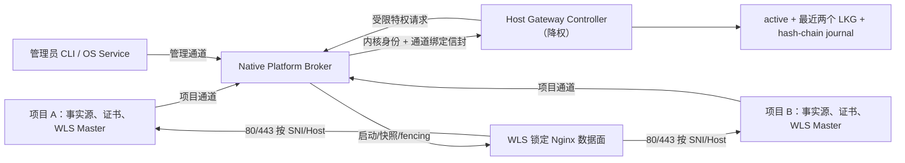

# WLS 2.0：多项目共享网关与自动恢复

## 1. 审查结论与开工门禁

| 项 | 结论 |
| --- | --- |
| 计划状态 | **READY FOR IMPLEMENTATION** |
| 源码状态 | **CHECKPOINT / NOT RELEASE-READY**；本文记录的 P0/P1 缺陷必须按任务修复 |
| 审查基线 | `master@91cc1b6f73848b489e8cbe4c9b8c0a9c4556e1be` |
| 协议 | `wls-edge/2` |
| 主模块 | `Weline_Server` |
| 协作模块 | `Weline_Websites`，仅通过已发布接口提供活动域名 |
| 任务记录 | `dev/ai/codex/tasks/2026-07-27/2026-07-27-0658-wls-2-0-gateway-plan-re-audit` |
| 未决产品决策 | `0` |
| 未决安全边界 | `0` |
| 未映射源码缺陷 | `0` |
| 当前工作区保护 | 不覆盖 `app/etc/env.sample.php` 的用户改动；不触碰三个 `.orig` 文件；不操作 9501 或未知 80/443 owner |

这里的 READY 只表示计划的公共行为、信任边界、状态机、失败语义、回滚和验收已闭合，不表示当前 WLS 2.0 检查点可发布。任何实现任务发现新的 P0、跨任务契约冲突或无法构造决定性验收证据时，必须暂停、把事实补回本文件，再继续后续任务。

本计划取代本文件此前所有版本；不得另建平行实施计划。实现阶段按 `TASK-000` 至 `TASK-014` 的依赖逐项完成、逐项验证、逐项标记。

## 2. 需求基线

### 2.1 编号需求

| ID | 必须满足的行为 |
| --- | --- |
| REQ-001 | 用户接口只暴露 `--edge=auto|gateway|wls`；优先级为 CLI > 已保存实例配置 > 环境配置 > `auto`。`--no-nginx` 和旧 `adapter=wls` 映射到 `edge=wls`；旧 `adapter=nginx` 保持 legacy，禁止静默提升。 |
| REQ-002 | `auto` 只能加入已由管理员安装、签名可信、协议兼容且 ready 的宿主网关；不得安装、升级、修复或接管未知服务。没有可信网关时立即启动纯 WLS 高端口。 |
| REQ-003 | `gateway` 必须成功加入可信网关，并达到 ACTIVE，或在首次签发时达到已鉴权的 `PENDING_CERTIFICATE/challenge-only`；其他失败干净退出。`wls` 完全不接触网关。 |
| REQ-004 | 宿主网关独立于任一项目，统一监听 80/443；引导项目停止、迁移或删除后，网关和其他项目继续运行。 |
| REQ-005 | 项目 UUID、域名期望状态、证书源、续签记录始终位于项目；宿主 enrollment、能力凭据、派生路由状态和证书快照不随项目迁移。 |
| REQ-006 | 单宿主允许多个项目，每个项目允许多个 WLS 实例。项目期望 generation 与实例租约 generation 分离，实例停止只移除自己的后端，不撤销项目。 |
| REQ-007 | 精确域名、通配符覆盖和跨项目冲突一律拒绝；域名转移必须使用管理员确认的原子 transfer。未知域名不得落到首个项目。 |
| REQ-008 | HTTPS 的 SNI 与 Host 必须解析为同一项目，否则返回 421；HTTP 未知 Host 返回中性 404，HTTPS 未知 SNI 返回中性 421。 |
| REQ-009 | 项目证书是唯一事实源。网关只通过安全读取器读取 enrollment 授权目录，验证后生成内容寻址快照；Nginx 只引用宿主快照。 |
| REQ-010 | ACME HTTP-01 只发布带过期时间的精确 challenge 租约；通配符必须走 DNS-01。无有效证书前不得开放普通 443 路由。 |
| REQ-011 | 网关发布采用 desired → candidate → active 事务；只有候选配置、Nginx 语法、真实路由探针和观察窗全部成功后，路由才成为 ACTIVE。失败保留上一代 active/LKG。 |
| REQ-012 | 心跳默认 10 秒，45 秒未续租进入 STALE，新请求 503；主动排空默认 300 秒；STALE 保留 24 小时；未被 active 或最近两个 LKG 引用的快照 7 天后回收。 |
| REQ-013 | 控制器故障但数据面正常时不得中断流量或触发项目降级；数据面持续故障时按接管、重启、配置回滚、全包二进制回滚、状态重建、熔断顺序恢复。 |
| REQ-014 | 项目数据面连续不可用 90 秒时，在同一 Master 内增加纯 WLS TLS 高端口监听；网关 ACTIVE 且连续健康 30 秒后切回，高端口排空 300 秒再关闭。 |
| REQ-015 | 未知程序占用 80/443 时绝不停止或修改该进程；`auto` 退纯 WLS并报告 `PORT_TAKEN`，显式 `gateway` 失败。 |
| REQ-016 | 生产网关必须由系统级服务管理：macOS LaunchDaemon、Linux systemd system unit、Windows Service。无法安装服务、验证权限、安全通道或安装 profile 要求的 IPv4/IPv6 80/443 时不得 ready。 |
| REQ-017 | A/B 槽覆盖稳定启动器之外的 Controller、Nginx、安全读取器和 manifest；升级必须影子验证、事务切槽、观察五分钟并可自动回退；旧槽健康保留至少 24 小时。 |
| REQ-018 | WLS 1.x 不自动注册。占用 80/443 的旧项目只有显式 `gateway:promote` 才能影子验证并进入公告过的短维护窗完成受控端口交接；失败自动恢复原项目。跨平台不得虚构绝对无缝的 socket 原子移交。 |
| REQ-019 | `server:stop {instance}` 只排空并注销本实例，不停止共享网关；`gateway:stop` 仅管理员可用，并写入持久停机意图，平台守护不得立即拉起。 |
| REQ-020 | `website_id=0/code=default` 是有效站点；构建路由时不得因假值判断丢弃。 |
| REQ-021 | H1、H2、SSE、WebSocket 的 reload/恢复/排空必须可证明；H3 只有真实 QUIC 通过才声明支持，H3 故障不得影响 H2/H1。 |
| REQ-022 | 网关与纯 WLS 各执行精确一百万次防假绿请求；多项目混合流量必须证明无串租户，且性能回归在同宿主基线阈值内。 |
| REQ-023 | enrollment 必须显式授权项目可注册的规范化域名集合/模式；持有项目凭据但未获域名授权的项目不能抢注域名、申请 challenge 或发起 transfer。 |
| REQ-024 | 网关必须清洗客户端伪造的 Forwarded/X-Forwarded-*、连接级 hop-by-hop 头和歧义 Host；后端只接受 loopback/受保护传输。重复 Host、CL/TE 歧义及请求走私载荷必须 fail closed。 |
| REQ-025 | WLS 2.0 v1 必须全局禁用 TLS session cache/ticket 和 0-RTT。仅用 per-route ticket key 不能作为 TLS 1.3 租户边界；同 SNI、跨 SNI 和证书 generation 变化后均必须重新握手。 |
| REQ-026 | 端口角色必须明确：gateway 后端只绑定 loopback 的实例端口；纯 WLS 的显式 `-p` 是公开端口且冲突即失败；未显式指定时才使用 UUID 稳定高端口分配。 |
| REQ-027 | 宿主 A/B 槽必须自包含 Controller 应用及其锁定运行时、锁定 Nginx、安全读取器和签名 manifest；删除/迁移最初安装它的项目后仍能独立启动和恢复。 |
| REQ-028 | 管理员 revoke、域名 transfer 和凭据失效必须写入单调安全墓碑；任何 LKG、journal replay 或旧实例 heartbeat 都不能复活已撤销的项目、域名、凭据或证书引用。 |
| REQ-029 | `auto` 在纯 WLS 高端口运行时必须以退避方式继续发现可信网关；加入并连续健康后按 30/300 秒切回。`wls` 不启动发现器；`gateway` 只在首次启动失败时退出，已成功运行后的数据面故障仍按 90 秒降级。 |
| REQ-030 | 任一时刻只能有一个持有 OS 锁和单调 fencing token 的 Controller 发布配置、操作 Nginx 或写 active pointer；旧 Controller、旧槽和网络/进程延迟消息必须被拒绝。 |
| REQ-031 | 未知/缺失 SNI 使用不含任何租户域名的宿主中性证书并在诊断客户端中返回 421；普通校验客户端可能先证书失败，文档不得承诺一定看到 421。IPv6 默认必需但可由管理员显式声明 IPv4-only；H3 的 UDP 443 是独立能力，失败只关闭 H3。 |
| REQ-032 | 发布事务必须持久化 `PREPARED → SHADOW_VERIFIED → ACTIVATING → COMMITTED` 阶段；Controller 在任一指令点崩溃后，必须以 journal、active pointer、Nginx owner generation 和墓碑对账，确定继续提交或回滚，不能盲目 adopt。 |
| REQ-033 | 项目 UUID、desired digest/generation 和 certificate generation 必须由项目锁保护并原子持久化；同摘要复用 generation，变更才 CAS 递增。缺失且项目配置只读时 fail fast，不得生成临时身份或把 generation 退回 1。 |
| REQ-034 | `auto` 从 native 高端口加入网关时，必须在同一 Master 先增加独立 loopback H1 backend、完成身份验证与 ACTIVE，再排空 native TLS；加入失败保留 native TLS 并撤销临时 backend。任何阶段都不得把 TLS public listener 直接注册为明文 backend。 |
| REQ-035 | 纯 WLS 和 fallback 只能使用项目已验证并原子激活的证书 generation；没有有效证书时不得开放生产 TLS 或生成隐式自签名证书。网关首次签发可只开放精确 ACME challenge，取得有效证书后再转 ACTIVE/443。 |
| REQ-036 | 高端口入口沿用实例显式 public bind；未显式配置时安全默认 loopback，不能因降级自动扩大到所有网卡。WLS 只报告实际 bind、可用域名:端口和 DNS/防火墙/LB 限制，不自动修改网络策略。 |
| REQ-037 | host_gateway scope 的每个 loopback backend 必须在业务路由前验证按 gateway epoch + master launch 绑定的内部能力；Nginx 必须覆盖客户端同名头，WLS 校验后剥离。缺失、跨实例、旧 epoch 或公网伪造能力一律拒绝。 |
| REQ-038 | 同项目多实例默认采用一个确定性首选 backend + 健康热备；只有项目声明且运行时证明 stateless/shared-session capability 时才允许多 backend 分流。已发送的非幂等请求不得因 upstream 切换自动重放。 |
| REQ-039 | ENOSPC、inode/配额耗尽或只读状态盘不得破坏 active/LKG 或触发重启循环；网关进入 `DISK_PRESSURE`，拒绝新持久操作但保持已验证数据面，并通过有界日志轮转、快照配额和预留恢复空间可诊断。 |
| REQ-040 | lease、健康连续失败、观察窗、排空、熔断和退避使用 monotonic clock；证书有效期和协议 timestamp 使用经合理性检查的 wall clock。时钟前后跳不得让所有租约误过期或绕过重放窗口。 |

### 2.2 v1 信任边界

- 支持：同一物理/虚拟宿主、同一管理员控制的 OS 信任域、项目根目录可由管理员授权读取。
- 不声称支持：彼此敌对的同 UID 项目、跨用户强隔离、跨容器无共享命名空间、跨宿主高可用。
- 跨用户或容器必须在后续 2.x 通过专用 broker、ACL 和只读共享卷设计；v1 遇到此部署形态必须 fail closed，不得退回共享 token。
- 单机自动恢复不能解决宿主断电、宿主网络或磁盘整体故障；无感 80/443 高可用属于后续多宿主网关。

### 2.3 明确不在范围

- 跨项目路径路由。
- 自动修改 DNS、防火墙或外部负载均衡。
- 自动终止系统 Nginx、Apache、容器代理或其他未知端口 owner。
- 普通项目自行升级共享网关。
- 把宿主注册状态写回项目并随项目迁移。
- 把第二个完整 WLS Master 当作 fallback。

## 3. 源码事实与历史证据

### 3.1 已验证事实

| 证据 | 当前事实 | 计划约束 |
| --- | --- | --- |
| E-001 | `EdgeAdapterResolver` 当前只有 `nginx|wls` | 共享网关是 `nginx` 数据面之上的 `host_gateway` scope，不新增第三种 adapter |
| E-002 | `Start` 的 `gateway.mode` 未传入 `ServiceContext` 的 `wls.edge.mode` | TASK-001/005 必须用一个强类型运行时契约消除重复配置树 |
| E-003 | `GatewayStartupDecision(auto)` 可调用 `GatewayHostManager::prepare()` | TASK-001 禁止普通 start 隐式安装、升级或修复宿主服务 |
| E-004 | 当前没有 `server:gateway:install`；直接 `status` 可运行，但 `bin/w list` 未列出 gateway 命令 | TASK-003/007 增加显式安装并验收命令发现 |
| E-005 | `GatewayClient` 使用一个全局 `control.token` 认证项目和管理员操作 | TASK-004 拆分管理通道与项目通道，最小权限 |
| E-006 | register 会自动 enroll；Controller 也会在缺失时创建 enrollment | TASK-004 中 register 永不 enroll，enroll 必须管理员显式执行 |
| E-007 | `peer_identity` 由客户端声明；Windows 当前回退 loopback TCP | TASK-004 使用真实 UDS peer credential 或 Named Pipe SID/DACL |
| E-008 | `projectUuid()` 仍由项目路径 hash 派生 | TASK-001 写入可迁移随机 UUIDv4 |
| E-009 | fallback 启动第二个 `server:start gateway-fallback-*` | TASK-009 改为同 Master 补充 TLS worker/listener |
| E-010 | 高端口探测后关闭 socket 再写 lease | TASK-009 使用宿主锁、保留 socket/bind handoff 和重试 |
| E-011 | Agent 在控制器异常时仅以 80/443 TCP 可连接判断数据面健康 | TASK-005/008 使用 SNI+Host+证书摘要+后端 nonce 的真实探针 |
| E-012 | Controller 的 backend probe 只 TCP connect，未验证项目/实例身份 | TASK-005 增加 loopback 鉴权身份端点和全链路 sentinel |
| E-013 | register 先改 state/route、忽略 publish false，并提前返回 ACTIVE | TASK-006 实现事务发布和 `PENDING_PUBLICATION` |
| E-014 | `projects` 以项目 UUID 单键覆盖，多个实例会互相替换/注销 | TASK-005 分离项目期望状态和实例后端租约 |
| E-015 | 当前 platform supervisor 是用户级 LaunchAgent/systemd user，Windows unavailable | TASK-003 使用三平台系统级服务；缺能力不得 ready |
| E-016 | LKG 配置回滚未同步 active generation；快照 GC 未保留最近两个 LKG 引用 | TASK-008 使用完整 generation bundle 和引用闭包 |
| E-017 | 当前 journal 仅追加，无序列 hash-chain、fsync 和确定性重放 | TASK-008 增加可校验日志与损坏隔离 |
| E-018 | inactive slot 安装时先翻 active pointer，平台服务仍直接指向旧 Controller | TASK-010 使用稳定启动器、pending slot 和全包切换 |
| E-019 | 现有 realpath/lstat 证书读取仍有 TOCTOU | TASK-003/006 引入原生安全读取器；缺失时网关不 ready |
| E-020 | `gateway:stop` 只退出 Controller，会被 KeepAlive/Restart 拉起 | TASK-010 持久 stop intent 并调用平台服务管理 |
| E-021 | 旧 Gateway 文档仍写“已退役”，与当前检查点冲突 | TASK-012 只在行为验收后统一文档 |
| E-022 | `app/etc/env.sample.php` 存在用户改动，模块 env 与根 env 不能覆盖式同步 | TASK-000/012 采用精确 hunk 合并并先停下报告重叠 |

### 3.2 既有负载证据只作基线

上一轮隔离测试已经得到：

- 手工运行 Agent 的网关数据面：`1,000,000/1,000,000` HTTP 200、0 错误、5,442.61 req/s、平均 18.356 ms。
- 纯 WLS：`1,000,000/1,000,000` HTTP 200、0 错误、26,062.80 req/s、平均 3.830 ms。
- 系统 `ab` 曾在 TLS 1.3 握手失败、返回 0 字节时报告“成功”，已证明不能作为唯一工具。
- 纯 WLS 的 H2 能力测试实际协商为 HTTP/1.1，不能把“配置声称支持”当作 H2 通过。
- 自动 Agent 未启动，route 在 45 秒后由 ACTIVE 转 STALE，公开入口返回 503。

这些数据证明两个数据面在特定手工条件下能完成百万请求，也同时证明生命周期、协议协商和测试断言存在缺陷。它们不能替代 TASK-013/014 的最终验收。

## 4. 缺陷分级、根因与归属

| ID | 等级 | 缺陷/风险 | 根因 | 修复任务 |
| --- | --- | --- | --- | --- |
| DEF-001 | P0 | 项目可用共享 token 执行 stop/upgrade/revoke | 管理操作与租户操作没有权限域 | TASK-004 |
| DEF-002 | P0 | 同 UID 客户端可伪造 peer identity | 信任客户端字段而非内核对等身份 | TASK-003/004 |
| DEF-003 | P0 | 自动 register 等于自动 enroll | enrollment 与期望状态混为一体 | TASK-004 |
| DEF-004 | P0 | 普通 `auto` 启动会安装宿主服务 | 发现、安装、加入三个动作没有分离 | TASK-001/003 |
| DEF-005 | P0 | Agent 没有随 Master 自动启动 | `gateway.mode` 与 `wls.edge.mode` 配置树错位 | TASK-001/005 |
| DEF-006 | P0 | fallback 启动第二个完整 Master | 缺少同 Master 动态监听控制面 | TASK-009 |
| DEF-007 | P0 | register 发布失败仍返回 ACTIVE | desired、candidate、active 共用可变状态 | TASK-006 |
| DEF-008 | P0 | A/B 只切 Nginx，Controller 不切且不能可靠回滚 | 无稳定启动器和 pending/active 事务 | TASK-010 |
| DEF-009 | P0 | 证书读取可发生符号链接/路径替换 TOCTOU | PHP 路径校验不是 no-follow 文件句柄读取 | TASK-003/006 |
| DEF-010 | P0 | 端口可连被误认为项目路由健康 | 健康检查不是租户特定的端到端探针 | TASK-005/008 |
| DEF-011 | P1 | 项目路径变化导致身份变化 | UUID 从路径 hash 派生 | TASK-001 |
| DEF-012 | P1 | 同项目多实例互相覆盖和误注销 | 状态只按项目 UUID 建模 | TASK-005 |
| DEF-013 | P1 | 端口租约存在探测到绑定的竞争窗口 | probe 后释放 socket | TASK-009 |
| DEF-014 | P1 | 控制器重启/状态损坏 epoch 语义不清 | 没有 clean restart 与 reconstruction 区分 | TASK-008 |
| DEF-015 | P1 | LKG 配置、路由、证书引用和 generation 不一致 | LKG 不是完整不可变 bundle | TASK-008 |
| DEF-016 | P1 | 快照 GC 可能删除 LKG 证书 | GC 只追踪 current routes | TASK-008 |
| DEF-017 | P1 | journal 无法证明完整重放 | 无序列、hash chain、fsync、截断规则 | TASK-008 |
| DEF-018 | P1 | 用户级守护不能可靠管理开机 80/443 | 平台集成层级错误 | TASK-003 |
| DEF-019 | P1 | gateway stop 被平台自动重启抵消 | 无持久管理员停机意图 | TASK-010 |
| DEF-020 | P1 | stop 后端可能先退出，现有长连接被截断 | drain 没有 active connection/request 反馈闭环 | TASK-007 |
| DEF-021 | P1 | 通配符匹配、SNI/Host 同项目语义不完整 | 字符串比较代替规范化路由解析 | TASK-006 |
| DEF-022 | P1 | ACME challenge 可能被当普通代理路径 | 未建模最小 challenge 租约 | TASK-006 |
| DEF-023 | P1 | 单线程 Controller 被证书复制/发布阻塞 | 重操作同步执行且无 coalesce | TASK-006/008 |
| DEF-024 | P1 | 未限制项目、路由、请求和更新频率 | 缺少本地 DoS 与 reload storm 门禁 | TASK-004/006 |
| DEF-025 | P1 | 命令能直接执行但未出现在命令列表 | 命令发现/元数据未纳入验收 | TASK-007 |
| DEF-026 | P1 | 文档与当前行为互相冲突 | 文档仍保留 Gateway 退役时代语义 | TASK-012 |
| DEF-027 | P1 | H2/百万测试可能假绿 | 只看工具退出码/请求数，未断言 ALPN、body、租户和字节 | TASK-013/014 |
| DEF-028 | P2 | 当前实现会把 user-home/test override 当生产信任根 | 生产路径和测试路径没有强隔离 | TASK-003 |
| DEF-029 | P2 | `website_id=0` 可能被假值过滤 | 默认站点边界未成为路由断言 | TASK-006/013 |
| DEF-030 | P2 | 当前检查点可能被误认作完整 2.0 | manifest 没有实现等级/能力与组件摘要 | TASK-003/010 |
| DEF-031 | P0 | 已 enrollment 项目可抢先注册未获授权的其他域名 | enrollment 未约束域名能力 | TASK-004/006 |
| DEF-032 | P1 | TLS session/ticket 可能跨租户或证书 generation 复用 | 会话恢复隔离与 0-RTT 边界未定义 | TASK-002/006 |
| DEF-033 | P1 | 伪造代理头、重复 Host 或 CL/TE 歧义可污染身份/路由 | edge 到 backend 的规范化边界未纳入契约 | TASK-002/006 |
| DEF-034 | P1 | `-p` 在 gateway backend、纯 WLS public 和 fallback 中可能语义漂移 | 端口角色和显式冲突行为未闭合 | TASK-001/009 |
| DEF-035 | P2 | legacy promote 被过度承诺为跨平台绝对原子交接 | 现有端口 owner 未必支持句柄继承/socket activation | TASK-011 |
| DEF-036 | P0 | 删除引导项目可能使 Controller 脚本、autoload 或 PHP 运行时消失 | 宿主槽未定义为真正自包含发行包 | TASK-003/010 |
| DEF-037 | P0 | revoke/transfer 后配置回滚可能复活旧路由或私钥引用 | LKG 缺少不可逆安全墓碑覆盖层 | TASK-006/008 |
| DEF-038 | P1 | auto 高端口降级后可能永久停留，网关恢复也不回切 | 缺少低频可信发现器和重入状态机 | TASK-005/009 |
| DEF-039 | P0 | 升级/重启交叠的两个 Controller 可能同时发布和操作 Nginx | 缺少 OS singleton lock 与 fencing token | TASK-003/008/010 |
| DEF-040 | P2 | 未知 SNI 的 421、IPv6 与 H3 readiness 容易被过度承诺 | TLS 握手和可选地址族/UDP 能力边界未写清 | TASK-003/006/013 |
| DEF-041 | P0 | Nginx 已切 candidate 但 Controller 在 active pointer 前崩溃时状态分叉 | 发布阶段没有持久化和启动对账规则 | TASK-006/008 |
| DEF-042 | P0 | 多实例/重启后项目与证书 generation 可能竞争、回退或丢失 | 项目侧没有锁保护的 generation 事实源 | TASK-001/005/006 |
| DEF-043 | P0 | auto 高端口实例发现网关后没有可注册的明文 loopback backend | native→gateway 的同 Master 拓扑转换未建模 | TASK-005/009 |
| DEF-044 | P0 | “gateway 必须 ACTIVE”与无证书项目先完成 ACME 的流程互相阻断 | 首次签发受限 ready 状态和无证书 fallback 语义未定义 | TASK-006/007/009 |
| DEF-045 | P1 | 自动高端口降级可能意外把 loopback 项目暴露到所有网卡 | fallback bind 与报告语义未定义 | TASK-001/009 |
| DEF-046 | P0 | 本机进程可绕过 Nginx 直接请求 loopback WLS backend | backend 只有端口隔离，没有逐实例入口能力校验 | TASK-005/006 |
| DEF-047 | P1 | 多实例轮询可能破坏本地 Session 或重复非幂等写请求 | backend pool 未定义 affinity/capability/retry 策略 | TASK-005/006 |
| DEF-048 | P1 | 磁盘/ inode 耗尽可能截坏状态并触发恢复循环 | 原子写入未定义 ENOSPC 安全态、配额和恢复预留 | TASK-006/008/012 |
| DEF-049 | P1 | wall clock 跳变可能让租约、熔断或防重放误判 | 持续时间与绝对时间没有分时钟域 | TASK-004/005/008 |
| DEF-050 | P1 | auto 加入网关后原生 TLS deadline 已过仍长期存活 | Agent 单次发送 drain，Master 没有可重试、重启安全的完成阶段 | TASK-005/007/009 |
| DEF-051 | P1 | 原生 Worker 在 `desired=0` 后仍被断线/健康恢复复活 | 复活入口和执行队列没有统一检查当前期望槽位 | TASK-005/009 |
| DEF-052 | P1 | 公网已由网关服务，但项目 endpoint/status 仍报告旧 `GATEWAY_UNAVAILABLE` | 缺少经认证健康观察到项目运行时投影的原子转换 | TASK-005/007/012 |
| DEF-053 | P1 | `server:benchmark --instance` 把网关接管项目误判成无 Worker/纯 WLS | 目标解析、就绪门禁和前后运行时指纹固定绑定普通 Worker | TASK-013/014 |
| DEF-054 | P2 | 原生入口关闭后状态仍显示旧高端口 fallback | 状态展示没有区分 native drain、supplemental fallback 和 gateway active | TASK-007/012 |
| DEF-055 | P1 | 原生入口 `DRAINED` 后普通 Worker 每分钟从 0 扩回 8 | MemoryPressureController 未受持久 native-edge 接管状态约束，且启动/整组重启/手工扩容存在同类旁路 | TASK-005/009 |
| DEF-056 | P1 | 网关启动时已健康的项目被 Benchmark 错误要求 `gateway_backend` | Benchmark 以 `mode=gateway` 代替 endpoint 回源拓扑判断；正常 gateway-start 使用普通 Worker，auto rejoin 才使用 join backend | TASK-013/014 |
| DEF-057 | P1 | Worker 私有端口可能落入 Linux 临时端口区间并被客户端源端口抢占 | 未把主/控制/maintenance/surge 与平台 ephemeral 边界统一纳入分配 | TASK-005/009 |
| DEF-058 | P1 | 长管理事务成功后被 PHP/Windows Broker 误报超时 | 管理发布观察窗大于通用短 I/O 窗口 | TASK-004/007/010 |
| DEF-059 | P0 | revoke 后租约扫描可能把 `REMOVED` 路由重新选后端并复活 | 后端选择路径没有统一应用不可逆项目墓碑 | TASK-006/008 |
| DEF-060 | P1 | enrollment 已授权多实例能力，但真实项目永远只能首选+热备 | registration 只读取 endpoint hint，生产启动没有写入者，也没有认证 Session 证明 | TASK-005/006 |
| DEF-061 | P1 | 两个 stateless 实例在心跳中交替递增项目 generation 并重写派生状态 | 实例 generation-bound 证明摘要被错误混入项目共享 desired digest | TASK-005/006 |
| DEF-062 | P1 | 项目 generation 收敛后，其他实例可能长期保留旧 Session 能力身份 | heartbeat 未携带 instance digest，Controller 无法要求该实例重放完整 register | TASK-004/005 |
| DEF-063 | P2 | 原生 H3 恢复验收偶发把安全降级或手工租约过期误判为产品失败 | 夹具缓存旧 `h3_enabled` 且故障注入期间未模拟真实 Agent 心跳 | TASK-013 |
| DEF-064 | P0 | 两个实例各自证明 shared Session 后，即使实际连接不同 Session 服务仍可能同时分流 | 分流判定只比较能力模式，没有校验证据完整性及跨实例证据摘要一致性 | TASK-005/006 |
| DEF-065 | P1 | 同项目不同实例的能力观测交替推进 project generation，触发反复 register/reload | 实例租约能力被错误写入项目 shared desired digest，stateless 还写项目恢复状态 | TASK-004/005/006 |

所有已确认缺陷均有任务、验证和回滚归属；没有“实现时再决定”的安全或状态机空白。

## 5. 最终架构与协议契约

### 5.1 三层结构



- 项目级：Master、项目 UUID、域名/证书期望状态、实例租约、纯 WLS fallback。
- 原生 Platform Broker：由系统服务启动，持有 UDS/Named Pipe、真实 peer identity、singleton/fencing、受 manifest 限制的 Nginx 启动和安全证书快照；不理解项目路由策略。
- 宿主 Controller：以专用低权限身份执行能力授权、路由合并、候选发布、恢复决策和审计；只通过 broker 的窄协议申请特权动作。
- Nginx 数据面：只处理公开协议、TLS、路由、排空；不成为项目事实源。

### 5.2 adapter、mode 与 scope

| 维度 | 值 | 语义 |
| --- | --- | --- |
| adapter | `nginx` | WLS 提供 loopback H1 后端，TLS 在 Nginx |
| adapter | `wls` | WLS 原生 TLS/H2/H1 |
| mode | `auto` | 只加入可信 ready 网关；否则纯 WLS高端口 |
| mode | `gateway` | 必须加入可信 ready 网关，否则失败 |
| mode | `wls` | 不发现、不读取、不操作网关 |
| scope | `project_legacy_nginx` | 旧项目级受管 Nginx，保持兼容直到 promote |
| scope | `host_gateway` | 宿主级共享 Nginx |
| scope | `native` | 纯 WLS |

强类型 `EdgeRuntimeDecision` 是唯一运行时事实，`Start`、`MasterProcess`、Provider、status 和 endpoint schema 均读取它，不再各自拼接 `gateway`/`edge` 数组。

### 5.3 启动决策

1. 解析 CLI/实例/env/default，生成不可变 decision。
2. `wls`：选择稳定高端口并启动原生 TLS，不读取宿主网关目录。
3. `auto`：
   - 只读取固定系统信任路径的签名 manifest；
   - 验证 host id、版本、协议 min/max、安全 profile、组件摘要、服务状态、控制通道和 profile 要求的 IPv4/IPv6 端口；
   - ready 时先启动 loopback WLS，再由同一 Master 的 Agent 异步注册，并等待 bounded route ACTIVE；
   - 不存在、不可信、不兼容或未 ready 时，在项目有有效 active/previous-valid 证书时直接启动同 Master 纯 WLS高端口；无有效证书则以 `TLS_CERTIFICATE_UNAVAILABLE` 失败并给出签发前置；
   - 注册超时/失败时切到同 Master fallback，不把半注册状态报告为成功。
4. `gateway`：同样验证，但任一失败均清理本实例并非零退出。
5. `auto` 与 `gateway` 均不得调用 install/upgrade/repair/promote。

### 5.4 固定宿主路径与平台前置

| 平台 | 状态/包根 | 控制通道 | 服务 |
| --- | --- | --- | --- |
| Linux | `/var/lib/weline-gateway`，运行态 `/run/weline-gateway` | 两个 UDS；`SO_PEERCRED` | systemd system unit，最小 capability/权限 |
| macOS | `/Library/Application Support/WelineGateway`，运行态 `/var/run/weline-gateway` | 两个 UDS；`LOCAL_PEERCRED/getpeereid` | LaunchDaemon |
| Windows | `%ProgramData%\Weline\Gateway` | 两个 Named Pipe；DACL + client SID | Windows Service |

- 生产禁止 `WLS_GATEWAY_HOME` 改写信任根。
- 仅当 `WLS_GATEWAY_TEST_MODE=1`、全部公开端口高于 1024、状态根位于任务临时目录时允许测试 override；manifest 必须标记 test，生产 client 必须拒绝。
- 管理安装必须验证目录 owner/ACL、服务身份、组件摘要、profile 要求的 IPv4/IPv6 绑定和 Broker 安全能力；任一失败不写 ready。
- 权限分离必须可证明：安装/服务管理由管理员执行；原生 Platform Broker 是唯一特权常驻边界；Controller 以专用低权限身份持有派生状态；Nginx worker 无权读取项目源证书或管理凭据。不得让 Controller 以无限制 root/SYSTEM 权限运行。
- Broker 创建管理/项目端点并取得内核 UID/GID/PID 或 client SID，把通道绑定的不可伪造身份元数据转交 Controller；Controller 不能接受客户端自报的 peer identity。Broker 的安全快照接口只接受当前 enrollment id、预授权 root、源相对路径和目标 generation，不提供任意读/写/exec。
- 发行包按 OS/architecture 由 CI 构建，包含自包含 Controller 应用及锁定 PHP CLI 运行时、锁定 Nginx、原生 Platform Broker、许可清单和 manifest；生产安装不从项目目录执行 Controller，也不在目标宿主临时编译 native 组件。
- 极小稳定启动器位于 A/B 槽之外，只验证 slot manifest 并启动所选 slot 的 Broker；Broker 再降权启动 Controller。稳定启动器自身首次安装采用原子备份，普通 `gateway:upgrade` 不替换它。
- 下载包先验证固定上限、外部签名和内嵌 release public key，再逐项验证 manifest/hash/path/mode；禁止绝对路径、`..`、symlink/reparse entry。支持管理员提供离线签名包。
- release key 轮换必须由当前受信 key 签署新的 key set，并有可审计生效 generation；私钥只存在 CI/发行系统，不进入仓库或宿主包。
- IPv4+IPv6 是默认 profile；管理员可以显式安装 `ipv4-only` profile 并使 capability/status/manifest 一致。H3 另行检查 UDP 443，失败只把 H3 标为 unavailable，不使健康的 H2/H1 数据面 down。

### 5.5 身份、generation 与租约

- `app/etc/wls-project.json`：保存 schema、随机 UUIDv4、desired digest/generation，以及按 route/certificate id 的 pending/active/previous-valid digest+generation+项目相对源路径；首次创建及每次更新使用项目锁、临时文件、fsync、原子 rename，POSIX 0600；它随项目迁移。
- 多实例先在锁外计算规范化摘要，再在项目锁内 compare-and-swap：摘要未变返回现有 generation，摘要变化才递增并落盘。缺文件时只允许创建一次；配置只读则给出显式初始化命令并失败，不得使用路径 hash、随机临时 UUID 或回退 generation。
- enrollment：宿主管理员把 `(host_id, project_uuid, canonical_root, UID/SID, allowed_domains, allowed_cert_roots, capabilities)` 写入宿主凭据库；不写回项目。
- 同一 host 上相同 UUID 但不同 root/owner 必须拒绝；复制项目要显式 `project-id:rotate` 后再 enroll。
- `instance_id` 表示命名实例；`master_epoch/launch_id` 每次 Master 启动随机生成，旧进程不能续租新实例。
- generation 分离：
  - `project_desired_generation`：域名、策略、期望证书引用；
  - `certificate_generation`：证书源版本；
  - `instance_generation`：单实例后端和能力；
  - `route_generation`：Controller 合并后的候选路由；
  - `active_config_generation`：已完成探针并对外服务的不可变 bundle。
- 相同 generation+摘要重复提交成功；较低拒绝；相同 generation 不同摘要拒绝；较高串行/合并处理。

### 5.6 双通道权限模型

| 通道 | 身份 | 允许操作 |
| --- | --- | --- |
| 管理通道 | OS 管理员/服务 SID + 管理凭据 | install、enroll、revoke、transfer、routes-all、doctor、repair、upgrade、stop、promote |
| 项目通道 | 内核 peer 身份 + 每项目能力凭据 | register desired、renew cert、heartbeat instance、drain instance、unregister instance、own-status |

- 两个端点均由 Platform Broker 创建：POSIX 以 UDS mode/owner + `SO_PEERCRED`/`getpeereid` 取证，Windows 以 Named Pipe DACL + impersonation/token query 取 client SID；Broker 把已绑定身份转给 Controller。
- 管理凭据永不出现在项目可读目录。
- 项目凭据只授权一个 host/project/root/owner、允许的规范化域名集合和证书根；不能查询其他项目。管理员 enrollment 必须预览并确认 `allowed_domains`，后续新增域名先扩展 enrollment。
- 宿主签发的项目能力凭据保存在该宿主专属的项目 `var/wls/gateway/{host_id}.cred` 或 OS credential store，权限限定项目 owner；它属于宿主注册状态，不应提交或随项目迁移。v1 不声称隔离彼此敌对的同 UID 进程。
- 信封包含 `protocol`, `host_id`, `gateway_epoch`, `project_uuid`, `instance_id`, `master_epoch`, `generation`, `idempotency_key`, `timestamp`, `nonce`, `request_digest`。
- 通道绑定、响应 MAC、时间窗和 nonce 缓存共同防止重放与响应替换。
- request body 上限 4 MiB；未知字段按协议 minor 版本规则处理，安全字段不得静默忽略。
- `register` 永远不执行 enrollment。
- 防重放 timestamp 使用 wall clock 合理性门禁；nonce/idempotency 持久化提供第二层防护。宿主时钟超出管理员阈值时拒绝新的安全敏感变更并报告 `CLOCK_UNTRUSTED`，不停止已验证数据面。

### 5.7 多实例与路由状态

项目 desired state 和实例 backend lease 分开存储。Controller 只把身份探针通过、租约有效的实例合并为该项目 route backends；一个实例 unregister 不删除其他实例和项目 desired state。

- 默认按稳定 instance id 选择一个首选 backend，其余为热备；首选不健康时才切换。只有 registration capability 与实际 Session/Runtime 状态同时证明 `stateless` 或 `shared_session` 时，Controller 才生成多 backend 分流配置。
- upstream retry 只允许在尚未把请求体/业务请求发送给 backend 的连接建立阶段；POST/PATCH/PUT/DELETE 和流式请求一旦发送不得自动重放。SSE/WebSocket 断开由客户端重连，不在 gateway 内迁移连接。

```text
PENDING_BACKEND
  → PENDING_CERTIFICATE
  → PENDING_PUBLICATION
  → ACTIVE
  → DRAINING
  → STALE
  → REMOVED
```

- ACTIVE 必须对应 active bundle；不能只表示内存 state 已写入。
- 45 秒未续租的实例从后端池剔除；最后一个实例失效时路由进入 STALE 并返回 503，但保留 TLS/LKG。
- 缺失或未知 SNI 落到独立 default server：只使用宿主生成、无租户 SAN 的中性证书，不暴露任何项目证书/页面。诊断客户端在完成 TLS 后得到 421；正常证书校验客户端可能在 HTTP 前失败。
- 后端 loopback 身份端点只接受本机鉴权请求，返回 project UUID、instance、master epoch、launch id、generation 和一次性 nonce 签名。
- 全链路 sentinel 使用真实 SNI/Host、期望证书 digest、不可缓存 nonce，并验证响应项目/实例标记。
- 精确域名和通配符统一转小写 IDNA ASCII；通配符只覆盖一个左侧 label，不匹配 apex。
- route 中禁止端口、用户信息、路径、控制字符和 IP literal；请求 Host/`:authority` 只允许规范的可选端口后缀，去除尾点后按同一 IDNA 规则解析。重复或冲突的 Host/`:authority` 直接拒绝。
- `transfer --domain --from --to --confirm` 先验证目标 backend/cert，再在一个 active generation 内完成归属切换；中间不得双归属或落到默认站点。
- revoke/transfer 成功 generation 同时写入 security tombstone；后续 LKG 回滚只允许恢复仍被当前 enrollment 授权且未被墓碑覆盖的条目。

### 5.8 事务发布和限流

1. Controller 验证信封、权限、配额和 generation，把请求与幂等结果槽 fsync 到 desired journal。
2. 重操作进入 bounded queue，返回 `operation_id`；客户端按 bounded timeout 查询自身操作。
3. coalescer 生成不可变 candidate bundle：Nginx 配置、route snapshot、certificate refs、binary slot；写 `PREPARED`。
4. 运行 `nginx -t`，在 loopback 高端口 shadow Nginx 上执行受影响路由的真实 SNI/Host/cert/backend 探针和至少 15 秒观察；成功写 `SHADOW_VERIFIED`。
5. 写 `ACTIVATING` 后才让 Broker 平滑 reload 公共 Nginx；验证公开 generation、逐路由 probe 和进程身份，成功后原子切换 active pointer并写 `COMMITTED`，此时才返回 ACTIVE。
6. 任一失败保留或恢复旧 active，candidate 标记失败并带精确阶段；不得把 desired 内存状态当 active。
7. 启动时对账 journal phase、active pointer、Nginx owner generation、fencing token 和 security tombstone：公共 Nginx 仍在 candidate 时，只能在重复公开探针成功后完成 commit，否则回滚旧 bundle；没有证据时 fail closed 到 LKG TLS/503。

默认可配置限额：

- 128 个项目；每项目 256 条路由；宿主总路由 2048。
- 每路由最多 16 个后端。
- 单证书链/私钥输入各不超过 1 MiB；控制请求不超过 4 MiB。
- 每项目更新 1 次/秒、burst 5；全局发布最多 2 次/秒、debounce 250 ms。
- 异步队列最多 1024；满时返回明确 retry-after，不丢弃已接受操作。
- 状态盘为每项目快照、全局 journal/candidate/log 设置管理员可调硬限额，并保留只供 rollback/tombstone 的恢复空间；达到阈值先 GC 无引用对象，再以 `DISK_PRESSURE` 拒绝新操作，绝不覆盖 active/LKG。

数据面边界：

- Nginx 删除客户端提供的 `Forwarded`、`X-Forwarded-*` 和内部身份/探针头，只写入网关规范化值；hop-by-hop 头按 H1/H2 规则处理。
- 重复 Host、Host/`:authority` 冲突、多个 Content-Length 不一致、Content-Length 与 Transfer-Encoding 歧义以及非法 header name/value 均在 edge fail closed，不转发到 WLS。
- 后端业务监听与身份端点只绑定 loopback；内部探针头使用每个 active generation 的短期密钥并包含 nonce，公网客户端不能构造有效 sentinel。
- host_gateway backend 在 HTTP 解析后、业务路由前验证逐实例入口能力；能力绑定 project/instance/master launch/gateway epoch，并由 Nginx `proxy_set_header` 强制覆盖客户端值。验证后从应用可见 headers 中删除；缺失、旧 epoch、跨实例和公网直连均返回中性拒绝。
- WLS 2.0 v1 全局关闭 TLS session cache、session ticket 和 0-RTT。真实 OpenSSL
  TLS 1.3 验证已经证明 per-route ticket key 仍可能跨虚拟主机恢复，因此 v1 不把
  Nginx/OpenSSL 会话恢复作为租户隔离边界；同 SNI、跨 SNI 和证书 generation 变化
  后都必须重新握手。后续版本若重新启用，必须先提供独立 TLS context 的实机证明。

### 5.9 证书与 ACME

- 默认源目录 `app/etc/ssl`；额外目录只能由 enrollment 授权。
- 协议中的证书位置使用 `(root_alias, relative_path)`，默认 alias 为 `project_ssl`；项目不提交宿主绝对路径。enrollment 把 alias 映射为本宿主 canonical root，Broker 只在该 root 下解析相对路径，因此项目迁移后可在新宿主重新映射而不改变证书事实。
- 宿主包的原生 Platform Broker 必须实现 `SecureFileSnapshotReader` 窄操作：
  - Linux 使用 `openat2(RESOLVE_BENEATH|RESOLVE_NO_SYMLINKS)`；
  - macOS 逐组件 `openat/O_NOFOLLOW` 并 `fstat`；
  - Windows 使用拒绝 reparse point 的 `CreateFile` 并校验最终路径/ACL。
- Broker 安全快照能力缺失、摘要不匹配或平台能力不足时网关不得 ready。
- 校验证书与私钥匹配、SAN、规范化精确/通配符语义、notBefore/notAfter/续签窗口、算法强度、chain、大小、POSIX mode/Windows ACL。
- SAN 存在时不得回退 CN；仅 SAN 缺失时才按兼容策略检查 CN。
- 读取前后校验句柄身份、大小和 digest；不一致拒绝发布。
- 快照按内容摘要命名，私钥 POSIX 0600/Windows 限服务 SID，原子落盘；Nginx 只读快照。
- 无效新证书不能替换当前 TLS context。
- 项目证书管理器先把 renewal 写入 pending 源文件，完成同一套验证后才 CAS 提升 active generation；previous-valid 在新 generation 稳定前保留。纯 WLS、fallback 和 gateway registration 都只读取 active generation，保证项目离开宿主后仍能使用同一证书事实源。
- HTTP-01 使用 `(domain, token, keyAuthorization, generation, expiry)` 的认证租约生成精确 `location =` 响应，不泛化代理 challenge 目录；wildcard 使用 DNS-01。
- 项目续签在本地待确认队列保留，网关恢复后按 generation 幂等重放。
- 首次没有 active 证书时，可信网关只允许 `PENDING_CERTIFICATE/challenge-only`；普通 443 route 不生成。纯 WLS/auto fallback 无有效 active 或 previous-valid 时返回 `TLS_CERTIFICATE_UNAVAILABLE` 并停止该公开入口；只有显式 test profile 可使用标记为 test 的自签名证书。

### 5.10 恢复、LKG 与 epoch

每五秒执行核心检查；每条 ACTIVE 路由至少每 60 秒执行一次完整数据面探针。

所有“持续 N 秒/窗口内 N 次”使用 monotonic clock；wall clock 只用于证书、审计显示和协议时间窗。宿主重启后运行中 lease 默认失效并等待项目重注册，但 LKG TLS/503 可恢复。

- `CONTROL_DEGRADED`：Controller/管理通道失败但 Nginx、公开 SNI/Host、证书和后端 sentinel 正常。保持数据面，只恢复 Controller。
- `DATA_PLANE_DOWN`：安装 profile 要求的公开 IPv4/IPv6、TLS、route sentinel 或 Nginx 身份失败。

恢复链：

1. Controller 重启后验证现有 Nginx PID、可执行文件摘要、slot 和 active generation；健康时无 reload 接管。
2. 连续三次核心数据面探针失败才重启清单中验证通过的 Nginx；绝不操作未知 PID。
3. 五分钟三次启动/探针失败时回退最近健康完整 bundle；reload 失败则以该 LKG 完整重启。
4. 升级后五分钟崩溃循环切回旧全包 slot。
5. 状态损坏时隔离文件，用 LKG route+cert 构建 TLS/503 隔离配置；rotate gateway epoch，等待项目重提完整期望状态，逐条恢复。
6. 十五分钟累计十次恢复失败进入熔断，最长五分钟指数退避；status 显示阶段、原因、active generation、slot、重试时间。

状态持久化：

- clean Controller restart 保持 epoch；状态重建、不可兼容恢复或管理员 rotate 才改变 epoch。
- Controller 必须先取得 OS singleton lock 和单调 fencing token；每次 journal/active pointer/Nginx owner 操作都带 token。新 Controller 接管后，旧 token 的进程和延迟操作只读失败，不得发布。
- 接管先执行发布事务对账；只有 `COMMITTED` generation 可直接 adopt。`ACTIVATING` generation 必须按 §5.8 完成探针或回滚，不能因端口可连而提升。
- bundle 包含 config、route snapshot、cert refs、binary slot 和健康证据摘要。
- 保留 active + 最近两个 LKG；GC 计算三者完整引用闭包。
- journal 带单调 sequence、previous hash、record hash、fsync；启动时验证、重放到最后完整记录，截断尾部半写，隔离中段损坏。
- 所有 state/candidate/tombstone 写入都采用同目录 temp、fsync(file)、原子 replace、fsync(directory)；ENOSPC/EROFS 时保留旧文件和预留恢复空间，进入 `DISK_PRESSURE` 而不是重启 Nginx。
- 管理员 revoke、credential rotation 和 domain transfer 另写单调 security tombstone。恢复任何 LKG 前先应用墓碑过滤；被撤销引用从新 active 和可回滚 bundle 中清除，相关明文快照在不再被安全配置引用后立即 unlink，并明确底层存储不保证物理擦除。

### 5.11 同 Master fallback

- 启动时没有可信网关：项目有有效证书时 `auto` 立即以纯 WLS 高端口成功，不等待 90 秒；无有效证书则 fail fast，不伪造 TLS。
- `auto` 的低频发现器使用指数退避和抖动，只验证固定信任根，不执行 install/repair；网关出现后走正常注册、ACTIVE 30 秒和 300 秒排空。显式 `wls` 不创建发现器。
- 发现可信网关后，ServiceOrchestrator 在同一 Master 内先创建逐实例唯一、仅 loopback 的 H1 backend worker，等待身份端点 ready 后才注册；route ACTIVE 连续 30 秒后停止 native TLS 接新连接并排空 300 秒。注册/发布失败则注销并排空临时 backend，现有 native TLS 不受影响。
- 运行中 ACTIVE route 的真实数据面连续失败 90 秒：Master 通过已鉴权的内部 Orchestrator 命令增加 supplemental TLS listener/worker；不创建第二个 Master、Session、Cron 或 sidecar。
- 端口在 20000–29999 依据 project UUID 稳定起点选择；宿主锁与保留 socket/bind handoff 消除 TOCTOU，冲突时有界重试。
- Controller 单独失败但数据面健康时不 fallback。
- `gateway` 模式首次加入/发布失败仍干净退出；一旦实例曾达到 ACTIVE，后续持续数据面故障允许 fallback，以保障已运行项目可用性，同时持续报告显式 gateway 期望未满足。
- 恢复 ACTIVE 且真实探针连续健康 30 秒后切回 80/443；高端口停止接新连接并排空 300 秒。
- status 输出 `DEGRADED_WLS`、精确 `https://host:port`、原因以及 DNS/防火墙/LB 不会自动切换的限制。
- 端口语义固定：gateway scope 的 WLS backend 端口只监听 loopback且逐实例唯一；`--edge=wls -p N` 把 N 作为显式公开端口，bind 冲突直接失败；`--edge=wls` 未给 `-p` 或 auto/fallback 才走 20000–29999 稳定分配。
- fallback bind 沿用实例显式 public host/address-family；没有显式 public bind 时只监听 loopback。status 分别显示 bind endpoint 与每个证书域名的 `https://domain:port`，不得把 `0.0.0.0`/`::` 当作可访问 URL，也不自动配置防火墙、DNS 或负载均衡。

### 5.12 stop、drain 与管理员停机

- 项目 stop 请求 drain ticket；网关停止把新请求分配给该实例，其余副本继续服务。
- Master 停止接收新请求，报告已鉴权的 active request/connection、SSE、WebSocket 计数。
- 计数归零后 unregister 本实例并退出；300 秒截止仍未归零时标记 forced、报告被终止连接数并以可区分结果结束。`--force` 必须显式。
- 项目 stop 永不 revoke project、stop/upgrade gateway。
- 管理员 gateway stop 先写入带签名的 `ADMIN_STOPPED` 意图，再由平台服务 stop/disable；Controller 和稳定启动器都必须尊重意图。再次 start 只能由管理员清除。

## 6. 计划修改矩阵

下列是实现允许触及的计划范围；发现需要范围外文件时先更新本矩阵。

| ID | 路径 | 计划修改 | 主要任务 |
| --- | --- | --- | --- |
| MOD-001 | `app/code/Weline/Server/Console/Server/Start.php` | 解析 mode、生成唯一 decision、禁止 auto 隐式安装 | TASK-001/007 |
| MOD-002 | `app/code/Weline/Server/Console/Server/Status.php` | 输出 edge scope、gateway/fallback/operation/recovery 状态 | TASK-007/012 |
| MOD-003 | `app/code/Weline/Server/Console/Server/Stop.php` | drain ticket、连接感知排空、实例级 unregister | TASK-007 |
| MOD-004 | `app/code/Weline/Server/Console/Server/Gateway/*.php` | 权限分层；新增 Install/Transfer；修复发现、帮助和退出码 | TASK-003/004/007/010/011 |
| MOD-005 | `app/code/Weline/Server/Service/MasterProcess.php` | 接收不可变 decision；同 Master supplemental TLS 控制 | TASK-001/009 |
| MOD-006 | `app/code/Weline/Server/Service/Contract/ServiceContext.php` | 去除重复 mode 来源，携带实例 epoch/launch id | TASK-001 |
| MOD-007 | `app/code/Weline/Server/Service/Provider/GatewayProvider.php` | 正确启停 Agent，不在数据面健康时触发 fallback | TASK-005/009 |
| MOD-008 | `app/code/Weline/Server/Service/ServerInstanceManager.php` | endpoint schema 增量字段、兼容旧记录 | TASK-001/007 |
| MOD-009 | `app/code/Weline/Server/Service/ServiceOrchestrator.php` | 管理 supplemental TLS worker/listener 的创建、身份、排空和退出 | TASK-007/009 |
| MOD-010 | `app/code/Weline/Server/IPC/ChildControl/` 与 `app/code/Weline/Server/bin/worker_ssl.php` | 增加 Master→SSL worker 鉴权监听/drain counters 控制消息；保持 epoch/launch/lease 校验 | TASK-007/009 |
| MOD-011 | `app/code/Weline/Server/Service/Edge/EdgeAdapterResolver.php` | 保持 `nginx|wls`，解析 scope/mode decision | TASK-001 |
| MOD-012 | `app/code/Weline/Server/Service/Edge/EdgeCertificateReloadService.php` | 统一 pending→active/previous-valid 证书验证、CAS promotion 与纯 WLS热更新 | TASK-001/006/009 |
| MOD-013 | `app/code/Weline/Server/Service/Edge/NginxEdgeAdapter.php` | 复用 host gateway scope，不自行持有宿主管理权 | TASK-001/002 |
| MOD-014 | `app/code/Weline/Server/Service/Edge/WlsNativeEdgeAdapter.php` | 原生 TLS 与 supplemental listener 共用证书 generation | TASK-009 |
| MOD-015 | `app/code/Weline/Server/Service/Edge/Nginx/ManagedNginx*.php` | 提取带进程身份、candidate、probe、LKG 的公共原语 | TASK-002 |
| MOD-016 | `app/code/Weline/Server/Service/Edge/Gateway/GatewayStartupDecision.php` | 纯发现/加入；删除 auto prepare 副作用 | TASK-001 |
| MOD-017 | `app/code/Weline/Server/Service/Edge/Gateway/GatewayHostManager.php` | 仅管理员 install/upgrade/promote 路径可调用 | TASK-003/010/011 |
| MOD-018 | `app/code/Weline/Server/Service/Edge/Gateway/GatewayPaths.php` | 固定系统路径、生产/测试根强隔离 | TASK-003 |
| MOD-019 | `app/code/Weline/Server/Service/Edge/Gateway/GatewayClient.php` | 双通道、能力凭据、响应认证、防重放、own-status | TASK-004 |
| MOD-020 | `app/code/Weline/Server/Service/Edge/Gateway/GatewayRegistrationBuilder.php` | 替换为 desired state + instance lease 构建器 | TASK-001/005 |
| MOD-021 | `app/code/Weline/Server/Service/Edge/Gateway/GatewayPortLeaseAllocator.php` | UUID 稳定端口、锁和保留绑定交接 | TASK-009 |
| MOD-022 | `app/code/Weline/Server/Service/Edge/Gateway/ProjectIdentityStore.php`（新增） | 项目锁、UUIDv4、desired/certificate digest+generation CAS 与显式 rotate | TASK-001/005/006 |
| MOD-023 | `app/code/Weline/Server/Service/Edge/Gateway/EdgeRuntimeDecision.php`（新增） | adapter/mode/scope 唯一运行时契约 | TASK-001 |
| MOD-024 | `app/code/Weline/Server/Service/Edge/Gateway/GatewayCredentialStore.php`（新增） | 项目能力凭据读取与约束 | TASK-004 |
| MOD-025 | `app/code/Weline/Server/Service/Edge/Gateway/GatewayProtocolEnvelope.php`（新增） | generation、nonce、摘要、响应认证 | TASK-004 |
| MOD-026 | `app/code/Weline/Server/Service/Edge/Gateway/GatewayDataPlaneProbe.php`（新增） | 真实 SNI/Host/cert/backend sentinel | TASK-005/008 |
| MOD-027 | `app/code/Weline/Server/Service/Edge/Gateway/HostGatewayPackageManager.php`（新增） | manifest、系统服务、稳定启动器、A/B 事务 | TASK-003/010 |
| MOD-028 | `app/code/Weline/Server/bin/wls_gateway_controller.php` | 双通道控制器、异步操作、状态机、恢复与审计 | TASK-004/005/006/008/010 |
| MOD-029 | `app/code/Weline/Server/env/gateway/`（新增） | 三平台服务模板、稳定启动器模板、package manifest schema 与受信 release keys | TASK-003/010 |
| MOD-030 | `app/code/Weline/Server/Service/Edge/Gateway/Native/`（新增） | 三平台 Platform Broker C 源码：双通道 peer identity、fencing、受限进程启动、安全快照和窄协议 | TASK-003/004/008/010 |
| MOD-031 | `.github/workflows/wls-gateway-package.yml`（新增） | 按 OS/arch 构建自包含 Controller runtime、Nginx、Platform Broker，生成 SBOM/hash/signature；不保存签名私钥 | TASK-003/010 |
| MOD-032 | `app/code/Weline/Server/etc/wls_services.php` | Provider 顺序、兼容条件和运行态契约 | TASK-001/005 |
| MOD-033 | `app/code/Weline/Server/etc/env.php` | 新配置默认值、限额、超时和明确兼容映射 | TASK-001/006/008 |
| MOD-034 | `app/etc/env.sample.php` | 仅在确认无用户 hunk 重叠后精确同步公开示例 | TASK-012 |
| MOD-035 | `app/code/Weline/Server/doc/README.md` | WLS 2.0 模式与当前发布状态 | TASK-012 |
| MOD-036 | `app/code/Weline/Server/doc/WLS-Gateway使用指南.md` | 安装、注册、迁移、恢复、限制 | TASK-012 |
| MOD-037 | `app/code/Weline/Server/doc/WLS启动与关闭链路图.md` | 启动/排空/fallback/恢复链 | TASK-012 |
| MOD-038 | `app/code/Weline/Server/doc/WLS-Nginx部署指南.md` | legacy/promote/host gateway 边界 | TASK-012 |
| MOD-039 | `app/code/Weline/Server/doc/AI-INDEX.md` | 只通过仓库规定的索引生成流程更新，不手改 | TASK-012 |
| MOD-040 | `app/code/Weline/Server/Service/Edge/Gateway/GatewayBackendCapability*.php`（新增） | generation-bound 声明、认证运行时证明、30 秒恢复状态与项目/实例投影 | TASK-005/006 |
| MOD-041 | `app/code/Weline/Server/Test/{Unit,Integration}/Service/Edge/Gateway/*Capability*Test.php` 与协议/数据面回归 | 能力伪造、generation、防抖、heartbeat 重放和跨实例 Session 一致性 | TASK-005/006/013 |

禁止修改 `generated/`，禁止用共享 token 兼容旧原型，禁止把安全读取降级为 `realpath()`，禁止为 fallback 启第二个 Master。

## 7. 实施任务与逐任务验收

### 7.1 依赖

| 任务 | 依赖 | 可并行 |
| --- | --- | --- |
| TASK-000 | 无 | 否 |
| TASK-001 | TASK-000 | 否 |
| TASK-002 | TASK-000 | 可与 TASK-001 的非重叠设计并行 |
| TASK-003 | TASK-001/002 | 否 |
| TASK-004 | TASK-001/003 | 否 |
| TASK-005 | TASK-001/004 | 否 |
| TASK-006 | TASK-002/004/005 | 否 |
| TASK-007 | TASK-005/006 | 否 |
| TASK-008 | TASK-002/003/006 | 否 |
| TASK-009 | TASK-001/005/007 | 否 |
| TASK-010 | TASK-003/008 | 否 |
| TASK-011 | TASK-002/003/006/010 | 否 |
| TASK-012 | 各行为任务完成后增量同步 | 可随已验收行为推进 |
| TASK-013 | TASK-001 至 TASK-011 | 否 |
| TASK-014 | TASK-013 | 否 |

### TASK-000：安全基线与环境门禁

- 前置：记录 HEAD、`git status --short`、相关文件摘要、80/443 owner、可用 PHP/Nginx/协议测试工具；检查当前任务没有运行中的 `ai-test-*`。
- 动作：
  1. 把 `91cc1b6f7` 作为检查点，不再执行旧计划的“隔离未提交原型”。
  2. 建立用户改动保护清单，尤其是 `app/etc/env.sample.php` 和 `.orig`。
  3. 修复或绕过项目智能索引的 `legacy project identity already migrated` 环境问题；失败只影响索引能力，不得伪报 WLS 失败。
  4. 为后续真实 80/443、三平台服务、重启测试准备隔离 VM/宿主；本机只用高端口测试模式。
- 验证：基线和保护清单写入任务记录；未知 80/443 owner 不被触碰；所有后续端口均是明确整数且不等于 9501。
- 停止条件：目标文件与用户改动重叠且不能精确合并；找不到隔离宿主却尝试宣称生产服务验收。
- 验收：环境分为“可本机高端口验证”和“必须隔离宿主验证”，没有模糊前置。

### TASK-001：edge 契约与稳定身份

- 影响审查：编辑每个现有符号前执行项目智能 impact；HIGH/CRITICAL 先报告。
- 动作：
  1. 引入 `EdgeRuntimeDecision`，统一 adapter/mode/scope/source/fallback reason。
  2. 修复 Start → Master → ServiceContext → Provider 的 mode 传播。
  3. 让 `auto` 只 discover/join，移除 prepare/install 副作用。
  4. 以项目锁和 CAS 原子创建/更新 `app/etc/wls-project.json` 的 UUIDv4、desired/certificate digest+generation，并建立 clone 冲突、只读 fail-fast 和 rotate 命令语义。
  5. endpoint schema 增加 project UUID、instance、master epoch、launch id、edge scope；旧记录读兼容。
  6. 固化 `-p`：gateway scope 为只绑定 loopback 的实例 backend；纯 WLS 显式端口是 public 且冲突即失败；未显式时才调用稳定高端口分配。
- 验证：
  - `--edge=wls` 不访问 gateway 路径；
  - `auto` 无网关时启动纯 WLS高端口且不产生宿主服务文件；
  - `gateway` 无网关时非零退出且无残留；
  - 移动项目目录 UUID 不变，复制到同宿主未 rotate 被拒绝；
  - 两个实例并发看到同摘要时取得相同 generation；内容变化只递增一次；重启/迁移不回退；
  - 缺 identity 且 `app/etc` 只读时明确失败，不产生临时 ID；
  - `--no-nginx` 等价 `edge=wls`；
  - 每个 gateway backend 只在 loopback 可达，纯 WLS 显式端口不被静默替换。
- 回滚：保留旧 endpoint reader，schema 只增量；decision 未贯通前不切默认行为。
- 验收：配置树只剩一个运行时事实源；缺陷表中归属 TASK-001 的全部断言通过。

### TASK-002：受管 Nginx 公共原语

- 动作：从 `ManagedNginx*` 提取可由 legacy 项目 Nginx 和 host gateway 共用的不可变安装、进程身份、candidate、原子 active pointer、reload、真实活性接口和完整 bundle rollback。
- 限制：不复制一套简化实现；不改变 legacy 默认行为；只操作 manifest 中 PID+exe digest+generation 全匹配进程。
- 验证：legacy Nginx 原有启动/reload/stop 回归；坏 candidate 不改变 active；未知同名进程不被操作。
- 回滚：公共原语可由旧适配器的兼容 facade 调用；失败恢复旧 active 配置。
- 验收：TASK-003/006/008 只依赖这套原语，没有平行进程管理器。

### TASK-003：宿主包、显式安装与平台服务

- 动作：
  1. 新增管理员命令 `server:gateway:install`，安装签名 manifest、稳定启动器、A/B 初始槽、安全读取器和系统服务。
  2. CI 生成按 OS/arch 的自包含签名包：Controller 应用、锁定 PHP CLI runtime、锁定 Nginx、原生 Platform Broker、SBOM；manifest 记录 host id、protocol min/max、security profile、implementation level、能力、组件摘要和签名。当前不完整检查点不能报告 release ready。
  3. 按 §5.4 实现固定路径、权限、UDS/Named Pipe 和三平台系统服务。
  4. 安装前验证 profile 要求的 IPv4/IPv6 80/443；未知 owner 时失败且不终止。
  5. Platform Broker 执行真实 peer identity、受限启动和 no-follow 句柄读取；Broker 不可用不 ready。
  6. Broker 取得 singleton lock/fencing token，降权启动 Controller，并生成独立 neutral default certificate。
- 验证：
  - 普通项目无法写状态根、管理通道或 service unit；
  - Broker/Controller/Nginx worker 的实际 UID/SID、ACL 和可读路径符合最小权限；
  - reboot 后服务恢复，项目尚未启动时 LKG TLS 可握手且后端 503；
  - 平台权限、Broker 安全能力或任一必需公开地址族失败，ready=false；
  - 测试 override 不能被生产 client 信任；
  - 删除安装它的项目后，宿主包仍可重启/接管；
  - 签名、archive traversal、symlink entry、组件 hash 或 SBOM 不一致的包拒绝；
  - 未知 SNI 不暴露租户证书，显式 IPv4-only/H3 capability 与实际监听一致。
- 回滚：安装失败删除本次未激活槽和未启用 service；已存在旧 owner 完全不变。
- 验收：Linux/macOS/Windows 各有决定性服务状态证据；缺陷表中归属 TASK-003 的全部断言通过。

### TASK-004：协议、鉴权与 enrollment

- 动作：实现双通道、真实 peer identity、每项目能力凭据、防重放、响应认证、幂等/generation、显式管理员 enroll/revoke、own-status 和配额前门。
- 负面要求：
  - 项目 token 调用 stop/upgrade/routes-all/enroll/revoke/transfer 必须拒绝且产生审计。
  - register 缺 enrollment 必须拒绝，不能自动创建。
  - root/owner/allowed domains/cert roots 与 enrollment 不一致必须拒绝。
  - 旧共享 `control.token` 不能作为兼容后门。
- 验证：
  - 伪造 UID/SID、重放 nonce、旧 timestamp、篡改 digest、跨项目 instance、较低 generation、同 generation 异摘要均被拒绝；
  - wall clock 前后跳不会绕过 nonce/idempotency；超出阈值进入 CLOCK_UNTRUSTED，已验证流量仍正常。
- 回滚：协议能力未完全启用前只允许管理员 doctor/status，不开放项目注册。
- 验收：最小权限和防重放矩阵全绿；缺陷表中归属 TASK-004 的全部断言通过。

### TASK-005：Agent、多实例租约与后端身份

- 动作：
  1. 让 GatewayProvider 在正确 decision 下随 Master 启动/停止 Agent。
  2. 分离项目 desired state 与 instance backend lease，按 master epoch 防旧进程续租。
  3. 增加 loopback 鉴权身份端点和公开全链路 sentinel。
  4. heartbeat 只更新租约，不能修改路由/证书。
  5. 控制器故障时以真实公开探针判断 CONTROL_DEGRADED。
  6. auto fallback 运行低频可信发现器，并协调同 Master native TLS → loopback backend → ACTIVE → TLS drain 拓扑转换；显式 wls 不运行。gateway 首次失败退出，达到过 ACTIVE 后允许运行时 fallback。
  7. 多实例能力由 Start 写入 generation-bound stateless 声明，或由项目侧对真实 WLS Session Server 做认证探针；Controller 逐实例绑定 endpoint 复核。能力失败立即隔离，恢复连续健康 30 秒后才允许重新分流。
- 验证：
  - 单项目两个实例同时 ACTIVE，停止一个只移除一个 backend；
  - 默认只有确定性首选实例收流量、另一实例热备；声明且证明 shared-session 后才分流；
  - 已发送的非幂等请求在 backend 故障时不会投递第二次；
  - 旧 Master heartbeat 不能覆盖新 launch；
  - Agent 连续运行超过 3 个租约周期不 STALE；
  - wall clock 前后跳不改变 monotonic lease 结果；
  - 假 TCP listener、错证书、错 Host、错 nonce 均不被视为健康。
  - 直接请求 loopback backend、客户端伪造内部头、旧 launch/epoch 能力均在业务路由前拒绝；
  - auto native→gateway 先出现 loopback backend 再注册；失败撤销 backend 且 native TLS 始终可用。
  - stateless 多实例的实例 generation 不改变项目 shared desired digest；Session 证明变化通过 instance digest heartbeat 触发完整重放，heartbeat 本身仍不修改配置。
  - 伪造 shared-session endpoint hint、错误 token scope、非 loopback Session、未认证探针和 enrollment 未授权能力全部保持单实例路由。
  - shared-session 多实例必须逐个保留完整证明且证据摘要完全一致；不同 Session 服务、旧状态缺证明或摘要损坏一律回退确定性单实例。
  - 项目 desired 只记录稳定 `runtime_attested` 策略；能力模式/证明只属于 instance digest。相同 project generation 的同一 master/launch 只允许能力字段更新，任何后端、路由、域名或证书变化均拒绝。
- 回滚：实例租约异常时保留项目 desired/LKG，并返回 503，不回落首项目。
- 验收：Agent、租约、身份、入口能力和多实例策略均有决定性证据；缺陷表中归属 TASK-005 的全部断言通过。

### TASK-006：路由、事务发布、证书与 ACME

- 动作：
  1. 实现规范化、精确/通配符冲突、同项目 SNI/Host、未知域名、default site 规则。
  2. 实现异步 desired/candidate/active 发布和 `PENDING_PUBLICATION`。
  3. 实现内容寻址证书快照、强校验、读取前后不变性和 LKG 保留。
  4. 实现精确 ACME challenge lease、续签待确认队列和管理员 transfer。
  5. coalesce 更新并执行 §5.8 配额。
  6. 固化代理头、Host/`:authority`、CL/TE 规范化；v1 全局关闭 TLS
     session cache/ticket/0-RTT，不接受仅靠 per-route ticket key 的隔离声明。
  7. revoke/transfer 写入 security tombstone，发布和 LKG 恢复始终先应用墓碑。
- 验证：
  - candidate 语法失败、证书替换竞态、探针失败都不改变 active；
  - 在 PREPARED/SHADOW_VERIFIED/ACTIVATING/active-pointer/COMMITTED 每个边界 kill Controller，重启后只能确定性 commit 或回滚；
  - wildcard 不匹配 apex，只匹配一个 label；
  - SNI/Host 跨项目返回 421；
  - `website_id=0/code=default` 路由存在；
  - HTTP-01 只有精确 token 可达且到期失效，wildcard HTTP-01 拒绝；
  - 无 active 证书的新项目可达到 challenge-only，签发/验证后才出现普通 443 ACTIVE；
  - 无有效项目证书的纯 WLS/fallback 明确失败，test 自签名不能进入生产 profile；
  - 域名 transfer 无双归属/空窗。
  - 未在 `allowed_domains` 的注册/challenge/transfer 均拒绝；
  - 伪造 Forwarded/X-Forwarded-*、重复 Host、CL/TE 歧义不进入 WLS；
  - 同项目、跨项目和证书 generation 变化后的 TLS session 都不能恢复，0-RTT 被拒绝。
  - revoke/transfer 后注入旧 LKG、旧 journal 和旧 heartbeat 均不能复活旧归属或凭据。
- 回滚：按完整 bundle 恢复，错误 candidate 隔离供诊断后按保留期回收。
- 验收：路由/证书/发布/墓碑/磁盘安全矩阵全绿；缺陷表中归属 TASK-006 的全部断言通过。

### TASK-007：生命周期、CLI、异步操作与排空

- 动作：
  1. 完成 Install/Status/Routes/Doctor/Repair/Enroll/Revoke/Transfer/Promote/Upgrade/Stop 的命令发现、help、JSON schema、权限和退出码。
  2. start 在 gateway 模式等待 bounded operation；ACTIVE 或首次签发的 challenge-only 才算受限成功。auto 超时仅在有有效证书时转同 Master fallback，gateway 其他超时清理退出。
  3. status 区分 desired/candidate/active、CONTROL_DEGRADED、DATA_PLANE_DOWN、PORT_TAKEN、DEGRADED_WLS。
  4. stop 实现 drain ticket、active counters、SSE/WebSocket 计数和 deadline。
- 验证：
  - `php bin/w list` 与每个直接 help 一致；
  - stop 一个实例不影响其他实例/项目/网关；
  - 300 秒内自然排空无截断；超时/force 报告被终止数；
  - start/stop/reload 不触碰默认 9501。
- 回滚：CLI schema 保持增量兼容；未完成的新命令隐藏而不是暴露半实现行为。
- 验收：CLI 发现、状态和连接感知生命周期全绿；缺陷表中归属 TASK-007 的全部断言通过。

### TASK-008：恢复、LKG、状态重建和熔断

- 动作：实现 §5.8/5.10 的发布阶段对账、健康分类、singleton fencing 接管、三次失败重启、完整 LKG 回滚、security tombstone 覆盖、hash-chain journal、隔离 TLS/503、epoch rotate、十次失败熔断与退避。
- 验证：
  - kill Controller 但数据面真实探针正常：流量不中断、无 Nginx reload、无 fallback；
  - kill Nginx：第三次核心探针失败后只重启已验证进程；
  - 坏 config/cert/route：active generation 不变并回滚；
  - 截断尾 journal 可恢复，中段篡改进入隔离；
  - active+2 LKG 的 cert 快照永不被 GC；
  - 两个 Controller 交叠时只有新 fencing token 可以发布，旧进程操作全部拒绝；
  - 每个 publish phase 崩溃后 active/Nginx owner/journal 对账一致，无盲目 adopt；
  - revoke/transfer 墓碑在 LKG/journal replay 后仍生效；
  - 重启宿主且项目延迟启动：LKG TLS/503 后逐条 ACTIVE；
  - 15 分钟 10 次失败触发熔断和可见 next_retry_at；
  - ENOSPC/inode/只读注入不损坏 active/LKG、不触发重启循环，status 为 DISK_PRESSURE；
  - 日志/快照达到配额时只回收无引用对象并保留恢复预留。
- 回滚：恢复逻辑自身异常时停止高频动作、保留 LKG TLS/503，不接管未知进程。
- 验收：恢复、对账、LKG、墓碑、fencing、磁盘和时间故障矩阵全绿；缺陷表中归属 TASK-008 的全部断言通过。

### TASK-009：同 Master 纯 WLS fallback

- 动作：为 Orchestrator 增加鉴权 supplemental listener 控制；实现稳定端口、锁、socket handoff、运行中 90 秒触发、30 秒恢复和 300 秒排空。
- 验证：
  - 进程树证明没有第二个 Master/Session/Cron/sidecar；
  - 多项目无网关时获得不同稳定端口；
  - 竞争相同端口时有界重试且无 lease 指向未绑定端口；
  - 未显式 public bind 时只监听 loopback；显式地址只绑定指定网卡/地址族，status 不输出通配地址 URL；
  - 仅 Controller 失败不 fallback，错路由/错证书持续 90 秒会 fallback；
  - 恢复后新请求回 80/443，旧长连接在高端口排空。
  - auto 从 native-only 切到 gateway-backend 时没有第二 Master、没有把 TLS 端口注册成明文 backend，失败可逆。
- 回滚：supplemental listener 失败不影响现有 WLS backend；保留清晰不可用状态。
- 验收：同 Master fallback/rejoin/端口/bind/证书状态机全绿；缺陷表中归属 TASK-009 的全部断言通过。

### TASK-010：A/B 全包升级与管理员停机

- 动作：
  1. 稳定启动器不随普通槽切换；slot 包含 Controller 应用、锁定 PHP CLI runtime、Nginx、Platform Broker、SBOM 和 manifest。
  2. 安装 inactive 后先 shadow self-test，写 pending pointer，再由平台服务受控切换。
  3. 观察五分钟，崩溃循环自动恢复旧 active slot；旧槽至少保留 24 小时。
  4. 完成持久 `ADMIN_STOPPED` 和管理员 start 语义。
- 验证：
  - 坏 Controller、坏 Nginx、坏 Broker、坏 manifest 各自不能成为 active；
  - 切槽后进程可执行文件摘要全部属于新槽；
  - 切槽后 Controller 及锁定运行时来自新槽，删除引导项目不影响重启；
  - 五分钟内故障回旧槽，路由/证书/LKG 一致；
  - gateway stop 后平台不重启；普通项目不能清除停机意图。
- 回滚：stable launcher 以最后健康 slot 和 active bundle启动；pending 槽可安全隔离。
- 验收：全包 A/B、稳定启动器和持久管理员停机全绿；缺陷表中归属 TASK-010 的全部断言通过。

### TASK-011：WLS 1.x 显式提升

- 动作：识别 legacy 项目 Nginx 但不自动信任；管理员 promote 导入期望状态、证书快照和 LKG，在高端口 shadow 验证，公告短维护窗后排空旧入口、受控释放并绑定 80/443。支持句柄继承的平台可以缩短窗口，但不得作为跨平台正确性的前提。
- 验证：
  - 未执行 promote 的 1.x 项目完全不变；
  - 成功后原项目作为普通租户继续服务；
  - shadow、证书、释放、绑定、启动任一步失败都优先恢复原 config/80/443，并报告实际中断时长；
  - 未知 owner 拒绝 promote。
- 回滚：保存原项目可执行文件、配置、启动参数和证书证据直到新网关稳定观察窗结束；无法恢复时 fail closed 并给出人工恢复命令，不伪报成功。
- 验收：成功和每阶段注入失败都无端口双占/流量串租户；维护窗和失败恢复时长有上限、有测量，不宣称绝对零中断。

### TASK-012：可观测性与文档

- 动作：统一结构化状态、操作审计、route/lease/recovery/queue/reload/fallback 指标；更新矩阵中的文档和配置示例；按生成流程更新 AI index。
- 文档必须写清：auto 不安装、生产固定路径、信任边界、迁移时哪些携带/不携带、高端口不是透明替代、三平台权限、恢复/熔断、命令权限、H3 边界。
- 验证：每个状态均能从 JSON status 和人类输出解释；旧“Gateway 已退役”叙述全部消除；文档示例与实际 `--help` 一致。
- Browser：优先通过专用 WLS 文档路由打开目标并记录 URL/路径、可见结果、控制台和 WLS 状态；纯文档可尝试 `file://`。若 Browser URL policy 拒绝本地文件，记录 `BLOCKED_ENVIRONMENT` 并执行静态结构/链接检查，不得用临时服务器、CDP 或其他浏览器绕过后假报 Browser 通过。
- 停止条件：`app/etc/env.sample.php` hunk 与用户改动重叠；先报告并精确解决。
- 验收：缺陷表中归属 TASK-012 的可观测性与文档断言通过，文档不提前宣称未通过的能力。

### TASK-013：安全、功能、恢复与协议验收

- 环境：
  - 本机任务实例必须命名 `ai-test-wls2-{task}-{unique}`，使用实际整数端口 `>=9502` 且不为 9501。
  - 宿主网关本机测试只在 `WLS_GATEWAY_TEST_MODE=1` 和高端口进行。
  - 真实 80/443、系统服务、重启和平台权限在隔离 Linux/macOS/Windows host/VM。
- 顺序：静态/lint → 单组件 → 协议负面矩阵 → 单项目 → 多实例 → 多项目 → TLS/协议 → 故障注入 → 平台/重启 → Browser。
- 核心断言：状态码、非零 body、租户 marker、证书 digest、ALPN、PID/epoch/generation、连接计数和 active/LKG 指针同时匹配；只看退出码不算通过。
- Browser：对每个外部行为记录完整 URL、步骤、可见结果、console、gateway status、WLS status。
- 清理：自动验收后停止所有任务实例和 test gateway；若需要用户手工验收才保留，并报告 URL/实例/端口/stop 命令。
- 验收：§8 中 TEST-001 至 TEST-054 全部通过；环境不具备的项目标记 BLOCKED，不得写 PASS。

### TASK-014：百万请求、性能回归与发布门禁

- 前置：TASK-013 全绿；先记录同一宿主、同一工具、同一并发、同一 TLS/ALPN 的 pre-change 基线。没有可比基线先测基线，不发明阈值。
- 场景：
  1. 网关 H1 keep-alive 精确 1,000,000；
  2. 网关真实 ALPN h2、多路复用精确 1,000,000；
  3. 纯 WLS H1 精确 1,000,000；
  4. 纯 WLS 声明 H2 时真实 ALPN h2 精确 1,000,000；
  5. 至少两个项目的混合域名流量精确 1,000,000，验证无串租户；
  6. reload、Controller 接管和 worker drain 期间各执行持续流量。
- 每场景先 warmup，再做三轮，比较中位数。阻断标准：
  - 完成数不等于 1,000,000；
  - 任一 transport/TLS/protocol/non-200/body/tenant 错误；
  - 成功 body 总字节为 0 或与期望不符；
  - 实际 ALPN 与场景不符；
  - 非预期 Master/worker/Controller/Nginx PID churn；
  - route STALE/fallback/circuit/open queue 泄漏；
  - 同宿主吞吐或 p95/p99 相对基线回退超过 20%。
- `ab` 仅可作为辅助，必须另行核对 TLS 握手、状态、body 字节和协议；0 字节“成功”直接判失败。
- 不新增永久负载测试文件，除非用户另行明确授权；可在任务临时目录使用可审计、可复现的临时 harness。
- 验收：两数据面和多项目混合均满足正确性，再看性能；结果写入任务记录，清理所有测试进程。

## 8. 详细测试矩阵

| 测试 | 场景 | 决定性证据 | 归属 |
| --- | --- | --- | --- |
| TEST-001 | `wls/auto/gateway` 优先级与兼容别名 | decision JSON 与实际 listener 一致 | TASK-001 |
| TEST-002 | auto 无网关 | 无宿主写入；纯 WLS高端口 ready | TASK-001 |
| TEST-003 | gateway 无网关/不兼容 | 非零退出、无残留实例 | TASK-001 |
| TEST-004 | UUID 创建、迁移、clone/rotate | UUID 持久；同宿主 clone 拒绝 | TASK-001 |
| TEST-005 | 未知 Nginx 占 80/443 | owner PID 未变；PORT_TAKEN | TASK-003 |
| TEST-006 | 三平台系统服务安装/权限/reboot | service manager、ACL、ready 和重启证据 | TASK-003 |
| TEST-007 | 生产/test 信任根隔离 | 生产 client 拒绝 test manifest | TASK-003 |
| TEST-008 | 安全读取器 symlink/reparse/rename 竞态 | 读取拒绝、active cert 不变 | TASK-003/006 |
| TEST-009 | 管理/项目权限矩阵 | 越权全部拒绝并审计 | TASK-004 |
| TEST-010 | peer identity、防重放、响应认证 | 伪造/重放/篡改均拒绝 | TASK-004 |
| TEST-011 | register 无 enrollment | 拒绝且宿主无自动 enrollment | TASK-004 |
| TEST-012 | generation 幂等/乱序/异摘要 | 按契约成功或拒绝 | TASK-004 |
| TEST-013 | Agent 自动生命周期 | 三个租约周期仍 ACTIVE | TASK-005 |
| TEST-014 | 同项目多实例 | 停一实例，另一实例继续 200 | TASK-005 |
| TEST-015 | 旧 Master 冒充新 launch | heartbeat 拒绝 | TASK-005 |
| TEST-016 | 假 TCP/错 cert/错 Host/错 nonce | route 不 ACTIVE 或触发数据面故障 | TASK-005 |
| TEST-017 | 多项目并发注册 | 域名、body、证书完全隔离 | TASK-006 |
| TEST-018 | 精确/通配符冲突和 apex | 冲突拒绝，匹配语义正确 | TASK-006 |
| TEST-019 | SNI/Host 不一致、未知域名 | 421/404，无默认项目泄漏 | TASK-006 |
| TEST-020 | default website | `website_id=0/code=default` 路由正常 | TASK-006 |
| TEST-021 | candidate config/probe 失败 | active generation/LKG 不变 | TASK-006 |
| TEST-022 | 证书校验与 concurrent replace | 无效证书不替换 current | TASK-006 |
| TEST-023 | ACME exact lease/expiry/wildcard | 仅授权 token 生效；wildcard HTTP-01 拒绝 | TASK-006 |
| TEST-024 | 原子 domain transfer | 无双归属、无默认落点 | TASK-006 |
| TEST-025 | 命令发现/help/JSON/exit code | list、help、直接调用一致 | TASK-007 |
| TEST-026 | drain HTTP/SSE/WebSocket | 自然排空或明确 forced 计数 | TASK-007 |
| TEST-027 | Controller 崩溃、Nginx 健康 | 0 流量错误、0 reload、0 fallback | TASK-008 |
| TEST-028 | Nginx 崩溃 | 三次失败后仅重启自有进程 | TASK-008 |
| TEST-029 | LKG、journal 损坏、隔离重建 | TLS/503 后逐路由恢复，epoch 语义正确 | TASK-008 |
| TEST-030 | 连续崩溃熔断 | 10 次后退避，状态含 next_retry_at | TASK-008 |
| TEST-031 | fallback 触发/恢复 | 同 Master、稳定端口、90/30/300 秒 | TASK-009 |
| TEST-032 | A/B 坏组件和自动回滚 | 全包摘要回旧槽，路由仍正确 | TASK-010 |
| TEST-033 | ADMIN_STOPPED | 平台不拉起，项目无权恢复 | TASK-010 |
| TEST-034 | legacy promote 成功/逐阶段失败 | 成功成为租户；短维护窗可测；失败原项目恢复 | TASK-011 |
| TEST-035 | H1/H2/H3、reload 和恢复 | 实际 ALPN/QUIC 与排空证据 | TASK-013 |
| TEST-036 | 百万请求五场景与持续流量 | 精确计数、body/tenant/ALPN、性能门禁 | TASK-014 |
| TEST-037 | enrollment 域名授权 | 越权注册/challenge/transfer 均拒绝并审计 | TASK-004/006 |
| TEST-038 | TLS session/ticket 跨租户与证书轮换 | 同租户/跨租户/轮换后均不恢复；0-RTT 拒绝 | TASK-002/006 |
| TEST-039 | 代理头、重复 Host、CL/TE 歧义 | edge fail closed，WLS 无请求记录 | TASK-002/006 |
| TEST-040 | backend/public/fallback 端口角色 | loopback/public bind 与显式冲突语义一致 | TASK-001/009 |
| TEST-041 | 删除/迁移引导项目后宿主重启 | 自包含 Controller/runtime/Nginx/Broker 正常接管 | TASK-003/010 |
| TEST-042 | revoke/transfer 后回放旧状态 | LKG/journal/heartbeat 均不能复活墓碑条目 | TASK-006/008 |
| TEST-043 | 两个 Controller/槽交叠 | 只有最新 fencing token 可写 active/操作 Nginx | TASK-003/008/010 |
| TEST-044 | auto 发现与模式重入 | auto 会重加并排空；wls 不发现；gateway 运行时可降级 | TASK-005/009 |
| TEST-045 | 中性 SNI、IPv4-only、H3 UDP 故障 | 无租户证书泄漏；能力/status/监听一致；H2/H1 不受 H3 影响 | TASK-003/006/013 |
| TEST-046 | 发布每阶段 Controller 崩溃 | phase/active/Nginx owner 对账后确定 commit 或 rollback | TASK-006/008 |
| TEST-047 | 项目 generation CAS/重启/只读 | 并发只递增一次；迁移不回退；只读无临时身份 | TASK-001/005/006 |
| TEST-048 | auto native→gateway 拓扑转换 | 先建 loopback backend；成功排空 TLS；失败保留 TLS 并清理 backend | TASK-005/009 |
| TEST-049 | 首次 ACME 与无证书 fallback | challenge-only 可签发；443 后开；生产无证书不伪造 TLS | TASK-006/007/009 |
| TEST-050 | fallback bind 与地址报告 | 默认 loopback；显式 bind 不扩大；URL 不含通配地址 | TASK-001/009 |
| TEST-051 | loopback backend 入口能力 | 直连/伪造/旧 epoch 拒绝；Nginx 正常请求通过且应用看不到内部头 | TASK-005/006 |
| TEST-052 | 多实例 Session/重试策略 | 默认首选+热备；能力后分流；非幂等请求不重复 | TASK-005/006 |
| TEST-053 | ENOSPC/inode/只读/配额 | active/LKG 完整；DISK_PRESSURE；无重启循环 | TASK-006/008/012 |
| TEST-054 | wall clock 前后跳与 monotonic 时序 | lease/排空/熔断稳定；重放仍拒绝；CLOCK_UNTRUSTED 可见 | TASK-004/005/008 |

H3 若目标平台/构建未声明能力，记录 `NOT_ADVERTISED`；若声明却没有真实 QUIC 工具或网络能力，记录 `BLOCKED_ENVIRONMENT`，不得以 H2 代替通过。

## 9. 需求—任务—测试追踪

| 需求 | 实现任务 | 验收 |
| --- | --- | --- |
| REQ-001～003 | TASK-001/007 | TEST-001～004/025 |
| REQ-004～006 | TASK-003/004/005 | TEST-006/009～017 |
| REQ-007/REQ-008/REQ-020 | TASK-006 | TEST-018～020/024 |
| REQ-009/REQ-010 | TASK-003/006 | TEST-008/022/023 |
| REQ-011 | TASK-002/006 | TEST-021 |
| REQ-012 | TASK-005/007/008 | TEST-013/026/029 |
| REQ-013 | TASK-008/010 | TEST-027～030/032 |
| REQ-014/REQ-015 | TASK-003/009 | TEST-005/031 |
| REQ-016/REQ-017 | TASK-003/010 | TEST-006/007/032/033 |
| REQ-018 | TASK-011 | TEST-034 |
| REQ-019 | TASK-007/010 | TEST-026/033 |
| REQ-021/REQ-022 | TASK-013/014 | TEST-035/036 |
| REQ-023 | TASK-004/006 | TEST-037 |
| REQ-024 | TASK-002/006 | TEST-039 |
| REQ-025 | TASK-002/006 | TEST-038 |
| REQ-026 | TASK-001/009 | TEST-040 |
| REQ-027 | TASK-003/010 | TEST-041 |
| REQ-028 | TASK-006/008 | TEST-042 |
| REQ-029 | TASK-005/009 | TEST-044 |
| REQ-030 | TASK-003/008/010 | TEST-043 |
| REQ-031 | TASK-003/006/013 | TEST-045 |
| REQ-032 | TASK-006/008 | TEST-046 |
| REQ-033 | TASK-001/005/006 | TEST-047 |
| REQ-034 | TASK-005/009 | TEST-048 |
| REQ-035 | TASK-006/007/009 | TEST-049 |
| REQ-036 | TASK-001/009 | TEST-050 |
| REQ-037 | TASK-005/006 | TEST-051 |
| REQ-038 | TASK-005/006 | TEST-052 |
| REQ-039 | TASK-006/008/012 | TEST-053 |
| REQ-040 | TASK-004/005/008 | TEST-054 |

## 10. 风险、回滚和停止规则

| 风险 | 预防 | 回滚/安全态 |
| --- | --- | --- |
| 共享入口影响所有项目 | candidate+真实探针+观察窗 | 完整 LKG，必要时 TLS/503 隔离 |
| 项目越权控制宿主 | 双通道、OS peer、能力凭据 | fail closed，保留数据面 |
| 坏证书/竞态泄漏私钥 | Broker 原生 no-follow 快照、内容寻址 | 保留 current/LKG cert |
| reload storm/Controller 饥饿 | 限额、bounded queue、coalesce | retry-after，旧 active 继续 |
| fallback 重复 Master | Orchestrator supplemental listener | listener 失败不生成第二 Master |
| A/B 切换破坏 Controller | stable launcher+pending slot | 自动旧槽+旧 bundle |
| 用户工作区被覆盖 | TASK-000 保护清单和精确 patch | 立即停止，不覆盖/不 reset |
| 性能测试假绿 | body/tenant/ALPN/字节/PID 联合断言 | 任何缺失判失败 |

全局停止条件：

1. 新发现 P0 或协议/状态机矛盾未写回本计划。
2. impact 为 HIGH/CRITICAL 而未先向用户报告。
3. 目标文件出现未知重叠修改，无法证明精确合并。
4. 80/443 owner 身份不明、测试端口等于 9501、生产/test 信任根混用。
5. 安全读取器、真实 peer identity、系统级服务或真实路由探针只能用不安全替代。
6. 验收工具只给退出码而无法证明状态、body、租户、证书或协议。
7. 任何平台前置缺失却准备宣称跨平台或生产 ready。

## 11. 执行与交付规则

- 每个 TASK 开始前：刷新目标精确区域和 impact，记录前置、允许路径、禁止路径、验证命令和回滚点。
- 每个 TASK 完成后：先低成本 lint/静态门禁，再启动专用 WLS 实例，再做 HTTP/协议/Browser；结果和缺陷写入任务记录，完成一个才标记一个。
- 代码修改使用紧凑 replacement plan 和一次受锁应用；提交前运行变更影响检查，确认只影响预期符号和流程。
- 不创建或修改测试文件、fixture、E2E spec，除非用户另行明确授权；本计划允许执行测试和使用任务临时 harness。
- 不手改 `generated/` 或生成型 AI index。
- 自动验证结束即清理实例；需要用户手工验收才保留，并交付完整 URL、实例名、端口、状态和 stop 命令。
- 每次开发/修复交付列出可访问 URL、后台/API/文档绝对路径；交付前重新探测主要 URL 和 `server:status`。
- 实现完成后保留本需求计划并按仓库规则归档；不得删除来制造“已完成”。

## 12. 最终发布判定

### 12.1 当前实施检查点（2026-07-29）

- TASK-000～002 已按逐任务验收完成。TASK-003～014 的实现和验收继续按矩阵推进；存在
  `PARTIAL/PENDING/BLOCKED_ENVIRONMENT` 的任务不得因代码已存在而标记完成。
- 当前提交候选使用正式 `app/bootstrap_phpunit.php` 完成 Weline_Server 全量回归：
  `1312 tests / 6606 assertions / 17 platform skips`，零错误、零失败；按
  `Gateway|Windows|Nginx` 过滤的跨平台门禁为
  `243 tests / 2581 assertions / 15 capability skips`，PHP lint、diff check 全绿。
- macOS 已显式开启原生集成门禁，在任务随机端口完成 Native Broker、Launcher、签名
  槽位、崩溃回滚和真实数据面恢复：`12 tests / 1985 assertions`，零跳过、零失败；
  因当前会话无法取得 sudo，launchd 系统安装、ACL 和 reboot 仍为
  `BLOCKED_ENVIRONMENT`。
- Windows 平台分支、Named Pipe/ACL/包路径、协议和管理长事务 I/O 窗口已纳入上述
  跨平台门禁；Parallels 授权已到期且 VM 被挂起，尚无本轮真实 Windows
  Service/reboot 证据，不能宣称实机通过。
- Linux 隔离 Lima VM `wls-gateway-v2-perf` 已闭合 systemd、真实 80/443、宿主包
  独立运行、冷 reboot TLS/503→ACTIVE、H3-only 降级、90/30/301 秒
  fallback/rejoin、A/B/LKG/熔断和 Controller/Nginx 恢复。平台单元
  `weline-wls-gateway-v2.service` 为 enabled/active，网关状态
  `wls-edge/2`、`HEALTHY`、4 条 ACTIVE 路由、恢复失败计数 0。
- legacy 80/443 显式提升已在真实 Linux 完成：promotion v50 返回成功，在约
  69.897 秒维护窗内完成 enrollment、候选发布、Agent 接管和连续 12.216 秒公网稳定
  观察；引导项目随后以普通租户重新启动，宿主网关不依赖项目进程继续存活。
- 提升后发现并关闭 DEF-057：原 Worker 候选端口 42774 落入 Linux
  `32768–60999` 临时端口范围，项目建立 loopback 连接时内核可能抢占该源端口，
  造成延迟 `EADDRINUSE`。WLS 现把私有 Worker 区间稳定归一化到
  `10000–16999`，为主端口、控制端口、maintenance/surge 端口建立统一保留集合，
  扫描耗尽时 fail-fast，且所有候选严格低于 32768。真实 v53 的 8 个 Worker 在
  16217–16224 连续稳定运行。
- 修复后的真实网关 H2 百万复测报告：
  `/home/weline.guest/wls-project-full/var/log/wls/benchmark_report_20260729_091823_496626_wls-health_pid131366.json`。
  精确 `1,000,000/1,000,000` 成功、0 失败、HTTP/2 命中 100%、8 个 Worker
  全部命中、质量门禁 PASS；345.688 秒，2892.78 QPS，P95 187.865ms，
  P99 301.984ms，连接复用率 99.8991%。压测后公网直连仍为 HTTP/2 200，网关
  generation 23、Nginx master 受清单管理、恢复计数 0。
- 当前 v54 新鲜宿主包又关闭两项真实缺陷。DEF-058：`revoke/repair/transfer/upgrade`
  会同步经历候选验证和发布观察窗，项目 PHP client 及 Windows Native Broker 原
  3 秒窗口会把已成功的事务误报为超时；长管理事务现统一覆盖 90 秒响应窗，普通状态
  与项目通道仍保持短超时。DEF-059：`REMOVED` 路由在租约扫描时可能重新选择后端并
  复活；Controller 现把项目撤销作为不可逆墓碑，重复清空 instances/backends、
  backend identity 和首选实例，同时保持原 `removed_at`。
- DEF-058/059 已在独立 Linux 项目真实撤销验证：管理调用 30.67403 秒返回已认证成功，
  route/tombstone generation 均为 13；随后约 3 分钟和三次间隔 15 秒采样始终
  `REMOVED`、`removed_at` 不变、所有后端身份集合为空。撤销域名返回中性 421，幸存
  租户继续返回 HTTP/2 200 且 tenant/UUID 精确匹配；网关保持 `HEALTHY`、恢复失败
  计数 0。证据：
  `/home/weline.guest/wls-project-v54/var/log/wls/v54_revoke_independent.json`（SHA-256
  `7af2509bcc4c223f0362c52a4ddb85f0ca2b3c506557b9c5543d513189ede83e`）和
  `v54_removed_invariant_samples.jsonl`（SHA-256
  `73c4c464219d46e0092ac12bc3ea4415aa3e06e8db595444862d3b76deb46191`）。
- v54 双租户 H2 混合百万精确完成：两个项目各 500,000 成功、0 失败，实际 HTTP/2
  和 tenant marker 均 100% 精确；项目 one/two 分别 8268.25/10433 QPS，P95
  3.137/3.043ms。原始日志 `v54_h2_one_500k.log`、`v54_h2_two_500k.log` 的
  SHA-256 分别为 `7e197b6a84c5bac6df4d0d86e6e88eaa47b16a97f71e01cae6daa401d32c59bf`、
  `ec50c19a8b512c46c37e3ef1b7d27fd514004dd61b62121f4a919e93b99e215f`。
- 同一 v54 宿主的双租户 H3 混合百万也精确完成：两个项目各 500,000 成功、0 失败，
  ALPN `h3`、tenant 和 UUID 各 500,000 次精确匹配；项目 one/two 分别
  3166.78/3262.12 QPS，P95 44.218/39.847ms。报告
  `v54_h3_one_500k.json`、`v54_h3_two_500k.json` 的 SHA-256 分别为
  `a0c2fb2fe74066cbc929ef251d240165c5211e108115d38d06d843a72d32df60`、
  `9aa1c7f0ebd0c0da554fe7d6ffe1bee0fb38bfc1a7ba4478216722ce892847cf`。
- 首次 v54 验收包签名链不匹配来自任务临时重签脚本把 PHP 信任根与 launcher 嵌入
  公钥分开更新，修正验收包后宿主正常安装；它不是产品运行时缺陷。首次撤销夹具把两
  个项目共置于一个 runner，任一项目鉴权失败会连带停止另一个项目；该无效拓扑已改
  为每项目独立 runtime，后续多项目故障隔离验收禁止复用共享 runner。
- 纯 WLS、网关 H2/H1.1 单项目百万以及当前 v54 双项目 H2/H3 混合百万均为 0
  正确性错误；同条件三轮性能中位数及剩余场景级性能门禁仍属 TASK-014 未闭合项。
- 本轮关闭 DEF-060～065：Start 生成受 instance generation 约束的 stateless 声明；
  shared Session 只能由项目侧对已注册 loopback Session Server 完成 token 认证探针后证明；
  任一失败立即隔离，恢复需连续健康 30 秒。项目 desired digest 不再混入 stateless 的
  实例证明，heartbeat 上报 instance digest 并在差异时要求完整 register，避免旧能力身份和
  generation/reload 抖动。Controller 还会复核活动实例的完整证明；shared-session 只有在
  所有实例证据摘要一致时才分流，不同 Session 服务或旧状态缺证明立即回退单实例。
  项目 desired 仅保留稳定协议策略，stateless 不写项目恢复状态；同代 instance digest 重放
  只能改变能力字段，杜绝 generation/reload 抖动及夹带路由变更。H3 夹具改为读取当前能力
  与显式降级原因，并在故障注入前模拟真实 Agent 续租。红测分别复现未定义能力投影、派生状态写放大、心跳不要求重放和 H3
  夹具假失败；最终专项 `61 tests / 1060 assertions`、Weline_Server
  `1312 / 6606 / 17`、Gateway/Windows/Nginx `243 / 2581 / 15`、原生套件
  `12 / 1985` 全绿，聚焦真实 H3 恢复 `1 / 1479` 全绿。
- 本轮没有清除旧 Linux 性能 VM 的 `CLOCK_UNTRUSTED` 安全锁，也没有用 v54 包冒充当前
  控制面源码。v54 双租户 H2/H3 百万继续作为未变化数据面的历史证据；新签名宿主包上的
  当前源码百万和同条件三轮中位数仍保持 TASK-014 未闭合。
- 首次 ACME、完整 Session 运行时亲和、macOS/Windows 系统服务 ACL/reboot、
  Windows 实机和 TEST-001～054 尚未全部闭合。当前发布判定仍为 `BLOCKED`，但真实
  legacy promote、双租户 H2/H3 百万以及 DEF-058～065 已不再是代码阻断项。

WLS 2.0 只有同时满足以下条件才可从 checkpoint 提升为 release candidate：

1. TASK-000～TASK-014 全部完成，TEST-001～TEST-054 无假绿；环境阻断项明确列出且对应能力不宣称支持。
2. P0/P1 缺陷全部关闭，没有共享管理 token、自动 enrollment、第二 Master fallback、非事务 ACTIVE 或不安全证书读取兼容路径。
3. Linux/macOS/Windows 的系统服务、安全通道和 ACL 有实机/VM 证据；真实 80/443 只在隔离宿主测试。
4. 网关、纯 WLS、两项目混合场景的百万请求均精确完成且 0 正确性错误；H2/H3 以实际协商证明。
5. 控制器、Nginx、配置、证书、状态、slot 和宿主重启故障注入均按设计恢复或进入可解释安全态。
6. 文档、CLI help、JSON status、manifest capability 与实际行为一致。
7. 工作区用户改动保持不变，所有任务测试实例和临时网关已清理。

这份修订版已合入本轮发现的能力证明、generation 与验收夹具缺陷；后续只继续未完成 TASK，并保持发布判定为 `BLOCKED`，不得跳过剩余平台和场景门禁。
