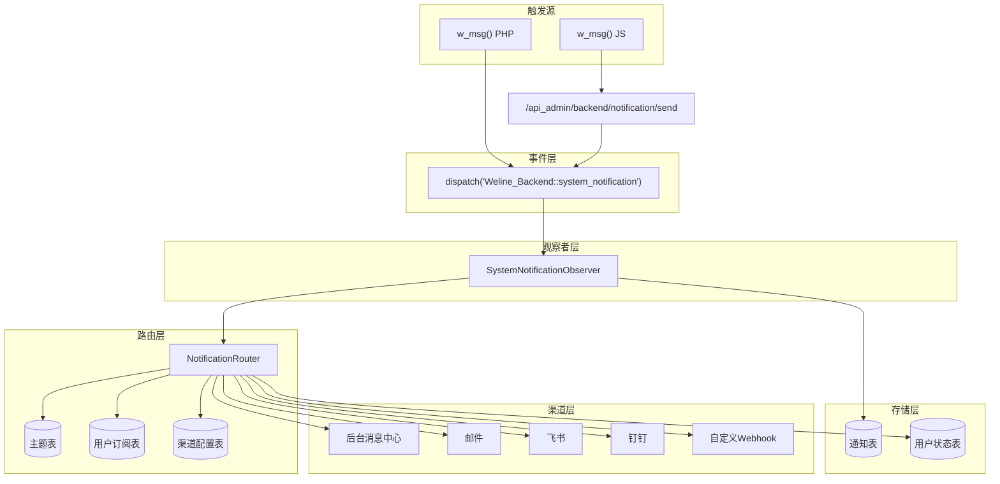

# 消息订阅通知系统

## 概述

构建完整的消息订阅通知系统，支持消息主题（Topic）、消息类型（Type）、用户订阅机制、多渠道通知（后台/邮件/飞书/钉钉/Webhook），提供 w_msg() 全局函数（PHP/JS），并在后台提供用户订阅管理和管理员渠道配置界面。

## 架构图

## 涉及模块及子计划

| 模块 | 子计划 | 任务进度 | 职责 |
|------|--------|---------|------|
| Weline_Backend | [plan.md](../../app/code/Weline/Backend/doc/开发/plan.md) | [task.md](../../app/code/Weline/Backend/doc/开发/task.md) | 核心：数据模型、事件、路由、适配器、UI |
| Weline_Framework | [plan.md](../../app/code/Weline/Framework/doc/开发/plan.md) | [task.md](../../app/code/Weline/Framework/doc/开发/task.md) | w_msg() PHP 全局函数 |
| Weline_Theme | [plan.md](../../app/code/Weline/Theme/doc/开发/plan.md) | [task.md](../../app/code/Weline/Theme/doc/开发/task.md) | w_msg() JS 全局函数 |
| Weline_Admin | [plan.md](../../app/code/Weline/Admin/doc/开发/plan.md) | [task.md](../../app/code/Weline/Admin/doc/开发/task.md) | 旧事件兼容层 |
| Weline_Websites | [plan.md](../../app/code/Weline/Websites/doc/开发/plan.md) | [task.md](../../app/code/Weline/Websites/doc/开发/task.md) | 注册域名相关主题 |
| Weline_Server | [plan.md](../../app/code/Weline/Server/doc/开发/plan.md) | [task.md](../../app/code/Weline/Server/doc/开发/task.md) | 注册服务器相关主题 |
| Weline_Seo | [plan.md](../../app/code/Weline/Seo/doc/开发/plan.md) | [task.md](../../app/code/Weline/Seo/doc/开发/task.md) | 注册 SEO 相关主题 |
| Weline_I18n | [plan.md](../../app/code/Weline/I18n/doc/开发/plan.md) | [task.md](../../app/code/Weline/I18n/doc/开发/task.md) | 注册翻译相关主题 |
| Weline_Sticker | [plan.md](../../app/code/Weline/Sticker/doc/开发/plan.md) | [task.md](../../app/code/Weline/Sticker/doc/开发/task.md) | 迁移调用方式 |

## 里程碑

1. **数据基础**：Weline_Backend 创建 5 个数据模型
2. **核心功能**：w_msg() PHP/JS 函数、事件系统
3. **路由分发**：消息路由、渠道适配器
4. **后台界面**：订阅管理、渠道配置、消息中心增强
5. **主题注册**：各模块注册消息主题
6. **迁移兼容**：迁移现有调用、旧事件兼容层

## 执行顺序

1. Weline_Backend - 数据模型
2. Weline_Backend - 主题注册接口
3. Weline_Framework - w_msg() PHP
4. Weline_Backend - 事件和观察者
5. Weline_Theme - w_msg() JS
6. Weline_Backend - API 接口
7. Weline_Backend - 路由和适配器
8. Weline_Backend - 后台界面
9. 各模块 - 注册主题
10. 各模块 - 迁移调用
11. Weline_Admin - 兼容层
