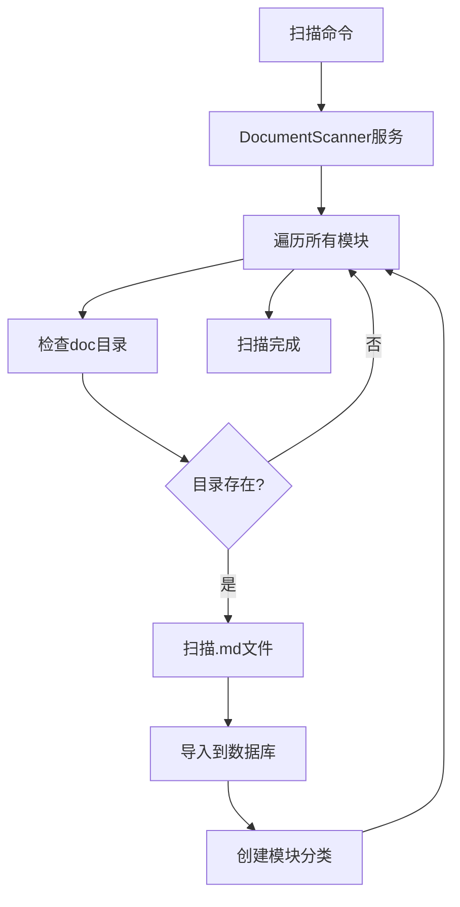

# 文档编写规范技能

## 📋 核心原则

**除非用户明确要求，否则不要创建文档文件。**  
**专注功能实现，少废话，少文档。**

参考 `error-learning` 技能的"文档创建规范"章节。  
只在以下 **3 种情况** 写文档，其他情况禁止编写文档：

---

## ✅ 何时需要写文档

### 1. **使用文档** - 用户如何使用功能

**触发条件：**
- 新增用户可见的功能（前端/后台界面、API、CLI 命令）
- 现有功能的使用方式发生重大变化
- 用户明确要求提供使用说明

**文档位置：**
- 前端功能：`模块/doc/前端使用指南.md` 或直接在界面添加帮助文本
- CLI 命令：命令的 `help()` 方法
- API：接口注释或 `模块/doc/API使用指南.md`

**文档内容：**
- 功能是什么
- 如何使用（操作步骤）
- 参数说明（如果有）
- 使用示例

**示例：**
```markdown
# 功能名称使用指南

## 功能说明
简述功能用途（1-2句话）

## 使用步骤
1. 步骤1
2. 步骤2
3. 步骤3

## 参数说明
| 参数 | 说明 | 必填 | 默认值 |
|------|------|------|--------|
| xxx  | xxx  | 是   | -      |

## 使用示例
```代码示例```
```

---

### 2. **架构文档** - 系统架构重大变化

**触发条件：**
- 新增或重构核心架构（如：适配器模式、注册中心、Provider 系统）
- 引入新的设计模式或架构层
- 模块间交互方式发生重大变化
- 数据库表结构设计（新表或重大变更）

**文档位置：**
- `模块/doc/架构设计-[功能名].md` 或 `模块/doc/[功能名]架构说明.md`

**文档内容：**
- 架构背景（为什么需要这个架构）
- 核心组件（接口、抽象类、实现类）
- 工作流程（流程图或步骤）
- 扩展方式（如何添加新实现）
- 关键代码示例

---

### 3. **需求文档** - 需求规划和设计

**触发条件：**
- 用户提出明确的需求或功能规划
- 需求复杂，需要拆分任务
- 需要与用户确认需求理解

**文档位置：**
- `docs/需求/[需求名].md` 或 `模块/doc/需求-[功能名].md`

**文档内容：**
- 需求描述、功能范围、实现方案、任务拆分、验收标准

---

## ❌ 何时不要写文档

**禁止在以下情况编写文档：**

1. **Bug 修复** - 直接修复，不写文档
2. **小功能优化** - 直接优化，不写文档
3. **代码重构** - 代码本身已足够清晰
4. **临时脚本/测试代码** - 用完即删
5. **配置调整** - 修改配置文件
6. **i18n 翻译** - 添加翻译键值
7. **CSS/样式调整** - 样式改动
8. **日志/调试信息** - 添加日志
9. **修改功能后的"说明文档"**、**添加功能后的"使用指南"**（除非属上列 3 类）
10. **修复 bug 后的"修复文档"**、**优化界面后的"总结报告"**、**完成任务后的"完成报告"**

**替代方案：** 用代码注释说明功能、在对话中告诉用户、用 Git commit message 记录、更新相关技能的 Q&A。  
**原则：代码即文档。清晰的代码、注释、命名 > 额外的文档。**

---

## 文档位置规范

### 1. 模块文档目录

```
app/code/Vendor/ModuleName/
└── doc/
    ├── README.md              # 模块文档索引（推荐）
    ├── 功能说明.md             # 功能说明文档
    ├── API文档.md             # API 接口文档
    ├── 使用指南.md             # 用户使用指南
    ├── 开发指南.md             # 开发者指南
    ├── 架构设计.md             # 架构设计文档
    └── 子目录/                # 可选的分类目录
        └── 详细文档.md
```

### 2. 文档位置原则

| 文档类型 | 位置 | 示例 |
|---------|------|------|
| **架构设计** | `doc/架构设计.md` | Sitemap 架构设计 |
| **功能说明** | `doc/功能名称说明.md` | 事件系统设计文档 |
| **使用指南** | `doc/使用指南.md` | API 使用指南 |
| **扩展开发** | `doc/扩展开发指南.md` | Sitemap 扩展开发指南 |
| **Extends 文档** | `extends.md`（模块根目录） | 扩展点说明 |

### 3. 特殊位置

**Weline_Framework 模块：** doc/ 下的子目录会被扫描为顶层分类，例如：`Weline/Framework/doc/Hook/Hook使用指南.md`

**模块根目录：**
- `extends.md` - 扩展点文档（必需，如果定义了 extends.php）
- `README.md` - 模块介绍（可选）
- `CHANGELOG.md` - 更新日志（可选）

---

## 文档命名规范

### 命名原则

1. **使用中文描述性名称**（推荐）：如 `Sitemap架构设计.md`、`扩展开发指南.md`、`使用手册.md`
2. **英文命名**（可选）：如 `README.md`、`API_REFERENCE.md`、`CHANGELOG.md`
3. **避免**：`sitemap功能修改说明.md`（太具体）、`2026-01-30-更新记录.md`（带日期）、`临时文档.md`（不清晰）

### 文档类型建议

| 文档用途 | 推荐名称 | 说明 |
|---------|---------|------|
| 模块索引 | `README.md` | 模块总览 |
| 架构设计 | `架构设计.md` 或 `设计文档.md` | 系统架构 |
| 使用说明 | `使用指南.md` | 用户手册 |
| 开发指南 | `开发指南.md` | 开发者文档 |
| API 文档 | `API文档.md` | 接口说明 |
| 扩展点 | `扩展开发指南.md` | 扩展开发 |
| 集成说明 | `XX集成说明.md` | 模块集成 |
| 更新日志 | `CHANGELOG.md` | 版本更新 |

---

## 文档扫描系统

### 扫描命令

```bash
# 增量扫描（只扫描新增和修改的）
php bin/w doc:import

# 强制重新扫描（删除旧文档重新导入）
php bin/w doc:import --force
```

### 扫描逻辑



### 扫描规则

**扫描的文件格式：** `.md`、`.markdown`、`.txt`  
**忽略的目录：** `.git`、`.svn`、`vendor`、`node_modules`、`var`、`pub`、`generated`  
**文档存储：** 表 `developer_workspace_document`，字段 `module_name`、`title`、`content`、`file_path`、`is_auto_imported`

---

## 📝 文档编写规范

### 通用规范

1. **简洁明了** - 避免冗长描述，用列表、表格、代码块；1 个文档 ≤ 200 行
2. **结构清晰** - 使用标题层级（h1, h2, h3），重要信息在前，代码示例必须可运行
3. **中文优先** - 技术术语可用英文，保持术语一致性
4. **版本信息** - 文档底部标注：`**版本：** 1.0.0`、`**更新时间：** YYYY-MM-DD`、`**状态：** ✅ 已实现 / 🚧 开发中 / 📋 计划中`

### 文档结构建议

```markdown
# 标题（一级标题，全文唯一）
## 概述
## 核心概念
## 使用方法
## 示例代码
## 常见问题
## 相关文档
```

### Markdown 规范

**代码块：** 使用语言标识。**表格：** 标准 Markdown 表格。**链接：** 内部 `[文本](./其他文档.md)`，外部完整 URL。

### 代码示例原则

- ✅ 提供完整的可运行代码、包含必要的注释、展示最佳实践
- ❌ 不要只有代码片段、不要省略重要的引用

---

## 架构文档编写

### 何时写架构文档

**必需场景：** 重新设计系统架构、引入新的设计模式、多模块协作机制、复杂的数据流程。

**文档内容：** 架构图（Mermaid）、设计原则、核心组件、数据流程、扩展点、实施步骤。

### 架构文档模板

```markdown
# XX 架构设计

## 架构变更说明
**当前问题：** ...
**新架构目标：** ...

## 架构图
\`\`\`mermaid
graph TD
    A[组件A] --> B[组件B]
    B --> C[组件C]
\`\`\`

## 核心组件
### 组件A - 职责说明
### 组件B - 职责说明

## 数据流程
## 接口设计
## 实施指南
## 相关文档
```

---

## 文档位置决策树

```
需要创建文档?
    ├─ 用户明确要求? 
    │   ├─ 是 → 创建到 doc/ 目录
    │   └─ 否 → 继续判断
    ├─ 架构级别变更?
    │   ├─ 是 → 创建架构文档到 doc/
    │   └─ 否 → 继续判断
    ├─ extends 扩展点?
    │   ├─ 是 → 创建 extends.md 到模块根目录
    │   └─ 否 → 继续判断
    └─ 其他情况 → 不创建文档，用代码注释或对话说明
```

---

## 实战示例与案例

### ✅ 需要写文档的场景

- **新增 CLI 命令**：在 `help()` 方法中编写使用说明（可不单独 .md）
- **新架构引入**：创建 `模块/doc/Sitemap架构设计.md`，说明 Provider、Adapter、Registry 关系
- **复杂需求**：创建 `docs/需求/多平台Sitemap生成.md`，拆分任务与验收标准
- **Sitemap 架构重构**：系统级变更 → 创建架构文档于 `app/code/Weline/Seo/doc/Sitemap架构设计.md`

### ❌ 不需要写文档的场景

- **添加下拉菜单**：简单 UI 改进 → 代码注释 + 对话说明
- **修复 Nginx 502**：临时问题 → Git commit；通用问题可更新 error-learning 技能
- **Bug 修复、代码重构、添加翻译**：不写“修复记录”“重构说明”“翻译更新记录”

---

## 文档更新时机

**必须更新文档：** 修改了接口签名、改变了使用方式、添加了新的扩展点、架构发生变化。  
**不需要更新文档：** 内部实现优化、Bug 修复、UI 微调、代码重构（接口不变）。

**更新方式：** 编辑 `模块/doc/文档.md` → 执行 `php bin/w doc:import` → 访问 `http://localhost/dev/tool/docs` 验证。

---

## 文档访问

**开发模式：** `http://your-domain/dev/tool/docs`  
**后台：** 导航栏 → 开发工具 → 文档中心  

**数据库查询：**
```sql
SELECT * FROM developer_workspace_document;
SELECT * FROM developer_workspace_document WHERE module_name = 'Weline_Seo';
```

---

## 🚀 执行检查清单

**创建文档前问自己：**

- [ ] 用户明确要求了吗？
- [ ] 是否涉及用户可见的新功能？→ 是：编写使用文档
- [ ] 是否引入新的架构或重大架构变更？→ 是：编写架构文档
- [ ] 是否是复杂需求或需要规划？→ 是：编写需求文档
- [ ] 是否是框架级别的重大功能？是否涉及多模块复杂集成？是否需要长期维护的文档？
- [ ] 能否用代码注释代替？能否在对话中说清楚？

**如果不应写文档的项都满足，就不要创建文档，专注代码实现。**

---

## 文档管理命令

```bash
php bin/w doc:import          # 扫描并导入文档（增量）
php bin/w doc:import --force  # 强制重新扫描
php bin/w doc:import --help   # 查看帮助
```

---

## 相关技能

- `error-learning` - 文档创建规范
- `create-extends` - extends.md 编写
- `module-development` - 模块开发流程

---

## 快速参考

| 问题 | 答案 |
|------|------|
| 文档放哪里？ | `app/code/Module/doc/` |
| 用什么命名？ | 中文描述性名称，如 `使用指南.md` |
| 怎么扫描？ | `php bin/w doc:import` |
| 怎么访问？ | `http://localhost/dev/tool/docs` |
| 要不要创建？ | **除非用户要求或属 3 类文档，否则不要！** |

---

## 📌 技能记忆要点

1. **只在 3 种情况写文档**：使用文档、架构文档、需求文档
2. **其他情况禁止写文档**：Bug 修复、小优化、配置调整等
3. **代码即文档**：清晰的命名、注释、结构 > 额外文档
4. **简洁至上**：1 个文档 ≤ 200 行，重点突出
5. **专注功能实现**：少废话，多写代码

**最后提醒：当你想写文档时，先问自己：用户/开发者真的需要这个文档吗？还是代码本身已足够清晰？**

---
**版本：** 1.0.0  
**最后更新：** 2026-01-30  
**状态：** ✅ 已合并 documentation + documentation-standards
