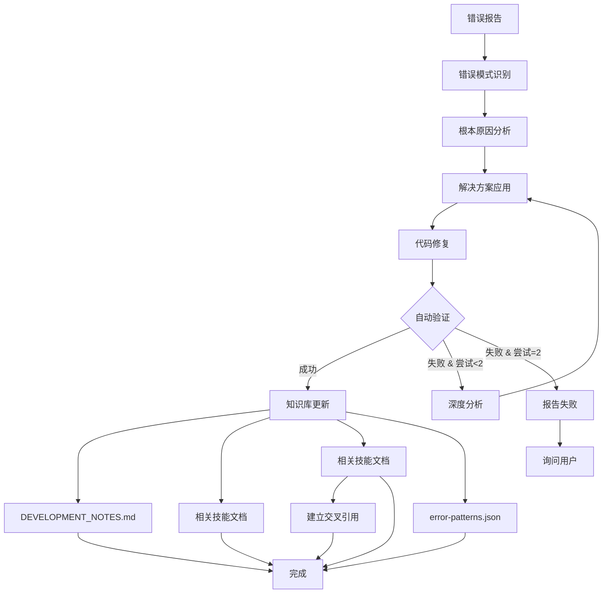

# 错误自学习技能 (Error Learning Skill)

## 何时使用此技能

**此技能必须在以下场景自动调用：**
- ✅ 用户报告任何错误信息
- ✅ 遇到 Fatal error、Warning、Notice、Exception
- ✅ 代码运行时出现问题
- ✅ 框架使用不当导致的错误
- ✅ 修复完成后，进行知识总结

**触发方式：**
- 用户输入包含错误信息关键词（error, exception, warning, 报错等）
- 修复代码后的知识总结阶段

---

## 核心功能

### 0. 自动验证与重试机制 ⚠️ 强制执行

**验证-修复-重试循环**：每次修复错误后，必须验证修复是否成功，失败则自动重试。

```
错误报告
    ↓
分析 + 修复 (尝试 1)
    ↓
自动验证 ← ────────┐
    ↓               │
成功？              │
├─ YES → 知识库更新 → 完成
└─ NO  → 尝试次数 < 2？
          ├─ YES → 重新分析 + 修复 (尝试 2) ─┘
          └─ NO  → 报告失败 → 询问用户
```

**验证方法（按优先级）**：

1. **单元测试验证**（最佳）：
   ```bash
   php bin/w test:unit ModuleName/TestClass
   ```

2. **功能测试验证**：
   ```bash
   # HTTP 请求测试
   php bin/w http:req "/path/to/endpoint"
   
   # 创建验证脚本
   php verify_feature.php
   ```

3. **集成测试脚本**：
   ```bash
   php integration_feature.php
   ```

4. **手动验证步骤**：
   - 数据库查询确认
   - 日志检查
   - 前端功能测试

5. **浏览器自动化**（前端）：
   - 使用 cursor-ide-browser MCP 工具

**📝 验证模板**：查看 [VERIFICATION_TEMPLATE.md](VERIFICATION_TEMPLATE.md) 获取 6 种验证模板和选择指南

**重试策略**：

| 尝试次数 | 操作 | 说明 |
|---------|------|------|
| **第 1 次** | 初始修复 | 基于错误分析的第一次修复尝试 |
| **验证失败** | 深度分析 | 分析为什么修复失败，查看实际执行结果 |
| **第 2 次** | 改进修复 | 基于验证结果的改进修复 |
| **验证失败** | 停止询问 | 向用户报告问题，等待指导 |

**验证失败处理**：

```markdown
## 验证失败报告

**修复内容**：[简要说明]

**验证方法**：[使用的验证方法]

**验证结果**：
- ❌ 期望：[预期结果]
- ❌ 实际：[实际结果]

**已尝试次数**：2/2

**问题分析**：
[为什么两次修复都失败的分析]

**需要用户帮助**：
[具体需要什么信息或指导]
```

### 1. 错误模式识别

分析错误并归类到预定义的模式：

| 错误模式 | 特征 | 典型案例 |
|---------|------|---------|
| **依赖注入缺失** | `Undefined property`, `Call to member function on null` | 控制器未注入模型 |
| **方法不存在** | `Call to undefined method` | 使用了框架不存在的方法 |
| **类型错误** | `TypeError`, `Argument must be of type` | 参数类型不匹配 |
| **引用传递错误** | `could not be passed by reference` | 直接传数组字面量给引用参数 |
| **路由错误** | `404 Not Found`, 路由解析失败 | URL 生成错误，HTTP 方法不匹配 |
| **数据库错误** | `SQLSTATE`, `Unknown column` | SQL 语法错误，字段不存在 |
| **配置错误** | `register.php` 版本未更新 | 升级方法不执行 |
| **JSON 解析错误** | `json_decode()` 收到 null | 请求体获取方法错误 |
| **事件系统错误** | 观察者未执行，事件未触发 | dispatch 调用缺失 |
| **前后台混淆** | 前台使用后台专属功能 | URL 生成权限错误 |

### 2. 根本原因分析

深入分析错误的根本原因，而不仅仅是表面现象：

```
表面错误：Call to a member function reset() on null
    ↓
深入分析：$this->themeLayout 为 null
    ↓
根本原因：ThemeLayout 模型未在构造函数注入
    ↓
框架知识：Weline 框架使用构造函数依赖注入
    ↓
解决方案：在构造函数添加参数并赋值给属性
```

### 3. 解决方案模式库

记录通用的解决方案模式：

#### 模式 1: 依赖注入三步骤
```php
// 1. 声明属性
private ModelClass $model;

// 2. 构造函数注入
public function __construct(ModelClass $model) {

// 3. 赋值
    $this->model = $model;
}
```

#### 模式 2: 引用参数传递
```php
// ❌ 错误
$manager->dispatch('event', ['data' => $value]);

// ✅ 正确
$data = ['data' => $value];
$manager->dispatch('event', $data);
```

#### 模式 3: POST JSON 数据获取
```php
$bodyParams = $this->request->getBodyParams();

if (is_string($bodyParams)) {
    $decoded = json_decode($bodyParams, true);
    $data = ($decoded !== null && is_array($decoded)) ? $decoded : $this->request->getParams();
} elseif (is_array($bodyParams) && !empty($bodyParams)) {
    $data = $bodyParams;
} else {
    $data = $this->request->getParams();
}
```

#### 模式 4: URL 生成（Observer/Service）
```php
use Weline\Framework\Http\Url;

public function __construct(Url $url) {
    $this->url = $url;
}

$url = $this->url->getBackendUrl('module/controller/action');
```

### 4. 相关技能关联

自动识别错误类型并关联到相应技能：

| 错误关键词 | 相关技能 |
|-----------|---------|
| `Undefined property`, 依赖注入 | `module-development`, `code-generation-standards` |
| 路由, `404`, `postDelete` | `weline-routing` |
| `json_decode`, `getContent`, POST | `weline-routing` |
| 前台, 后台, `AdminToast`, URL | `theme-development` |
| `alert`, `confirm`, 原生弹窗 | `friendly-notifications` |
| `register.php`, `upgrade()`（已废弃） | 表结构用 #[Col]+setup:upgrade；见 `error-tracking/DEVELOPMENT_NOTES.md`、`database-model-standards` |
| 事件, `dispatch`, Observer | `create-event` |
| 数据库, Model, `install()`（已废弃）, `delete` | `database-model-standards`（#[Col]、Schema diff）、`create-weshop-model` |
| `delete()->fetch()`, 删除失败 | `database-model-standards`, `error-tracking` |

### 5. 知识沉淀（按价值）

错误解决后，**必须先验证**。验证成功后，先做价值评估，再决定是否更新知识库：

#### 完整流程（含验证）



#### 验证检查清单 ⚠️ 必须执行

**代码修复后立即执行：**

1. **选择验证方法**：
   - [ ] 单元测试？（优先）
   - [ ] 功能测试脚本？
   - [ ] HTTP 请求测试？
   - [ ] 手动验证步骤？

2. **执行验证**：
   - [ ] 运行测试/验证命令
   - [ ] 记录验证输出
   - [ ] 判断是否成功

3. **验证结果处理**：
   - [ ] ✅ 成功：继续更新知识库
   - [ ] ❌ 失败 & 第1次：深度分析 → 重新修复
   - [ ] ❌ 失败 & 第2次：报告失败 → 询问用户

#### 价值评估检查清单

**仅在验证成功后执行：**

- [ ] 是否跨模块可复用（非模块特例）
- [ ] 是否可转化为可执行规则
- [ ] 是否重复发生概率高
- [ ] 是否影响稳定性/安全/一致性/性能

**满足 >=2 项再更新：**

- [ ] DEVELOPMENT_NOTES.md - 添加抽象规则（可选）
- [ ] 相关技能 - 添加 Q&A/检查项（至少 1 个，按需）
- [ ] error-patterns.json - 更新错误模式库
- [ ] 交叉引用 - 建立技能间链接
- [ ] 验证方法 - 记录使用的验证方法

---

## 错误模式库

### 已知错误模式

#### Pattern 1: 依赖注入缺失
**错误特征：**
- `Undefined property: ClassName::$propertyName`
- `Call to a member function methodName() on null`

**根本原因：**
在类方法中使用了未通过构造函数注入的依赖。

**解决模式：**
```php
// 依赖注入三步骤
private DependencyClass $dependency;

public function __construct(DependencyClass $dependency) {
    $this->dependency = $dependency;
}
```

**相关技能：** `module-development`, `code-generation-standards`

**历史案例：**
- 2026-01-29: ThemeEditor 控制器 ThemeLayout 模型注入缺失

---

#### Pattern 2: JSON 数据解析错误
**错误特征：**
- `TypeError: json_decode(): Argument #1 ($json) must be of type string, null given`

**根本原因：**
1. 使用了不存在的方法（如 `getContent()`）
2. 直接读取 `php://input` 可能已被读取
3. 前端未设置 `Content-Type: application/json`

**解决模式：**
```php
$bodyParams = $this->request->getBodyParams();

if (is_string($bodyParams)) {
    $decoded = json_decode($bodyParams, true);
    $data = ($decoded !== null && is_array($decoded)) ? $decoded : $this->request->getParams();
} elseif (is_array($bodyParams) && !empty($bodyParams)) {
    $data = $bodyParams;
} else {
    $data = $this->request->getParams();
}

$param = (int)($data['param'] ?? $this->request->getParam('param', 0));
```

**相关技能：** `weline-routing`

**历史案例：**
- 2026-01-29: postRemoveOrphanWidgets 方法使用 getContent() 导致错误

---

#### Pattern 3: 路由 DELETE 关键词冲突
**错误特征：**
- `404 Not Found` on POST `/backend/controller/delete-something`

**根本原因：**
URL 路径包含 `delete` 关键词，路由器误识别为 DELETE HTTP 方法限定。

**解决模式：**
```php
// ❌ 错误命名
public function postDeleteWidget() { }
// URL: /backend/theme-editor/delete-widget (POST) → 404

// ✅ 正确命名
public function postRemoveWidget() { }
// URL: /backend/theme-editor/remove-widget (POST) → 成功
```

**相关技能：** `weline-routing`

**历史案例：**
- 2026-01-29: postDeleteOrphanWidgets 路由 404 错误

---

#### Pattern 4: 引用参数传递错误
**错误特征：**
- `Argument could not be passed by reference`

**根本原因：**
PHP 不允许将数组字面量作为引用参数传递。

**解决模式：**
```php
// ❌ 错误
$manager->dispatch('event', ['data' => $value]);

// ✅ 正确
$eventData = ['data' => $value];
$manager->dispatch('event', $eventData);
```

**相关技能：** `create-event`

**历史案例：**
- 2026-01-28: EventsManager dispatch 引用传递错误

---

#### Pattern 5: Observer/Service 中硬编码 URL
**错误特征：**
- 前端 fetch 请求返回 404
- URL 路径不正确

**根本原因：**
在 Observer/Service 中硬编码 URL 路径，未使用框架的 Url 服务。

**解决模式：**
```php
use Weline\Framework\Http\Url;

class MyObserver implements ObserverInterface
{
    private Url $url;
    
    public function __construct(Url $url) {
        $this->url = $url;
    }
    
    public function execute(Event &$event): void
    {
        // ✅ 使用 Url 服务生成
        $apiUrl = htmlspecialchars($this->url->getBackendUrl('module/controller/action'));
        
        $html .= "<script>
            fetch('{$apiUrl}', { method: 'POST' });
        </script>";
    }
}
```

**相关技能：** `weline-routing`, `theme-development`

**历史案例：**
- 2026-01-29: LayoutSlotRenderer 硬编码 `/backend/theme-editor/remove-orphan-widgets`

---

#### Pattern 7: ORM delete 操作后不当使用 fetch()
**错误特征：**
- 前端提示删除成功
- 刷新后数据还在
- 使用了 `delete()->fetch()` 组合

**根本原因：**
在 Weline 框架的 Model ORM 中，`delete()` 是一个执行方法，会直接执行 DELETE SQL。在其后调用 `fetch()` 等查询方法会导致删除操作未真正提交或执行。

**解决模式：**
```php
// ❌ 错误：delete() 后调用 fetch()
$this->model->reset()
    ->where('id', $id)
    ->delete()
    ->fetch();  // 错误：delete 是执行方法

// ✅ 正确：delete() 直接执行
$result = $this->model->reset()
    ->where('id', $id)
    ->delete();  // 正确：返回布尔值或受影响行数

// ✅ 批量删除
$this->model->reset()
    ->where('status', 'expired')
    ->delete();  // 一条 SQL 删除所有符合条件的记录
```

**ORM 方法链规则：**
- ✅ 查询链：`where()->select()->fetch()`
- ✅ 删除链：`where()->delete()`
- ✅ 更新链：`where()->update()`
- ❌ 错误链：`delete()->fetch()`, `update()->select()`, `fetch()->delete()`

**相关技能：** `database-model-standards`, `error-tracking`

**历史案例：**
- 2026-01-29: ThemeEditor 删除孤儿部件时使用 delete()->fetch() 导致删除失败

---

#### Pattern 8: WLS 状态泄漏导致间歇性错误
**错误特征：**
- 间歇性 404（时不时就 404）
- 上一秒正常，下一秒换个 URL 就报错
- 某些页面偶尔返回错误数据或空数据
- 静态变量在请求间残留

**根本原因：**
WLS 常驻内存模式下，static 变量和单例实例在请求间持久化。如果某个请求修改了 static 变量但未在请求结束时重置，下一个请求会读到脏数据。

**解决模式：**
```php
// 在 StateManager::registerFrameworkResets() 中注册重置
StateManager::registerStaticReset(MyClass::class, 'myStaticVar', defaultValue);
StateManager::registerResetCallback('my_reset', function () {
    MyClass::reset();
});
```

**相关技能：** `weline-server`, `process-management`

**历史案例：**
- 2026-02-06: Request URI 缓存导致间歇性 404
- 2026-02-06: SseContext/SessionManager/CacheFactory 递归保护标志跨请求残留
- 2026-02-06: Env::$user 跨请求残留

---

#### Pattern 9: Worker 重复启动
**错误特征：**
- 日志中出现两个相同 ID 的 Worker
- 端口冲突或请求分配异常

**根本原因：**
Master 进程的健康检查、滚动重启、IPC 断开回调三条路径可能同时触发同一 Worker 重启，缺少互斥保护。

**解决模式：**
```php
// 使用 per-Worker 内存互斥锁
if (!$this->acquireWorkerRestartLock($workerId)) {
    return 0; // 跳过重复启动
}
try {
    return $this->doRestartWorker($workerId, $port);
} finally {
    $this->releaseWorkerRestartLock($workerId);
}
```

**相关技能：** `process-management`, `weline-server`

**历史案例：**
- 2026-02-06: 健康检查和滚动重启竞态导致两个 Worker #1

---

#### Pattern 10: ORM save() 中 checkUpdateOrInsert() 查询状态叠加
**错误特征：**
- `SQLSTATE[23502]: Not null violation` on `save()`
- `SQLSTATE[23505]: Unique violation` on `save()`
- `clone + load() + save()` 偶发插入而非更新

**根本原因：**
`AbstractModel::checkUpdateOrInsert()` 在执行存在性检查、更新、插入操作前未调用 `clearQuery()`。前序操作（如 `load()`）残留的 WHERE 条件与新条件叠加，导致查不到已有记录，误走 INSERT 分支。

**解决模式：**
```php
// 框架已修复 — checkUpdateOrInsert() 内部三处操作前均加 clearQuery()

// 1. 存在性检查
$check_result = $this->getQuery()->clearQuery()->where($this->unique_data)->find()->fetchArray();

// 2. 更新操作
$query = $this->getQuery()->clearQuery();
$save_result = $query->where($this->unique_data)->update($data, $this->_primary_key)->fetch();

// 3. 插入操作
$save_result = $this->getQuery()->clearQuery()->insert($this->getModelData(), $conflictFields)->fetch();
```

**相关技能：** `database-model-standards`, `error-tracking`

**历史案例：**
- 2026-02-07: PageBuilder 选择模板时 save() 走 INSERT 分支，name 为 null 触发 NOT NULL 约束

---

#### Pattern 11: CLI 输出抽象方法调用
**错误特征：**
- `Cannot call abstract method ...::setStickyFooter()`  
- 报错位置在 `Output\Cli\Printing.php`

**根本原因：**
新增了 `PrintInterface` 方法，但 CLI 命名空间下的 `AbstractPrint/PrintInterface`
未同步实现，导致 `parent::setStickyFooter()` 指向接口抽象方法。

**解决模式：**
```php
// ✅ 在 Output\Cli\PrintInterface 补充方法声明
public function setStickyFooter(array $lines, string $color = self::NOTE): void;
public function clearStickyFooter(): void;

// ✅ 在 Output\Cli\AbstractPrint 实现方法并在 printing() 中渲染
$this->renderStickyFooter();
```

**相关技能：** `error-tracking`

**历史案例：**
- 2026-02-09: server:start 增加底栏提示后触发 CLI 抽象方法调用

---

#### Pattern 12: 健康检查使用监听地址导致误判
**错误特征：**
- `[Master] Worker #X ... HTTP 健康检查连续失败 5 次`
- 实际进程仍存活、端口在监听

**根本原因：**
健康检查使用监听地址 `0.0.0.0/::` 作为请求目标，导致请求无法建立连接，
从而持续失败并触发错误重启逻辑。

**解决模式：**
```php
$host = $this->config['host'] ?? '127.0.0.1';
$healthHost = ($host === '0.0.0.0' || $host === '::' || $host === '') ? '127.0.0.1' : $host;
$url = "{$scheme}://{$healthHost}:{$port}/_wls/health";
```

**相关技能：** `error-tracking`

**历史案例：**
- 2026-02-09: Windows 模式下健康检查误判导致周期性“重启”

---

#### Pattern 6: 前台使用后台专属功能
**错误特征：**
- `ReferenceError: AdminToast is not defined`
- `ReferenceError: getBackendUrl is not defined`

**根本原因：**
前台代码使用了后台专属的 JS 对象或函数。

**解决模式：**
```javascript
// ❌ 前台错误使用
AdminToast.success('成功');  // AdminToast 仅后台可用

// ✅ 前台正确做法
if (Weline.config.theme.area === 'backend') {
    AdminToast.success('成功');
} else {
    FrontendToast.success('成功');  // 自定义实现
}
```

**相关技能：** `theme-development`, `friendly-notifications`

---

#### Pattern 13: 第三方 API 路径漂移导致语义错错（错误接口返回“看似相关”的 -1）
**错误特征：**
- 接口 A（如“获取 DNS 记录”）返回了接口 B 的错误文案（如“提交修改DNS失败”）
- 常见错误码为 `-1`，但错误描述与当前操作语义不一致

**根本原因：**
第三方平台升级了 API 路径/命名（例如 `api/resolution/*` 替代历史 `api/domain/dns*`），
本地适配器仍请求旧端点，导致命中兼容路由或错误处理分支，返回误导性消息。

**解决模式：**
```php
// ✅ 新端点优先 + 别名兜底 + 历史回退
$response = $this->makeRequest('api/resolution/list', ['ym' => $domain], $credentials);
if (($response['code'] ?? 0) !== 1) {
    $response = $this->makeRequest('api/jiexi/list', ['ym' => $domain], $credentials);
}
if (($response['code'] ?? 0) !== 1) {
    $response = $this->makeRequest('api/domain/dnslist', ['ym' => $domain], $credentials);
}
```

**相关技能：** `error-tracking`, `framework-method-validation`

**历史案例：**
- 2026-03-09: GName DNS 记录接口使用历史路径，触发“获取记录却提示修改失败（-1）”

---

#### Pattern 14: Request::get() 走 __call 魔术方法导致参数永远为 1
**错误特征：**
- 后端收到的参数值永远是 `1`，无论前端传什么
- URL query string 参数明确正确（浏览器 Network 面板可见），但后端读到错误值
- `(int) $this->request->get('key', 0)` 永远返回 1

**根本原因：**
`Request` 继承自 `DataObject`，后者的 `__call` 魔术方法将 `get('key', 0)` 解析为：
`substr('get',3)=''` → `$key=''` → `getData('')` → 返回整个 `$this->_data` 数组 → `(int)` 强转非空数组 = 1。

**解决模式：**
```php
// ❌ 错误：走 __call，返回整个 _data 数组
$id = (int) $this->request->get('param_name', 0);

// ✅ 正确：使用明确的参数获取方法
$id = (int) $this->request->getParam('param_name', 0);
$id = (int) $this->request->getGet('param_name', 0);
$id = (int) $this->request->getPost('param_name', 0);
```

**框架修复：** 已在 `Request` 类显式定义 `get()`/`post()`/`body()` 覆盖 `__call`。

**相关技能：** `code-generation-standards`, `error-tracking`

**历史案例：**
- 2026-03-13: DNS 切换 SSE 中 `dns_account_id` 永远为 1，选 Cloudflare 却始终切换到 GName

---

## 学习增强机制

### 错误模式演化

每次遇到新的错误变体，自动更新模式库：

```
原始模式: 依赖注入缺失（控制器）
    ↓
新变体: 依赖注入缺失（Service）
    ↓
更新模式: 依赖注入缺失（通用）
    ↓
扩展场景: 控制器、Service、Helper、Observer
```

### 解决方案优化

记录多种解决方案，根据场景选择最佳方案：

| 场景 | 方案A | 方案B | 推荐 |
|------|-------|-------|------|
| POST JSON | getBodyParams() | getParams() | A（标准） |
| URL 生成 | PHP传递 | JS动态生成 | A（安全） |
| 删除操作 | DELETE方法 | POST + remove | B（避免冲突） |

### 预防性建议

根据错误模式，生成预防性检查清单：

**创建控制器时：**
- [ ] 所有使用的模型/服务已在构造函数注入？
- [ ] 私有属性已声明且类型正确？
- [ ] 构造函数参数类型与属性类型一致？
- [ ] 构造函数内已将参数赋值给属性？

**处理 POST 请求时：**
- [ ] 使用 `getBodyParams()` 而非 `getContent()`？
- [ ] 处理了字符串、数组、空值等不同情况？
- [ ] 提供了 fallback 到 `getParams()`？
- [ ] 前端设置了 `Content-Type: application/json`？

**定义路由时：**
- [ ] 避免在 URL 中使用 HTTP 方法关键词（delete、put等）？
- [ ] 使用同义词（remove、update等）？
- [ ] 后台使用 `getBackendUrl()` 生成 URL？
- [ ] 前台仅使用 PHP 传递的 URL？

---

## 技能调用协议

### 自动调用触发器

当用户消息包含以下关键词时，自动调用此技能：

```
错误关键词:
- error, fatal, warning, notice, exception
- 报错, 错误, 异常
- undefined, null, not found
- SQLSTATE, TypeError, Call to

解决关键词:
- 修复, 已修复, 解决
- fixed, resolved, solved
```

### 调用工作流（含验证重试）

```
1. 错误识别
   ↓
2. 模式匹配（已知模式库）
   ↓
3. 根本原因分析
   ↓
4. 解决方案推荐
   ↓
5. 代码修复（尝试 1）
   ↓
6. ⚠️ 自动验证修复 ⚠️
   ├─ 选择验证方法（测试/脚本/请求）
   ├─ 执行验证
   └─ 判断结果
   ↓
7. 验证成功？
   ├─ YES → 跳到步骤 9
   └─ NO → 尝试次数 < 2？
           ├─ YES → 深度分析 → 重新修复（尝试 2）→ 返回步骤 6
           └─ NO → 报告失败 → 询问用户 → END
   ↓
9. 价值评估
   ├─→ 值得沉淀：更新 DEVELOPMENT_NOTES.md/相关技能
   └─→ 不值得沉淀：仅保留当前修复结论
   ↓
10. 交叉引用建立
   ↓
11. 完成报告
```

### 输出格式

#### 成功场景（验证通过）

```markdown
## 错误学习报告 ✅

### 错误分析
- **错误模式**: [模式名称]
- **根本原因**: [详细说明]
- **影响范围**: [相关技能]

### 解决方案
- **应用模式**: [解决模式名称]
- **代码修复**: [修复内容]

### ✅ 验证结果
- **验证方法**: [测试/脚本/请求/手动]
- **验证命令**: `[实际执行的命令]`
- **验证结果**: ✅ 成功
- **验证输出**: [关键输出摘要]
- **尝试次数**: 1/2（首次成功）或 2/2（第二次成功）

### 知识库更新
- ✅ DEVELOPMENT_NOTES.md - 已更新抽象规则
- ✅ [技能名称] - 已添加 Q&A
- ✅ 交叉引用 - 已建立

### 预防建议
- [ ] 检查清单项 1
- [ ] 检查清单项 2
```

#### 失败场景（验证失败 2 次）

```markdown
## 验证失败报告 ❌

### 错误分析
- **错误模式**: [模式名称]
- **根本原因**: [初步分析]

### 修复尝试

#### 尝试 1
- **修复内容**: [第一次修复]
- **验证方法**: [方法]
- **验证结果**: ❌ 失败
- **失败原因**: [分析]

#### 尝试 2
- **修复内容**: [第二次修复]
- **验证方法**: [方法]
- **验证结果**: ❌ 失败
- **失败原因**: [分析]

### 问题分析
[为什么两次修复都失败的深度分析]

### 需要用户帮助
1. [具体需要什么信息]
2. [或者需要什么指导]

### 已尝试的方法
- [方法1]
- [方法2]

### 建议下一步
[如果用户同意，可以尝试的方向]
```

---

## 持续改进

### 错误统计

跟踪最常见的错误类型：

| 错误模式 | 出现次数 | 最后遇到 |
|---------|---------|---------|
| 依赖注入缺失 | 1 | 2026-01-29 |
| JSON 解析错误 | 1 | 2026-01-29 |
| 路由冲突 | 1 | 2026-01-29 |
| ORM delete 使用不当 | 1 | 2026-01-29 |
| 引用传递错误 | 1 | 2026-01-28 |
| SQL 聚合函数被当标识符加引号 | 1 | 2026-02-07 |
| ORM save() 查询状态叠加 | 1 | 2026-02-07 |
| Request::get() 走 __call 返回整个 _data | 1 | 2026-03-13 |

### 技能关联强度

追踪技能间的关联关系：

```
error-tracking (核心) ←→ 所有技能
    ↓
weline-routing ←→ module-development
    ↓
theme-development ←→ friendly-notifications
    ↓
database-model-standards ←→ create-weshop-model
```

### 学习效果评估

- **错误重复率**：同一错误再次出现的频率（目标 < 5%）
- **技能覆盖率**：错误类型的技能覆盖比例（目标 100%）
- **解决时间**：从错误到解决的平均时间（目标递减）

---

## 相关技能

- `error-tracking` - 错误追踪和记录（核心依赖）
- `module-development` - 模块开发规范
- `weline-routing` - 路由和请求处理
- `theme-development` - 主题开发
- `friendly-notifications` - 友好通知
- `code-generation-standards` - 代码生成标准
- `database-model-standards` - 数据库模型标准
- `create-event` - 事件系统
- `create-hook` - Hook 扩展

所有技能文档 ←→ error-learning（双向引用）

---

## 📚 附加文档

本技能包含以下附加文档，提供详细指导：

1. **[VERIFICATION_TEMPLATE.md](VERIFICATION_TEMPLATE.md)** - 6 种验证模板和选择指南
   - 数据库操作验证
   - HTTP 请求验证
   - 单元测试验证
   - 集成测试验证
   - 手动验证步骤
   - 浏览器自动化验证

2. **[VERIFICATION_QUICKREF.md](VERIFICATION_QUICKREF.md)** - 1 分钟速查手册
   - 验证流程图
   - 3 步验证法
   - 重试决策树
   - 常用命令速查

3. **[EXAMPLE_VERIFICATION_FLOW.md](EXAMPLE_VERIFICATION_FLOW.md)** - 完整案例演示
   - 真实错误修复过程
   - 第一次尝试失败
   - 深度分析
   - 第二次尝试成功
   - 完整验证报告

4. **[error-patterns.json](error-patterns.json)** - 错误模式数据库
   - 结构化错误模式
   - 解决方案模板
   - 验证统计数据

---

## 🎯 使用建议

### 初次使用
1. 阅读本文档（SKILL.md）了解核心概念
2. 查看 [VERIFICATION_QUICKREF.md](VERIFICATION_QUICKREF.md) 掌握验证流程
3. 参考 [VERIFICATION_TEMPLATE.md](VERIFICATION_TEMPLATE.md) 创建验证脚本

### 遇到错误时
1. 按照本文档的"自动验证与重试机制"执行
2. 使用 VERIFICATION_TEMPLATE.md 中的模板快速创建验证
3. 参考 EXAMPLE_VERIFICATION_FLOW.md 了解完整流程

### 更新知识库时
1. 确保已通过验证
2. 记录验证方法和结果
3. 更新 error-patterns.json 统计数据

---

## ⚠️ 文档创建规范

### 禁止随意创建文档

**原则：** 除非用户明确要求，否则**不要创建任何文档文件**。

**适用场景：**
- ✅ 用户明确说"写一个文档"、"创建说明文档"、"生成文档"
- ✅ 框架技能要求（如 error-tracking 的 DEVELOPMENT_NOTES.md）
- ✅ 复杂功能确实需要文档说明，且用户同意

**禁止场景（❌ 不要创建文档）：**
- ❌ 修改了一个功能 → 不要创建"XX功能修改说明.md"
- ❌ 添加了一个按钮 → 不要创建"XX按钮使用指南.md"
- ❌ 修复了一个 bug → 不要创建"XX问题修复文档.md"
- ❌ 优化了界面 → 不要创建"XX界面优化总结.md"
- ❌ 完成任务后 → 不要创建"XX完成报告.md"

**正确做法：**
1. **直接沟通**：在对话中告诉用户做了什么
2. **代码注释**：在代码中添加清晰的注释
3. **Git commit**：用详细的 commit message 记录
4. **技能更新**：更新相关技能的 Q&A 部分

**例外情况（需要创建文档）：**
- 框架级别的重大功能（如新增 Extends 机制）
- 复杂的集成说明（如 Sitemap + SEO + Nginx 配置）
- 用户明确要求
- 技能文档本身（SKILL.md）

**文档创建前必须问自己：**
1. 用户要求了吗？**没有 → 不创建**
2. 是否复杂到必须文档？**不是 → 不创建**
3. 能否用代码注释说明？**能 → 不创建文档**
4. 能否在对话中说清楚？**能 → 不创建文档**

**反面案例（实际发生）：**
```
❌ 错误：添加了一个"更多操作"下拉菜单后，创建了：
   - 页面管理-更多操作菜单.md (12KB)
   
✅ 正确：在代码中添加注释，对话中简要说明即可
```

**记住：代码即文档，注释即说明。过多文档 = 维护负担。**

---

**创建日期**: 2026-01-29
**最后更新**: 2026-01-30
**版本**: 2.1.0（新增文档创建规范）
