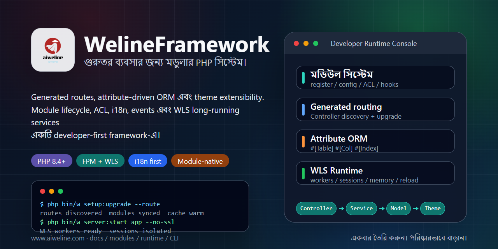

# WelineFramework



[ভাষাসমূহ](./README.md) | [সরলীকৃত চীনা](../../README.zh-CN.md)

WelineFramework হলো modular web application, admin system এবং commerce scenario-এর জন্য একটি PHP framework। এটি modules, routing, ORM, events/hooks, themes, backend ACL, i18n, WLS long-running service এবং CLI tools সংগঠিত করে, যাতে business modules সহজে extend ও maintain করা যায়।

## পথ বেছে নিন

- নতুন local setup: one-click installer ব্যবহার করুন।
- PHP, Composer ও database আগে থেকেই আছে: clean install ব্যবহার করুন।
- Architecture: [Weline architecture](../weline/README.md).
- AI / Codex কাজ: [AI-ENTRY.md](../../AI-ENTRY.md) থেকে শুরু করুন।

## প্রয়োজনীয়তা

- PHP `^8.4`
- Composer `^2.7`
- MySQL / MariaDB / PostgreSQL
- Nginx / Apache অথবা Weline built-in server (WLS)

Install command বর্তমান user দিয়ে চালান। One-click installer সরাসরি `sudo` দিয়ে শুরু করবেন না।

## One-Click Install

Linux / macOS / Git Bash:

```bash
curl -fsSL https://gitee.com/aiweline/WelineFramework/raw/master/bin/bootstrap.sh | bash -s --
```

Windows PowerShell:

```powershell
$f="$env:TEMP\weline-bootstrap.ps1"; irm 'https://gitee.com/aiweline/WelineFramework/raw/master/bin/bootstrap.ps1' -OutFile $f; & $f
```

Common options: `-b dev`, `-y`, `-f`, `--path-only`, `php`, `pgsql`, `mysql`.

## Clean Install

```bash
git clone https://gitee.com/aiweline/WelineFramework.git weline
cd weline
composer install
php bin/w command:upgrade
php bin/w system:install:sample
```

Weline built-in server (WLS) চালু করুন:

```bash
php bin/w server:start
```

## দরকারি Commands

| Command | উদ্দেশ্য |
|---|---|
| `php bin/w` | command list দেখুন |
| `php bin/w setup:upgrade` | modules, schema ও config upgrade করুন |
| `php bin/w setup:upgrade --route` | controller change-এর পরে routes refresh করুন |
| `php bin/w server:start` | Weline built-in server (WLS) চালু করুন |
| `php bin/w query:help <provider>` | Query Provider contracts দেখুন |

## Documentation

- [Project docs](../README.md)
- [Architecture overview](../weline/架构总览.md)
- [Development guide](../开发文档.md)
- [Deployment guide](../部署文档.md)
- [AI assistant entry](../../AI-README.md)

## Notes

`generated/` artifacts সরাসরি edit করবেন না। `routes.xml` হাতে লিখবেন না। User-visible text i18n দিয়ে যেতে হবে। AI tests-এর জন্য default `9501` নয়, `9502+` port-এর isolated WLS instance ব্যবহার করুন।
