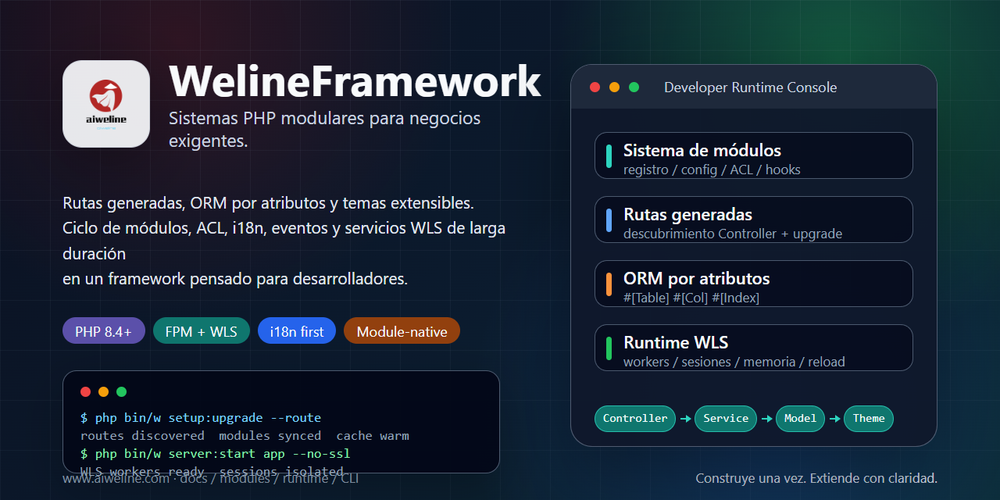

# WelineFramework



[Idiomas](./README.md) | [Chino simplificado](../../README.zh-CN.md)

WelineFramework es un framework PHP para aplicaciones web modulares, sistemas de administración y escenarios de comercio. Organiza módulos, rutas, ORM, eventos/hooks, temas, ACL de backend, i18n, el servicio de larga duración WLS y herramientas CLI para mantener los módulos de negocio extensibles y mantenibles.

## Elegir Una Ruta

- Nuevo entorno local: usa el instalador de un solo paso.
- PHP, Composer y base de datos ya instalados: usa la instalación limpia.
- Arquitectura: [arquitectura de Weline](../weline/README.md).
- Trabajo con AI / Codex: empieza en [AI-ENTRY.md](../../AI-ENTRY.md).

## Requisitos

- PHP `^8.4`
- Composer `^2.7`
- MySQL / MariaDB / PostgreSQL
- Nginx / Apache o servidor integrado de Weline (WLS)

Ejecuta los comandos de instalación como el usuario actual. No inicies el instalador de un solo paso directamente con `sudo`.

## Instalación De Un Solo Paso

Linux / macOS / Git Bash:

```bash
curl -fsSL https://gitee.com/aiweline/WelineFramework/raw/master/bin/bootstrap.sh | bash -s --
```

Windows PowerShell:

```powershell
$f="$env:TEMP\weline-bootstrap.ps1"; irm 'https://gitee.com/aiweline/WelineFramework/raw/master/bin/bootstrap.ps1' -OutFile $f; & $f
```

Opciones comunes: `-b dev`, `-y`, `-f`, `--path-only`, `php`, `pgsql`, `mysql`.

## Instalación Limpia

```bash
git clone https://gitee.com/aiweline/WelineFramework.git weline
cd weline
composer install
php bin/w command:upgrade
php bin/w system:install:sample
```

Iniciar el servidor integrado de Weline (WLS):

```bash
php bin/w server:start
```

## Comandos Útiles

| Comando | Propósito |
|---|---|
| `php bin/w` | Listar comandos |
| `php bin/w setup:upgrade` | Actualizar módulos, esquema y configuración |
| `php bin/w setup:upgrade --route` | Regenerar rutas después de cambios en controladores |
| `php bin/w server:start` | Iniciar el servidor integrado de Weline (WLS) |
| `php bin/w query:help <provider>` | Revisar contratos de Query Provider |

## Documentación

- [Documentación del proyecto](../README.md)
- [Resumen de arquitectura](../weline/架构总览.md)
- [Guía de desarrollo](../开发文档.md)
- [Guía de despliegue](../部署文档.md)
- [Entrada para asistentes AI](../../AI-README.md)

## Notas

No edites directamente los artefactos de `generated/`. No escribas `routes.xml` manualmente. El texto visible para usuarios debe pasar por i18n. Las pruebas AI deben usar una instancia WLS aislada en el puerto `9502+`, no el puerto predeterminado `9501`.
