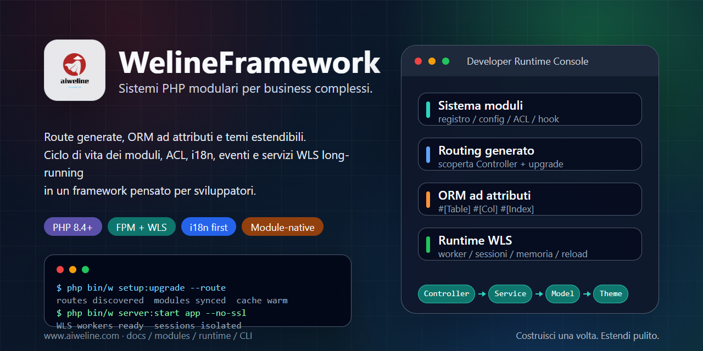

# WelineFramework



[Lingue](./README.md) | [Cinese semplificato](../../README.zh-CN.md)

WelineFramework è un framework PHP per applicazioni web modulari, sistemi di amministrazione e scenari commerce. Organizza moduli, routing, ORM, eventi/hook, temi, ACL backend, i18n, servizio WLS long-running e strumenti CLI per mantenere i moduli business estendibili e manutenibili.

## Scegli Un Percorso

- Nuovo ambiente locale: usa l'installer one-click.
- PHP, Composer e database già disponibili: usa l'installazione pulita.
- Architettura: [architettura Weline](../weline/README.md).
- Lavoro AI / Codex: inizia da [AI-ENTRY.md](../../AI-ENTRY.md).

## Requisiti

- PHP `^8.4`
- Composer `^2.7`
- MySQL / MariaDB / PostgreSQL
- Nginx / Apache o server integrato Weline (WLS)

Esegui i comandi di installazione con l'utente corrente. Non avviare direttamente l'installer one-click con `sudo`.

## Installazione One-Click

Linux / macOS / Git Bash:

```bash
curl -fsSL https://gitee.com/aiweline/WelineFramework/raw/master/bin/bootstrap.sh | bash -s --
```

Windows PowerShell:

```powershell
$f="$env:TEMP\weline-bootstrap.ps1"; irm 'https://gitee.com/aiweline/WelineFramework/raw/master/bin/bootstrap.ps1' -OutFile $f; & $f
```

Opzioni comuni: `-b dev`, `-y`, `-f`, `--path-only`, `php`, `pgsql`, `mysql`.

## Installazione Pulita

```bash
git clone https://gitee.com/aiweline/WelineFramework.git weline
cd weline
composer install
php bin/w command:upgrade
php bin/w system:install:sample
```

Avviare il server integrato Weline (WLS):

```bash
php bin/w server:start
```

## Comandi Utili

| Comando | Scopo |
|---|---|
| `php bin/w` | Elencare i comandi |
| `php bin/w setup:upgrade` | Aggiornare moduli, schema e configurazione |
| `php bin/w setup:upgrade --route` | Aggiornare le route dopo modifiche ai controller |
| `php bin/w server:start` | Avviare il server integrato Weline (WLS) |
| `php bin/w query:help <provider>` | Controllare i contratti Query Provider |

## Documentazione

- [Documentazione progetto](../README.md)
- [Panoramica architettura](../weline/架构总览.md)
- [Guida sviluppo](../开发文档.md)
- [Guida deployment](../部署文档.md)
- [Ingresso assistente AI](../../AI-README.md)

## Note

Non modificare direttamente gli artefatti `generated/`. Non scrivere `routes.xml` manualmente. Il testo visibile agli utenti dovrebbe passare da i18n. I test AI devono usare un'istanza WLS isolata su porta `9502+`, non la porta predefinita `9501`.
