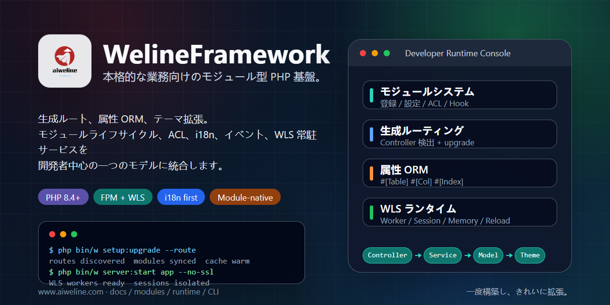

# WelineFramework



[言語](./README.md) | [簡体字中国語](../../README.zh-CN.md)

WelineFramework は、モジュール型 Web アプリ、管理システム、コマース用途向けの PHP フレームワークです。モジュール、ルーティング、ORM、イベント/Hook、テーマ、バックエンド ACL、i18n、WLS 長時間稼働サービス、CLI ツールを整理し、ビジネスモジュールを拡張しやすく保守しやすくします。

## 開始方法を選ぶ

- 新しいローカル環境: ワンクリックインストーラーを使用します。
- PHP、Composer、データベースが既にある場合: クリーンインストールを使用します。
- アーキテクチャ: [Weline architecture](../weline/README.md)。
- AI / Codex 作業: [AI-ENTRY.md](../../AI-ENTRY.md) から開始します。

## 要件

- PHP `^8.4`
- Composer `^2.7`
- MySQL / MariaDB / PostgreSQL
- Nginx / Apache または Weline 組み込みサーバー（WLS）

インストールコマンドは現在のユーザーで実行してください。ワンクリックインストーラーを直接 `sudo` で起動しないでください。

## ワンクリックインストール

Linux / macOS / Git Bash:

```bash
curl -fsSL https://gitee.com/aiweline/WelineFramework/raw/master/bin/bootstrap.sh | bash -s --
```

Windows PowerShell:

```powershell
$f="$env:TEMP\weline-bootstrap.ps1"; irm 'https://gitee.com/aiweline/WelineFramework/raw/master/bin/bootstrap.ps1' -OutFile $f; & $f
```

よく使うオプション: `-b dev`, `-y`, `-f`, `--path-only`, `php`, `pgsql`, `mysql`。

## クリーンインストール

```bash
git clone https://gitee.com/aiweline/WelineFramework.git weline
cd weline
composer install
php bin/w command:upgrade
php bin/w system:install:sample
```

Weline 組み込みサーバー（WLS）を起動:

```bash
php bin/w server:start
```

## よく使うコマンド

| コマンド | 用途 |
|---|---|
| `php bin/w` | コマンド一覧 |
| `php bin/w setup:upgrade` | モジュール、スキーマ、設定を更新 |
| `php bin/w setup:upgrade --route` | Controller 変更後にルートを更新 |
| `php bin/w server:start` | Weline 組み込みサーバー（WLS）を起動 |
| `php bin/w query:help <provider>` | Query Provider 契約を確認 |

## ドキュメント

- [プロジェクトドキュメント](../README.md)
- [アーキテクチャ概要](../weline/架构总览.md)
- [開発ガイド](../开发文档.md)
- [デプロイガイド](../部署文档.md)
- [AI アシスタント入口](../../AI-README.md)

## 注意

`generated/` の生成物を直接編集しないでください。`routes.xml` を手書きしないでください。ユーザーに見える文言は i18n を通してください。AI テストは既定ポート `9501` ではなく、`9502+` の独立した WLS インスタンスを使用します。
