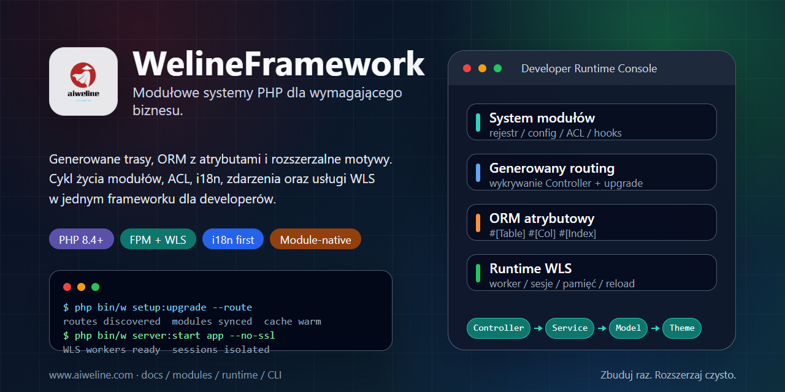

# WelineFramework



[Języki](./README.md) | [Chiński uproszczony](../../README.zh-CN.md)

WelineFramework to framework PHP dla modułowych aplikacji webowych, systemów administracyjnych i scenariuszy commerce. Porządkuje moduły, routing, ORM, events/hooks, motywy, backend ACL, i18n, długodziałającą usługę WLS oraz narzędzia CLI, aby moduły biznesowe były rozszerzalne i łatwe w utrzymaniu.

## Wybierz Ścieżkę

- Nowe środowisko lokalne: użyj instalatora one-click.
- PHP, Composer i baza danych są gotowe: użyj czystej instalacji.
- Architektura: [architektura Weline](../weline/README.md).
- Praca AI / Codex: zacznij od [AI-ENTRY.md](../../AI-ENTRY.md).

## Wymagania

- PHP `^8.4`
- Composer `^2.7`
- MySQL / MariaDB / PostgreSQL
- Nginx / Apache albo wbudowany serwer Weline (WLS)

Uruchamiaj komendy instalacji jako bieżący użytkownik. Nie uruchamiaj instalatora one-click bezpośrednio przez `sudo`.

## Instalacja One-Click

Linux / macOS / Git Bash:

```bash
curl -fsSL https://gitee.com/aiweline/WelineFramework/raw/master/bin/bootstrap.sh | bash -s --
```

Windows PowerShell:

```powershell
$f="$env:TEMP\weline-bootstrap.ps1"; irm 'https://gitee.com/aiweline/WelineFramework/raw/master/bin/bootstrap.ps1' -OutFile $f; & $f
```

Częste opcje: `-b dev`, `-y`, `-f`, `--path-only`, `php`, `pgsql`, `mysql`.

## Czysta Instalacja

```bash
git clone https://gitee.com/aiweline/WelineFramework.git weline
cd weline
composer install
php bin/w command:upgrade
php bin/w system:install:sample
```

Uruchom wbudowany serwer Weline (WLS):

```bash
php bin/w server:start
```

## Przydatne Komendy

| Komenda | Cel |
|---|---|
| `php bin/w` | Lista komend |
| `php bin/w setup:upgrade` | Aktualizacja modułów, schematu i konfiguracji |
| `php bin/w setup:upgrade --route` | Odświeżenie tras po zmianach controllerów |
| `php bin/w server:start` | Start wbudowanego serwera Weline (WLS) |
| `php bin/w query:help <provider>` | Sprawdzenie kontraktów Query Provider |

## Dokumentacja

- [Dokumentacja projektu](../README.md)
- [Przegląd architektury](../weline/架构总览.md)
- [Przewodnik programisty](../开发文档.md)
- [Przewodnik wdrożenia](../部署文档.md)
- [Wejście asystenta AI](../../AI-README.md)

## Uwagi

Nie edytuj bezpośrednio artefaktów `generated/`. Nie pisz ręcznie `routes.xml`. Teksty widoczne dla użytkownika powinny przechodzić przez i18n. Testy AI muszą używać izolowanej instancji WLS na porcie `9502+`, a nie domyślnego `9501`.
