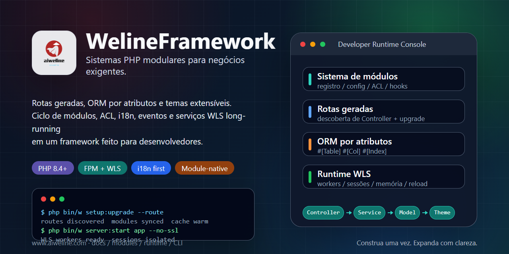

# WelineFramework



[Idiomas](./README.md) | [Chinês simplificado](../../README.zh-CN.md)

WelineFramework é um framework PHP para aplicações web modulares, sistemas administrativos e cenários de comércio. Ele organiza módulos, rotas, ORM, eventos/hooks, temas, ACL de backend, i18n, o serviço de longa duração WLS e ferramentas CLI para manter módulos de negócio extensíveis e fáceis de manter.

## Escolha Um Caminho

- Novo ambiente local: use o instalador de um passo.
- PHP, Composer e banco de dados já existem: use a instalação limpa.
- Arquitetura: [arquitetura Weline](../weline/README.md).
- Trabalho com AI / Codex: comece em [AI-ENTRY.md](../../AI-ENTRY.md).

## Requisitos

- PHP `^8.4`
- Composer `^2.7`
- MySQL / MariaDB / PostgreSQL
- Nginx / Apache ou servidor embutido do Weline (WLS)

Execute os comandos de instalação como o usuário atual. Não inicie o instalador de um passo diretamente com `sudo`.

## Instalação De Um Passo

Linux / macOS / Git Bash:

```bash
curl -fsSL https://gitee.com/aiweline/WelineFramework/raw/master/bin/bootstrap.sh | bash -s --
```

Windows PowerShell:

```powershell
$f="$env:TEMP\weline-bootstrap.ps1"; irm 'https://gitee.com/aiweline/WelineFramework/raw/master/bin/bootstrap.ps1' -OutFile $f; & $f
```

Opções comuns: `-b dev`, `-y`, `-f`, `--path-only`, `php`, `pgsql`, `mysql`.

## Instalação Limpa

```bash
git clone https://gitee.com/aiweline/WelineFramework.git weline
cd weline
composer install
php bin/w command:upgrade
php bin/w system:install:sample
```

Iniciar o servidor embutido do Weline (WLS):

```bash
php bin/w server:start
```

## Comandos Úteis

| Comando | Finalidade |
|---|---|
| `php bin/w` | Listar comandos |
| `php bin/w setup:upgrade` | Atualizar módulos, esquema e configuração |
| `php bin/w setup:upgrade --route` | Atualizar rotas após mudanças de controller |
| `php bin/w server:start` | Iniciar o servidor embutido do Weline (WLS) |
| `php bin/w query:help <provider>` | Ver contratos do Query Provider |

## Documentação

- [Documentação do projeto](../README.md)
- [Visão geral da arquitetura](../weline/架构总览.md)
- [Guia de desenvolvimento](../开发文档.md)
- [Guia de implantação](../部署文档.md)
- [Entrada do assistente AI](../../AI-README.md)

## Observações

Não edite artefatos em `generated/` diretamente. Não escreva `routes.xml` manualmente. Textos visíveis ao usuário devem passar por i18n. Testes AI devem usar uma instância WLS isolada na porta `9502+`, não a porta padrão `9501`.
