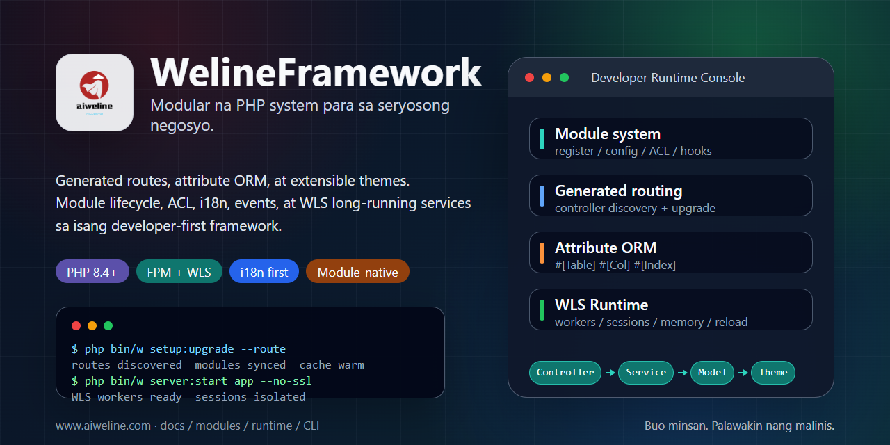

# WelineFramework



[Mga Wika](./README.md) | [Pinasimpleng Tsino](../../README.zh-CN.md)

Ang WelineFramework ay isang PHP framework para sa modular web applications, admin systems, at commerce scenarios. Inaayos nito ang modules, routing, ORM, events/hooks, themes, backend ACL, i18n, WLS long-running service, at CLI tools para manatiling extensible at maintainable ang business modules.

## Pumili Ng Landas

- Bagong local setup: gamitin ang one-click installer.
- May PHP, Composer, at database na: gamitin ang clean install.
- Architecture: [Weline architecture](../weline/README.md).
- AI / Codex work: magsimula sa [AI-ENTRY.md](../../AI-ENTRY.md).

## Requirements

- PHP `^8.4`
- Composer `^2.7`
- MySQL / MariaDB / PostgreSQL
- Nginx / Apache o Weline built-in server (WLS)

Patakbuhin ang install commands bilang kasalukuyang user. Huwag direktang simulan ang one-click installer gamit ang `sudo`.

## One-Click Install

Linux / macOS / Git Bash:

```bash
curl -fsSL https://gitee.com/aiweline/WelineFramework/raw/master/bin/bootstrap.sh | bash -s --
```

Windows PowerShell:

```powershell
$f="$env:TEMP\weline-bootstrap.ps1"; irm 'https://gitee.com/aiweline/WelineFramework/raw/master/bin/bootstrap.ps1' -OutFile $f; & $f
```

Common options: `-b dev`, `-y`, `-f`, `--path-only`, `php`, `pgsql`, `mysql`.

## Clean Install

```bash
git clone https://gitee.com/aiweline/WelineFramework.git weline
cd weline
composer install
php bin/w command:upgrade
php bin/w system:install:sample
```

Simulan ang Weline built-in server (WLS):

```bash
php bin/w server:start
```

## Useful Commands

| Command | Purpose |
|---|---|
| `php bin/w` | Ilista ang commands |
| `php bin/w setup:upgrade` | I-upgrade ang modules, schema, at config |
| `php bin/w setup:upgrade --route` | I-refresh ang routes pagkatapos ng controller changes |
| `php bin/w server:start` | Simulan ang Weline built-in server (WLS) |
| `php bin/w query:help <provider>` | Suriin ang Query Provider contracts |

## Documentation

- [Project docs](../README.md)
- [Architecture overview](../weline/架构总览.md)
- [Development guide](../开发文档.md)
- [Deployment guide](../部署文档.md)
- [AI assistant entry](../../AI-README.md)

## Notes

Huwag direktang i-edit ang `generated/` artifacts. Huwag magsulat ng `routes.xml` nang manual. Ang user-visible text ay dapat dumaan sa i18n. Ang AI tests ay dapat gumamit ng isolated WLS instance sa port `9502+`, hindi default `9501`.
