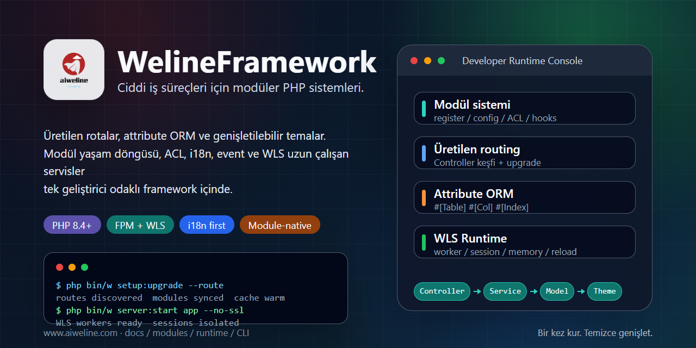

# WelineFramework



[Diller](./README.md) | [Basitleştirilmiş Çince](../../README.zh-CN.md)

WelineFramework, modüler web uygulamaları, yönetim sistemleri ve ticaret senaryoları için bir PHP framework'üdür. Modülleri, routing'i, ORM'i, events/hooks yapısını, temaları, backend ACL'i, i18n'i, WLS uzun çalışan hizmetini ve CLI araçlarını düzenleyerek iş modüllerini genişletilebilir ve sürdürülebilir tutar.

## Yol Seçin

- Yeni yerel kurulum: tek adımlı installer kullanın.
- PHP, Composer ve veritabanı hazır: temiz kurulum kullanın.
- Mimari: [Weline architecture](../weline/README.md).
- AI / Codex çalışması: [AI-ENTRY.md](../../AI-ENTRY.md) ile başlayın.

## Gereksinimler

- PHP `^8.4`
- Composer `^2.7`
- MySQL / MariaDB / PostgreSQL
- Nginx / Apache veya Weline yerleşik sunucusu (WLS)

Kurulum komutlarını mevcut kullanıcıyla çalıştırın. Tek adımlı installer'ı doğrudan `sudo` ile başlatmayın.

## Tek Adımlı Kurulum

Linux / macOS / Git Bash:

```bash
curl -fsSL https://gitee.com/aiweline/WelineFramework/raw/master/bin/bootstrap.sh | bash -s --
```

Windows PowerShell:

```powershell
$f="$env:TEMP\weline-bootstrap.ps1"; irm 'https://gitee.com/aiweline/WelineFramework/raw/master/bin/bootstrap.ps1' -OutFile $f; & $f
```

Yaygın seçenekler: `-b dev`, `-y`, `-f`, `--path-only`, `php`, `pgsql`, `mysql`.

## Temiz Kurulum

```bash
git clone https://gitee.com/aiweline/WelineFramework.git weline
cd weline
composer install
php bin/w command:upgrade
php bin/w system:install:sample
```

Weline yerleşik sunucusunu (WLS) başlatın:

```bash
php bin/w server:start
```

## Kullanışlı Komutlar

| Komut | Amaç |
|---|---|
| `php bin/w` | Komutları listele |
| `php bin/w setup:upgrade` | Modülleri, şemayı ve ayarları yükselt |
| `php bin/w setup:upgrade --route` | Controller değişikliklerinden sonra route yenile |
| `php bin/w server:start` | Weline yerleşik sunucusunu (WLS) başlat |
| `php bin/w query:help <provider>` | Query Provider sözleşmelerini incele |

## Dokümantasyon

- [Proje dokümantasyonu](../README.md)
- [Mimari genel bakış](../weline/架构总览.md)
- [Geliştirme kılavuzu](../开发文档.md)
- [Dağıtım kılavuzu](../部署文档.md)
- [AI asistan girişi](../../AI-README.md)

## Notlar

`generated/` çıktıları doğrudan düzenlenmemelidir. `routes.xml` elle yazılmamalıdır. Kullanıcıya görünen metinler i18n üzerinden geçmelidir. AI testleri varsayılan `9501` yerine `9502+` portunda izole WLS instance kullanmalıdır.
