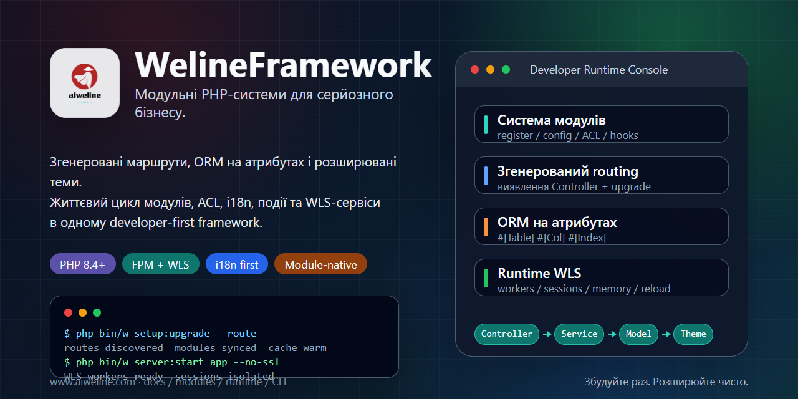

# WelineFramework



[Мови](./README.md) | [Спрощена китайська](../../README.zh-CN.md)

WelineFramework — це PHP-фреймворк для модульних вебзастосунків, адміністративних систем і commerce-сценаріїв. Він організовує модулі, маршрутизацію, ORM, events/hooks, теми, backend ACL, i18n, довготривалий сервіс WLS і CLI-інструменти, щоб бізнес-модулі були розширюваними та підтримуваними.

## Оберіть Шлях

- Нове локальне середовище: використайте one-click installer.
- PHP, Composer і база даних уже є: використайте чисту інсталяцію.
- Архітектура: [архітектура Weline](../weline/README.md).
- Робота AI / Codex: почніть з [AI-ENTRY.md](../../AI-ENTRY.md).

## Вимоги

- PHP `^8.4`
- Composer `^2.7`
- MySQL / MariaDB / PostgreSQL
- Nginx / Apache або вбудований сервер Weline (WLS)

Виконуйте команди встановлення від поточного користувача. Не запускайте one-click installer напряму через `sudo`.

## Встановлення В Один Крок

Linux / macOS / Git Bash:

```bash
curl -fsSL https://gitee.com/aiweline/WelineFramework/raw/master/bin/bootstrap.sh | bash -s --
```

Windows PowerShell:

```powershell
$f="$env:TEMP\weline-bootstrap.ps1"; irm 'https://gitee.com/aiweline/WelineFramework/raw/master/bin/bootstrap.ps1' -OutFile $f; & $f
```

Поширені опції: `-b dev`, `-y`, `-f`, `--path-only`, `php`, `pgsql`, `mysql`.

## Чиста Інсталяція

```bash
git clone https://gitee.com/aiweline/WelineFramework.git weline
cd weline
composer install
php bin/w command:upgrade
php bin/w system:install:sample
```

Запуск вбудованого сервера Weline (WLS):

```bash
php bin/w server:start
```

## Корисні Команди

| Команда | Призначення |
|---|---|
| `php bin/w` | Показати команди |
| `php bin/w setup:upgrade` | Оновити модулі, schema і config |
| `php bin/w setup:upgrade --route` | Оновити routes після змін controller |
| `php bin/w server:start` | Запустити вбудований сервер Weline (WLS) |
| `php bin/w query:help <provider>` | Перевірити контракти Query Provider |

## Документація

- [Документація проєкту](../README.md)
- [Огляд архітектури](../weline/架构总览.md)
- [Посібник розробника](../开发文档.md)
- [Посібник розгортання](../部署文档.md)
- [Вхід AI-асистента](../../AI-README.md)

## Примітки

Не редагуйте артефакти `generated/` напряму. Не пишіть `routes.xml` вручну. Текст, видимий користувачу, має проходити через i18n. AI-тести повинні використовувати ізольований WLS instance на порту `9502+`, а не стандартний `9501`.
