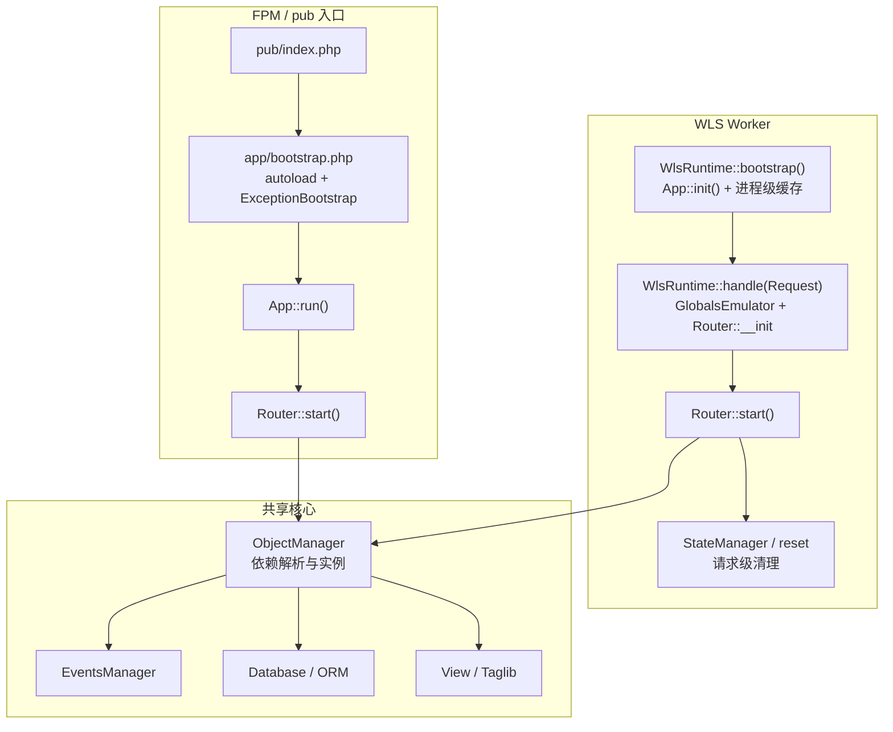
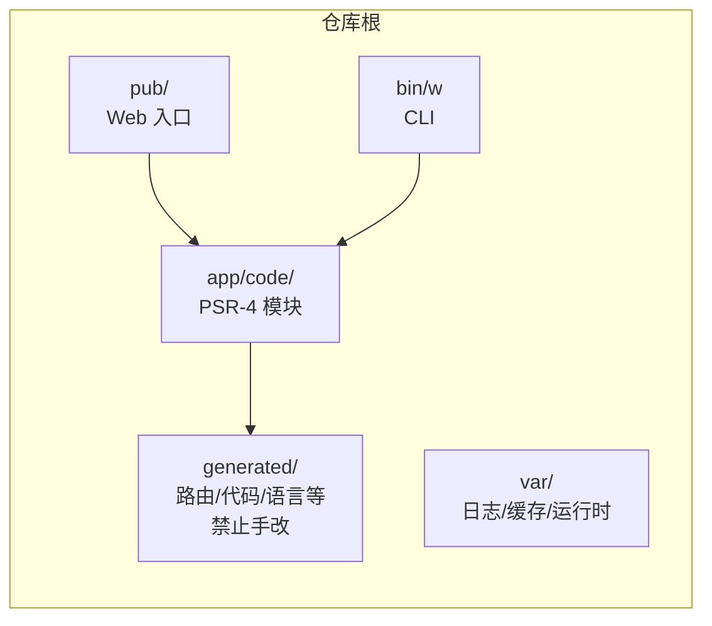
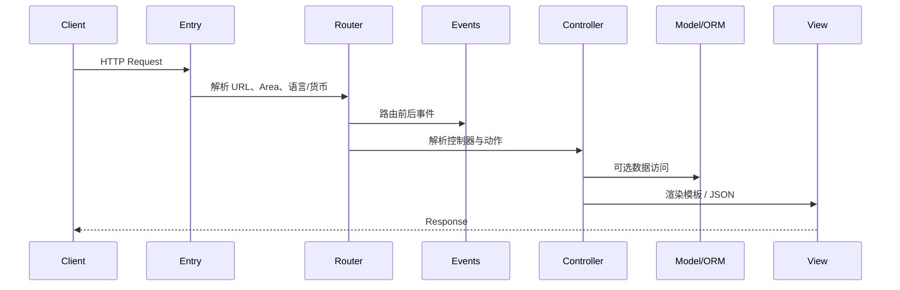
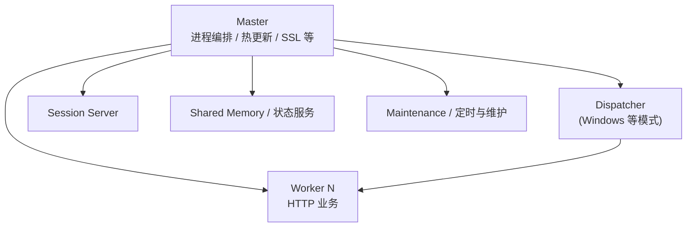

# WelineFramework 架构总览

本文从**运行时入口、核心子系统、模块边界、扩展方式**四个维度说明框架，并配合 Mermaid 图便于在支持 Mermaid 的查看器中渲染（如 IDE、Gitee/GitHub）。

---

## 1. 双运行时：FPM / CLI 与 WLS

框架同一套业务代码可在两种典型模式下运行：

| 模式 | 入口 | 特点 |
|------|------|------|
| **传统 Web（FPM / 内置 PHP Server）** | `pub/index.php` → `app/bootstrap.php` → `App::run()` | 每请求独立 PHP 进程，启动成本由 Web 服务器承担 |
| **WLS（Weline Long-running Server）** | Worker 进程内 `WlsRuntime` | 进程常驻内存，`bootstrap()` 一次，`handle()` 每请求；需 `reset` 隔离请求级状态 |



**要点**

- `app/bootstrap.php` 负责 `BP`、安装锁、`app/autoload.php`（`app/code` 与 `generated/code` 优先于 `vendor`）、异常引导、Web 下屏蔽 Pest 全局函数污染，最后调用 `App::run()`。
- WLS 下由 `Weline\Framework\Runtime\WlsRuntime` 在进程级缓存 `EventsManager`、`Router` 等，同时在每个请求边界清理 URL/ACL 等静态缓存，避免请求间串状态（实现细节见 `WlsRuntime::handle()` 与 `StateManager`）。

---

## 2. 仓库与代码布局



- **`app/code/Weline/`**：框架核心模块（`Framework`、`Server`、`Theme`、`Acl` 等）。
- **`app/code/{Vendor}/`**：业务与第三方模块（如 `GuoLaiRen`）。
- **`generated/`**：由 `setup:upgrade`、`command:upgrade` 等生成的路由表、标签编译结果等；**不要手工编辑**。
- **`pub/`**：对外的 Web 根；静态资源与 `index.php`。
- **`bin/w`**：统一 CLI 入口（安装、升级、路由测试、`server:start` 等）。

---

## 3. 请求生命周期（概念）



与具体类名的对应关系：**路由** `Weline\Framework\Router\Core`；**应用** `Weline\Framework\App`；**请求/响应** `Weline\Framework\Http\*`；**视图** `Weline\Framework\View\*` 与主题、Taglib 协作。

---

## 4. 路由：约定优于配置

- **不使用** `routes.xml`；URL 由**模块目录结构 + 生成的路由缓存**推导。
- 新增/调整 Controller 后执行：`php bin/w setup:upgrade --route`（或完整 `setup:upgrade`）。
- **Frontend** 典型片段：`/{currency}/{language}/{module}/{area}/{controller}/{action}/...`
- **Backend**：前缀 `/{backendKey}/...`（如 `admin`）。
- **REST API**：`/rest/v1/{module}/{action}` 等形式（以项目模块为准）。

详细规则见 `dev/ai/diagrams/03-routing-system.txt` 与 [开发文档.md](../开发文档.md) 路由章节。

---

## 5. 依赖注入与对象管理

- **`Weline\Framework\Manager\ObjectManager`**：解析构造函数依赖、管理可替换实现（如测试中）、在 WLS 下与请求级 `setInstance` 配合（例如注入当前 `Request`）。
- 业务代码优先**构造函数注入**，避免在深层逻辑里硬编码 `new` 具体实现。

---

## 6. 数据层：ORM 与迁移

- Model 使用 **`#[Table]`、`#[Col]`、`#[Index]`** 等属性描述结构；**表结构变更走 `setup:upgrade` 生成的 DDL 流程**，不要在 `Setup/Upgrade.php` 里手改字段逻辑（项目规范）。
- 查询链式 API，链尾需 **`fetch()` / `fetchArray()`** 等终止方法（见数据库模型技能与开发文档）。
- **Weline_Database** 提供企业级迁移、版本与回滚能力；命令如 `db:migrate:upgrade` 等（见根 `README` 更新说明与 `docs/` 下迁移规范）。

---

## 7. 事件、Hook、Extends（扩展三角）

| 机制 | 用途 | 典型配置 |
|------|------|----------|
| **Event + Observer** | 生命周期与业务解耦监听 | `etc/event.xml` + `Observer/` |
| **Hook** | 模板插槽与非侵入拼接 | `hook.php` + `view/hooks/` |
| **Extends** | 跨模块扩展点注册 | `extends.php` + `extends/module/` |

模块间**查询型**协作优先 **QueryProvider / `w_query()`**；**通知型**用事件。详见 `dev/ai/diagrams/05-event-system.txt` 与扩展点技能。

---

## 8. 表现层：Theme、Taglib、Backend

- **Theme**：`app/design` 与 `Weline\Theme` 模块协作，布局、partial、静态资源管线。
- **Taglib**：自定义标签与 Widget，模板编译产物进入 `generated/`。
- **Backend**：`Controller/Backend`、`etc/backend/menu.xml`、`#[Acl]` 与 `Weline_Acl` 集成。

---

## 9. 国际化与配置

- 用户可见文案：**`__()`、`<lang>`、i18n CSV、模板 `@lang`**；占位符 **`%{1}` / `%{name}`**（避免 `%1`/`%2` 旧式）。
- 环境/模块配置：**`etc/env.php`**、`SystemConfig`；多区域 **Area**（frontend/backend/api 等）影响路由与模板路径。

---

## 10. WLS 进程与外围服务（概要）



控制面常用 **NDJSON over TCP** 与 Master 通信（register、heartbeat、reload、restart 等）。更细的进程图与 IPC 说明见 `dev/ai/diagrams/02-wls-architecture.txt` 与 `app/code/Weline/Server/README.md`。

---

## 11. 标准模块骨架（约定）

```
Weline_{Module}/
├── register.php          # Register::register()
├── etc/
│   ├── env.php           # 路由与模块配置
│   ├── event.xml
│   └── backend/menu.xml  # 后台菜单（如有）
├── Controller/
├── Model/
├── Console/
├── Observer/
├── Setup/Install.php | Upgrade.php
├── view/templates/ | view/hooks/
├── i18n/*.csv
├── hook.php | extends.php
└── Test/Unit/
```

---

## 12. 特性速查表

| 特性 | 说明 |
|------|------|
| 模块化 PSR-4 | `app/code` 下独立模块，可单独升级 |
| 约定式路由 | 目录映射 URL，`setup:upgrade --route` 同步 |
| 属性驱动 | Schema、`#[Acl]` 等与反射/生成器协作 |
| 事件驱动 | 解耦模块依赖 |
| DI | `ObjectManager` + 构造注入 |
| ORM | 链式查询、多库、迁移体系 |
| 主题与标签 | Theme + Taglib + 生成物 |
| WLS | 常驻内存、Session/共享状态服务、热重载 |
| 统一 CLI | `bin/w` |
| 权限 | ACL 与菜单体系 |
| 跨模块查询 | QueryProvider / `w_query()` |

---

## 13. 延伸阅读

- [项目文档索引](../README.md)
- [开发文档.md](../开发文档.md)
- `AI-ENTRY.md`（AI 阅读顺序与约束）
- `dev/ai/diagrams/01-framework-overview.txt`（ASCII 总览）
- `app/code/Weline/Framework/doc/README.md`（框架模块文档入口）
